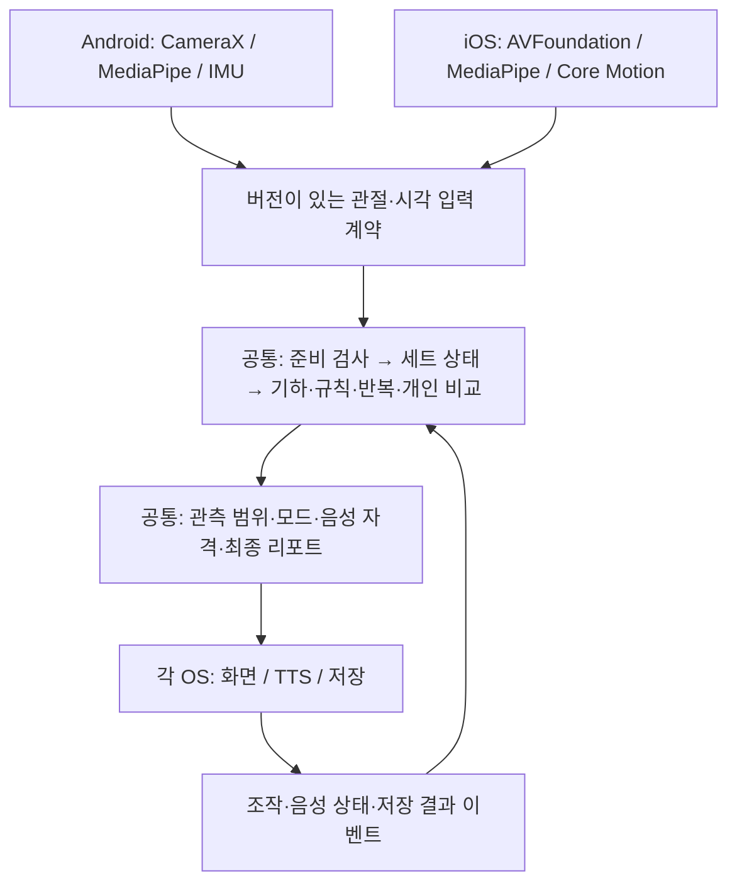

# ADR-056 — iOS 자세 기능 확장을 위한 KMP 공통 엔진 설계

**상태: Proposed — 구현 전 설계**

**작성일: 2026-09-12**

**분석 기준: `feature/posture-coach-reliability`, `5c7118e`**

**결정 주체: 프로젝트 소유자. 구현 범위 확정 및 플랫폼 검증은 후속 작업이다.**

**2026-09-13 보완:** 사용자 요청으로 [Mac 구현 착수 계획](ios-kmp/MAC_IMPLEMENTATION.md)의 M0~M2 범위를 확정했다. Mac의 실제 Intel/Xcode 환경을 반영하고 공통 엔진 의존성이 없는 진단 앱·OS 어댑터를 먼저 구현한다. 아래 전체 엔진 설계는 여전히 Proposed이며 P1/P2 API·플랫폼 검증은 미완료다.

Kotlin Multiplatform(KMP) 공통 모듈에 자세 계산과 세션 상태를 모으고, Android는 기존 Compose 화면을, iOS는 SwiftUI 화면을 사용한다. 양쪽에서 MediaPipe Pose Landmarker를 호출해 같은 입력 계약으로 공통 엔진에 전달한다. C++ 재작성은 첫 이식 범위에 넣지 않는다.

이 문서는 모듈·입출력·상태 전이·검증·이전 순서를 정한 설계다. 아래의 모듈, API, 테스트 작업 이름과 정책 버전은 **제안**이며 아직 존재하거나 통과한 것으로 해석하지 않는다. 앱 코드·Gradle·규칙·모델·설치본은 이번 설계에서 변경하지 않는다. 정본 스펙의 연결 절은 [§56](../research/aihub_fitness/KOTLIN_PORTING_SPEC.md)이다.

Windows·Mac에서 이어갈 때는 [협업 규약](IOS_KMP_COLLABORATION.md)의 통합/작업 브랜치와 담당 범위를 따른다. 구현 API와 실제 검사 결과는 [Windows 상태](ios-kmp/WINDOWS_STATUS.md), [Mac 상태](ios-kmp/MAC_STATUS.md)에 커밋 기준으로 공유한다.

GitHub 협업 브랜치의 소스 출발점은 `5237ba9`다. 위 분석 기준인 로컬 `5c7118e`와 추적 파일 트리가 같음을 확인했다. 큰 파일이 포함된 로컬 이력을 보존하고 GitHub에서 받을 수 있는 동일 소스에 문서만 옮긴 경위는 협업 규약 §1에 기록했다.

## 1. 목적과 범위

### 필요한 결과

- Android와 iOS가 동일한 관절·시각·조작 입력에 대해 같은 평가 구간, 반복, 판정, 개인 비교, 코칭 이벤트를 만든다.
- COACH/TRACK, 준비, 건너뛰기, 일시정지, 카메라 전환, 세트 결과와 관측 범위 설명을 iOS에서도 제공한다.
- 기존 Android의 운동 기록·설정·자가 라벨 형식을 보존한다.
- 성능은 추론과 후처리를 분리해 측정한다. KMP 도입을 속도 개선이나 정확도 향상으로 표현하지 않는다.

### 첫 확장에서 하지 않는 것

앱 전체 UI 공통화, 식단·로그인·클라우드 동기화의 iOS 이식, Apple Vision/Core ML로 모델 교체, 임계값 재학습, beta 승격, 새 운동 추가, 구형 기준선 자동 보정 재개는 범위 밖이다. C++/SIMD 최적화도 실측 이후 별도 결정이다.

카메라 자세 기능을 담은 iOS 검증 앱부터 만든다. 전체 TREX iOS 제품의 출시 일정·최소 지원 기기·스토어 배포는 이 문서가 확정하지 않는다. 개발 검증의 초기 deployment target은 **iOS 16 이상을 제안**하며, 제품 지원 범위는 P0에서 확인한다.

## 2. 현재 코드에서 확인한 사실

| 사실 | 설계에 주는 제약 | 근거 |
|---|---|---|
| 현재 Gradle 모듈은 `:app` 하나다 | 공통 라이브러리를 새로 추출해야 한다 | [settings.gradle.kts](../settings.gradle.kts) |
| Kotlin 2.3.21, AGP 8.13.2, Gradle 8.13, Android MediaPipe 0.10.14다 | 최신 버전 일괄 업그레이드와 이식을 섞지 않는다 | [버전 카탈로그](../gradle/libs.versions.toml), [Wrapper](../gradle/wrapper/gradle-wrapper.properties) |
| 서서 규칙 141개는 ship 51/beta 20/exclude 70, floor_v0.4는 16개 중 beta 14/exclude 2다 | JSON 헤더 대신 배열을 검증하며 EXCLUDE도 원본 로더에 보존한다 | [서서 규칙](../app/src/main/assets/posture/rules_mp_v0.json), [바닥 규칙](../app/src/main/assets/posture/rules_floor_v0.json) |
| 프로필 57개 중 카메라 55개, 규칙 매핑은 앱 이름 27개/데이터 종목 26개다 | 카메라 지원, 개인 비교, 규칙 판정 가능 여부를 별도 속성으로 유지한다 | [ExerciseProfiles](../app/src/main/java/com/example/trex_kotlin/posture/ExerciseProfiles.kt), [PostureLive](../app/src/main/java/com/example/trex_kotlin/PostureLive.kt) |
| 앵커·최종 평가·카운터 설정이 Compose 화면에 들어 있다 | 계산 파일만 옮겨서는 동일한 엔진이 되지 않는다 | [PostureLive](../app/src/main/java/com/example/trex_kotlin/PostureLive.kt) |
| `PoseSample`은 Android 추론 파일에 있고, 준비 검사도 이 타입을 받는다 | 모델 입력 DTO를 Android 파일에서 분리한다 | [PostureAnalyzer](../app/src/main/java/com/example/trex_kotlin/posture/PostureAnalyzer.kt), [CapturePreparation](../app/src/main/java/com/example/trex_kotlin/posture/CapturePreparation.kt) |
| 첫 반복 완료 또는 피처 관측 이후 4초/10초에 앵커한다 | 준비 카운트 종료와 판정 창 시작은 서로 다른 사건이다 | [PostureLive](../app/src/main/java/com/example/trex_kotlin/PostureLive.kt) |
| 라이브 반복은 `completeOnReturn=true`, `maxGapMs=1500`이다 | `RepCounter.forExercise()`만 호출하는 이식은 다른 카운터가 된다 | [RepCounter](../app/src/main/java/com/example/trex_kotlin/posture/RepCounter.kt), [ReturnRepTracker](../app/src/main/java/com/example/trex_kotlin/posture/ReturnRepTracker.kt) |
| 구형 기준선 TSV 자동 적용은 중단되어 있다 | 새 iOS가 저장 기준선을 임의로 적용하면 안 된다 | [PostureLive](../app/src/main/java/com/example/trex_kotlin/PostureLive.kt) |
| 로그 v1은 피처·가시성을 기록하지만 원본 33점 world/2D 전체와 조작 이벤트는 담지 않는다 | 기존 로그만으로 관절부터 음성까지 전부 재생했다고 주장할 수 없다 | [PostureSetLog](../app/src/main/java/com/example/trex_kotlin/posture/PostureSetLog.kt) |
| Note10+ 재생 추론 중앙값 102ms/p95 120ms, Kotlin 후처리 독립 측정은 없다 | 성능 개선의 근거로 사용하지 않고 계측 기준점으로만 남긴다 | [재생 결과](../research/aihub_fitness/DEVICE_REPLAY_RESULTS.md) |

마지막 수치는 과거 Training 재사용·합성 시간축 실험이며 카메라·렌더링을 제외한다. 현재 전체 앱의 FPS·발열·정확도 측정치가 아니다.

## 3. 선택과 대안

| 대안 | 복잡도·이전 비용 | 확장성과 운영 | 판단 |
|---|---|---|---|
| KMP 계산·상태 공유, 플랫폼 UI | 중간. Kotlin 로직과 테스트를 옮기되 JVM 의존성을 제거한다 | Android/iOS가 한 구현을 사용한다. Swift 연결과 Native 측정은 필요하다 | **선택 제안** |
| C++ 공통 코어 | 높음. 재작성, 수치·상태 동등성, JNI/Swift 연결이 추가된다 | SDK·Python 재사용과 메모리 제어에 유리하다 | 실제 병목 또는 독립 SDK 요구가 확인되면 재검토 |
| Swift 별도 엔진 | 초기 iOS 연결은 단순하지만 로직을 다시 구현한다 | 수정 때마다 두 엔진과 연구 레퍼런스를 대조해야 한다 | 현재 프로젝트에는 선택하지 않음 |
| Compose Multiplatform으로 화면까지 공유 | 자세 엔진 외 화면·카메라 배치까지 이식 범위가 커진다 | 장기 UI 공유의 장점은 별도 평가할 수 있다 | 첫 자세 기능 이식에서는 제외 |

이는 코드 구조에 따른 비용 추정이다. 팀의 C++/Swift 숙련도, Mac 확보 여부와 출시 기한은 아직 확인되지 않았다. KMP로 공통 로직을 iOS 프레임워크에 넣는 경로는 [Kotlin 공식 가이드](https://kotlinlang.org/docs/multiplatform/multiplatform-mobile-create-first-app.html)가 제공한다. Kotlin/Native에도 GC가 있으므로 네이티브 컴파일만으로 저지연을 보장하지 않는다. [메모리 관리](https://kotlinlang.org/docs/native-memory-manager.html)

## 4. 모듈과 책임

```text
trex/
  app/                         기존 Android 앱: CameraX, MediaPipe, Compose, 저장, TTS
  posture-core/                신규 KMP 라이브러리, iOS framework 이름 TrexPosture
    src/commonMain/kotlin/    입력 모델, 기하, 규칙, 상태, 정책, 리포트, 순수 파서
    src/commonTest/kotlin/    수치/상태/정책 테스트
    src/commonTest/resources/ 플랫폼 공통 재생 픽스처의 원본
    src/androidMain/          공통 계산에 필요한 경우에만 최소 어댑터
    src/iosMain/              Swift에 내보내는 얇은 facade
  iosApp/                      신규 SwiftUI 검증 앱, Xcode 프로젝트, Podfile
  research/aihub_fitness/     기존 연구·로그 분석·픽스처 생성기
```

처음에는 공통 모듈 하나를 사용한다. API·기하·규칙·세션·표시 모델을 내부 패키지로 구분하되 각각 Gradle 모듈로 만들지 않는다. 기존 계산 클래스의 패키지 이름은 초기 추출에서 유지하여 이름 변경과 이식을 분리한다.



공통 모듈은 `Context`, Compose, MediaPipe SDK 타입, `Bitmap`, `CVPixelBuffer`, 파일 경로, OS 시계를 직접 참조하지 않는다. UI·파일·음성 콜백을 공통 계산 도중 호출하지 않고 결과 값으로 돌려준다.

### 현재 파일별 이전 계획

아래 파일명은 모두 기존 [posture 패키지](../app/src/main/java/com/example/trex_kotlin/posture/)에 있다. 화면 파일만 별도 표기했다.

| 현재 파일 | 공통으로 이동 | 플랫폼에 남는 부분·조치 |
|---|---|---|
| `PostureCore.kt`, `PostureView.kt` | 벡터·피처·집계·방향 추정 | `Math` 등을 `kotlin.math`로 교체하고 오차 대조 |
| `PostureFloor.kt`, `PlankAlignment.kt` | 2D 기하와 상태 | 픽셀 크기·회전 계약을 먼저 고정 |
| `RepCounter.kt`, `ReturnRepTracker.kt`, `FloorTemporal.kt` | 신호·복귀·반복/유지·종료 창 | 라이브 생성 인자까지 공통 팩토리에 포함 |
| `PostureRules.kt` | 모델, 선택, 평가, JSON 문자열 파서 | `Context.assets` 로딩은 Android 어댑터로 분리 |
| `PostureComparison.kt`, `NormalPoseReference.kt` | 기준 수집·변화·복귀·표본 파서 | Java 숫자 포맷 제거, 표본 출처 유지 |
| `PostureCoach.kt` | `LiveCoach`, 코칭 문구/이벤트 선택 | `SpeechCoach`, AudioManager, TTS는 Android에 유지 |
| `FloorFeedback.kt` | 참고 측정 상태·화면 이벤트 | 음성 후보는 §8의 공통 자격 게이트 통과 |
| `PostureScope.kt`, `RuleHighlight.kt` | 관측 범위·강조할 관절 ID | 색·Canvas·애니메이션은 플랫폼 |
| `PostureSetReport.kt`, `PostureSetLog.kt`, `PostureSetLabel.kt` | 값 모델·순수 인코더·리포트 구성 | Date/UUID/파일 저장·공유 UI는 어댑터 |
| `PostureMode.kt`, `PostureBaseline.kt` | 모드 값·기준 수집 계산 | SharedPreferences/파일 저장, 구형 가이드는 Android |
| `PostureOrientation.kt`, `PostureAnalyzer.kt` | DTO, MP 관절→엔진 좌표 변환, up 자가검증 | SDK 실행, 센서 구독, 디바이스→카메라 축 변환은 OS별 |
| `InferencePolicy.kt` | 간격 계산 | 열 상태 구독·OS 상태 매핑은 플랫폼 |
| `ExerciseProfiles.kt`, `PostureViewGuide.kt`, `CapturePreparation.kt` | 프로필·촬영 문구·프레이밍·준비 상태 | 화면 렌더링은 플랫폼 |
| `PostureLive.kt`, `CapturePreparationUi.kt` | 앵커·호출 순서·마감·준비 음성 대기 정책 | 카메라 소유·Compose·터치·패널 배치 |
| `WorkoutSession.kt`, `TrexApp.kt` | 목표/진행의 순수 상태와 마감 순서 | 앱 `Workout` 파싱·라우팅·기록 DB 연결 |
| `BaselineGuideScreen.kt`, `PostureLabScreen.kt`, `PostureScopeUi.kt` | 필요한 계산을 공통 모듈 호출로 교체 | 개발 화면은 Android에 유지 |

`WorkoutSession`은 앱의 `Workout`를 그대로 공유하지 않는다. Android가 기존 문자열 목표·별칭을 정규화한 `SessionPlanSpec`을 만들고, 공통 진행기가 준비/운동/휴식 token을 관리한다. iOS도 같은 정규화 모델을 사용한다. 식단·계정 모델은 의존하지 않는다.

## 5. 입력·출력 계약

### 5.1 엔진의 외부 동작

아래는 책임을 설명하는 의사 인터페이스다. Swift에 실제 노출할 DTO·메서드는 P2에서 생성 헤더와 함께 확정한다.

```text
create(ruleBundle, profileCatalog, engineConfig) -> Engine 또는 명시적 오류
openSession(SessionPlanSpec, sessionId, createdAtUtc) -> Update
send(CommandEnvelope) -> Update
accept(FrameEnvelope) -> Update
tick(monotonicNowMs) -> Update
close() -> 자원 해제; 이미 확정한 결과는 변경하지 않음

Update = Snapshot + 순서가 있는 Effect 목록
Effect = SpeechRequest | SpeechCancel | SetFinalized | Diagnostic
```

`CommandEnvelope`에는 `commandId`, 세션/세트 token, 단조 시각과 명령이 들어간다. `StartWork`, `Pause`, `Resume`, `BeginSkipConfirmation`, `CancelSkipConfirmation`, `FinishSet`, `SkipSet`, `ResetReference`, `ChangeMode`, `CaptureChanged`, `SpeechStatus`, `PersistenceStatus`를 명시적으로 구분한다. 카메라 불가 시 같은 운동의 수동 기록/타이머로 전환하는 명령도 제공한다.

### 5.2 프레임 계약 `mp33-input/1`

| 필드 | 의미·소유권 |
|---|---|
| `sessionId`, `setToken`, `phaseEpoch`, `captureEpoch` | 추론 시작 **전에** 붙이는 세션·단계·촬영 식별자. 늦은 콜백을 새 세트로 옮기지 않는다 |
| `frameId`, `sampleTimeMs` | 프레임 식별자와 샘플링 승인 시점의 단조 ms. 첫 이전은 현행의 추론 직전 샘플 시각 의미를 유지한다 |
| `sourceCaptureTimeMs`, `inferenceEndMs` | 소스 촬영 시각과 완료 시각의 진단 정보. 센서 시계와 자동 혼용하지 않는다 |
| `normalizedXY` | 회전 보정된 **추론 입력 이미지** 좌표 33×2, 원본 영상의 정규화 x/y. 프리뷰 화면 좌표가 아니다 |
| `worldXYZ` | MediaPipe가 반환한 33×3 좌표, 미터 단위. 공통 변환기가 `x*100, -y*100, -z*100`으로 현재 엔진 cm 좌표를 만든다 |
| `visibility`, `presence`, 존재 마스크 | 관절별 신뢰도와 좌표 존재 여부. 누락은 0 좌표로 채워 유효 관절로 만들지 않는다 |
| `imageWidth`, `imageHeight` | 회전 보정 후 실제 분석 이미지 크기. 바닥 2D 피처의 종횡비 계산에 사용 |
| `upInEngineWorld`, `upSource` | OS 어댑터가 동일한 엔진 축으로 바꾼 위 방향. IMU 부재는 `SCREEN_UP`와 출처를 함께 전달 |
| `detectionState`, `modelId`, `delegate`, `sdkVersion` | 검출/미검출/오류 구분과 추론 출처. 검출 성공만으로 측정 가능하다고 간주하지 않는다 |

SDK의 신뢰도 필드가 없는 경우 현재 Android의 기본값 1 적용 여부를 계약 테스트에 고정하고 `confidenceDefaulted`를 기록한다. SDK 차이를 조용히 추측해 채우지 않는다. 실제 사용 신뢰도는 현재처럼 `min(visibility, presence)`이며 준비 검사와 피처 검사의 서로 다른 문턱도 보존한다.

33점 순서·사용자 좌우·이미지 회전·world 부호·중력 변환은 픽스처로 검증한다. 전면 프리뷰의 좌우 반전은 렌더러에서만 적용한다. SDK 입력을 뒤집어야 하는 구성에서는 어댑터가 그 변환을 명시적으로 되돌리고 같은 관절 의미를 보장한다. world 좌표의 회전이 SDK에서 이미 처리됐는지 확인하지 않은 채 2D와 같은 회전을 한 번 더 적용하지 않는다.

프레임 배열은 제출 시 소유한 복사본으로 만들거나, 동기 처리 완료까지 대여하는 단일 규약을 사용한다. 첫 구현은 **제출 시 복사**를 선택한다. 엔진이 프레임을 보관하는 동안 카메라/Swift가 배열을 재사용해서 값을 바꾸면 안 된다. 이후 복사 제거는 계측과 수명 테스트를 거친 별도 최적화다.

### 5.3 결과

`Snapshot`은 불변 값이며 `revision`, 진행 단계, 준비 상태, 검출 수, 사용자가 수정한 기록 수, 개인 기준 번호, 규칙 결과, 촬영/관측 범위, 표시 문구와 강조 관절을 포함한다. 정오 판정과 개인 변화는 서로 다른 필드다.

점수는 `shipOk`, `shipJudged`, `shipAvailable`, `unjudgedReasons`로 반환한다. 판단 불가 항목을 0점 또는 통과로 채우지 않는다. `shipJudged==0` 또는 TRACK이면 점수는 null이다. 기존 저장용 accuracy는 호환 필드로 계산할 수 있지만 UI는 분수와 관측 범위를 함께 사용한다. 일부 항목만 관측했으면 전체 자세가 깨끗하다는 헤드라인을 만들지 않는다.

`FinalReport`는 운동명·규칙 종목·변형·모드 이력·세트 번호·촬영 구간·평가 시작/끝·자동/수동 횟수·규칙/비교 결과·버전 정보를 세트에 고정한다. 다음 종목의 현재 UI 값을 읽어 만들지 않는다. 재측정 이전 변화 이력도 기준 번호와 함께 남긴다.

## 6. 시간·순서·스레드 계약

공통 엔진은 OS 시계나 전역 시간을 읽지 않는다. 단일 직렬 실행 흐름이 모든 명령·프레임·tick을 전달한다. Android는 세션 전용 executor, iOS는 전용 serial queue를 사용하는 초기 구성을 제안한다. Swift actor를 사용할 경우 `await` 재진입이 프레임/마감 순서를 바꾸지 않게 동일한 계약을 지켜야 한다.

- 준비와 본운동은 하나의 단조 시계로 비교한다. 현재 Android의 벽시계 기반 엔진 시각을 바꾸는 것은 명시적인 호환 변경이다. UTC는 저장 날짜에만 사용한다. 재생의 `0ms`도 유효한 시각이므로 미설정 시각은 0 대신 null로 표현한다.
- `sampleTimeMs`는 같은 촬영 구간에서 증가해야 한다. 중복·역전 프레임은 이유를 남기고 거부한다. 시간을 임의로 당겨 운동한 것으로 만들지 않는다.
- 추론은 동시에 한 건만 진행하고 대기 영상은 최신 한 장만 유지한다. 건너뛴 프레임을 복제하여 8프레임을 채우지 않는다. 실제 관측 간격을 유지한다.
- 처리 중 세트/준비/카메라 token이 바뀌면 해당 결과를 폐기한다. 준비에서 시작한 추론이 운동 시작 뒤 완료되어도 평가·기준·로그에 넣지 않는다. 일시정지와 재개에도 phaseEpoch를 갱신해, 정지 전에 시작한 프레임이 재개 뒤 도착하는 경우를 차단한다.
- `FinishSet`이 직렬 흐름에서 처리된 시점에 접수된 유효 프레임까지만 확정한다. 이후 완료되는 추론은 로그에 `late_after_finalize` 진단만 남기고 결과에 추가하지 않는다.
- `FinalReport`를 먼저 생성해 진행기에 전달하고 다음 운동으로 이동한다. 영속 저장은 결과 ID로 멱등 처리한다. 같은 명령/마감의 재호출은 같은 결과를 돌려주되 저장·음성·횟수 증가 효과는 다시 내지 않는다.
- UI는 Snapshot을 읽기만 한다. 반복 도달·시간 만료·버튼 클릭이 동시에 발생해도 공통 진행기가 token당 한 번만 다음으로 넘어간다.

명령·프레임 입력 순번은 직렬 진입점이 부여하고 재생 파일에 저장한다. 이벤트 ID는 sessionId/세트 token/정책 epoch/이벤트 순번으로 생성하여 같은 입력 재생에서 달라지지 않게 한다. SDK·TTS 콜백 스레드가 직접 엔진 내부 상태를 변경하지 않는다.

`@Synchronized`를 그냥 삭제하는 방식으로 이식하지 않는다. 직렬 소유 모델을 연결한 후 공통 클래스의 JVM 잠금을 제거한다. 음성·저장 작업은 직렬 엔진을 기다리게 하지 않고 완료 상태만 다시 명령으로 넣는다.

## 7. 세션 상태와 관측 구간

준비, 운동 진행, 관측 가능 여부는 독립 상태다. `UNAVAILABLE`은 정상 자세가 아니며 사용자의 세트가 자동 완료됐다는 뜻도 아니다.

| 사건 | 진행 | 평가·반복·개인 기준 처리 |
|---|---|---|
| 준비 진입 | `PREPARING` | 프레이밍과 안내만. 본운동 프레임·시간·반복·기준은 0 |
| 자동/직접 5초 완료 | `WORKING` | 같은 카메라를 유지하고 새 phaseEpoch. 앵커 대기부터 시작 |
| 준비 건너뛰기 | `WORKING` | 준비만 생략. 정상 인증·앵커 강제 설정·세트 완료를 하지 않음 |
| 첫 반복 완료 또는 4초/10초 대체 조건 | 유지 | 실제 피처가 처음 나온 시점 기준. 창/집계를 초기화하고 앵커 시각 기록 |
| 일시정지·앱 비활성화·건너뛰기 확인 열기 | `PAUSED` | 목표 시계 정지. 진행 중 반복과 지속 판정 연결 중단, 완성된 개인 기준·횟수·이력 보존 |
| 취소·재개 | 이전 운동 상태 | 이전 기준은 유지하되 진행 중 반복·최근 관측 창은 다시 모음. 정지 시간은 정상 관측 시간이 아님 |
| 관절 가림·긴 프레임 공백 | 운동 진행 유지, 관측만 불가 | 항목별 유보. 해당 비교 연속성을 끊고 복귀를 정상/회복으로 지어내지 않음 |
| 기준 재측정 | 유지 | 개인 비교 기준만 새 epoch. 기존 이력과 모집단 임계값, 완료 횟수는 보존 |
| COACH/TRACK 전환 | 유지 | 측정/기준을 유지하고 정책 epoch 변경. 이전 모드 음성 취소, 모드 이력 기록 |
| 전·후면 전환/좌표 계약 변경 | 촬영 재준비 | captureEpoch 증가. 진행 중 반복·창·바닥 접지 추정·개인 기준 재설정. 이전 관측 구간은 별도 보존 |
| 순수 프리뷰 크기 변경 | 유지 | 분석 좌표·카메라가 같으면 평가 상태와 기준을 초기화하지 않음 |
| 목표 도달·직접 완료·건너뛰기 확정 | `FINALIZING` → `FINALIZED` | 세트 시작 시 고정한 context로 한 번만 리포트 생성. 부분 수행/건너뜀과 평가 결과 구분 |
| 카메라 권한/추론 불가 | 같은 운동의 수동/타이머 경로 | 관측 불가와 이미 관측한 부분을 구분. 운동을 자동 건너뛰거나 자세 정상으로 저장하지 않음 |

준비의 초기 동작은 현재 `CapturePreparationController`의 5초, 짧은 가림 보류, 지속 이탈 재시작을 기준으로 한다. 준비 설명 TTS 완료 대기 및 최대 12초 대체 진행도 공통 정책으로 추출한다. 카운트가 끝나도 방향·올바른 자세를 인증한 것이 아니다.

### 관측 구간을 나누는 이유

현재 코드는 카메라 변경 때 비교/플랭크 일부 상태를 초기화하지만 모든 세트 집계를 분리하지는 않는다. 다른 촬영에서 얻은 좌표를 섞으면 range와 개인 기준의 의미가 바뀔 수 있다. 목표 설계는 `captureEpoch`별 `AssessmentSegment`를 둔다. **이 부분은 현행 그대로의 추출이 아니라 §12의 동작 변경 항목이다.**

각 segment 안에서는 기존 `PostureAssessment`의 window/rep/hold/alignment 분기를 보존한다. window/hold는 앵커 뒤를, alignment는 자체 준비 게이트를 사용하며 초기 기준 수집 전의 정렬도 평가한다. rep 결과의 구간 선택은 현재 동작을 픽스처로 고정한다. 준비 프레임은 어떤 kind에도 포함하지 않는다.

카메라가 같아도 일시정지·긴 공백은 별도의 `continuityEpoch`를 만든다. 초반 기준과 원본 관측은 보존하되 최근 판정 창·진행 중 반복·지속 이탈을 그 경계 너머로 이어 붙이지 않는다. 모집단 평가의 새 연속 구간에는 기존 앵커 규칙을 적용하고, 개인 비교는 완성된 기준을 재사용한다. 각 추적기의 750ms/1500ms 등 기존 공백 조건은 하나의 전역 값으로 합치지 않는다. 프레임이 아예 오지 않을 때도 tick이 관측 시효를 확인해 이전 OK와 점수를 현재 상태처럼 계속 표시하지 않게 한다. 이 전이도 §12의 명시적 변경에 포함한다.

최종 종료 컷은 현재 `AssessmentWindow.end`의 **반복 3개 이상 및 전체 간격의 규칙성** 조건을 유지한다. 같은 연속 운동 구간에서만 마지막 검출+중앙 주기를 적용한다. 일시정지·카메라 변경을 가로지르는 주기를 계산하지 않는다. 원본 프레임과 추정한 종료 시각을 함께 보존한다.

복수 segment의 규칙 결과는 원시 좌표를 합쳐 재계산하지 않는다. VIOLATION이 하나라도 있으면 세트 결과는 위반이다. 그렇지 않고 모든 평가 대상 segment가 OK이면 OK, 일부가 ABSTAIN이면 ABSTAIN과 부분 관측 설명을 남긴다. 프레임이 없는 새 촬영 구간도 완료된 것으로 숨기지 않는다. 복귀·개인 변화는 segment/기준 번호 안에서만 해석한다. 규칙은 세트에서 한 번만 점수 분모에 들어간다.

## 8. 신뢰도와 음성 정책

공통 엔진은 모델의 관절 신뢰도, 규칙 등급, 해당 플랫폼에서의 검증 상태를 별개로 보관한다. SDK 실행 성공이나 컴파일 성공은 iOS 촬영 검증 통과가 아니다.

| 결과 종류 | 화면 | 음성 | 점수 |
|---|---|---|---|
| SHIP 규칙의 관측 가능한 COACH 결과 | 판단한 범위와 함께 표시 | 기존 지속/쿨다운과 관측 조건을 통과한 교정/복귀 | 판단한 SHIP만 |
| BETA 규칙 결과 | 참고, 확정 판정과 구분 | **교정·위반·복귀 음성 차단** | 제외 |
| EXCLUDE | 관측 불가 범위에 포함 | 관측 범위 설명만 | 제외 |
| ABSTAIN | 구체적인 유보 사유 | 촬영 안내 가능, 정상/교정으로 읽지 않음 | 제외 |
| TRACK/비교 전용 프로필 | 같은 부위·단계의 초반 대비 변화 | 정답 자세를 지시하지 않는 변화/복귀 설명 | 없음 |
| 자동 횟수 | 참고 횟수, 수동 보정 제공 | 숫자 안내 가능, ROM 미달을 근거 없는 교정으로 발화하지 않음 | 자세 점수에 사용하지 않음 |

**현행과 지침의 충돌:** `FloorFeedbackController`는 beta 위반을 “참고 안내예요”로 발화하고, `PostureSetReport.voiceLine`에도 beta 위반을 읽는 경로가 있다. 그러나 [AGENTS.md](../AGENTS.md)는 “beta 는 음성으로 말하지 않고”라고 명시한다. 목표 기본 정책은 지침을 따라 두 경로 모두 음성 자격 게이트를 통과하게 한다. 기존 동작은 P0의 비교 자료로만 남긴다. 새로 지침을 완화하거나 이식 완료를 이유로 예외를 승인한 것으로 간주하지 않는다.

이 차이는 `legacy-5c7118e`와 제안 `shared-policy/1`의 명시적 정책 차이로 기록한다. 수치 계산 패리티 실패로 숨기거나, 테스트 기대값을 일괄 덮어써서 지우지 않는다.

### 음성 요청과 실제 재생을 분리한다

`SpeechRequest`는 이벤트 ID, 세트/정책/촬영 epoch, 출처 종류, 규칙 등급, 원본 한국어 문구, 발행 시각, 만료 시각, 큐 동작을 가진다. OS가 상태를 다시 보고한다: `ACCEPTED`, `STARTED`, `COMPLETED`, `CANCELLED`, `FAILED`, `EXPIRED`.

일반 코칭의 2회 지속·4초 전체 간격·12초 규칙 간격, 개인 비교의 8초 간격·20초 동일 항목 간격을 초기 기준으로 보존한다. 음소거/사용 불가 때의 후보 소모 여부도 기존 경로마다 테스트한다. 목표 정책에서는 미제출·실패 이벤트를 ‘사용자가 들었던 안내’로 기록하지 않으며, 성공한 제출은 중복 요청 억제에, STARTED는 복귀 안내의 선행 발화 확인에 사용한다.

준비/시작·세트 요약은 경계 발화로 보호하고, 전환 후 이전 세트 교정은 폐기한다. 교정이 발생했을 때 뒤늦은 횟수 큐가 이를 밀어내지 않게 한다. 새 고정 우선순위로 전체 발화를 재정렬하는 변경은 별도 테스트 없이 넣지 않는다. 한국어 원본 존댓말을 TTS로 전달하고 화면의 공룡 말투 변환은 엔진 판정문에 적용하지 않는다.

TRACK 변화는 beta 규칙 위반을 이름만 바꿔 내보내는 우회 경로가 아니다. 초반의 본인 관측과 직접 비교한 결과만 사용한다. 초기 자세의 모집단 규칙 통과를 기준 수집 조건으로 추가하지 않는다.

## 9. iOS 어댑터와 빌드

### 빌드 제안

- 기존 `:app`는 Android 애플리케이션으로 유지한다. `:posture-core`는 Kotlin Multiplatform과 `com.android.kotlin.multiplatform.library` 플러그인을 사용한다. 현재 AGP/Kotlin은 공식 최소 조건 안에 있지만 실제 전체 빌드 성공은 P1에서 확인한다. [Android KMP 플러그인](https://developer.android.com/kotlin/multiplatform/plugin)
- Kotlin 2.3.21·AGP 8.13.2·Gradle 8.13에서 시작한다. 해당 Kotlin 행의 Xcode 호환 기준은 26.0이다. 설치된 Mac/Xcode 조합을 확인해 고정하며 최신 버전 일괄 변경을 하지 않는다. [KMP 호환 표](https://kotlinlang.org/docs/multiplatform/multiplatform-compatibility-guide.html)
- `iosArm64`, `iosSimulatorArm64`를 초기 타깃으로 제안한다. Intel Mac은 팀 요구가 확인될 때 `iosX64`를 추가한다. 공통 테스트 리소스는 같은 원본을 각 테스트 러너가 읽게 하는 얇은 로더를 두며, Native에서 JVM classpath 접근이 된다고 가정하지 않는다.
- `TrexPosture` 프레임워크는 Xcode에서 Gradle 직접 연결로 사용한다. 외부 SDK 배포가 필요해질 때 XCFramework 배포를 추가한다. Swift에 Flow·Kotlin sealed 계층 전체를 노출하지 않고 작은 facade와 평탄한 DTO를 내보낸다. [직접 연결](https://kotlinlang.org/docs/multiplatform/multiplatform-direct-integration.html)
- MediaPipe CocoaPods 의존성은 **Swift 앱 타깃이 소유**한다. KMP 공통 모듈에 MediaPipe Pod를 연결하지 않으므로 KMP의 CocoaPods 배포 플러그인과 중복 연결하지 않는다. iOS SDK 버전은 Android 번호가 존재한다고 가정하지 않고 실제 Pod 해석·모델 실행을 확인한 뒤 `Podfile.lock`으로 고정한다. [MediaPipe iOS 설치](https://developers.google.com/edge/mediapipe/solutions/setup_ios)

### 카메라·추론

`AVCaptureSession`의 입력을 MediaPipe Pose Landmarker로 전달한다. 첫 iOS 경로는 현재 Android처럼 **VIDEO 모드의 단일 직렬 추론**을 선택한다. 라이브 비동기 모드 변경은 프레임 폐기/추적 순서 차이가 있으므로 별도 검증 후 선택한다. Full 모델·1명·신뢰도 0.5·segmentation 비활성 설정부터 대조한다. delegate는 해당 iOS SDK의 실제 지원 옵션을 확인하고 사용값을 기록한다. [Pose Landmarker iOS API](https://developers.google.com/edge/mediapipe/solutions/vision/pose_landmarker/ios)

초기 분석 크기는 Android의 요청값인 640×480을 비교 출발점으로 사용하되 기기가 실제 제공한 크기를 기록한다. 프리뷰는 전체 분석 범위를 보이는 aspect-fit으로 연결한다. SwiftUI 패널이 열리고 닫혀도 `AVCaptureSession`을 다시 만들지 않는다. 카메라와 음성의 소유자는 화면 View 재생성보다 긴 세션 객체다.

Core Motion의 중력은 디바이스 좌표에서 보고된다. Android의 센서 부호 보정 함수를 그대로 복사하지 않고, 회전·전후면별 변환 표와 고정 기기 실험을 만든다. up 자가검증의 반전/미검증 상태도 Android와 같은 진단 필드로 기록한다. [Apple gravity 문서](https://developer.apple.com/documentation/coremotion/cmdevicemotion/gravity)

Swift 어댑터는 `AVSpeechSynthesizer`와 오디오 세션의 중단/재개를 공통 음성 상태로 변환한다. 권한 거부·카메라 사용 중단·모델 초기화 실패 때는 같은 운동의 시간 측정/직접 기록을 제공한다. 백그라운드 카메라 관측이나 중단 중 가짜 프레임 생성은 하지 않는다.

### 열과 샘플링

300ms 기본 샘플 간격과 8프레임 창을 유지한다. Android의 OS 열 상태별 배수를 보존하고, iOS 열 상태는 별도 매핑 테이블로 입력한다. 제안 초기값은 nominal=1, fair=1.5, serious=2, critical=3이며 동등한 물리 온도라고 주장하지 않는다. 이 매핑은 iPhone 지속 측정 후 확정할 운영 설정이다. 느려진 샘플을 기존 간격처럼 복제하지 않으며, 가림/긴 간격 유보 규약은 유지한다.

## 10. 규칙·모델·프로필·표본의 버전

첫 이전의 파일 원본은 현재 `app/src/main/assets/posture/`로 유지한다. Android와 iOS 빌드가 이 위치의 자산을 사용하게 하여 원본 이동과 엔진 이식을 분리한다. iOS는 빌드 단계에서 앱 번들에 복사하고 SHA-256을 대조한다. 별도 iOS JSON을 손으로 관리하지 않는다.

제안 `AssetManifest`에는 모델 해시, 두 규칙 파일의 해시/버전, 피처 버전, 프로필 버전, 정책 버전, 입력 계약 버전, 정상 표본 해시를 넣는다. 앱 버전과 엔진 버전도 로그에 별도로 남긴다. 해시 불일치·필수 규칙 로딩 실패는 기능 오류로 표시하고 정상 결과로 처리하지 않는다. 선택적 정상 표본만 누락됐으면 해당 참고 표시를 끄고 핵심 계산은 유지할 수 있다.

JSON 파서는 commonMain의 `kotlinx.serialization` JSON 모델을 제안한다. `subtype=null`, 누락한 `kind`의 window 기본값, 개인 기준선/반대측 가드/허용 뷰를 보존한다. 메타데이터 추가는 허용하되 알 수 없는 판정 kind·잘못된 필수 임계값을 기본 정상 규칙으로 바꾸지 않는다. 기존 로더와 입력별 결과 대조 후 교체한다. 의존성 버전은 P1에서 잠근다.

처음에는 현재 운동명 키와 별칭 매핑을 고정한 카탈로그를 사용한다. 언어 변경 시 번역된 이름으로 규칙을 조회하지 않는다. 장기적인 영문 ID 도입은 기존 운동 기록·rule.id 매핑을 보존하는 별도 마이그레이션이다.

`normal_pose_reference.tsv`의 출처는 `android_video_training`이다. iOS가 이 파일을 읽었다고 iOS 정상 범위가 검증된 것이 아니다. iOS 검증 앱에서는 Android 재생 참고 표본임을 표시하고, 교정 임계·점수·초기 기준 수락에 쓰지 않는다. 비교 가능한 입력 분포가 확인되기 전 일반 사용자에게 iOS 정상 범위로 노출하지 않는다.

## 11. 기록·재생·저장 실패

- 기존 `trex.posture.setlog/1`과 `labels/set_labels.jsonl`, `rep_truth.csv`를 보존한다. 새 플랫폼/엔진/자산 메타데이터는 우선 선택 필드로 확장한다. 기존 `results.value`는 원값, `value_rel`은 보정값이라는 의미를 유지한다.
- v1의 `frames.t_ms`, 반복 시각, `anchor_t_ms`, `assessment_end_t_ms`는 모두 첫 기록 프레임을 원점으로 맞춘다. 재생 이벤트의 session 단조 원점과 다를 수 있으므로 변환 오프셋을 기록한다. 앵커가 없으면 null이며 0으로 판정 시작을 조작하지 않는다.
- 단일 구간 결과는 v1 호환 형태로 내보낼 수 있다. 촬영 segment가 여러 개면 선택 필드 `segments`와 구간별 결과를 남기고 `segmented=true`로 표시한다. 기존 분석기가 모든 피처를 합쳐 다시 평가하지 않도록 함께 수정하기 전에는 이런 로그를 재보정 입력에서 제외한다.
- 새 iOS 로그는 `platform=ios`로 표시한다. 기존 메타데이터 없는 로그는 `legacy/unknown`으로 분류한다. 연구 도구는 플랫폼·모델·자산 버전을 명시적으로 선택해야 하며 Android와 iOS를 자동 합쳐 임계값을 재적합하지 않는다.
- 완전한 엔진 재생용 `trex.posture.replay/1`은 **별도 `replays/` 하위 폴더**에 둔다. top-level jsonl을 세트로 세는 기존 저장소와 섞지 않는다. 진단 설정으로 관절 입력, 미검출/시간 공백, 명령, 음성 상태와 기대 결과를 기록한다. 이미지·영상·음성 파형은 기본 수집하지 않는다.
- 기존 피처 로그는 규칙/시간 로직 일부를, 원본 관절 픽스처는 기하 계산을 검증한다. 전체 카메라 어댑터·조작 순서·TTS까지 검증하려면 새 이벤트 픽스처와 기기 실험이 필요하다.
- 메모리의 세트 결과 확정과 파일 저장 완료는 별개다. 저장 실패는 ‘저장됨’으로 표시하지 않고 같은 resultId로 재시도한다. 중복 결과는 저장소에서 upsert/중복 방지한다.
- 강제 프로세스 종료 후 완벽한 복구를 보장하지 않는다. 완료 세트는 원자적인 파일/레코드 교체로 보존하고, 미완료 세트는 별도 진행 정보에서 미완료로 복구한다. 운동 중 관절 스트림을 자동으로 이어 붙여 정답 세트를 생성하지 않는다.

첫 추출에서는 현재 세트 원본 보관과 최종 재평가 의미를 보존한다. 따라서 메모리가 세트 길이에 비례할 수 있음을 인정한다. 최근 창용 ring buffer만으로 원본을 버리거나 분위수·종료 컷을 근사값으로 바꾸지 않는다. P0 장시간 계측으로 기록 한도를 정하고, 한도 도달 시 관측을 명시적으로 중단해 부분 기록/직접 기록을 제공한다. 조용히 오래된 프레임을 버려 점수가 좋아지는 동작은 금지한다.

## 12. 기존 동작 보존과 의도적인 변경

공통화와 오류 수정이 섞여 검증 기준이 사라지는 것을 막기 위해 비교 기준을 둘로 나눈다.

| 항목 | legacy-5c7118e의 특성 | 목표 shared-policy/1 | 검증 방식 |
|---|---|---|---|
| 일반 피처·규칙 임계·등급·반대측 가드 | 현재 값 | 보존 | 같은 입력 수치·판정 동등성 |
| 방향 UNKNOWN 게이트 | 방향 제한을 적용하지 않음 | 첫 이식에서 보존하고 한계 명시 | UNKNOWN/8프레임 경계 테스트 |
| 기준선·개인 비교 | 구형 보정 비활성, 현재 세트 기준 수집 | 보존 | 3회/5초/관측 창·가림·측별 테스트 |
| beta 교정/복귀 음성 | 일부 바닥·세트 요약에서 발화 | 모든 출구에서 차단 | 지침을 따르는 별도 정책 테스트 |
| 일시정지/카메라 경계 | 일부 상태만 재설정 | §7의 관측 구간·연속성 계약 | 전이 기대값을 새로 명시 |
| 시간 | 벽시계와 단조 시계 혼용 | 단조 시간, UTC는 저장용 | 시계 변경·중복·역전 입력 |
| 음성 전달 | 요청과 실제 재생 사이 차이 존재 | 출처·수명·상태가 있는 이벤트 | 제출 실패/누락/만료/이전 세트 이벤트 |
| 판정 0건·부분 관측 | UI와 리포트 경로별 점검 필요 | stale 점수 금지, 범위와 유보 명시 | 정상→미관측·모드 전환·부분 관측 |

P0에서 각 차이를 입력·구형 출력·목표 출력으로 기록한다. 구형의 오류까지 iOS 계약으로 고정하지 않는다. 변경 목록 밖의 판정 차이는 실패이며, 목록 안의 변경도 기대값과 근거 없이 허용하지 않는다. 목표 정책을 Android와 iOS에 동일하게 적용한다.

## 13. 검증 계획과 통과 기준

### 세 층의 검증

| 층 | 입력·환경 | 통과 기준 | 증명하지 못하는 것 |
|---|---|---|---|
| A. 계산 동등성 | 같은 관절/피처/JSON, JVM와 Kotlin/Native | 기존 피처별 허용 오차 이내, 유효 키/결측 동일, 임계 경계 판정과 규칙 선택 동일 | 실카메라 좌표 정확도 |
| B. 세션 동등성 | 같은 시각·조작·음성 상태를 포함한 재생 | 앵커/종료 구간·횟수·기준 epoch·판정·이벤트 ID 순서·최종 결과 동일. §12의 변경만 별도 기대값 | 실제 음성 청취·OS 카메라 중단 |
| C. 플랫폼 실기기 | Android·iPhone 촬영/권한/센서/TTS | 아래 시나리오와 성능 목표의 결과·실패·유보를 기록. 음성 제출/시작/완료 확인 | 새 사용자 전체 정확도·출시 기준 자동 충족 |

부동소수점은 비트 단위 동일성을 요구하지 않지만, 작은 수치 오차를 이유로 OK/VIOLATION/ABSTAIN 차이를 묵인하지 않는다. 기존 `PostureCoreParityTest`의 피처별 오차와 바닥/플랭크 픽스처 기준을 출발점으로 사용한다. 새 언어에서 통과시키려고 일괄 허용 오차를 넓히지 않는다.

### 필수 테스트 묶음

1. 기존 `posture_port_fixture`, `floor_port_fixture`, `view_fixture`, `plank_replay_fixture`의 JVM/Native 대조와 실제 JSON 로딩·EXCLUDE 보존·중복 규칙 선택.
2. 가시성 0.5/준비 0.55 경계, NaN/무한대·0 크기·누락 world/2D·한쪽 가림, SDK 신뢰도 기본값.
3. 처음부터 몸이 덜 보임, 준비에서 시작한 늦은 프레임, 첫 반복/4초/10초 앵커, minFrames=8, 앵커 프레임의 포함/제외 경계.
4. `completeOnReturn=true`의 완전/불완전/마지막 반복, 빠른 반복, 긴 공백, 수동 횟수 수정과 원본 자동 횟수 분리.
5. TRACK의 안정된 반복 기준·유지 기준·WINDOW 기준, 한쪽 가림, 같은 쪽/같은 단계, 재측정 후 이력 보존.
6. 플랭크 alignment의 독립 준비 게이트·지속 이탈·복귀, rep/window/hold 마감 경로, 바닥 beta 음성 차단.
7. 일시정지/백그라운드/건너뛰기 취소, 카메라·회전·프리뷰 크기 변경, 세트 변경과 마감 경쟁, 중복 명령.
8. 음소거, TTS 미준비·실패·콜백 누락·전화 중단, 경계 발화, 이전 모드/세트의 늦은 음성, 준비 설명 12초 대체 진행.
9. 0판정, beta만, 일부 SHIP만 관측, 전부 유보로 전환, TRACK 점수 없음, 제외된 부위의 관측 범위 문구.
10. 자산 누락/해시 불일치, 저장 실패/재시도, v1 파서 호환, segmented/iOS 로그가 재보정에 자동 혼합되지 않음.

처음 검증 운동은 스쿼트(3D/반복), 플랭크(2D/정렬/유지), 푸시업(2D/반복), 런지(WINDOW/교대 동작), 카프 레이즈(규칙 없는 비교)다. 이후 카메라 프로필 55개 전부의 자산/분기 연결을 검사한다. 연결 성공을 55개 운동의 촬영 정확도로 표기하지 않는다.

### 성능 검증

입력 변환·추론·브리지 복사·피처 계산·상태/규칙·리포트·UI 반영·저장 시간을 각각 측정한다. 중앙값뿐 아니라 p95와 장시간 변화를 기록한다. 워밍업을 분리하고 release 구성에서 같은 모델·자산·샘플링으로 비교한다.

- **제안 목표:** 지원 대상 중 느린 기기에서도 브리지+공통 프레임 처리 p95 ≤ 10ms. 미측정 목표이며 보장 수치가 아니다.
- **제안 회귀 기준:** 동일 Android 기기/입력의 전체 처리 p95가 추출 전보다 `max(5ms, 5%)`를 넘게 악화하면 원인을 확인하기 전 기본 엔진을 바꾸지 않는다.
- **지속 검사:** 준비→운동→휴식을 포함한 20분, 별도 긴 세트, 화면/카메라 전환 반복에서 열 감속·프레임 공백·메모리 증가·저장 큐를 기록한다. 전환을 반복해 닫힌 세트의 엔진이 남지 않아야 한다.
- **최적화 분기:** 후처리가 예산을 넘으면 할당/집계를 먼저 확인한다. 추론이 대부분이면 입력 복사·해상도·모델·delegate·스케줄링을 별도 실험한다. 8프레임의 시간 의미를 유지하지 않는 FPS 변경은 하지 않는다.

Kotlin/Native 공통 테스트는 Mac/시뮬레이터에서 실행할 수 있지만 카메라 검증은 실제 iPhone이 필요하다. SwiftUI 화면 테스트와 실기기 영상/TTS 확인 결과를 분리해서 보고한다. [Kotlin/Native 지원 환경](https://kotlinlang.org/docs/native-target-support.html), [MediaPipe 기기 조건](https://developers.google.com/edge/mediapipe/solutions/setup_ios)

P4의 기능·회귀 통과를 [정본 스펙 §9의 출시 검증](../research/aihub_fitness/KOTLIN_PORTING_SPEC.md) 통과로 대체하지 않는다. 사람별 자세 정확도를 주장하려면 필요한 라벨·관측 조건·독립 검증이 별도로 충족되어야 한다. 이식만으로 규칙을 승격하거나 확정 교정의 지원 범위를 넓히지 않는다.

## 14. 구현 단계·롤백

| 단계 | 작업 단위 | 완료 기준 | 롤백/중단 기준 |
|---|---|---|---|
| P0 — 기준 확보 | 소스/자산 해시 고정, 기존 테스트 실행, 새 이벤트 재생 픽스처와 성능 계측. Mac·지원 기기·Xcode 확인 | 측정한 것과 없는 것, §12 차이 목록과 기대값이 남음 | 현재 Android 동작 유지 |
| P1 — 계산 모듈 | `posture-core` 생성, DTO·기하·규칙·JSON·기준/반복 계산 이동, 기존 API의 얇은 호환 연결 | Android 기존 테스트/빌드 + Native 계산 테스트 통과 | 앱이 기존 모듈 경로를 사용하도록 복귀 |
| P2 — 공통 세션 | 준비/앵커/조작/마감/음성·진행기를 추출, Swift facade 생성, 목표 정책 차이 별도 적용 | A/B 동등성 및 정책 테스트, 마감·이전 세트 경쟁 재현 통과 | 세트 사이에서만 기존 엔진 선택 가능 |
| P3 — iOS 검증 앱 | SwiftUI 카메라·MediaPipe·Core Motion·TTS·로컬 기록 연결. 5개 대표 운동 | 빌드·좌표·기본 촬영·권한 폴백 확인 | 결과를 개발 검증으로만 취급 |
| P4 — 플랫폼 검증 | 나머지 프로필·중단/회전·장시간·음성/저장 회귀, Android 새 코어 연결 대조 | 검증 결과와 미해결 항목을 기록, 지원 범위 결정 | 미검증 플랫폼/기능을 확정 교정으로 공개하지 않음 |
| P5 — 제품 연결 | 검증한 iOS 자세 화면을 전체 iOS 앱과 연결, 배포 준비 | 별도 iOS 제품 범위와 배포 검증 충족 | 기존 Android 배포본 유지 |

P1/P2는 하나의 거대한 PR로 합치지 않는다. 계산 추출과 §12 정책 변경은 서로 다른 변경 묶음으로 검토한다. P0/P1의 Android 작업은 Windows에서 진행할 수 있지만 Native 검증이 없는 상태를 KMP 이식 완료로 표시하지 않는다.

Android 개발 검증에서는 같은 입력을 기존/새 엔진에 공급해 차이를 기록할 수 있다. 사용자에게는 하나의 엔진만 횟수·음성·저장 효과를 내보낸다. 두 엔진 실행으로 왜곡된 수치는 성능 측정에 쓰지 않는다. 엔진 선택은 세트 시작 시 고정하며 운동 중 자동 전환하지 않는다. 실패 시 관측 중단/부분 기록을 알리고 다음 세트에서 복귀한다. 구형 엔진으로 되돌릴 때도 음성 자격 게이트는 적용하여 beta 음성 제한을 우회하지 않는다.

## 15. 구현 전에 남아 있는 결정과 재검토 조건

| 항목 | 현재 제안·다음 확인 | 결정 시점 |
|---|---|---|
| iOS 지원 범위·Mac | 개발 기본 iOS 16+. 실제 환경은 Intel/Xcode 16.2이며 iPhone 실행은 미확인. M0~M2는 현재 Mac에서 착수하고 지원되는 Native 검증 환경은 별도로 확보. 상세는 Mac 구현 계획 §2 | P0 |
| 빌드/Pod 버전 | 저장소 버전에서 시작하고 Mac에서 실제 해결된 버전을 잠금 | P1/P3 |
| iOS 플랫폼 성능·정확도 | 알려진 측정치 없음. Android의 ship 지위를 iOS 검증 결과로 사용하지 않음 | P4 |
| beta 음성 충돌 | 지침을 따르는 차단이 목표 기본값. 변경 범위는 §12로 공개 | P2 |
| 부분 관측·카메라 구간 합성 | §7의 보수적 세트 집계 제안, 경계 픽스처 필요 | P2 |
| 최장 세트·메모리 한도 | 임의로 프레임을 버리지 않음. 장시간 측정 후 운영 한도 명시 | P0/P4 |
| C++ 재검토 | 공통 후처리 병목이 측정되거나 Python/외부 SDK 직접 배포가 제품 요구가 될 때 | 측정·요구 변경 시 |

Windows의 첫 구현은 **P0의 기준 로그/테스트 확보와 P1의 계산 모듈 추출**이다. Mac은 2026-09-13 보완에 따라 **M0~M2의 평가 없는 SwiftUI 진단 앱·OS 어댑터**를 병행한다. P3의 전체 평가 기능 연결은 P1/P2 이후다. 이 설계의 완료는 문서가 검토 가능한 상태라는 뜻이며, Android/iOS 구현·실기기 검증 완료를 뜻하지 않는다.
