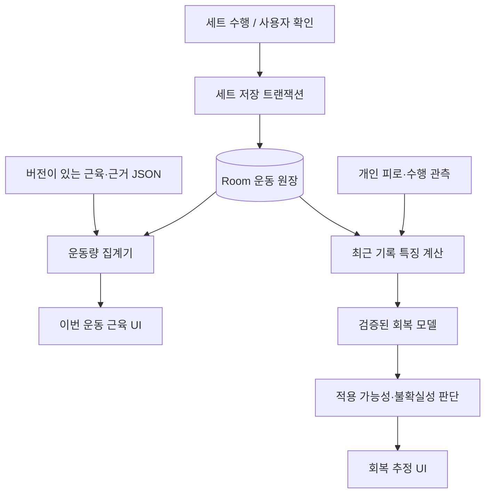

# TREX 근육별 운동량·회복 추정 설계

작성일: 2026-09-27 · 상태: 제안 / 앱 미구현

목표: 운동 완료 화면에서 사용한 근육과 기록된 운동량을 설명하고, 누적 운동 기록과 개인 반응으로 회복 상태를 추정하여 색으로 보여준다. 현재 레이아웃과 자세 평가 정책을 유지한다. 이 문서는 개발 설계이며 26종목의 근육 매핑이나 회복 모델이 검증 완료되었다는 뜻은 아니다.

## 1. 제품에서 약속할 것

세 정보를 분리한다.

| 정보 | 사용자에게 보여줄 내용 | 근거 |
|---|---|---|
| 운동에 관여하는 근육 | 주동근·보조근·안정화근 | 해당 운동 변형의 해부학·운동역학·연구 |
| 이번 운동량 | 근육이 주로 관여한 실제 기록 세트, 횟수, 유지 시간 | 완료/부분 수행 기록, 사용자 확인 |
| 회복 추정 | 최근 부하와 개인 반응에 따른 낮음·중간·높음 또는 정보 부족 | 별도 검증된 예측 모델 |

근전도 수치를 근육 사용 비율로 변환하거나, 근육별 숫자를 합쳐 100%로 만들지 않는다. 카메라 관절 좌표로 근육 활성도·근육 손상·회복률을 측정했다고 말하지 않는다. 회복 모델은 자세 점수와 별개다.

첫 출시에서는 근육 지도와 실제 기록량을 완성한다. 회복 추정은 검증된 근육군·운동 조건부터 별도 기능으로 연다. 검증 전에는 날짜별 운동량만 제공하고, 임의의 회복 퍼센트를 배포하지 않는다. 최종 목표는 색으로 표현하는 회복 추정까지다.

## 2. 설계에 사용한 연구와 적용 범위

이번 조사에서는 아래 논문의 서지와 공개 초록/공개 자료를 확인했다. 운동별 매핑을 출시할 때는 원문의 실험 조건·표·방법과 후속 연구까지 검토해야 한다. 아래 문헌만으로 모든 종목의 가중치를 확정하지 않는다.

| 연구 | 확인한 내용 | 제품 설계로 이어지는 판단 |
|---|---|---|
| [Vigotsky 등, 2018](https://pubmed.ncbi.nlm.nih.gov/29354060/) · DOI 10.3389/fphys.2017.00985 | 표면 근전도 진폭을 힘이나 장기 적응으로 해석할 때 한계가 있다. | EMG %MVIC를 사용량·성장률·회복률로 표시하지 않는다. |
| [Morán-Navarro 등, 2017](https://pubmed.ncbi.nlm.nih.gov/28965198/) · DOI 10.1007/s00421-017-3725-7 | 훈련된 남성 10명의 스쿼트·벤치프레스 실험에서 실패까지 수행한 조건은 다른 조건보다 회복이 느렸다. | 세트 수만으로 충분하지 않다. 노력도 입력을 수집한다. 이 연구를 모든 근육의 고정 48시간 규칙으로 쓰지 않는다. |
| [Kubo 등, 2019](https://pubmed.ncbi.nlm.nih.gov/31230110/) · DOI 10.1007/s00421-019-04181-y | 남성 17명의 10주 훈련에서 스쿼트 깊이에 따라 근육별 MRI 부피 변화가 달랐다. | 운동 변형을 구분한다. 장기 근비대 결과를 한 세트의 활성 비율이나 급성 피로량으로 바꾸지 않는다. |
| [Hughes 등, 2020](https://pubmed.ncbi.nlm.nih.gov/33337690/) · DOI 10.1519/JSC.0000000000003865 | 훈련된 남성 21명의 실험에서 RIR 추정 정확도는 사용한 부하에 따라 달랐다. | RIR은 선택 입력이며 오차가 있는 자기보고로 취급한다. 미입력을 RIR 0으로 채우지 않는다. |
| [Nuckols 등, 2026](https://pubmed.ncbi.nlm.nih.gov/41527566/) · DOI 10.7717/peerj.20542 | 남녀 각 21명의 벤치프레스 실험에서 수행량 차이가 있었지만, 이후 근육통과 추정 1RM 회복의 유의한 성별 차이는 없었다. | 그림 선택과 생리 모델을 분리한다. 여성에게 일괄적인 빠른 회복 계수를 적용할 근거로 사용할 수 없다. 한 운동의 결과를 성차 없음의 보편 법칙으로 확대하지도 않는다. |

문헌의 집단 평균은 개인 측정값이 아니다. 논문이 뒷받침하는 주장과 제품이 선택한 계산 규칙을 근거 파일에서 구분한다.

## 3. 현재 앱과의 연결 지점

2026-09-27 작업 트리 기준:

| 현재 코드 | 상태 | 필요한 변경 |
|---|---|---|
| `Sheets.kt`의 `workoutCatalog` | 26종목 | 이름과 별개인 운동/변형 ID 추가 |
| `TrexData.kt`의 `Workout` | 계획 횟수·시간·휴식 등 | 계획과 수행 기록을 분리 |
| `WorkoutHistoryItem` | 이름·횟수 문자열·시간·칼로리 등 | 실제 세트·시각·무게·노력도 원장 추가 |
| `TrexData.kt`의 `replaceTodayWith` | 같은 날 새 기록이 기존 당일 기록을 교체 | 세션별 저장 후 일자별 화면 집계 |
| `RecordRetention.kt`, `TrexStore.kt` | 표시/정리 범위가 오늘 포함 7일 | 화면 범위와 원본 보관 정책 분리 |
| `SessionScreens.kt`의 `SessionCompleteScreen` | 요약 수치 아래 자세 리포트 | 그 사이에 근육 요약 카드 삽입 |
| `PostureLive.kt`, `WorkoutSession.kt` | 반복·정확 반복·부분 완료/경과 시간 | 세트 종료 이벤트에서 실제 수행 정보를 전달 |

기존 `바벨 스쿼트 → 기본 스쿼트` 이름 정규화 이력이 있다. 기존 이름만 보고 맨몸/바벨 변형을 확정하지 않는다. 예전 기록은 변형 미확인으로 보존한다. 가이드 GIF의 기구도 실제 사용자 수행 기구의 증거가 아니다.

## 4. 사용자 흐름과 화면

### 4.1 운동 전·중

운동 수정 화면의 기존 세트·횟수/시간·휴식 구조를 유지한다. 무게가 필요한 종목에만 작은 `무게` 항목을 추가한다. 덤벨은 한 손 무게인지, 바벨은 봉 포함 총무게인지 명확히 표시한다. 이전 값은 제안값이며 사용자가 변경/확인할 수 있다.

매 세트마다 설문을 띄우지 않는다. 종료 후 종목별 펼침 영역에서 실제 수행과 무게를 수정할 수 있게 한다. 마지막 세트의 여유 횟수는 `0회 / 1–2회 / 3–4회 / 5회 이상 / 모름`으로 선택한다. 마지막 세트 답변을 모든 세트의 측정값으로 복제하지 않고 범위를 기록한다. 시간 운동은 별도 체감 강도를 사용하며 반복 운동 RIR과 직접 환산하지 않는다.

### 4.2 운동 완료 화면

기존 완료 제목 → 기존 세트·시간·칼로리 요약 → **이번 운동의 근육** 카드 → 기존 자세 리포트 → 기존 홈 버튼 순서.

```text
이번 운동의 근육                       자세히 보기 ›
[이번 운동] [회복 추정]

          앞면 신체        뒷면 신체
         (근육별 강조, 선택 시 윤곽선)

대퇴사두근       주로 사용 · 기록 5세트
둔근             주로 사용 · 기록 5세트
선택한 근육에 해당하는 운동 보기 ›
```

위 숫자는 UI 예시다. 실제로 스쿼트 3세트와 런지 2세트를 수행하고 두 운동이 해당 근육의 주동근으로 검토되었을 때만 표시한다. 한 세트가 여러 근육에 관여하므로 근육별 세트의 합은 전체 운동 세트보다 클 수 있다.

카드에서는 앞·뒤를 나란히 배치한다. 좁은 화면과 큰 글씨에서는 앞/뒤 전환을 제공한다. 전체 지도 상세 화면은 세로 스크롤, 완료 카드 자체는 중첩 스크롤 없이 높이를 제한한다. 회복 추정 미공개 단계에는 해당 탭을 숨긴다. 개인 정보 부족이면 탭 안에서 이유와 기록 보완 동작을 보여준다.

### 4.3 근육 상세

근육을 누르면 해당 영역 강조와 목록 선택이 연결된다. 상세 화면 순서:

1. `허벅지 앞 · 대퇴사두근`처럼 쉬운 이름과 해부학 이름.
2. 이번 운동의 주동근 세트 / 보조근 세트 / 안정화 관여를 분리.
3. 기여한 종목과 실제 세트 기록. 근육별 무게를 임의로 나눠 표시하지 않는다.
4. 최근 날짜별 운동량과 마지막 기록 시각.
5. 공개 대상이면 회복 추정·입력 정보 상태·그렇게 나온 이유.
6. `관련 연구` 펼침 영역: 종목 변형, 근거, 한계, 검토일.

고정된 상세 컨테이너 내부만 스크롤한다. 이전 사용자 요구에 따라 손가락 스크롤로 팝업 전체가 따라 올라갔다 내려가는 동작을 추가하지 않는다.

완료 화면의 `이번 운동`은 과거 세션을 다시 열어도 동일하다. `현재 회복 추정`은 기준 시각이 갱신되는 값이다. 과거의 운동 직후 상태를 보여주면 그 시각을 명시한다.

### 4.4 색상 규칙

| 모드 | 색의 의미 | 범례/보조 표현 |
|---|---|---|
| 이번 운동 | 주동근/보조근/안정화 역할 | 민트 채움/옅은 채움/윤곽선 + 역할 이름·실제 세트 수 |
| 회복 추정 | 예측된 잔여 부담의 순서 | 낮음: 옅은 청록, 중간: 주황, 높음: 산호색 + 텍스트 |
| 알 수 없음 | 데이터 부족 또는 모델 적용 불가 | 회색 사선 + `정보 부족` |
| 이번 세션 기록 없음 | 이번 운동에서 해당 근육 기록 없음 | 중립색 + `이번 운동 기록 없음` |

‘기록 없음’과 ‘회복 추정 낮음’은 서로 다른 상태다. 근육 색을 매번 최댓값으로 정규화하지 않는다. 그래야 1세트만 해도 가장 강한 피로 색이 나오는 일을 막는다. 안정화근은 힘을 쓰지 않는다는 뜻이 아니며, 수치화 근거가 부족하면 역할만 표시한다.

회복 색상 구간은 검증 후 고정한 모델 설정을 사용한다. 색에 의존하지 않도록 근육 목록·텍스트·선택 윤곽선을 함께 제공한다. TalkBack으로 같은 내용을 읽을 수 있고 작은 근육도 목록에서 선택할 수 있어야 한다. 명암·대비는 실제 에셋과 함께 검수한다.

## 5. 남성형·여성형 근육 지도

첫 버전은 2D 정면/후면 그림 4장과 근육별 벡터 마스크로 만든다. 3D 회전은 첫 버전에 필요하지 않다. 세밀한 명암은 바탕 일러스트, 색과 선택 영역은 벡터 레이어로 처리한다.

- 남성형/여성형의 동일 근육에 동일한 `muscleId`를 연결한다.
- `avatarStyle`은 사용자가 바꿀 수 있는 표현 설정이다. 기존 프로필 성별을 반드시 선택하도록 강제하지 않는다. 미선택 시 중립 도식을 쓸 수 있다.
- 그림 변경은 운동량·회복값을 바꾸지 않는다. 성별을 근거로 모집단 임계값을 달리하지 않는 현재 프로젝트 원칙을 유지한다.
- 좌우는 사용자의 해부학적 좌우다. 정면에서는 화면 왼쪽이 사용자 오른쪽이다.
- 앞뒤에 보이는 동일 근육은 하나의 엔티티로 관리한다. 마스크가 둘이라고 운동량을 두 번 더하지 않는다.
- 상업적 사용이 가능한 원본 일러스트를 제작/라이선스 확보하고 해부학 검수를 받는다. 참고 앱의 그림을 추출해서 쓰지 않는다. AI 그림은 컨셉 검토용으로만 사용하고 최종 근육 경계는 검수한다.

표현 단위 초안: 가슴, 전면/측면/후면 어깨, 상완이두, 상완삼두, 전완, 승모, 광배, 척추기립근, 복직근, 복사근, 대둔근, 중둔근, 대퇴사두, 햄스트링, 내전근, 종아리의 19그룹. 좌우를 별도 키로 관리한다. 사용 화면에서는 일부 그룹을 묶을 수 있다.

이는 그림/집계 단위다. 모든 근육군의 피로를 동등하게 추정할 수 있다는 뜻은 아니다. 장요근 등 깊은 근육은 별도 의미 ID와 텍스트로 지원하고, 겉에 보이는 복근 영역을 대신 칠하지 않는다. 작은 근육의 개별 분할은 근거와 터치 가독성이 확보되면 확대한다.

## 6. 운동 → 근육 근거 데이터베이스

### 6.1 저장 단위

`운동 변형 × 근육 × 주장` 단위로 검토한다. 논문 하나를 운동 전체의 인증 표시처럼 붙이지 않는다.

```text
ExerciseVariant
  exerciseId, variantId, 표시명/이전 이름, 장비, 자세, 지지 방식
  그립, 가동범위 조건, 단측/양측, 외부 하중 방식

MuscleAssociation
  variantId, muscleId, sideRule
  role = PRIMARY | SECONDARY | STABILIZER | UNRESOLVED
  evidenceStatus = REVIEWED | CONDITIONAL | ANATOMY_ONLY | UNREVIEWED
  conditions, limitations, claimIds, reviewer, reviewedAt, mappingVersion

EvidenceClaim
  PMID/DOI/URL, 연구 유형, 표본/훈련경력/성별, 정확한 운동 조건
  측정 지표, 주장, 효과 방향/불확실성, 반대 근거, 원문 확인 상태
```

이 근거 상태는 기존 자세 평가 `ship/beta/exclude`와 다른 목적이다. 자세 판정이 가능한 운동이라도 근육 부하 매핑은 미확정일 수 있다.

### 6.2 근거 구축 절차

1. 현재 26종목의 실제 동작과 변형을 확정한다. 이름이 넓은 운동은 세분하거나 조건을 붙인다.
2. PubMed와 원 출판사에서 운동명·해부학 근육명·EMG·kinetics·MRI·fatigue·recovery로 검색한다. 검색식과 날짜를 남긴다.
3. 연구가 조사한 주장에 맞게 원문을 분류한다. EMG는 전기적 활성, 운동역학은 힘/모멘트, MRI 장기 연구는 적응, 회복 연구는 해당 성능/증상의 시간 경과를 뒷받침한다.
4. 같은 논문의 중복 출판과 동일 표본을 구분한다. 상충하는 결과와 관찰하지 않은 근육도 기록한다.
5. 스포츠과학/운동역학 검토자가 역할·조건을 검토하고 다른 검토자가 원문 대조한다. 자동 요약은 초안까지만 사용한다.
6. 일반화 가능한 주장만 지도에 연결한다. 연구가 없는 경우 해부학 근거임을 표시하고 정량 부하 모델에서 제외한다.
7. 버전 고정 후 배포한다. 근거가 바뀌면 변경 이유와 영향 종목을 남긴다.

### 6.3 26종목 조사 작업표

아래는 연구 조사 범위와 변형 확인 항목이다. 근육 역할의 확정표가 아니다.

| 종목 | 우선 확인할 조건·근육 범위 |
|---|---|
| 기본 스쿼트 | 맨몸/바벨 여부, 깊이; 대퇴사두·둔근·내전근, 햄스트링 역할의 과대 해석 방지 |
| 런지 | 전방/후방/제자리, 보폭·상체 각도; 앞/뒤 다리별 역할 |
| 바벨 런지 | 하중 위치·보폭·다리별 수행; 맨몸 연구의 적용 범위 |
| 사이드 런지 | 측방 이동·깊이; 내전근·둔근·대퇴사두 |
| 크로스 런지 | 교차 방향·지지 다리; 둔근 세부·대퇴사두, 직접 근거 유무 |
| 바벨 데드리프트 | 컨벤셔널/루마니안 구분; 햄스트링·둔근·기립근·대퇴사두 |
| 굿모닝 | 무릎 각도·바 위치; 고관절 신전과 몸통 안정화 역할 |
| 힙 쓰러스트 | 맨몸/바벨·지지 위치·무릎 각도; 둔근·햄스트링 |
| 오버헤드 프레스 | 덤벨/바벨·서서/앉아서; 삼각근·삼두·상방회전 관련 근육 |
| 랫풀 다운 | 그립·상체 각도; 광배·팔꿈치 굴곡근·견갑 관련 근육 |
| 딥스 | 평행봉/벤치·보조 여부·상체 기울기; 가슴·삼두·전면 어깨 |
| 덤벨 컬 | 회외/중립·교대/양측·지지 여부; 팔꿈치 굴곡근 |
| 바벨 컬 | 그립·바 종류·가동범위; 팔꿈치 굴곡근 |
| 사이드 레터럴 레이즈 | 견갑면·팔꿈치 각도·기구; 삼각근·승모 |
| 프런트 레이즈 | 그립·기구·높이; 전면 어깨 중심의 역할 |
| 업라이트로우 | 그립 폭·당기는 높이; 삼각근·승모·팔꿈치 굴곡근 |
| 푸쉬업 | 손 위치·발 높이·실제 수행 범위; 가슴·삼두·전거근·몸통 |
| 니 푸쉬업 | 무릎 지지 위치·몸통 정렬; 일반 푸쉬업과 부하 차이 |
| Y 레이즈 | 엎드려/서서·기구·팔 각도; 승모 세부·삼각근 |
| 플랭크 | 전완/손·유지 시간·지지 조건; 복부와 안정화 근육 |
| 스탠딩 사이드 크런치 | 저항·몸통 측굴과 회전; 복사근·기타 몸통 근육 |
| 스탠딩 니업 | 고관절 굴곡·골반 움직임; 고관절 굴곡근과 복부 역할 구분 |
| 행잉 레그 레이즈 | 무릎 굽힘·골반 후방회전·반동; 고관절 굴곡근·복부·그립 |
| 크런치 | 몸통 굴곡 범위·추가 저항; 복직근·복사근 |
| 레그 레이즈 | 누운 자세·골반 움직임·무릎 각도; 고관절 굴곡근과 복부 |
| 시저 크로스 | 교차/상하 동작 정의·골반 지지; 직접 연구와 해부학 추론 구분 |

6종목(스쿼트, 런지, 힙 쓰러스트, 랫풀 다운, 덤벨 컬, 플랭크)으로 표현·기록 경로를 먼저 확인하고 26종목 전체로 확장한다. 직접 근거가 부족한 종목도 조사 결과와 한계를 남기며, 근거 없는 숫자로 빈칸을 채우지 않는다.

## 7. 무엇을 기록해야 하는가

| 필드 | 수집 원칙 |
|---|---|
| sessionId / setId | 수행 시작 시 생성, 다시 저장해도 동일 ID |
| exerciseId / variantId | 이름이 바뀌어도 유지. 미확인은 별도 상태 |
| startedAt / endedAt / zoneId | 절대 시각과 표시 시간대. 경과 시간은 단조 시계로 별도 측정 |
| completionStatus | 완료·부분 수행·미수행·확인 필요 |
| actualReps / actualDuration | 실제 수행 기록, 계획 목표는 다른 필드 |
| observationSource | 사용자 확인 / 카메라 추정 / 타이머 / 이전 기록 이관 |
| left/right/bilateral/unknown | 단측 수행 구분. 런지 쌍 단위와 다리별 횟수를 별도 보존 |
| load | kg, 한 손/합계/보조 중량/맨몸, 미입력 상태 |
| effort | RIR 구간 또는 체감 강도, 응답 대상 세트/종목, 입력 시각 |
| setType | 준비 세트 / 본 세트 / 미확인 |
| rest | 계획 휴식과 실제 휴식. 실제 기록이 없으면 계획으로 대체하지 않음 |
| userRevision | 수정/삭제 이력과 최신 리비전 |
| mappingVersion / modelVersion | 어떤 지식·계산을 썼는지 재현 |

근육 피로감·근육통·통증은 별도 선택 입력이다. 통증을 높은 피로값으로 바꾸거나 점수가 낮다는 이유로 무시하지 않는다. 수면·일반 컨디션·앱 밖 운동은 후속 입력으로 확장하되 검증 없이 고정 배수를 곱하지 않는다.

현재 카운터의 ‘정확 반복’만 운동량으로 사용하면 잘못된 자세로 수행한 운동이 부하에서 빠진다. 실제 수행 반복/시간을 따로 보존하고, COACH/TRACK에 동일한 물리적 기록 원칙을 적용한다. ABSTAIN이나 화면 이탈은 운동량 0이 아니다. 모르면 확인 필요 상태다.

양측 1세트는 왼쪽과 오른쪽 각각의 관여 기록 1세트다. 단측은 해당 측에만 기록한다. 좌우 쌍으로 표시하는 런지를 쌍 수와 개별 반복 수 양쪽에서 더하지 않는다. 좌우 미상은 좌우 대칭으로 추정해 칠하지 않고 양측 합계 미분리 상태를 보여준다.

## 8. 계산 모델

### 8.1 첫 출시: 근육별 기록량

근육 m에 대해 주동근·보조근·안정화 세트를 따로 집계한다.

```text
primarySets(m) = 주동근으로 연결된, 실제 수행이 확인된 본 세트 수
secondarySets(m) = 보조근으로 연결된, 실제 수행이 확인된 본 세트 수
stabilizerSets(m) = 안정화 역할이 검토된 수행 세트 수
```

부분 수행·준비 세트·카메라 추정 기록은 각각 분리하여 표시한다. 모르는 무게나 노력도를 평균값으로 채워 ‘정확한 운동량’처럼 합산하지 않는다. 시간 운동은 실제 유지 초를 함께 표시한다. 30초 플랭크를 임의의 스쿼트 횟수로 환산하지 않는다.

총 외부 중량(kg × 반복)은 같은 운동 변형의 추세용으로만 사용할 수 있다. 그 값을 각 근육에 나눠 근육별 kg 사용량으로 표시하지 않는다. 서로 다른 운동의 기계적 조건을 무시한 단순 비교도 하지 않는다.

### 8.2 회복 추정 후보: 시간에 따라 줄어드는 기록 부하

해석 가능한 기준 모델부터 실험한다.

```text
L(m, t) = Σ[ w(운동 변형, 근육, 역할) × d(세트 입력)
              × exp(-ln(2) × 경과시간 / h) ]
```

- `d`: 실제 반복/시간, 상대적 부하가 확보된 경우 그 값, 노력도, 세트 유형으로 만든 부하 특징.
- `w`: 해당 운동과 근육의 연결 계수. 근전도 비율이 아니다.
- `h`: 기록의 영향이 절반으로 줄어드는 시간. 생리적 완전 회복 시간과 다르다.
- `L`: 최근 기록의 잔여 부하 지표. 그 자체가 실제 피로도나 회복 퍼센트는 아니다.

위 식은 **검증 후보인 제품 모델**이며 위 논문에서 제공한 공식이 아니다. ‘주동근 1, 보조근 0.5, 무조건 48시간’ 같은 값을 검증된 상수로 넣지 않는다. 계수·시간척도·입력 누락 처리·허용 종목은 학습/검증 버전의 설정에 저장한다. 검증 전에는 숫자를 배포할 기본값으로 확정하지 않는다.

역할별 원시 세트 수와 마지막 운동 시각만 사용하는 단순 모델도 함께 평가한다. 복잡한 모델이 더 잘 맞지 않으면 단순 모델을 채택한다. 초반에는 개인별 회복시간을 과적합하지 않고 공통 모델을 사용하며, 충분한 개인 관측이 있는 경우에만 제한적으로 보정한다.

### 8.3 최종 사용자 출력: 회복 추정

검증의 예측 대상은 ‘다음 표준화된 수행에서 개인 평소 수준보다 성능이 떨어질 가능성/정도’로 정의한다. 동일 종목·부하·조건의 준최대 수행 지표를 쓰고, 체감 피로/근육통은 별도 결과로 수집한다. 복합 운동의 성능 저하만으로 개별 근육의 원인을 확정하지 않는다. 검증 가능한 근육군 수준으로 출력 범위를 제한한다.

`최근 부하 특징 + 개인 기준선 + 유효한 자기보고`에서 예측 분포를 만들고, 검증된 경계로 낮음/중간/높음을 산출한다. 예측이 구간 경계를 넓게 가로지르거나 입력이 모델 적용 범위 밖이면 `정보 부족`을 반환한다. 신뢰도를 곱해서 피로값을 낮추지 않는다.

운동 직후부터 실제 증상이 단조롭게 줄어든다고 가정하지 않는다. 지연된 근육통은 별도 시계열로 유지한다. 자기보고를 반영할 때도 ‘근육통 = 성능 저하’라는 등식은 두지 않는다.

초기 공개값은 순서형 단계다. 향후 0–100 지수가 필요하면 예측 대상과 보정 결과를 먼저 정의하고 `TREX 회복 추정 지수`처럼 단위를 명시한다. `근육이 83% 회복됨`이라는 생리적 실측 문구는 사용하지 않는다. 부상 위험과 운동 허가 여부를 이 값으로 판정하지 않는다.

### 8.4 정보 부족 정책

- 신규 사용자: 근육별 실제 운동 기록은 표시, 개인 회복은 정보 부족.
- 해당 근육 기록 없음: ‘최근 기록 없음’. 100% 회복 처리 금지.
- 무게/RIR 미입력: 세트 기록은 표시. 누락 패턴을 검증한 모델만 회복 추정 허용.
- 앱 밖 운동 미기록: 기록 범위를 명시하고 외부 운동 추가 경로 제공.
- 계산 불가/서버 장애: 이미 저장된 운동량은 유지하고 회복값만 정보 부족.
- 시간대/기기 시계 역행: 음수 경과시간으로 회복이 바뀌지 않도록 시각 이상 표시 및 재확인.
- 오래된 데이터 정리: 사라진 기록을 운동 안 함으로 해석하지 않는다. 관측 가능 기간을 보존한다.

## 9. Android 구조와 데이터 흐름



새 `muscle/` 도메인 패키지는 순수 Kotlin 계산과 모델을 담는다. 기존 자세 엔진에 근육 회복 의존성을 넣지 않는다. 앱 계층에서 세트 기록만 전달한다. 자세 원본 프레임 로그는 개발 자료이며 운영 회복 계산의 유일한 저장소로 사용하지 않는다.

제안 파일:

```text
muscle/MuscleModels.kt            근육·좌우·근거·출력 타입
muscle/MuscleLoadCalculator.kt    세션 집계, 역할별 기록량
muscle/RecoveryEstimator.kt       검증 모델 인터페이스, 적용 범위
data/workout/WorkoutDatabase.kt  세션·세트·수정·자기보고·스냅샷
data/workout/WorkoutRepository.kt 트랜잭션, 중복 방지, Flow
MuscleMap.kt                     바탕 그림·마스크·접근성 목록
MuscleSummaryCard.kt             완료 화면 카드
MuscleDetailScreen.kt            기록·근거·회복 상세
assets/muscles/                  지도와 표시 메타데이터
assets/exercise_muscles/         매핑, 근거, 모델 설정
```

Room은 현재 추가되지 않은 의존성이므로 구현 시 별도 도입한다. 선택 이유는 트랜잭션·고유키·부분 조회·스키마 이관이다. 기존 SharedPreferences 전체 교체는 필요하지 않으며 설정과 기존 화면 어댑터는 유지할 수 있다.

저장 계약은 `saveSet(setId, expectedRevision, record)`의 중복 호출이 같은 세트를 추가하지 않도록 한다. 세트가 끝날 때 저장하고, 완료 화면 재진입은 읽기만 한다. 저장 실패 시 완료 사실을 확정 표시하지 않고 재시도 상태를 보존한다. 앱 종료 후 재개에서 미완료 세트를 자동 완료로 만들지 않는다.

삭제/수정은 해당 기록 이후의 캐시를 무효화하고 다시 계산한다. 정정 시 오래된 값과 새 값을 동시에 합산하지 않는다. 하나의 계산 스냅샷에는 원장 리비전·매핑 버전·모델 버전·기준 시각·관측 범위를 함께 저장한다. 모델 변경 뒤 옛 점수가 조용히 바뀌지 않도록 재계산 여부를 명시한다.

오프라인 계산을 기본으로 한다. 개인별 소규모 원장을 조회하고 결과를 캐시하면 화면마다 전체 이력을 재계산할 필요가 없다. 도형 경로를 재사용하고 색 변경만 다시 그린다. 대규모 서버·실시간 센서 업로드는 첫 버전에 필요하지 않다.

## 10. 이관·보관·개인정보

1. 새 세션부터 원장에 기록한다. 기존 일별 기록은 `LEGACY_DAY_SUMMARY`로 보존한다.
2. 예전 기록에는 세트 시각·무게·RIR을 만들지 않는다. 알려진 날짜와 횟수만 기존 화면에 표시하고 정밀 회복 모델에서 제외한다.
3. 같은 날 여러 세션을 저장·합산하는 새 경로를 만든 뒤 기존 교체 저장 경로를 중지한다. 이관은 마커와 고유키로 한 번만 실행한다.
4. 첫 제안은 상세 원장 180일 보관, 화면은 기존 7일 조회 유지다. 180일은 제품 보관안이며 연구가 정한 회복 기간이 아니다. 기존 자동 삭제 기대와 달라지므로 사용자에게 보관 범위를 알리고 삭제/내보내기를 제공한 뒤 적용한다.
5. 원장 삭제 시 캐시·개인 모델·내보내기 대기 데이터도 함께 처리한다. 데이터가 끊긴 시각을 보존해 계산 범위를 줄인다.
6. 기본 저장은 앱 내부이며 클라우드 동기화·연구 참여는 별도 선택이다. 원본 영상은 이 기능에 필요하지 않다. 연구용 업로드에 프로필이나 건강 정보를 자동 포함하지 않는다.

## 11. 검증과 출시 조건

### 11.1 코드/데이터 검증

| 사례 | 통과해야 할 결과 |
|---|---|
| 같은 날 두 세션 | 둘 다 누적되며 첫 세션이 사라지지 않음 |
| 완료 화면 재진입/중복 이벤트 | setId 기준 한 번만 집계 |
| COACH/TRACK, 정확 반복 차이 | 실제 수행이 같으면 부하 기록도 같음 |
| 카메라 이탈/ABSTAIN | 0부하·완전 회복으로 변환되지 않음 |
| 계획 3세트 중 1세트 완료, 1세트 부분, 1세트 미수행 | 각각 분리, 3세트 완료로 표시 금지 |
| 왼쪽 런지만 수행 | 오른쪽에 같은 기록을 생성하지 않음 |
| 양측 동작/런지 쌍 표시 | 앞뒤 마스크·쌍 수 때문에 중복 집계되지 않음 |
| 아바타 변경 | 근육 ID·운동량·회복 결과 불변 |
| 30초 유지/횟수 입력 없음 | 실제 시간 유지, 반복수 조작 없음 |
| 기록 수정/삭제/시계 변경 | 캐시 재계산, 음수 시간 처리, 유실 없음 |
| 미확인 변형·근거 누락 | 상세 한계 표시, 회복 추정 강행 금지 |
| 기존 7일 기록 이관 | 알려진 정보 보존, 가짜 시간/무게 없음 |

전 종목의 근육 ID·근거 링크·매핑 버전·마스크 참조 무결성을 자동 검사한다. 도메인 유닛 테스트, DB 이관/트랜잭션 테스트, Compose 접근성·큰 글씨·작은 화면 검사를 수행한다. 실제 휴대폰 화면 검증은 사용자가 진행한다.

### 11.2 과학적 검증

먼저 파일럿으로 측정 반복성·참여 부담·효과 크기와 탈락률을 확인한다. 그 뒤 필요한 정밀도에 맞춰 표본 수를 산정하고 프로토콜·분석·실패 기준을 사전 등록한다. 특정 인원 수만 모으면 신뢰성이 보장된다고 약속하지 않는다.

기록 대상: 수행 세트/무게/강도, 직후 및 후속 시점의 체감 피로/근육통, 같은 조건의 표준화된 준최대 수행. 시간 간격은 프로토콜로 고정하고 같은 대상의 반복측정 의존성을 분석에 반영한다. 위험한 실패 반복을 일반 사용자에게 요구하지 않는다.

검증 데이터는 사람 단위 분리와 미래 시점 분리를 함께 사용한다. 같은 사람의 인접 세트가 학습과 평가에 섞이지 않게 한다. 공통 모델과 개인 보정의 평가를 구분하고, 검사하려는 종목/근육에만 결과를 적용한다.

비교 기준: 마지막 운동 이후 시간, 단순 주간 세트 수, 개인 평소 수행량. 성능 오차, 예측구간 포함률, 단계별 실제 결과, 정보 부족 비율, 실제 성능 저하를 낮은 부담으로 표시한 비율을 함께 보고한다. 성별·운동 경력·근육군 등 표본이 충분한 하위집단의 오차도 확인하되 별도 성별 계수를 자동 도입하지 않는다.

출시 조건: 사전 등록한 허용 오차와 잘못된 낮음 표시 기준 충족, 단순 기준 모델 대비 유용성 확인, 적용 대상/누락 입력 조건 명시, 독립 검토 완료. 통과하지 못한 근육군은 세트 지도만 제공한다. 출시 후에도 모델 버전을 되돌려 운동량 기능만 유지할 수 있게 한다.

### 11.3 사용자 이해 검증

사용자가 색을 보고 ‘어느 근육의 최근 부담이 큰가’, ‘어떤 운동 기록 때문인가’, ‘기록 없음과 부담 낮음이 다른가’를 이해하는지 확인한다. 기록 누락 보완과 좌우 선택도 과제로 검증한다. 사용자가 회복 추정을 실측·운동 허가로 해석하면 문구/범례를 수정한다.

## 12. 실행 순서와 산출물

| 단계 | 작업 | 완료 기준 |
|---|---|---|
| 1. 정의·근거 | 종목 변형·근육 ID·26종목 조사표·근거 검토 | 모호한 이름 처리, 주장별 근거 상태 확정 |
| 2. 에셋·UX | 남녀 앞뒤 도식, 마스크, 완료 카드와 상세 시안 | 해부학·접근성·권리 검수 |
| 3. 기록 기반 | 세트 원장, 실제 입력, 당일 다중 세션, 이관 | 데이터 유실·중복·가짜 기록 방지 테스트 통과 |
| 4. 첫 공개 | 근육별 세트 지도·상세·근거 | 검토된 매핑만 적용, 사용자 화면 검증 |
| 5. 연구 | 회복 파일럿·측정 반복성·모델 비교 | 분석 계획 확정, 독립 검증 결과 |
| 6. 제한 공개 | 통과한 근육군의 회복 추정 색상 | 적용 범위와 정보 부족 정책·되돌리기 확인 |
| 7. 확장 | 종목/개인 보정·선택적 외부 기록 연동 | 새 조건마다 검증, 버전별 변경 근거 보존 |

개발자 1명, 디자이너와 운동과학 검토자 참여를 가정한 작업 추정: 기록 기반+지도 첫 버전 약 4–6주, 전체 26종목 근거 검토와 에셋은 병행하되 원문 접근/검토 범위에 따라 추가될 수 있다. 회복 연구는 별도 종단 관측 기간이 필요하며 파일럿 뒤 일정을 확정한다. 6–12주 관측은 초기 계획 범위일 뿐 출시 신뢰성을 보장하는 기간이 아니다.

구현을 시작하면 해당 단계의 확정 계약과 이유를 `research/aihub_fitness/KOTLIN_PORTING_SPEC.md`에 새 절로 추가하고, 실제 완료 내용만 handoff에 기록한다. 현재 문서는 앱 변경·모델 출시·실기기 검증을 실행하지 않은 설계안이다.
