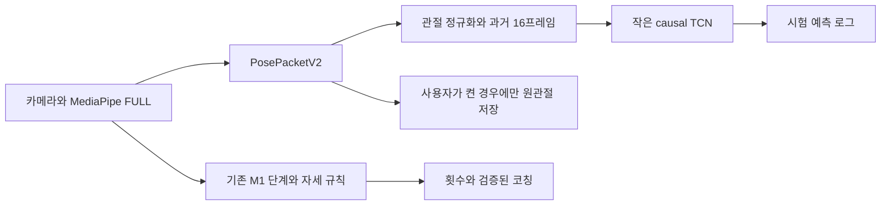

# 학습형 동작 모델 첫 구현 — 시험 실행

2026-09-23 · `codex/posture-action-model-preview` · `v1.2.0-preview.1`

[§59 설계](POSTURE_LEARNED_ACTION_MODEL_DESIGN.md)의 입력 계약·학습·Android 실행·로컬 자료 수집을 구현했다. **실제 학습 가중치를 포함하지만 운동 종류 분류만 학습했다.** 임의의 생활 행동, 자세 오류, 반복 단계와 피로를 모두 분류하는 완성 모델은 아니다. [26종목 M1 카운터](POSTURE_MOTION_ENGINE_IMPLEMENTATION.md)는 별도로 작동한다.

## 구현과 권한



- 새 모델은 선택한 운동명을 입력으로 받지 않는다. 예측한 운동명과 사용자가 선택한 운동명은 추론 후 비교한다.
- `ActionAssessment`의 `canAffectCount`·`canSpeak`는 모든 상태에서 `false`다. 모델 결과를 횟수·ROM·점수·음성·관절 강조에 연결하지 않았다. 번들도 `mode=shadow`와 두 권한을 검사한다.
- 관측 부족(`UNOBSERVABLE`), 모델/발열 문제(`UNAVAILABLE`), 낮은 확신(`AMBIGUOUS`), 분포 이탈 후보(`NOVEL`)를 구별한다. `NOVEL`도 미지 행동임이 검증된 정답이 아니다.
- §58의 새 무릎 방향 관측은 beta이므로 화면의 참고와 강조만 사용한다. 음성 연결을 제거해 기존 beta 침묵 원칙을 지켰다.
- 기존 26종목 범위·AIHub 규칙 자산·FULL 모델과 모집단 임계값은 그대로다. 사용자의 기존 로그로 모델을 학습하거나 보정하지 않았다.

## 입력·모델·휴대폰 실행

| 항목 | 구현 |
|---|---|
| 입력 | 33관절 × `(x,y,확신값,유효 마스크)` = 132차원, 과거 16프레임 |
| 정규화 | 영상 종횡비 보정, 골반 중심, 몸통 길이. 가림/비유한 값은 마스크. 선택 종목·기존 판정값은 미입력 |
| 구조 | Dense 48 → residual causal Conv1D 3개(커널 3, dilation 1/2/4) → 마지막 시점 27 logits |
| 출력 | 서비스 26종목 + 학습에 포함한 기타 운동 묶음. 기타 묶음은 서비스 종목 추가가 아님 |
| 크기 | 28,587 파라미터, 42,672바이트(약 43KB) |
| 양자화 | 내부 INT8, 외부 float32 입력/출력. 학습 분할 400표본으로 양자화 |
| 런타임 | `com.google.ai.edge.litert:litert:1.4.2`, CPU Interpreter 1스레드 |
| 스케줄 | 별도 단일 작업자, 최대 5Hz 추론. 바쁘면 입력을 생략하고 누락 수 기록. 작업 대기열을 쌓지 않음 |
| 연속성 | 세트·일시정지·카메라/회전 경계의 세대 분리, 750ms 이상 누락 시 입력 초기화. 미래 프레임/보간 없음 |
| 열 보호 | Android thermal MODERATE 이상이면 새 모델 실행 중단, 기존 MediaPipe 열 정책 유지 |
| 검증 번들 | 입력 규격·라벨·모델 SHA-256·FULL pose SHA-256·권한 검사 후 실행. 실패는 UNAVAILABLE |

§59의 더 큰 다중 과제 모델과 CompiledModel 전환에 앞서, 현재 APK에서 확인 가능한 CPU 호환 경로를 채택했다. 작은 모델은 16프레임 전체를 다시 계산하며 층별 상태 캐시는 아직 사용하지 않는다. 최대 5Hz는 요청 상한이며 달성 처리율이 아니다. **휴대폰 p95 지연·추가 PSS·전력·30분 지속 발열 예산은 아직 실측하지 않았다.** 43KB는 모델 크기이며 런타임/앱 전체 크기가 아니다.

## 학습 자료와 내부 시험

AIHub 캐시의 MediaPipe 추정 관절을 사용했다. GT 관절로 학습한 뒤 폰 추정값에 바로 적용하는 구조를 피했다. 한 클립의 16개 희소 프레임에서 4/8/12/16개 과거 구간을 만들며, 실제 프레임 간격이나 반복 경계를 꾸며 넣지 않았다.

| 분할 | 사람 수 | 구간 수 | 용도 |
|---|---:|---:|---|
| train | 66 | 23,706 | 가중치·INT8 보정 |
| calibration | 22 | 8,588 | 조기 종료·temperature·기각 경계 |
| test | 22 | 6,192 | 사람 분리 내부 평가 |
| 미학습 운동 계열 시험 | test 사람만 | 475 | 버피 테스트·페이스 풀·바이시클 크런치를 train/cal에서 제외 |

같은 사람의 다중 카메라/파생 구간은 분할을 넘지 않는다. test의 27분류 모두 표본이 있다. 다만 AIHub는 이전 규칙/피처 연구에도 사용했으므로 이 결과는 외부 신규 데이터 인증이 아니다. 구간들은 독립된 사람들이 아니며 6,192개를 독립 사람 표본처럼 해석하지 않는다.

| 결과 | 값 | 의미 |
|---|---:|---|
| test 운동 종류 정확도 | 75.21% | 27분류, 기각 이전 전체 구간 기준 |
| test 클래스별 recall 평균 | 79.28% | 클래스별 표본 불균형 보완 |
| 미학습 운동을 서비스 26종목으로 수용 | **62.11%** | 475구간에서 confidence/energy 기각을 통과한 오수용 |
| FP32↔INT8 top1 일치 | 98.44% | test 앞 128구간, 정확도 자체가 아님 |

**미지 행동 기각이 출시 조건을 충족하지 못해 자동 중재를 활성화하지 않았다.** test 결과에 맞춰 다시 경계를 조정하지 않았다. AIHub 희소 구간과 휴대폰 연속 16프레임은 시간 길이가 다르며, 라이브 정확도는 별도로 검증해야 한다. 걷기·물 마시기·기구 조절·가림, 잘못된 운동 자세/단계/피로/횟수의 학습 라벨은 이 모델에 없다.

정본 수치·클래스별 recall·혼동행렬: [ACTION_SHADOW_RESULTS.json](../research/aihub_fitness/ACTION_SHADOW_RESULTS.json). 원자료·개인 ID·원본 관절 픽스처는 공개하지 않으며 저장소 시험 픽스처는 수학적으로 만든 합성 관절이다.

## 자료 수집과 재현

준비 또는 일시정지 화면의 `동작 분석 개선용 관절 기록`은 기본 꺼짐이다. 명시적으로 켜면 MP 원본 2D/world33(m, y-down), visibility/presence, 단조 캡처 시각, 촬영 세대·영상 크기·중력축을 세트 로그에 저장한다. 영상/음성을 저장하거나 서버로 전송하지 않는다. 해제하면 진행 중 세트의 원관절 버퍼를 즉시 비운다. 이전에 저장한 로그까지 삭제하는 기능은 아니다.

세트당 원관절 600프레임, 모델 관측 1,200건 상한이다. 초과/작업자 누락은 별도로 기록한다. 원관절 수집이 꺼져 있어도 시험 예측 로그는 기존 세트 로그에 남는다. 기록은 `SetLogStore`의 앱 전용 폴더와 기존 로그 내보내기를 사용한다.

```powershell
python -m venv --system-site-packages .venv-action
.\.venv-action\Scripts\python.exe -m pip install -r research/aihub_fitness/requirements-action.txt
# SOURCE는 mp/sample.parquet와 mp/landmarks_*.parquet가 있는 허가된 로컬 캐시
.\.venv-action\Scripts\python.exe research/aihub_fitness/train_action_shadow.py --source SOURCE --epochs 25
.\.venv-action\Scripts\python.exe research/aihub_fitness/package_action_shadow.py

# 원관절을 켜고 기록한 새 로그만 사용. 누락/구형 스키마는 거부
python research/aihub_fitness/export_action_shadow.py sets.jsonl --set-id SET_ID --out research/aihub_fitness/outputs/action_replay.npz
```

내보낸 입력의 선택 운동명·모델 예측을 정답 라벨로 복사하지 않는다. 이후 실제 행동/단계/반복/관측불가 시각을 별도로 사람이 라벨링해야 한다. `--prepared`는 동일 카탈로그·입력 규격으로 이미 준비한 로컬 분할의 재사용에만 쓴다. 실행 환경과 파일 해시는 manifest·집계 보고서·로컬 provenance에 남긴다.

## 검증과 다음 승격 조건

- JVM 310건 통과, 1건 조건부 건너뜀(새 실기기 반복 재생 파일 없음). Python 내보내기 5건 통과.
- Android API 36.1 x86_64 가상 기기: 모델 로드/무결성·Python 결과 파리티·기록 opt-in/해제·세트 초기화 2건 통과. APK 설치와 MainActivity 최초 실행 성공.
- 같은 가상 기기에서 모드 선택/큰 글씨, 카메라 확장/횟수 HUD 유지의 기존 UI 회귀 2건도 통과했다.
- APK 서명 검증 통과, 기존 공개 APK와 동일 인증서. 실제 휴대폰 사용자 촬영·ARM 추론 정확도·전력은 이번 검증에 포함하지 않는다.
- Android 자료를 포함한 원천 파일, 학습 중간 산출물, 가상 환경, APK, 키는 Git에서 제외한다. APK는 새 태그의 GitHub 사전 릴리스로 제공한다.

다음 단계는 다양한 사람의 연속 폰 입력과 생활 행동·반복 경계·좌우·가림 라벨을 확보하는 것이다. 그 자료에서 사람/날짜/촬영 환경을 분리해 OOD 오수용·방향 오지시·누락·계수 지연과 기기 예산을 통과한 출력만, 항목별로 M1 중재에 연결한다. 특정 사용자에게 맞추기 위해 모집단 파라미터를 바꾸지 않는다.
