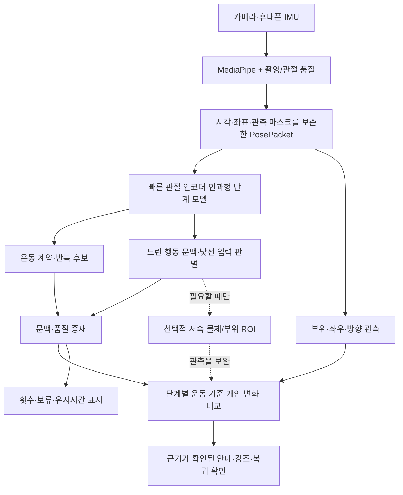

# TREX 학습형 행동 이해 모델 설계

2026-09-23 · 상태: **제안 / 학습·성능 검증 전** · 적용 기반: `codex/aihub-26-exercises`

요청: 휴대폰 한 대와 현재 MediaPipe 엔진을 사용하면서 운동 중 행동을 이해하고, 구체적으로 교정하고, 반복을 빠르게 세는 서비스.

이 문서는 [M1 구현](POSTURE_MOTION_ENGINE_IMPLEMENTATION.md)에 더할 학습 계층을 정의한다. 앱 코드·모델·규칙 임계값을 변경한 기록이 아니다. [이전 전체 설계](POSTURE_MOTION_ENGINE_DESIGN.md)의 학습 모델·자원·데이터 부분을 구체화하며, 선택 근거는 [ADR-0001](adr/0001-causal-posture-action-model.md)에 남긴다. 아래 수치 중 별도로 실측이라고 적지 않은 것은 **개발/출시 목표 또는 실험 후보**다.

## 1. 결정과 제품의 약속

**MediaPipe + 작은 관절 시계열 모델 + 명시적인 운동 계약 + 검증된 교정 정책**을 채택하는 방향으로 개발한다. 실제 채택은 데이터·기기 시험을 통과한 종목과 항목별로 결정한다.

- 서비스 운동은 `ExerciseProfiles`의 26종목으로 유지한다. 모델의 배경 행동 라벨을 운동 목록에 추가하지 않는다.
- 행동의 이름, 관절 움직임, 운동 기준 적합성, 측정 가능성을 따로 추정한다. `흔하지 않음`은 `틀린 자세`의 라벨이 아니다.
- 알려진 운동 외 행동과 처음 보는 행동을 구별한다. 이름을 모르더라도 현재 운동으로 세거나 교정하지 않을 수 있어야 한다.
- 모든 가능한 행동을 빠짐없이 이름 붙이거나 한 대의 카메라로 모든 오류를 확인한다고 약속하지 않는다. 관측되는 신체 관계를 조합하고, 검증된 교정 범위를 지속적으로 넓힌다.
- 초보·숙련자 모두 같은 관측 모델을 사용한다. 개인의 익숙한 자세나 음성 해제 선택을 모집단의 정답으로 학습하지 않는다. 이 사용자의 기존 로그는 계속 검증 전용이다.
- 정상/위반을 판단할 수 없는 경우와 행동이 낯선 경우를 구별하고, 그 상태를 점수의 정상 항목으로 바꾸지 않는다.

## 2. 현재 시스템에서 확인한 출발점

| 항목 | 코드/실측 | 설계에 주는 조건 |
|---|---|---|
| 자세 추론 | `PostureAnalyzer`: MediaPipe Tasks Vision 0.10.14, FULL, VIDEO, GPU 우선/CPU 대체 | 새 모델을 위한 MediaPipe 교체나 라이브 모드 전환이 선행 조건은 아님 |
| 실행 주기 | `PostureLive`: 80ms 요청, 기존 통계는 최소 300ms 표본 | 요청 간격은 실제 FPS가 아니며 새 모델이 기존 집계의 시간 의미를 바꾸면 안 됨 |
| 과거 Note10+ 진단 | GPU 추론 중앙값 102ms/p95 120ms, AIHub 이미지 재생 | 카메라·UI 포함 지연이나 현재 실제 운동 FPS는 미측정. FULL 30fps의 근거가 아님 |
| 현재 모델 자산 | FULL 9,398,198B, LITE 5,777,746B | 파일 크기는 실행 RAM/전력/속도가 아님 |
| 전달되는 관절 | `PoseSample`: 33개 XY, min(visibility,presence), 피처, 중력 상태 | 원래의 world33과 visibility/presence 각각은 새 학습 입력용으로 별도 전달해야 함 |
| 계수 | `MotionContracts` 26개, `MotionRepCounter`의 동적 25개, 플랭크 유지시간 | 반복 완료 계약을 모델의 클래스 확률로 대체하지 않음 |
| 현재 행동 상태 | 준비/움직임/정지/다른 움직임 휴리스틱 | 걷기·물 마시기 등의 의미를 학습한 분류기가 아님 |
| 학습용 로그 | `motion-1`: 일부 피처, 시각, 단계, 완료 수, 최대 6,000프레임 | 전체 관절 시계열이나 영상 정답이 아님. 과거 로그로 새 입력을 복원했다고 주장하지 않음 |
| 바닥 종목 | 2D 전용 피처와 가시 측 추적 | 불량 AIHub 3D를 정답으로 삼거나 무조건 standing 3D 경로로 통합하지 않음 |
| 지원 OS | minSdk 26, 현재 열 상태 구독은 API 29+ | 구형 OS·열 정보 미지원·CPU 대체 경로도 명시적으로 지원 |

근거: [휴대폰 재생 진단](../research/aihub_fitness/DEVICE_REPLAY_RESULTS.md), [Analyzer](../app/src/main/java/com/example/trex_kotlin/posture/PostureAnalyzer.kt), [InferencePolicy](../app/src/main/java/com/example/trex_kotlin/posture/InferencePolicy.kt), [Live](../app/src/main/java/com/example/trex_kotlin/PostureLive.kt). MediaPipe는 33개 랜드마크와 추정 world 좌표를 제공하고 VIDEO/LIVE_STREAM에서 추적을 사용한다. 비동기 API 선택 자체가 처리율을 보장하지는 않는다. [공식 Android 문서](https://developers.google.com/edge/mediapipe/solutions/vision/pose_landmarker/android)

## 3. 처리 구조



두 시간 경로를 사용한다. 반복·단계는 최신 관측마다 처리하고, 긴 문맥은 적은 횟수로 갱신한다. 과거 6초를 참고하는 모델도 과거 상태를 재사용하면 지금 결과를 낼 수 있다. 전체 6초가 끝날 때까지 기다리는 영상 분류기를 계수에 연결하지 않는다. 연속 추론에서 중복 계산을 줄이는 연구는 이 선택의 근거이며, 논문의 속도 개선 수치를 TREX 기기 성능으로 옮기지 않는다. [Continual ST-GCN](https://arxiv.org/abs/2203.11009)

## 4. 무엇을 학습하는가: 서로 다른 여섯 출력

| 출력 | 예시 | 허용되는 사용 |
|---|---|---|
| 행동 문맥 | 운동 동작, 준비·기구 배치, 쉬는 중, 위치 이동, 다른 움직임 | 세트 구간, 계수 억제, 교정 가능 구간 |
| 운동/동작 계열 | 스쿼트 계열, 런지 계열, 상체 밀기/당기기, 컬, 바닥 굴곡 등 + 26종목 후보 | 선택 종목과의 일치 확인. 기구 미관측 시 비슷한 운동을 억지로 구별하지 않음 |
| 단계·측 | 시작/진행/전환/복귀/유지, LEFT/RIGHT/BOTH | 운동 계약과 함께 반복 사건 형성 |
| 부위별 관측 | 무릎의 발 기준 안/밖 위치와 이동, 팔꿈치–몸통 거리, 몸통 기울기 | 여러 부위가 동시에 다른 방향인 경우를 보존 |
| 시간 변화 | 처음부터 지속, 같은 단계에서 점차 변화, 짧은 이탈, 회복 | 변화 설명. 영상만으로 피로·근력 부족 등의 원인을 확정하지 않음 |
| 신뢰·낯섦 | 입력 품질, 문맥 모호, 분포 밖 움직임, 종목별 미검증 변형 | 유보, 관찰만 표시, 연구 후보 수집 |

`물 마시기`는 손이 얼굴에 접근한 궤적만으로 확정하지 않는다. 병·컵이 관측되거나 해당 입력 조건에서 구별을 검증한 경우에만 세부 라벨로 확장한다. 그렇지 않으면 `손을 얼굴 쪽으로 이동/운동 외 움직임`이면 계수 억제에 충분하다. 기구 조작도 물체를 확인하지 못하면 `준비 동작`으로 표시한다. 여러 행동은 다중 라벨이 가능하며 모든 프레임을 하나의 생활 행동 이름으로 강제 분류하지 않는다.

### 구조화된 관측과 교정

관측은 `부위 × 사용자 좌우 × 기준축 × 방향 × 운동 단계 × 지속 × 변화량`으로 표현한다. 모든 조합마다 별도 클래스를 만드는 방식은 라벨 수가 폭증하고 반대 방향이 합쳐지므로 사용하지 않는다.

예시 흐름:

1. 오른발이 바깥을 향하고, 오른무릎은 그 발의 진행선을 따라 이동한다 → 발 각도만으로 안쪽/바깥쪽 오류를 만들지 않음.
2. 상승 중 오른무릎이 발 진행선 안쪽으로 이동한다 → 부위·방향 관측.
3. 이 운동·변형·단계·뷰에서 검증된 경계와 측정 오차를 넘고 지속 조건을 만족한다 → `오른쪽 무릎이 올라오는 동안 안쪽으로 움직여요. 발끝 방향을 따라 올려 주세요.`의 교정 후보.
4. 바깥 방향 오류라면 바깥 방향 라벨과 별도 검증 경계를 사용. 경계가 검증되지 않았으면 관측만 표시.

출력 증거에는 실제 피처 값, 기준/불확실성 범위, 관절 목록, 캡처 시각, 출처/버전, 적용 뷰, 단계, 판정 등급이 필요하다. 모델의 attention 지도는 정답 근거로 취급하지 않는다. 몸통/골반 정렬을 통해 척추 관련 교정을 할 수는 있지만, 그것을 모든 척추 마디의 직접 측정으로 확대하지 않는다.

## 5. 첫 학습 모델: 작은 인과형 TCN

### 5.1 입력 계약 후보

고정 크기 배열을 사용하는 `PosePacketV2`를 추가할 계획이다. 현재 `PoseSample`에 이 입력이 모두 있다는 뜻은 아니다.

| 입력 | 후보 크기 | 구성 |
|---|---:|---|
| J | 33×10 | 종횡비 보정·중심/스케일 정규화된 XY 2, 몸통 기준 추정 XYZ 3, visibility/presence 2, 2D/3D 유효 마스크 2, 마지막 유효 관측 나이 1 |
| F | 96 | manifest에 명시한 관절 각도·부위 관계 48개와 각 값의 유효 마스크 48개. 좌우를 유지 |
| G | 32 | 화면상의 중심/크기/변화, 뷰, 중력 신뢰, 카메라 회전/이동 단서 등 16값+16마스크 |
| T | 4 | 실제 dt, 세그먼트 시작 이후 경과, 표본 나이, 재시작 여부 |
| 의도 | 별도 작은 입력 | 선택 종목·선언한 변형. **운동 문맥의 공통 인코더/운동 인식 head에는 넣지 않음** |

차원은 첫 모델 후보이며 48개 피처와 16개 전역값의 이름·단위·순서를 feature manifest에서 고정하고 Python/Kotlin 골든 입력으로 검증해야 한다. 일부 숫자가 없으면 0+마스크로 전달하며 0을 정상 관측으로 해석하지 않는다. 분산/표준화 통계는 훈련 분할에서만 만든다.

- 화면 XY는 픽셀 종횡비를 반영한 뒤 정규화한다. 사용자 좌우와 미리보기 반전을 구별한다.
- 체형 크기 정규화와 함께 화면 중심/스케일을 별도 보존한다. 이를 버리면 걷기·카메라 접근을 제자리 반복으로 혼동할 수 있다.
- world 좌표는 단안 추정이다. 바닥·가림·축 불안정 구간에서는 3D 마스크를 내리고 2D 증거를 사용한다. 사람별 뼈 비율을 지우려고 모든 관절을 평균 인체로 강제 변형하지 않는다.
- 휴대폰 IMU는 **카메라의 움직임/기울기**를 설명한다. 거치된 폰의 가속도를 사용자의 신체 가속도로 학습하지 않는다. 카메라 평행이동은 IMU만으로 완벽히 분리되지 않으므로 화면 전체 이동 단서/유보를 함께 사용한다.
- MediaPipe 2D와 world의 일치는 품질 단서이지 독립 센서 두 개의 합의가 아니다. visibility도 실제 좌표 정확도의 보정된 확률이 아니다.
- `trackingEpoch`, 모델 hash, 해상도·회전·렌즈·거치 변경 정보는 수치 입력과 별도 메타데이터로 전달한다. 인물 또는 촬영 세대가 바뀌면 상태를 이어 붙이지 않는다.
- F/G도 선택 종목에 관계없이 같은 정의로 계산한다. 현재의 종목별 floor 피처 map이나 M1 phase/계수 출력을 공통 문맥 입력으로 그대로 주면 마스크/키 패턴에서 선택 종목이나 기존 오류를 외울 수 있다. canonical 입력과 종목별 판정 피처를 분리하고 선택 종목만 바꾼 동일 영상에서 문맥 출력이 같은지 검사한다.
- 현재 앱은 첫 번째 pose를 사용하므로 같은 사람이 계속 추적된다는 보장은 없다. 준비 중 선택한 인물의 화면 위치/크기·관절 연속성으로 세션 안의 추적 대상을 유지하고, 다른 사람 유입/급격한 위치 교체가 모호하면 epoch를 끊는다. 얼굴 신원 인식은 필요하지 않다. 다인 감지 보조 기능을 넣더라도 별도 기기 예산과 가림 교차 시험을 통과해야 하며 안정된 인물 추적 ID가 이미 있다고 가정하지 않는다.

### 5.2 네트워크 후보

처음부터 대형 Transformer를 정본으로 정하지 않는다. **프레임 공간 인코더 + 두 속도의 depthwise causal TCN + 작은 출력 head**를 첫 후보로 삼는다.

| 블록 | 첫 후보 | 이유 |
|---|---|---|
| 공간 인코더 | 관절 순서/좌우를 보존한 MLP, 462→128→128. 부위 head에는 해당 관절/피처의 skip 연결 | 작은 행렬 연산, 구현·양자화 용이. 중요 부위 증거를 전역 평균으로 잃지 않음 |
| 빠른 경로 | 채널128, kernel3의 시간 depthwise convolution **블록당 1개**, dilation 1/2/4, pointwise+잔차 | 15표본 과거 수용영역. 실제 dt/누락을 함께 입력. 즉시 단계·측·완료 후보 |
| 문맥 경로 | 최대 5Hz 새 관측 임베딩, kernel3·dilation 1/2/4/8 | 31표본, 약 6초 과거 문맥. 준비/다른 행동·운동 계열·낯섦 |
| 세부 head | 운동 계열/종목, 단계·측, 부위 관측, 품질, embedding | 정상/오류 한 개의 softmax로 모든 의미를 합치지 않음 |
| 운동별 부분 | 공통 인코더 위 종목/계열별 작은 head 또는 conditioning | 26개 큰 모델을 메모리에 올리지 않음. 플랭크는 반복 주기 대신 유지 상태 |

**예상 설계 범위**: 약 0.2–0.8M 파라미터, INT8 모델 자산 2MiB 이내, 캐시를 사용하는 새 프레임당 연산 5M MAC 이하를 목표로 한다. 아직 구현/프로파일한 수치가 아니다. MAC 수는 실행 지연과 같지 않다. TCN 선택은 시계열 모델의 합리적인 출발점이며 이 과제에서 GCN/GRU보다 우수하다는 실험 결과는 아직 없다. [TCN 원 논문](https://arxiv.org/abs/1803.01271)

비교 실험에는 (A) 현재 M1, (B) 기존 피처만 사용하는 작은 TCN, (C) 위 관절+피처 TCN, (D) 작은 고정 그래프 GCN+causal TCN을 넣는다. 온라인 양방향 attention, 큰 RGB 모델, 매번 과거 창 전체를 재계산하는 구조는 기본안에서 제외한다. GCN의 정확도 개선이 관절 방향 오류·부위 누락에서 뚜렷하고 기기 예산을 통과하면 공간 인코더만 교체한다. EfficientGCN의 경량화 방향은 비교 후보의 근거다. [EfficientGCN](https://arxiv.org/abs/2106.15125)

### 5.3 시간·상태·누락

- 빠른 경로는 실제 MediaPipe 완료 표본을 캡처 시각 순으로 받는다. 20Hz 카메라를 10Hz로 관측했다면 10Hz 입력이며 누락을 관측값처럼 보간하지 않는다.
- 느린 경로는 새 표본이 있는 200ms 슬롯만 사용하거나 명시적인 결측 토큰을 전달한다. 같은 관절 프레임을 복제해 여러 번 운동한 증거로 만들지 않는다.
- TCN 과거 캐시는 명시적인 입출력 텐서로 유지한다. 고정 크기 버퍼, 과거 표본 나이/결측 마스크를 사용하고 호출별 상태 복사를 계측한다.
- 준비 구간의 과거를 사용할 수 있지만 운동 시작 전에 모델이 충분히 준비됐다고 가정하지 않는다. warm-up은 마스크로 표시하고 첫 반복/재시작 성능을 따로 측정한다.
- 선택 종목, 카메라/렌즈/회전, 추적 인물, 모델 버전 변경과 긴 누락에서 상태를 reset한다. M1의 450ms 연속성 단절은 첫 호환 기준이며 새 학습 모델에서 데이터를 보고 재검증한다.
- 다양한 실제 dt, burst 누락, FPS 저하, 가림, 긴 정지, 처음부터 굽힌 자세를 훈련에서 포함한다. 15표본을 언제나 1.4초라고 간주하지 않는다.
- 학습 시 미래 프레임을 참조하지 않고, 평가도 전체 클립이 아니라 실제 도착 순서로 한다. 동일 prefix에 서로 다른 미래를 붙여 현재 출력이 같음을 검사한다.

## 6. 임의 행동과 모르는 행동 처리

`26종목 + 기타 1개`만 학습하면 기타에 없는 행동을 종목 중 하나로 강제 분류할 수 있다. 다음 상태를 **별도로** 유지한다.

| 상태 | 의미 | 서비스 동작 |
|---|---|---|
| TARGET | 선택한 운동/동작 계열과 관측이 맞음 | 계약을 통과한 반복 표시, 검증된 항목만 교정 |
| KNOWN_OTHER | 배운 준비/이동/휴식/다른 동작 | 운동 계수·교정 억제. 필요한 경우 쉬는 중 표시 |
| AMBIGUOUS | 익숙한 클래스끼리 혼동 또는 전환 중 | 짧은 중재 구간, 방향 지시 유보 |
| NOVEL | 보이지만 훈련 분포와 다른 움직임 | `동작 확인 중`, 미검증 관측만 기록. 비정상이라고 말하지 않음 |
| UNOBSERVABLE | 관절 가림·촬영/추적 불량 | 필요한 부위가 보이도록 안내, 해당 판정 유보 |
| UNAVAILABLE | 런타임 실패/모델 미설치/시간 초과 | 학습 기능 없음이 명시된 M1 대체 경로. 모델의 판단 결과인 NOVEL과 다름 |

알려진 배경 동작을 정상적인 데이터로 많이 수집하고, 훈련에는 일부 낯선 동작을 outlier exposure로 사용한다. 검증에는 훈련에 노출하지 않은 **행동 계열 전체**를 남긴다. 최대 softmax 확률 하나 대신 보정된 분류 confidence, energy score, 클래스 embedding 거리와 입력 품질을 비교한다. 우선 confidence+energy를 기본 실험으로 하고 embedding 거리는 추가 이득이 있을 때 채택한다. 출처: [Outlier Exposure](https://arxiv.org/abs/1812.04606), [Energy OOD](https://arxiv.org/abs/2010.03759).

이 기법들이 모든 미지 행동을 검출한다는 보장은 없다. temperature scaling은 알려진 분포에서 confidence를 보정하는 도구이며 unknown 해결책으로 대체하지 않는다. 음성 임계값은 별도 사용자 분할의 오류 비용과 판정 가능 비율을 함께 보고 정한다. [Calibration 원 논문](https://arxiv.org/abs/1706.04599)

행동 분류의 확률과 같은 관절로 만든 규칙 confidence를 독립 사건처럼 곱하지 않는다. 최종 발화는 문맥·관측·방향·기준·신선도 각각의 필수 조건을 통과한 후, 별도 검증한 결합 정책으로 정한다. 의도 입력으로 정답을 맞추는 편법을 막기 위해 문맥 head에는 선택 종목을 주지 않고, 선택 종목과 다른 행동/불완전 반복도 별도 훈련·평가한다.

## 7. 즉시 계수와 학습 모델의 관계

### 첫 배포: 모델이 매 반복을 새로 허가할 때까지 기다리지 않음

M1의 빠른 계약 카운터를 유지하며 모델은 문맥 억제와 단계 보조부터 적용한다. 충분한 실제 데이터가 모인 종목에서만 learned phase로 계수를 개선한다. 전체 모델의 결과로 과거 계수를 한꺼번에 덮어쓰지 않는다.

| 상황 | 후보 반복의 처리 |
|---|---|
| TARGET 문맥이 확인되고 최신 관절이 계약을 만족 | 완료 표본에서 바로 확정·표시. 느린 문맥 head가 다음번 갱신될 때까지 기다리지 않음 |
| TARGET 중 단발 AMBIGUOUS | 강한 off-target/낯섦/품질 단절이 없고 기존 단계가 이어질 때만 짧게 latch. 후보 상한 400ms를 검증 |
| 첫 반복/새 동작/연속 AMBIGUOUS | `확인 중` 후보를 최대 300ms 보류하는 초기 정책을 시험. 그 안에 문맥이 맞으면 확정, 아니면 미확정 사건으로 남김 |
| KNOWN_OTHER 또는 NOVEL | 신규 운동 반복·교정 확정 금지. 다른 움직임을 1회로 만들지 않음 |
| 필요한 관절 누락·인물/촬영 세대 변경 | 부분 사이클을 끊음. 뒤 프레임과 이어서 누락 반복을 채우지 않음 |
| 모델 런타임이 고장나 UNAVAILABLE | M1의 관측 반복 기능은 대체 실행 가능. 학습 문맥으로 확인한 횟수라고 표기하지 않으며 새 모델 전용 음성은 비활성 |

위 300/400ms는 제품 정책 후보이며 보정된 확률 경계가 아니다. 새 unknown이나 품질 단절에는 latch를 적용하지 않는다. 보류 후 확인된 사건이 음성 기한을 지났으면 화면/기록만 갱신한다. `미확정 사건`은 실제 반복 수로 확정하지 않으며 현재 `reps.unknown`(ROM 미확인)과 **별도 필드**로 저장한다.

유효한 반복은 상태 전이·끝점/복귀·지속 관측으로 확인한다. 모델이 앞으로 완료될 것 같다고 예측했거나 주기 신호가 반복된다는 이유만으로 선계수하지 않는다. 마지막 반복, 끝점 유지, 중간 포기, 부분 반복과 초고속 동작을 각각 시험한다.

### 빨라야 하는 것과 기다릴 수 있는 것

- **UI 횟수**: 관측 가능한 완료점 기준 warm RETURN p95 300ms 이내를 목표. TURN은 반전/유지 확인 비용 때문에 p95 450ms 후보를 별도 관리. 이전 문서의 단일 300ms 목표를 이렇게 세분화한다.
- **첫 반복/문맥 재획득**: 별도 p95와 미확정률을 공개하고 warm 수치에 섞어 숨기지 않음.
- **행동 이름**: 전환 뒤 약 0.5–1초 목표. 계수와 동일 지연을 요구하지 않음.
- **교정 음성**: 필요한 지속 관측 뒤 현재도 유효한 사건만 말함. 숫자나 지시를 음성 큐에 쌓지 않음.

10Hz에서 0.6초 반복은 약 6표본이다. 긴 가림이나 반전점 누락까지 신경망으로 해결했다고 볼 수 없다. 반복당 표본 수, 전환점 주변 최대 간격, 주/보조 관측 신뢰를 함께 검증하며 부족하면 `빠른 동작 측정 제한`을 표시한다. 보간 프레임이나 주기 외삽은 정답 표본으로 세지 않는다.

## 8. 휴대폰 예산·실행·발열

### 8.1 첫 개발 목표

| 지표 | 후보 예산 | 측정 방법 |
|---|---:|---|
| 추가 관절 모델 | INT8 파일 ≤2MiB | 실제 export 파일/manifest 집계 |
| 모델+전처리 추가 지연 | 지원 기준 기기 p95 ≤5ms/관측 | 입력 정규화·캐시 입출력·네이티브 호출을 포함 |
| 새 모델의 tensor/state | ≤4MiB | 버퍼 실측, state cache 포함 |
| 런타임 포함 추가 peak PSS | ≤32MiB | 기존 M1과 같은 촬영/세션 재생 A/B. 전체 앱 RAM과 구별 |
| 배포 크기 | native runtime 포함 증가 ≤15MiB 목표 | ABI별 설치/배포 크기, 모델 파일 크기와 별도 보고 |
| 추가 에너지 | 동일 세션의 M1 대비 ≤10% 목표 | 밝기·해상도·온도·TTS·충전 상태를 통제한 mWh/분. 미측정 시 배터리 %로 정밀 수치 주장 금지 |
| 지속 동작 | 30분 실제 스트림에서 p95/발열/드롭 안정 | 짧은 cold benchmark만으로 통과하지 않음 |

모든 목표가 모든 폰에서 동시에 달성된다고 가정하지 않는다. 기준 기기는 구형 실측 폰(Note10+)과 별도 보급형/중급형/고급형, CPU fallback을 포함해 선정한다. 데이터셋 정확도만 좋아진 모델은 이 예산을 통과하기 전에는 도입하지 않는다.

입력 462 float의 128표본 버퍼는 약 231KiB다(462×128×4). 실제 PSS에는 네이티브 라이브러리, 실행 arena, Java 배열, MediaPipe, 카메라, 렌더링이 추가된다. JSON/Map을 고속 내부 전송 형식으로 사용하지 않고 고정 배열과 제한된 큐를 사용한다.

### 8.2 런타임 선택

- 학습은 Python/PyTorch, 첫 배포 후보는 `.tflite` + **LiteRT CompiledModel CPU**. INT8 CPU와 FP32 CPU를 비교하고 1개 worker를 기본 후보로 한다.
- GPU는 이미 MediaPipe가 사용하므로 작은 모델까지 GPU로 보내는 구성이 자동으로 빠르다고 가정하지 않는다. CPU/GPU/NPU의 **전체 파이프라인** 지연/에너지로 선택한다. NPU나 인터넷/Play Services 설치를 필수 조건으로 만들지 않는다.
- 공식 Android 문서는 CompiledModel을 현대 API, Interpreter를 호환 API로 구분한다. 현재 앱의 MediaPipe 0.10.14와 공존하는 의존성/네이티브 로딩/ABI 시험을 먼저 한다. 호환성 또는 INT8 연산 지원이 막히면 고정 버전의 CPU Interpreter 대안을 벤치마크한다. [LiteRT Android](https://developers.google.com/edge/litert/android)
- PyTorch→LiteRT 변환을 초기에 시험한다. 고정 shape, 기본 dense/depthwise/pointwise/add/relu 연산 위주로 구성하고 사용자 정의 연산/Flex 의존은 피한다. 변환 도구와 runtime 버전을 manifest에 잠근다. [공식 변환 경로](https://developers.google.com/edge/litert/conversion/pytorch/overview)
- 대표 calibration 데이터에 초보·숙련자, 모든 지원 뷰/속도/가림/바닥, 실제 모델의 관측 분포를 넣는다. 정수화 전후 부위 방향·unknown·시점까지 비교하고 손실이 크면 QAT나 혼합 정밀도를 검토한다. 테스트 분할은 quantization calibration에 쓰지 않는다. [정수 양자화 문서](https://developers.google.com/edge/litert/conversion/tensorflow/quantization/post_training_integer_quant)
- 미래 구현에서 `.tflite` 자산의 압축/메모리 매핑 조건도 명시한다. 현재 `noCompress`에는 `.task`만 선언되어 있다.

### 8.3 스케줄러

카메라는 최신 프레임 정책을 유지한다. MediaPipe 작업자는 한 번에 한 프레임을 처리한다. 관절 모델은 제한된 단일 작업자에서 순서대로 처리하며 지연되면 오래된 입력을 쌓지 않는다. 입력을 버린 시간은 dt/마스크로 드러낸다. UI에는 최신 불변 상태만 전달하고 화면 갱신 속도와 ML 속도를 분리한다. [CameraX ImageAnalysis](https://developer.android.com/media/camera/camerax/analyze)

| 기기 상태 | 정책 후보 |
|---|---|
| 충분한 성능 | FULL 유지, 관절 head는 매 관측, 문맥은 최대5Hz. 필요 부위 ROI는 기본 비활성 |
| 빠른 동작 + FULL 관측률 부족 | 사전 검증된 LITE 번들이 있는 기기에서 세트 전에 선택. 없으면 제한 표시 |
| 발열 상승/전력 절약 | ROI·상세 진단 로그·느린 문맥 빈도부터 축소, 실제 계수 관측률 모니터링 |
| 지속 성능 부족 | 검증된 저부하 번들 또는 측정 제한 모드. 실제로 못 본 반복을 생성하지 않음 |
| 휴식/결과 | 저주기 감시 또는 카메라/추론 중단. 플랭크의 유지 운동을 휴식으로 오인하지 않도록 별도 계약 |

MediaPipe FULL/LITE 변경은 좌표 오차 분포를 바꿀 수 있다. 세트 중 교대로 실행하거나 FULL 임계값을 LITE에 그대로 적용하지 않는다. 변경할 때 perception+normalization+head+rules+calibration 번들 전체를 바꾸고 부분 사이클/기준을 재설정한다. 카메라 해상도 감소가 모델 내부 연산을 비례해서 줄인다고 가정하지 않는다.

열 상태(API29+)와 가능한 경우 thermal headroom(API30+)을 사용하며 OS/기기 지원 여부를 기록한다. headroom은 최소10초 간격의 보수적 폴링 후보로 두고 NaN/미지원 시 상태 콜백과 실제 지연/드롭을 사용한다. 열 정보 없음은 차갑다는 뜻이 아니다. 회복에도 지연을 두어 모드가 왕복하지 않게 한다. [Android Thermal API](https://developer.android.com/games/optimize/adpf/thermal)

### 8.4 선택적 영상/부위 모델

기구·병/컵·손 세부처럼 pose33만으로 모호한 질문에 한해 저속 ROI 모델을 별도 연구한다. 대상이 보이는 구간에 작은 crop을 1–2Hz로 처리하는 예산부터 시험하며, 별도 획득/연산/RAM 예산을 못 맞추면 기능을 켜지 않는다. 작은 RGB 분류기는 물체의 존재 단서만 주며 접촉 압력이나 실제 하중을 대신하지 않는다. 원본 영상 VLM/LLM은 상시 휴대폰 루프에 넣지 않는다. 세트 후 설명이나 동의한 연구 표본의 라벨 초안 도구로만 후보가 된다.

## 9. AIHub와 추가 데이터의 역할

| 자료 | 사용하는 것 | 정답으로 만들지 않는 것 |
|---|---|---|
| AIHub 26종목 부분집합 | 운동/조건/description, 다중 뷰, 신뢰 가능한 관절, 정상·연기 위반의 관측 관계 | 16장 사이의 미관측 단계 시각, 자연 피로 원인, 임의 생활 행동, 모든 프레임에 동일 오류 |
| AIHub를 실제 MediaPipe로 재추론 | 배포 입력 분포, GT와 관측의 차이, 뷰/가림별 신뢰 | GT 임계값을 MP에 무보정 적용, 바닥 불량3D를 복구된 정답 취급 |
| 실제 폰 연속 영상+관절+시각 | 반복 끝/중도 포기, 준비·다른 행동 전환, 빠른/느린 동작, 현실 촬영 오류 | 모델 자신의 출력이나 사용자 습관을 정자세 라벨로 자동 채택 |
| 기존 이 사용자 로그 | 회귀·재생·반례 검증 | 학습/threshold tuning/개인에게 맞는 출시 성능 근거 |
| MM-Fit 등의 공개 자료 | 연속 운동/휴식의 외부 스트레스 시험·권리 확인 후 사전학습 후보 | 맨몸/덤벨 proxy를 동일 바벨/머신 정답으로 처리, 웨어러블 IMU를 거치 폰 IMU로 처리 |

MM-Fit는 시간 동기화된 운동 영상/센서를 제공한다. 기존 저장소의 MM-Fit 실험은 이전 엔진의 결과이므로 새 모델 성능으로 인용하지 않는다. 영상 공개 페이지에는 20개 세션이 설명되어 있다. 실제 사용할 파일·원본·파생 포즈·사전학습 가중치별 권리와 출처를 manifest에 기록한 후 채택한다. [MM-Fit](https://mmfit.github.io/), [영상 원배포](https://zenodo.org/records/7672767)

NTU RGB+D는 다양한 생활 행동 연구에 유용하지만 공식 배포가 비상업 연구용으로 제한되어 있어 제품 기본 가중치의 무조건적인 사전학습 원천으로 선택하지 않는다. 별도 허용이 확인되지 않은 코퍼스는 연구 비교와 제품 artifact에서 분리한다. [NTU 공식 조건](https://rose1.ntu.edu.sg/dataset/actionRecognition/)

### 9.1 추가 수집과 라벨

첫 pilot는 **서로 다른 32–40명**이 각자 가능한 6–8종목을 여러 촬영에 나누어 수행하는 규모로 시작한다. 종목별 참여자 최소8명을 채우도록 배분하고 필요하면 증원한다. 각 종목의 반복/변형/방향 오류 근거가 부족하면 해당 head는 유보한다. 이는 데이터 파이프라인과 가능성을 확인하는 규모이며 출시 인증 표본 수가 아니다. 같은 사람이 26종목을 한 번에 수행하도록 요구하지 않는다.

두 날짜 이상, 서로 다른 거치/기기 조합을 포함한다. 정상적인 자연 동작, 선언한 부분 반복, 시작부터 일관된 스타일, 세트 후반 변화, 중간 정지/중도 포기, 생활 동작을 담는다. 초보/숙련, 키·팔다리 비율·가동범위, 옷·신발, 조명·배경·시점, 바닥과 가림을 분산한다. 잘못된 자세를 무거운 하중으로 강제 재현하는 촬영 설계는 하지 않는다.

라벨 단위:

- **세션**: 익명 식별이 아닌 가명 participant/session/day/device ID, 선택 종목·변형, 카메라/모델 버전.
- **행동 구간**: 실제 시작/종료 시각, 주 행동·겹치는 행동, 알려지지 않음, 관측 불가 이유.
- **반복 사건**: 계약의 완료 지점, 시작/전환/복귀 시각, 좌우, 완주/포기/부분 반복, 평가자 불확실 시간 구간.
- **자세 사건**: 부위·측·방향·단계·시작/종료, 관측값, 정의된 오류/허용 변형/판정 불가, 근거가 보이는 뷰.
- **품질 사건**: 사람 바뀜·가림·범위 이탈·카메라 이동·모델 좌우 스왑·센서 누락.

자세 정오와 반대 방향은 두 평가자의 독립 라벨+불일치 조정으로 확보한다. 코치의 의견도 관측 불가를 억지로 정답화하지 않는다. 프레임 경계가 불확실하면 구간 라벨을 남긴다. AIHub clip 조건은 weak label로 학습하고, 실제 프레임 라벨과 같은 가중치/단위로 취급하지 않는다.

### 9.2 학습 절차

1. participant/원본 촬영 단위로 먼저 분할한다. 같은 사람의 모든 뷰·날짜·clip 파생본은 같은 집합에 둔다. 잘못된 수행자 ID 가능성은 메타데이터/중복 검출로 감사한다.
2. 신뢰 가능한 AIHub·허용된 자료로 공간 표현과 clip 조건을 학습한다. 원래 sparse 프레임에는 속도·밀집 phase loss를 주지 않는다.
3. 폰 연속 데이터로 causal context/phase/side/boundary를 학습한다. clip-level label은 MIL/구간 pooling으로 연결하고, 실제 timestamp 라벨에만 boundary supervision을 준다.
4. 부위 관측과 방향 라벨을 학습한다. 라벨 없는 오류를 정상 negative로 채우지 않고 loss mask를 사용한다. identity shortcut/선택 종목 shortcut을 검사한다.
5. known-other와 outlier exposure를 학습한다. near-OOD인 운동 변형과 far-OOD인 전혀 다른 행동을 따로 검증한다.
6. FP32 export→동일 prefix 재생→INT8/PTQ→필요 시 QAT→보정→고정 test 순으로 진행한다. teacher를 사용하더라도 테스트 영상/라벨을 distillation에 쓰지 않는다.

데이터 증강은 좌우 라벨 재매핑을 동반한 반전, 검증 범위 내 촬영 변환, 실제 측정 잡음·가림, dt jitter/드롭, 허용 범위의 속도 변화로 제한한다. 반대로 바뀌는 동작 방향/해부학적 오류의 의미를 보존한다. 바닥 불량3D로 임의 3D 재투영을 만들지 않는다. 합성 체형/오류는 실제 여러 사람에 대한 시험을 대체하지 않는다.

이미 규칙/피처 탐색에 사용한 AIHub 모집단을 분할만 새로 해서 완전히 새로운 독립 시험이라고 부르지 않는다. AIHub 재평가는 내부 연구 비교이며, 최종 제품 채택은 개발에서 보지 않은 실제 폰 사용자/세션으로 확인한다. 기기 하나를 통째로 남긴 전이 시험과 미지 행동 계열 시험도 사람 분리를 유지한 채 별도로 둔다.

훈련은 오프라인으로 수행한다. 이 크기의 후보는 단일 GPU 실험을 우선하되 GPU/RAM/소요시간은 실제 pipeline을 돌려 정한다. 대형 교사 모델은 비교 이득이 확인될 때만 추가한다. 원본 tar는 기존 seek-read 방식을 사용하며 전량 압축 해제하거나 디스크 여유 없이 데이터를 복제하지 않는다. 모델 학습보다 라벨 품질·분할·반례 검토가 우선 작업이다.

### 9.3 새로운 행동을 지원 범위에 추가하는 과정

동의한 연구 자료에서 모델–계약 불일치, 오지시 제보, 반복 미확정, unknown 군집을 수집 후보로 고른다. 한 사람의 반복 제보가 학습을 지배하지 않도록 사람/행동/기기별 상한을 둔다. 특이 사례만 모으면 평범한 운동의 오탐을 알 수 없으므로 무작위 정상/휴식 표본도 함께 라벨링한다.

새 군집은 사람이 행동 의미와 관측 가능성을 검토한 뒤 기존 동작의 변형, 새로운 배경 행동, 관절 추정 오류, 새 교정 항목 중 하나로 나눈다. 모델에 클래스 이름을 자동 부여하거나 unknown을 전부 오류로 재학습하지 않는다. 추가된 항목은 새 라벨→오프라인 학습→별도 보정→shadow→출시 기준을 반복한다. 이전 잠금 test에 반복적으로 맞추지 않도록 새로운 버전용 미래 시험 표본도 확보한다. 서비스 운동 목록은 계속 26종목이다.

## 10. 사용자별 동작과 적합성

| 사용자 상황 | 동작 |
|---|---|
| 처음 쓰는 초보자 | 별도 26종목 정자세 등록을 요구하지 않음. 촬영 범위 확인 후 지원된 코칭 사용. 관측 기준과 정오 기준을 구별 |
| 숙련자의 습관/부분 반복 | TRACK 기본 선택 가능, 세트 목표/부분 반복 선언, 특정 안내 끄기. 선언이 다른 오류를 정상으로 바꾸지는 않음 |
| 초반부터 잘못된 움직임 | 개인 초반 기준만으로 정상화하지 않고 검증된 운동 기준과 대조. 경계 미검증이면 관찰로 표시 |
| 후반에 달라짐 | 같은 측·단계·선언한 변형끼리 초반과 비교. `후반에 오른쪽 무릎의 안쪽 이동이 커졌어요`처럼 변화 설명 |
| 오지시를 받음 | `방향이 달라요 / 의도한 동작이에요 / 잘 안 보였어요` 선택을 피드백 라벨로 저장. 즉시 전역/개인 모델을 재학습하지 않음 |
| 체형/운동 변형이 미검증 | 그 차이를 곧 오류로 취급하지 않고 해당 항목 유보. 관측 가능한 다른 항목과 횟수는 별도로 유지 |

개인에게 저장하는 것은 표시/음성 선호, 의도한 변형, 카메라 세션 정보, 관측된 같은 단계의 변화 기준이다. 강도/변형이 바뀌면 이전 기준과 비교하지 않는다. 상시 on-device training과 연합학습은 1차 범위에서 제외한다. 라벨 없이 사용자의 실수를 누적하면 습관을 정답으로 굳힐 수 있고, 전력·재현성·삭제 문제도 커진다.

음성은 한 번에 한 가지 행동 가능한 지시를 준다. 우선순위는 확인된 사건의 심각도 등급(검증된 범위), 신뢰, 지속, 사용자의 선택 순으로 설계한다. 검증되지 않은 위험 예측으로 우선순위를 만들지 않는다. 베타 항목은 화면 참고로 유지하며 실시간 생성형 문장이 신체 방향을 임의로 바꾸지 않게 한다.

## 11. 평가와 채택 기준

**윈도우 정확도 하나로 출시하지 않는다.** 모든 평가는 사람 단위 분할, 음성/계수 가능한 전체 스트림, 실제 시간과 앱 실행 정책을 포함한다.

| 영역 | 반드시 보고할 지표 | 첫 목표 후보 |
|---|---|---|
| 행동 | 시간가중 macro F1, segment F1, off-target 억제 지연, 첫 동작 인식 지연 | known context macro F1≥0.90과 종목별 결과 |
| unknown | near/far OOD별 알려진 운동으로의 오수용, known 오거부, risk–coverage 곡선 | 미지 동작을 TARGET으로 수용하는 비율≤5% @ 알려진 운동 수용≥90%를 함께 목표 |
| 반복 | 종목/측별 event precision·recall, 마지막 반복 recall, 세트 MAE, 과계수/미계수 분리 | event P/R 각각≥0.95, 정상 촬영 세트 MAE≤0.5 목표. 유보 포함 별도 전체 값 필수 |
| 비운동 | 준비·휴식·낯선 동작에서 잘못 센 횟수/분 | ≤0.05/분 목표, 행동별 최대치도 보고 |
| 교정 | 사건별 정밀도, 방향 오지시, 정상 운동 중 불필요 음성/분, 오류 recall, 유보율 | 음성 정밀도≥0.97, 반대 방향 지시≤1%, 불필요 음성≤0.1/분 후보 |
| 지연 | 영상 정답 사건→캡처→pose→head→중재→UI 실제 표시→TTS 시작 | RETURN/TURN/첫 반복을 나눠 §7 목표 평가 |
| 사용자 차이 | 신체/숙련/기기/시점/속도/신발/바닥/조명별 같은 지표 | 평균으로 취약 그룹을 숨기지 않음. 미달 범위는 제한/베타 |
| 지속 성능 | p50/p95/p99 지연, 드롭·최대 관측 간격, PSS, 에너지, 발열 상태 | §8 예산, 30분 이상과 재시작/백그라운드 복귀 |

이 목표들은 달성값이나 통계적으로 충분한 표본 규모가 아니다. 평가 단위와 허용 오차는 학습 전에 고정한다. 반복은 계약 완료 시각과 같은 측의 예측을 1:1 매칭하고, 예컨대 ±150/300ms 허용 오차 각각을 보고한다. 세트 수만 맞고 시점이 다른 결과를 정확한 계수로 인정하지 않는다.

시험 계획은 종목당 새 사용자 최소12명·2회 촬영을 출발점으로 하되, 방향별 오류/정상/외부 동작과 기기별 표본 수는 별도 quota로 확보한다. 훈련/보정/test 인원은 quota를 만족하도록 모집하며 pilot가 이를 대신하지 않는다. 사람 단위 cluster bootstrap 신뢰구간과 표본 수를 제시한다. 음성 승격은 점추정뿐 아니라 정밀도 95% 하한/반대 방향 오류율 95% 상한으로 목표 충족을 판단한다. 표본이 부족하면 정밀도가 높아 보여도 베타다. 단순 독립 사건 가정에서도 0/300건의 오지시는 0% 보장이 아니라 대략 1%의 95% 단측 상한에 해당한다. 같은 사람의 연속 프레임 300장을 독립 사례로 세지 않는다.

비교표는 M1, feature-only TCN, joint TCN, graph 후보, FP32/INT8, FULL/LITE 번들을 동일 잠금 시험에서 다룬다. 반복 누락을 줄이면서 off-target 과계수와 음성 방향 오류를 악화시키지 않아야 한다. 관측 불가를 모두 유보해 정밀도만 높이는 모델도 recall/coverage 하한을 통과하지 못하면 채택하지 않는다. 기존 AIHub와 공개 벤치마크 결과는 실제 폰 시험과 별도 표로 둔다.

## 12. 통합 계약·기록·운영

### 제안하는 모듈 경계

```text
PosePacketV2       캡처시각/epoch, raw XY/world33, v/p, 마스크, 좌표·센서 메타
ActionInputBuilder 훈련과 동일 정규화·피처 manifest, 고정 배열
ActionModelRunner  step(input, state) -> outputs + nextState; reset(epoch)
ActionAssessment   TARGET/OTHER/AMBIGUOUS/NOVEL/UNOBSERVABLE/UNAVAILABLE,
                   exercise candidates, phase/side, evidence, validUntil
MotionArbitrator   현재 MotionRepCounter 후보 + 문맥 + 품질 -> 확정/보류/기각
EvidencePolicy     구조화 관측 + 종목/변형/뷰/단계 기준 -> 표시/발화 등급
```

현재 `MotionContracts`, `MotionRepCounter`, `SideMotionComparison`, `MotionSpeechArbiter`, `EvidenceCues`를 유지하면서 연결한다. 새 부위 방향 피처에 옛 피처의 임계값을 이식하지 않는다. 학습 head가 활성화되지 않은 항목을 기존 ship과 같은 수준으로 표기하지 않는다.

상태를 관리하는 소비자는 epoch·단조 시각·입력 schema·model hash를 검사한다. 순서가 틀린 결과, 다른 세트의 결과, 만료된 ROI 분석은 버린다. 모델 준비 실패, NaN, 비정상 출력, 긴 정지, 메모리 부족에는 제한된 실패 코드로 대체 경로에 들어가며 무한 재시도/동시 추론을 하지 않는다. 실시간 경로에 네트워크 요청을 넣지 않는다.

### 모델 번들

모델 파일만 배포하지 않는다. 다음을 하나의 검증된 단위로 묶는다.

```text
bundle_id, pose_model_hash, mediapipe_version, delegate_profile,
feature_schema + units + normalization + masks,
action_model_hash + runtime_version + state_schema,
taxonomy_version, exercise_contracts_version,
calibration + per-item capability/view/variant matrix,
rules_version, cue_policy_version, supported devices/rates,
training_data_manifest_hash, golden_replay_results
```

첫 배포는 앱에 고정된 모델로 재현성을 확보한다. 추후 업데이트는 다운로드 완결/hash·서명/호환성 확인 후 세트 경계에서 원자적으로 교체한다. 이전 정상 번들을 보관하며 교체 실패나 회귀 때 되돌린다. 임의 모델 URL로 런타임 코드를 내려받지 않는다. 모델 교체 이후 기존 기준선의 호환성을 다시 판단한다.

### 관측·개인 데이터

기본 서비스는 휴대폰 안에서 실행한다. 품질·지연·드롭·상태 전이·음성 사건·수정 피드백의 최소 로그를 설계하고, 전송은 별도 동의를 전제로 한다. raw pose도 사람/신체 패턴과 연결될 수 있으므로 익명이라고 부르지 않는다. 영상은 기본 저장하지 않으며 연구 촬영/오류 제보 기능에서 사용자 선택으로 별도 수집한다. 원영상이 필요한 라벨은 관절 로그만으로 라벨링 가능하다고 주장하지 않는다.

`model_run_id`, epoch, capture/processed/presented/speechStart 시각, action state/confidence/OOD score, phase/side, candidate/committed/rejected 원인, capability, bundle_id를 기록한다. 기존 ROM 미확인과 새 행동 미확정은 다른 필드다. bounded ring/state와 기록 상한, 유실 수를 함께 저장한다. `motion-1` 로그를 새 모델 전체 재생 로그처럼 취급하지 않는다.

연구 수집에서는 동의 범위, 보관 기간, 삭제 경로, 가명 참여자 키, 원본과 파생 데이터의 연결을 정의한다. 라벨 확정 뒤 필요 없는 영상 보관을 줄이고, 학습 동의 철회 시 향후 학습 제외와 배포 모델의 한계를 명시한다. 동작 피드백을 받았다는 이유만으로 원영상 업로드를 시작하지 않는다.

## 13. 구현 순서와 완료의 정의

| 단계 | 작업 | 종료 조건 |
|---|---|---|
| L0 측정/계약 | `PosePacketV2`·timestamp·raw mask·bundle schema, 연구 라벨 도구, 수집 프로토콜 | Python/Kotlin 좌표·반전·순서·누락 parity, 실제 폰 지연 기준선 |
| L1 문맥 pilot | 준비/운동/휴식/다른 움직임/미지 상태, 3개 대표 계열에서 후보 TCN 비교 후 26종목 데이터 보완 | 사람 분리 평가·off-target 감소·관측 불가/낯섦 분리. 3종 성과를 26종 성과로 표기하지 않음 |
| L2 shadow | 앱에서 사용자 행동에 영향을 주지 않고 head·계수 후보·중재 결과를 기록 | 자원/발열/오류 원인 분석, 각 head의 지원 범위 고정 |
| L3 문맥 적용 | 검증된 범위에서 운동 외 동작 억제, 초기/미확정 정책 UI | 횟수 누락 증가 없이 off-target 개선, 사용자별 편향·첫 반복 지연 시험 |
| L4 단계 모델 | 빠른 phase/side/boundary head를 종목별로 채택 | M1 대비 시점·마지막 반복·속도·좌우 개선과 소급 오계수 없음 |
| L5 방향 교정 | 오류 라벨/뷰별 근거가 있는 부위 head와 계약 연결 | 방향별 정밀도·recall·coverage·문구 검증. beta→ship을 항목별로 판단 |
| L6 선택적 확장 | 물체/손 ROI, 지원 변형, 저부하 LITE 번들 | 관찰 불확실성을 실제로 줄이고 자원·개인정보·지원 범위가 명확함 |

L0–L2가 우선 구현 단위다. M1은 이미 구현되어 있지만 L0 이후 학습 계층과 훈련 가중치는 아직 없다. 새 모델의 계수/교정 권한은 데이터로 얻고, 구조만 완성됐다는 이유로 26종목 모든 오류의 인식 완료를 선언하지 않는다.
