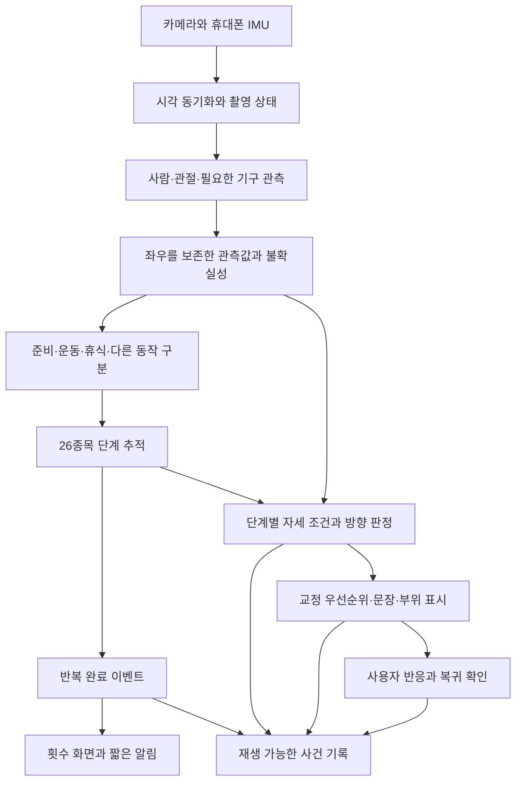

# 26종목 운동 이해·실시간 교정 엔진 설계

작성: 2026-09-23. 상태: **전체 목표를 담은 설계 제안**. 현재 실행 범위는 [M1 구현 문서](POSTURE_MOTION_ENGINE_IMPLEMENTATION.md)를 따른다. 아래 전체 목표가 구현 완료됐다는 뜻은 아니다.
기준: `feature/posture-coach-reliability`의 `5237ba9` + 현재 `codex/aihub-26-exercises`의 26종목 제한 작업.
종목별 계약: [26종목 설계표](POSTURE_MOTION_26_EXERCISES.md).

## 1. 제품의 목표와 약속

사용자가 원하는 것은 규칙에 걸렸다는 경고가 아니라 **지금 어떤 동작을 하고 있고, 어느 쪽 신체가 어느 방향으로 벗어났으며, 다음에 무엇을 바꾸면 되는지** 알려주는 서비스다. 반복은 종목별로 정의한 완료 지점에 도달하면 바로 표시한다.

앱의 처리 대상을 26개 운동으로 제한하되, 운동 사이의 휴식·준비·자리 이동·다른 동작·관측 실패까지 처리한다. 미지원 동작을 억지로 26개 중 하나로 분류하지 않는다. 모든 입력 구간에 상태를 주는 것과 모든 인간 행동의 이름·원인·정오를 알아내는 것은 다르다.

제품 계약은 다음과 같다.

- 관측 가능한 동작에는 `부위 + 사용자 좌우 + 방향 + 운동 단계 + 지속/변화 + 근거`를 붙인다.
- 선택한 운동의 기준에 맞는지와 처음 동작에서 변했는지는 별도로 판단한다. 처음부터 한 오류를 기준선으로 정상화하지 않는다.
- 평가할 수 없는 항목은 이유와 촬영 안내를 제공한다. 다른 부위와 횟수 관측은 가능하면 계속한다.
- 반복 검출, 운동 범위 충족, 자세 조건 충족을 구분한다. 자세 판정이 늦어도 관측된 반복 숫자는 기다리지 않는다.
- 앱이 말한 뒤 실제로 같은 부위·단계가 개선됐는지 확인한다. 가림이나 세트 종료를 개선으로 처리하지 않는다.
- 공통 규칙과 사용자 선택에 근거한다. 이 채팅 사용자의 영상에 맞춘 전역 임계값 변경은 하지 않는다.

영상만으로 통증·근력 부족·피로의 원인, 실제 발바닥 압력, 가려진 기구 접촉을 확정하지 않는다. 이들을 관측 가능한 위치·움직임과 같은 수준의 라벨로 만들지 않는다. ‘모든 오류’는 고정 개수의 문구로 완성할 수 없으므로, 미지의 동작을 정직하게 보류하고 검증된 오류 종류를 확장하는 구조가 필요하다.

## 2. 현재 코드에서 확인한 문제

이번에는 새 사용자 영상이나 기기 로그를 받지 않았다. 아래는 **코드로 확인한 구조**이며 이번 사용자 증상의 단일 원인을 실측 확정한 것은 아니다.

| 구조 | 코드 근거 | 영향 |
|---|---|---|
| 추론과 로그 간격이 같음 | `PostureLive.kt` 300ms, `InferencePolicy.kt` | 명목상 최대 3.33Hz. 발열 배수 1.5/2/3에서 2.22/1.67/1.11Hz. 실제 속도는 더 낮을 수 있음 |
| 전 종목 1.2초 재계수 제한 | `RepCounter.kt`, `ReturnRepTracker.kt` | 1.2초보다 빠른 모든 반복을 각각 즉시 확정하는 것이 구조적으로 불가능 |
| 고정 시작 위치와 복귀 정지 요구 | 시작 3표본·300ms, 복귀 2표본·150ms, 복귀 폭 `minAmp × 0.22` | 300ms 표본에서는 시작 관측에 적어도 약 600ms, 복귀에도 추가 표본 대기. 쉬지 않는 반복·시작 위치 변화에 취약 |
| 반복 신호 한 개에 의존 | 스쿼트 `knee_mean`, 런지 `knee_out_mean`, 일부 상체 `forearm_vert_mean` | 좌우 교대가 평균에서 상쇄되거나 오류 측정량이 반복 신호 역할을 함. 스탠딩 사이드 크런치는 카운터 없음 |
| 무릎의 좌우·단계 평균 | 스쿼트 `knee_out_mean__mean < 0.02388` | 한쪽 안쪽 이동과 다른 쪽 바깥 이동을 별도로 설명하지 못함 |
| 측정과 설명의 의미 차이 | `knee_out`은 골반–발목 연결선에서 무릎의 측방 변위, 발끝 방향을 직접 사용하지 않음 | 그 값만으로 ‘무릎이 발끝보다 안쪽’이라고 설명하면 관측 근거보다 강한 주장 |
| 조건 이름으로 음성 선택 | `CoachCues` 정규식과 `PRIMARY/OPPOSITE` | 다른 원인·단계·부위에 같은 문구가 적용됨. 골반/어깨 프록시만으로 척추 곡률이나 견갑골 상태를 확정할 수도 없음 |
| 초반과 최근의 8프레임 비교 | `LiveCoach`, 시작 앵커 | 300ms 간격에서 창의 시간 폭 약 2.1초. 순간 사건과 운동 단계가 섞이며 앵커 전 첫 반복이 평가에서 빠질 수 있음 |
| 방향 미확정 시 뷰 제한 해제 | `PostureRules.evaluate`의 UNKNOWN 처리 | 검증되지 않은 관측 조건에서 판정이 다시 열릴 수 있음 |
| 처리 시작 시각을 동작 시각으로 사용 | 라이브 `System.currentTimeMillis()` | 캡처·추론·출력 지연 분해가 어렵고 시계 변경에 취약 |

**정정:** 바깥쪽 무릎 음성은 이미 `oppositeEntries`에 있다. 스쿼트에는 `> 0.23358` 반대 방향 가드도 있다. ‘문구가 하나뿐’이 정확한 원인은 아니다. 이 가드는 정상 표본 27개의 MAD 범위에서 만든 값이며, 자산의 `validated: true`만으로 바깥쪽 오류의 독립 정답 검증을 증명하지 않는다.

구조를 보여주는 가상 숫자 예:

- 좌우 `knee_out`이 모두 `+0.01`이면 평균 `+0.01`은 양수인데도 `< 0.02388`이라 PRIMARY 문구로 간다. 피처 부호와 위반 방향은 동일하지 않다.
- 좌우가 `-0.10`, `+0.18`이면 평균 `+0.04`로 OK가 된다. 각 다리의 방향 정보는 사라진다.
- 이 숫자는 알고리즘 반례이며 실제 사람의 정답 자세를 라벨링한 결과가 아니다.

## 3. 전체 구조



모델 하나가 영상에서 문장을 직접 생성하는 구조 대신, **동작을 추정하는 모델 + 검증 가능한 운동 계약 + 근거가 있는 발화**를 결합한다. 모델은 복잡한 시계열과 미지 동작을 다루고, 계약은 무엇을 1회·정상·이탈로 부를지 제한한다.

기존 코드는 대조군으로 유지한다. 신규 엔진은 `ExerciseContract`, `MotionObservation`, `MotionEvent`를 경계로 붙이며 Compose가 프레임 판정 상태를 직접 소유하지 않게 한다.

## 4. 관측 계층: 좌표가 아니라 근거까지 전달

프레임마다 다음을 보존한다.

| 정보 | 용도 |
|---|---|
| frame ID, 캡처 시각, 수신·추론·렌더 시각 | 실제 지연과 누락 구분 |
| 사용자 ID, 좌우, 2D/추정 3D 관절, visibility/presence | 같은 사람과 같은 부위의 연속성 |
| 카메라 내부 파라미터 가용 여부, 회전, 미러, 이미지 변환 | 원영상·추론·오버레이 좌표 일치 |
| gravity와 촬영 방향 신뢰도 | 기울기 보정 및 항목별 관측 제한 |
| 관절/특징별 관측 구간과 불확실성 | 한 관절 가림을 전체 실패로 확대하지 않음 |
| 배경 이동·IMU 변화, 피처 출처와 모델 버전 | 카메라 이동과 사람 움직임 구분 |

`visibility`는 위치 오차의 확률이나 올바른 자세의 확률이 아니다. 2D/추정 3D의 일치도, 가림, 관절 길이 변화, 프레임 간 불연속과 실측 잔차를 함께 사용해 항목별 신뢰도를 검증한다. 같은 모델의 2D·3D 결과를 독립된 두 센서의 증거로 곱하지 않는다.

좌표는 목적에 따라 나눈다: 몸통 좌표(팔·몸통 관계), 지지발 좌표(무릎 궤적), 관측 측면 평면(바닥 운동), 카메라 좌표(촬영 안내). 매 프레임 골반 회전으로 축까지 회전시키면 오류가 상쇄될 수 있어, 세트 기준축과 현재 몸통축을 모두 보존한다. 좌우는 사용자의 해부학적 좌우로 고정하고 화면 미러는 렌더링에서만 적용한다.

압력·기구 접촉은 별도의 관측 능력이다. 바 경로를 말하려면 바를 검출하거나 손 위치에 의한 근사라고 밝혀야 한다. 뒤꿈치 접지는 발끝·뒤꿈치 추적, 바닥과의 상대 변화, 촬영 시점을 함께 확인하며 신발 두께를 곧바로 들림으로 해석하지 않는다. 손목 꺾임은 Pose의 희소 손 랜드마크만으로 확정하지 않고 필요한 경우 손 ROI 모델을 검토한다.

## 5. 실제 실시간 처리와 빠른 동작

### 5.1 추론·판정·저장 주기를 분리

- 카메라: 지원 기기에서 30fps 입력을 요청하되 실제 타임스탬프 간격을 측정한다.
- 관절 관측: 실측 기기 성능에 맞춰 연속 VIDEO 또는 LIVE_STREAM 처리. 10–15Hz 이상을 초기 성능 목표로 두고, 빠른 동작에서는 20–30Hz 후보를 시험한다. 지원 보장값이 아니다.
- 단계/카운터: 새 관측마다 갱신. 고주파 타이머로 같은 관측을 여러 번 사용하지 않는다.
- 정교한 부위 모델: 필요한 구간·ROI에 한정해 호출한다. 더 늦은 결과는 캡처 시각에 맞춰 합류한다.
- 기존 분석용 저속 집계: 2–4Hz 유지 가능. 그러나 이 표본을 카운터의 유일 입력으로 쓰지 않는다.
- 표시: 디스플레이 속도로 보간할 수 있지만 보간·예측 좌표로 반복 완료나 위반을 새로 확정하지 않는다.
- 저장: 판정에 사용한 관측·파생값·버전을 배치 기록한다. 자원상 전체 고속 피처를 저장 못 하는 모드는 비트 단위 재생 가능하다고 주장하지 않는다.

MediaPipe는 VIDEO/LIVE_STREAM에서 추적을 사용하며 비동기 라이브 입력도 제공한다. 이 API 선택만으로 관측률이 보장되지는 않는다. [공식 Android 문서](https://developers.google.com/edge/mediapipe/solutions/vision/pose_landmarker/android)

현재 코드도 이미 VIDEO 모드와 `detectForVideo`를 사용한다. 단순히 모드를 바꾸는 개선이 아니라 300ms 제한·변환 비용·동기 결과 처리·메모리 할당을 함께 계측해야 한다. 저장된 Note10+ 재생의 추론 중앙값 102ms/p95 120ms는 약 30Hz Full 추론을 약속할 근거가 아니다. 카메라·렌더링을 제외한 과거 특정 실행 수치다. [기존 재생 진단](../research/aihub_fitness/DEVICE_REPLAY_RESULTS.md)

Full 연속 처리와 Lite 고속 처리 후보를 동일 입력에서 비교한다. Lite의 좌표에 Full로 정한 임계값을 그대로 사용하지 않는다. 모델별 보정·불확실성과 전환 이력이 필요하다. 휴대폰에서 충분한 관측률을 못 내면 운동을 틀렸다고 말하지 말고 횟수 신뢰도를 낮춘다. 주기만 추정해 누락 횟수를 채워 넣지 않는다.

### 5.2 시간·누락·발열

캡처 타임스탬프를 기준으로 단조 증가하는 세션 시간축을 만들고, 카메라/IMU 타임베이스가 같다고 가정하지 않고 오프셋·리셋을 검증한다. 재바인딩은 새 capture epoch다. `captured → inferred → event → rendered → utteranceStarted`를 각각 기록한다.

CameraX는 `KEEP_ONLY_LATEST`에서 처리 중 쌓이는 옛 프레임을 버린다. 실시간 경로에서는 이 정책을 유지하되 입력률과 실제 처리율을 분리 기록하고, 오래된 프레임의 큐를 길게 쌓아 숫자가 뒤늦게 따라오게 하지 않는다. [공식 CameraX 문서](https://developer.android.com/media/camera/camerax/analyze)

열 상태 악화 시 ROI/해상도/모델/기록량의 검증된 조합을 선택한다. 보존해야 할 최우선 지표는 **단계 전환 구간의 실제 관측률과 최신성**이다. 이 조건을 충족 못 하면 해당 반복을 ‘미확인’으로 남긴다. 주기당 표본 수만으로 통과시키지 않고 전환점의 가시성·최대 관측 간격·노이즈를 함께 평가한다.

## 6. 운동 중 행동을 먼저 구분

세션 상위 상태:

`UNOBSERVABLE / SETUP / READY / ACTIVE / BETWEEN_REPS / REST / REPOSITION / OTHER_MOTION / UNKNOWN`

이 상태와 신체 오류는 별도 축이다. `ACTIVE + 왼쪽 무릎 안쪽 이동`은 교정 후보, `REST + 고개 숙임`은 보통 교정 대상이 아니다. 모델이 다른 행동의 구체적 이름을 확신하지 못해도 `OTHER_MOTION`으로 운동 카운트와 자세 교정에서 제외할 수 있다.

| 상황 | 처리 |
|---|---|
| 폰 설치, 걸어 들어오기, 덤벨 집기 | 준비 구간. 반복·정자세 기준에 섞지 않음 |
| 운동 중 옷 정리, 휴식, 자리 이동 | 운동 단계에서 이탈한 구간을 분리. 무조건 오류 발화하지 않음 |
| 발 위치를 조정한 뒤 재개 | 새 지지발 상태를 확인. 초반 기준을 조용히 덮어쓰지 않음 |
| 다른 운동처럼 보이는 동작 | 선택 종목으로 강제 계수하지 않음. ‘선택한 운동의 동작을 확인하지 못했어요’ |
| 몸이 일부 가려짐 | 해당 관절 판정만 유보. 이미 확인된 반복 수 유지 |
| 갑작스런 큰 몸통 이동 | 실제 균형 이탈/휴식/가림/카메라 이동을 구분할 근거가 부족하면 세부 처방 대신 확인 안내 |

처음에는 명시적 상태 전이와 다관절 움직임으로 구현한다. 이후 원영상/관절 시퀀스가 있는 데이터로 작은 causal TCN 또는 temporal encoder를 학습해 `actionContext + phase + side + observable event`를 공동 예측한다. 학습된 posterior에 종목별 전이 제약을 적용하는 온라인 필터를 사용한다. 오프라인 전체 영상의 미래 정보를 쓰는 성능을 실시간 성능으로 보고하지 않는다.

## 7. 카운터: 종목별 단계와 완료 사건

### 7.1 공통 4등분 대신 동작 계약

스쿼트는 `준비→하강→전환→상승→복귀`, 프레스는 `준비→밀기→상단→내리기`, 런지는 `발 내딛기→내려가기→올라오기→발 복귀`, 플랭크는 `진입→유지→이탈/종료`가 자연스럽다. 4단계라는 이전 아이디어의 장점은 **단계별 기준**이며, 모든 종목을 같은 시간 비율로 4등분하는 것은 아니다.

각 계약에는 `시작 상태`, `필수 통과 단계`, `계수 지점`, `다시 셀 수 있는 재진입 조건`, `허용 정지`, `좌우 계수 단위`를 둔다. [26종목 표](POSTURE_MOTION_26_EXERCISES.md)에 각각 지정했다. 계수 지점은 제품 초안이며 데이터 영상의 동작 정의·코치 검토와 맞춘 뒤 고정한다.

### 7.2 검출 방식

1. 좌우 무릎/고관절/몸통 또는 좌우 팔꿈치/상완/손 높이 등 **주신호 + 독립적인 의미의 보조 신호**로 단계를 추정한다. 같은 랜드마크에서 만든 파생값을 독립 증거로 과대평가하지 않는다.
2. 후보별 상태 확률과 제한된 경로를 온라인으로 유지한다. 유효 자세 여부는 단계 검출의 필수 조건으로 삼지 않는다. 얕은 반복도 동작은 관측할 수 있어야 한다.
3. 완료 전이의 실제 관측과 경로 이력이 충족되면 `RepObserved`를 단 한 번 발행한다. 다음 반복을 기다리지 않는다.
4. 같은 완료 자세에 오래 있어도 재진입 전에는 다시 세지 않는다. 전 종목 공통 1.2초를 중복 방지의 주수단으로 사용하지 않는다.
5. 동작 범위·노이즈·최근 속도는 변화율 필터와 전이 폭 조절에 사용한다. 정자세 임계값을 느슨하게 하는 용도로 사용하지 않는다. 초기 반복부터 동작하도록 모집단 전이 prior를 사용하고 준비 화면의 관측을 활용한다.
6. 시작이 반복 중간이면 이미 보지 못한 구간을 만들어내지 않는다. 명확히 관측한 첫 완료부터 계약에 맞게 센다. 카메라 이동/긴 가림은 진행 중 경로만 끊고 완료 수는 보존한다.
7. 좌우 교대는 개별 상태와 `side`를 유지한다. 양쪽 동시 운동은 두 상태의 허용 시차를 검사한다. 한쪽 가림 때문에 임의로 좌우 완료를 보충하지 않는다.

One Euro와 같은 속도 적응 필터는 저속 떨림과 고속 지연의 절충 후보다. 파라미터는 캡처 간격·신호 단위별로 재생 검증하며, 속도 변화·전환점 누락을 별도 평가한다. [원 저자 설명](https://gery.casiez.net/1euro/)

RepNet/TransRAC의 시간적 반복성 표현은 보조 주기 추정·훈련 표현·오프라인 교차검사 후보로 쓴다. 해당 논문의 총횟수 성능을 휴대폰의 인과적 완료시점 정확도로 간주하지 않는다. [RepNet](https://arxiv.org/abs/2006.15418), [TransRAC](https://arxiv.org/abs/2204.01018)

### 7.3 즉시 숫자와 기준 충족을 함께 제공

예: **관측 8회 · 기준 충족 6 · 이탈 1 · 미확인 1**. 숫자를 올리기 위해 전체 자세 평가의 확정을 기다리지 않는다. 내려놓기 등 완료 이후에 평가해야 할 구간이 있다면 품질 상태만 후속 갱신한다. 확정해 말한 반복 수를 몰래 되돌리지 않는다. 잘못 확정한 사건은 정정 사건으로 기록한다.

목표는 `반복 수`와 `지정한 자세 기준을 충족한 반복 수`를 구분해 설정한다. 이전 요구인 ‘기준을 만족해야 인정’은 후자로 제공한다. 동작 수와 기준 충족 수를 같은 변수로 재사용하지 않는다. `기준 충족`은 설정한 평가 범위에서만 의미가 있으며 신체 전체가 정답이라는 인증이 아니다. 미확인은 실패나 정상에 포함하지 않는다.

## 8. 방향과 원인을 분리한 자세 판정

### 8.1 사건 표현

`운동 + 단계 + 부위/사용자 좌우 + 움직임 방향 + 관계 기준 + 크기/지속 + 관측 신뢰도 + 근거 출처`

예: `squat / ascent / left_knee / medial_deviation / support_foot_corridor / persistent / observed`.

무릎 안쪽 이동과 바깥쪽 이동은 별도 사건이다. 고개 숙임/젖힘/좌우 회전, 골반 솟음/처짐/좌우 이동, 팔 벌림/모음/전후 이동, 깊이 부족/복귀 부족, 관측된 흔들림도 별도로 다룬다. 단일 ‘불량 자세’ 점수에서 문장을 추측하지 않는다.

### 8.2 정상 기준은 단일 정답 각도가 아님

각 항목의 허용 영역은 `종목·선택 변형·운동 단계·지지측·측정 도메인·촬영 방향`에 조건부다. 이름이 같은 운동의 모든 신체구조를 평균 자세 하나에 맞추지 않는다. 신체 길이 정규화는 단위 차이를 줄이는 도구이지 개인별 최적 각도를 알려주는 정답이 아니다.

관측값이 `x ± uncertainty`, 허용 범위가 `[L,U]`일 때 아래처럼 사용한다.

- 관측 구간이 완전히 L 아래/U 위에 있고 관측·방향 검증을 통과하면 각각 방향별 이탈 후보.
- 경계와 겹치면 `UNCERTAIN`, 해당 항목을 볼 수 없으면 `UNOBSERVABLE`.
- 영역 안이면 해당 관측 항목만 `IN_RANGE`. 모든 자세의 정상으로 승격하지 않음.
- 여러 항목이 같이 만족되어야 하는 조건은 단변량 범위들의 단순 합집합이 아니라 조건부 관계와 함께 검사한다.

L/U를 정상 표본 백분위만으로 정하면 ‘드문 자세’를 ‘틀린 자세’로 오인할 수 있다. 방향별 실제 오류 라벨·정의·촬영 검증을 함께 갖추기 전에는 정상 분포 이탈을 관찰로만 표시한다. 기본 범위의 임의 확대나 사용자 동의 한 번으로 의학적 안전을 인증하지 않는다.

## 9. 스쿼트 무릎 사례의 구체적 해결

**구분할 것:** 발끝이 바깥을 향함, 무릎이 바깥에 위치함, 상승 중 무릎이 안쪽으로 이동함, 무릎이 지지발 기준 허용 궤적 밖에 있음은 서로 다른 사실이다. 발 너비와 발 각도에 따라 무릎/고관절 움직임이 달라진다는 원 연구도 있으므로, 화면 바깥 방향 자체를 오류로 정의하지 않는다. [Lorenzetti 등, 2018](https://link.springer.com/article/10.1186/s13102-018-0103-7)

1. 정면에서 각 발의 뒤꿈치–앞발 방향을 관측하고, 무릎·고관절·발목과 지지발 상태를 연결한다. 발이 짧게 투영되거나 신발/가림으로 방향 오차가 크면 발끝 기준 판정은 유보한다.
2. 하강/최하단/상승을 분리한다. 지지발을 기준으로 정규화한 무릎의 부호 있는 측방 변위와 단계별 변화량을 계산한다. 기존 `knee_out`은 보조 관측이지 ‘발끝과 일치’의 대체 정의가 아니다.
3. 좌우를 평균하지 않는다. 왼쪽 이탈과 오른쪽 이탈을 별도 유지하고, 양쪽이 같은 오류일 때만 ‘양 무릎’으로 묶는다.
4. 부호는 화면 x 증가가 아니라 사용자·지지발 기준 안/밖으로 정의한다. 미러/좌우 회전 변환의 불변성을 테스트한다.
5. ‘무릎이 안쪽으로 회전했다’는 관절 축회전 주장은 희소 관절점만으로 확정하지 않는다. 실제 측정이 위치/궤적이면 ‘무릎이 안쪽으로 이동한다’고 말한다.

검증을 통과한 경우의 문구 예시:

| 관측·판정 | 안내 |
|---|---|
| 상승 중 왼쪽 무릎의 안쪽 이탈 | ‘올라올 때 왼쪽 무릎이 안쪽으로 들어와요. 발끝 방향을 따라 움직여 주세요’ |
| 오른쪽 무릎의 바깥쪽 이탈 | ‘오른쪽 무릎이 발끝 기준 범위보다 바깥으로 나가요. 발끝 방향에 맞춰 주세요’ |
| 양발 바깥 방향, 무릎 궤적 허용 | 발화하지 않음 |
| 왼발이 가려져 발 기준 불확실 | ‘왼발이 가려져 무릎 방향을 확인하기 어려워요’ |
| 후반에만 이탈 증가 | 같은 단계끼리 비교해 ‘후반 반복에서 왼쪽 무릎이 더 안쪽으로 움직여요’. 피로 원인 단정 안 함 |

정면에서 무릎 방향을 보더라도 스쿼트 깊이를 같은 정확도로 보는 것은 아니다. 깊이는 측면/사선의 가시성과 별도 계약이 필요하다. 이전의 ‘고관절이 무릎 윗부분보다 낮음’ 기준은 해부학적 표면 위치를 뜻하며 MediaPipe 관절 중심 높이 비교와 동일하지 않다. 이를 제품 기준으로 채택하려면 라벨 정의와 관측 오차를 검증해야 한다.

## 10. 개인화·초보·숙련자

개인화 값은 네 종류로 분리한다.

| 값 | 얻는 방법 | 변경할 수 없는 것 |
|---|---|---|
| 촬영 보정 | 카메라 안정 구간, 뷰·지면·관절 품질 | 운동의 정답 의미 |
| 신체 정규화 | 잘 보이는 부위의 강건한 길이 비율 | 임의의 체형별 정답 각도 |
| 세트 관측 기준 | 같은 측·단계의 초반 반복, 유지 동작 | 정자세 판정 임계값 |
| 운동 의도·알림 선호 | 전체/부분 범위, 좌우 단위, 집중 항목, 코칭/기록 | 공통 관측값과 측정 로그 |

기준을 모으는 동안에도 검증된 절대 조건은 첫 동작부터 평가한다. 초반 3회 수집 완료를 교정 시작 조건으로 묶지 않는다. 관측 기준이 아직 없으면 ‘처음부터/점점’이라는 시간 해석만 생략한다. 비교 기준에 오류가 있어도 변화는 측정할 수 있지만 ‘올바른 기준’이라고 부르지 않는다.

숙련자는 관측/템포/좌우 차이 중심으로 사용하고 항목별 음성을 줄일 수 있다. 부분 반복은 선택된 운동 안의 의도 태그이며 새로운 운동 지원을 의미하지 않는다. 미지원 변형에는 기존 정답 조건을 이식하지 않는다. 기준 재측정·모드 변경·촬영 변경의 이력은 보존하고 과거 결과를 덮어쓰지 않는다.

## 11. 음성·화면·복귀를 하나의 사건으로 연결

`event → coaching decision → cue → UI highlight → TTS start/end → outcome`에 같은 ID를 사용한다.

- 한 번에 행동 하나. ‘어디/언제/어느 방향’과 바꿀 행동을 짧게 말한다.
- 신뢰도 부족·의미 불일치·가림이면 자세 처방 대신 관측 안내를 선택한다.
- 반복 숫자는 즉시 화면에 표시한다. 음성 채널이 비어 있으면 숫자, 교정 중이면 짧은 톤으로 알려 오래된 숫자를 큐에 쌓지 않는다.
- 코칭 우선순위는 관측 확실성, 사용자가 고칠 수 있는지, 이벤트의 지속성과 합의된 운동 기준상 중요도로 정한다. AUC 하나나 경고 지속시간만으로 고르지 않는다.
- ‘무릎을 벌려라’와 ‘모아라’ 등 상충 사건은 한 부위의 최신 방향으로 병합한다. 실제 발화 시작 전에도 이벤트가 유효한지 검사한다.
- 큐에서 기다리는 동안 세트/단계/카메라/사람이 바뀌면 폐기한다. 발화 타이밍이 지난 지시는 다음 반복을 위한 문장으로 바꾸거나 세트 리포트로 보낸다.
- 방향 화살표는 교정 방향으로 검증된 투영이 가능할 때만 표시한다. 시점이 나쁘면 부위 표시만 한다.
- 개선은 같은 부위·같은 단계의 후속 관측이 있어야 확인한다. 가림/유보를 복귀로 처리하지 않는다.
- 사용자에게 ‘아니었어요’를 제공해 관측/방향/시점/문구 중 무엇이 틀렸는지 기록한다. 이 피드백은 수집 라벨이며 자동으로 전역 임계값을 변경하지 않는다.

언어모델은 검증된 구조화 사건의 세트 후 설명·문구 초안에 사용할 수 있다. 실시간 측정/방향/횟수의 정본은 아니다. 원영상 VLM 분석을 추가하더라도 정밀 운동학을 관절 관측 없이 만들어내게 하지 않는다.

## 12. 데이터 전략: AIHub가 주는 것과 추가로 필요한 것

AIHub 정상/연기 오류·description·다중 뷰·관절을 관측 후보, 운동 단계 예시, 오류 의미 체계의 출발점으로 사용한다. 현재 저장된 16프레임 클립과 세트 단위 라벨은 실제 시간·반복 끝·자연스러운 휴식·순간 오류·오류 방향의 정답을 모두 제공하지 않는다. 600ms 가정 시각이나 보간으로 이 정답을 만들어 검증했다고 할 수 없다.

데이터 연결표를 만든다: `조건명 → 실제 description → 관측 부위/방향 → 라벨 단위 → 사용 가능한 뷰 → GT/MP 도메인 → 확인 가능 여부`. 혼합 척추 라벨 등 하나의 라벨에 반대 방향이 섞이면 분리하거나 방향 미확정으로 둔다. 원영상이 없으면 프레임 전환 관계는 제한된 약한 라벨로만 사용한다.

### 필요한 라벨

- 세션 상태의 시작/끝, 선택한 운동/변형과 다른 행동 구간.
- 각 반복 시작/전환/완료·계수 지점, 사용자 좌우, 실제 시각.
- 부위·방향별 오류 시작/끝, 정상처럼 보이는 반례, 의도된 변형.
- 가림·시점·모델 오류·판정 불가. ‘안 보임’을 정상 라벨로 채우지 않음.
- 교정 문구가 측정 사실·방향·시점에 맞는지, 후속 개선 여부.

새 영상은 참여자 동의를 받아 수집하고 기존 기본 동작인 영상 미저장을 유지한다. 개발용 촬영 모드에서만 원본 기록·보관 기간·삭제를 선택하게 한다. 관절 궤적도 개인 활동 정보이므로 내보내기 범위를 명시한다. 이 설계에서는 촬영·업로드를 실행하지 않는다.

### 사람 전체를 위한 검증 분할

1. AIHub는 수행자 단위로 train/dev/test 분리. 같은 클립의 모든 뷰와 파생값을 같은 분할에 둔다. 가능하면 날짜·환경·기기도 외부 분할로 확인한다.
2. 임계값/뷰/피처/문구를 선택한 데이터는 개발 데이터다. 선택 후 그 자료의 성능을 독립 시험 결과로 표시하지 않는다.
3. 실제 휴대폰에서는 체형·숙련도·좌우·복장/신발·빛·가림·속도·촬영 방향·기기를 나눠 평가한다. AIHub 평균 AUC만으로 출시하지 않는다.
4. 이 채팅에서 이미 반복 수정에 활용된 로그는 회귀 자료다. 새로운 홀드아웃으로 취급하지 않는다. 사용자 설명과 세트 ID가 확실히 연결된 것만 정답에 포함한다.
5. 합성 관절 회전·스파이크·프레임 드롭은 불변성/고장 주입 시험에 사용한다. 사람의 실제 잘못된 자세·개인화 효과의 증명으로 사용하지 않는다.

기존 데이터만으로 구현할 수 있는 것은 입력/시간 정리, 방향 의미 제한, 상태 기반 카운터, 종목 계약, 미확정 처리, 사건 로그다. **모든 방향 오류의 정확도와 실제 고속 동작 성능을 인증하려면 적절한 새 정답 데이터가 필요하다.**

## 13. 검증 기준과 성능 목표

아래 숫자는 **설계 목표이며 측정 결과가 아니다**. 시점·관측 조건을 만족하는 지원 영역과 전체 실사용 영역을 각각 보고한다. 유보를 늘려 정확도만 높이는 방식은 허용하지 않는다.

| 항목 | 목표와 보고 방법 |
|---|---|
| 반복 사건 | 완료시각을 일대일 매칭한 precision/recall 각각 98% 이상을 초기 목표. 짧은 세트에서는 단순 총횟수 오차만 쓰지 않음 |
| 정확한 세트 수 | 세트 exact-count 비율 95% 이상 목표, MAE/중복/첫·마지막 누락 함께 보고 |
| 화면 지연 | 관측 가능한 완료시점→화면 p95 300ms 이내 목표. 빠른/느린 동작·발열·기기별 분리 |
| 알림 지연 | 음성 채널이 비었을 때 완료→숫자 음성 시작 p95 500ms 목표. 코칭 점유 시 숫자 톤과 표시 지연 별도 |
| 교정 안내 | 실제 오류 시작→사건 확정과 확정→화면/음성 지연을 분리. 후자는 p95 300/700ms 목표, 오류 지속 조건은 항목별 명시 |
| 방향 정확도 | 사용자 좌우 × 안/밖 × 단계 혼동행렬. 반대 방향으로 교정시키는 비율 1% 미만을 초기 목표 |
| 유효한 교정 | 발화한 교정의 정밀도 95% 이상 목표. 위반 검출률은 관측 가능 구간과 유보 포함 전체를 모두 표시 |
| 과도한 발화 | 오류 없는 운동 10분당 잘못된 교정 1회 미만 목표. 걷기/기구 집기/휴식의 오계수 별도 |
| 관측 범위 | 운동·항목별 actionable coverage, 유보 시간/사유. 유보가 많으면 교정 가능이라고 배포하지 않음 |
| 사용자 효과 | 안내 후 같은 단계에서 개선되는 비율, 잘못된 방향 안내, 이해도, 음소거/거부 빈도 |

사람 단위 군집 부트스트랩과 구간 추정, 이벤트 수·사람 수를 함께 보고한다. 1% 오류율 주장에 필요한 표본은 사람 내 상관을 고려해 산정한다. 소수 사람의 수백 프레임을 독립 수백 사례로 세지 않는다. 체형 집단별 표본이 부족하면 차이가 없다고 결론내리지 않는다.

필수 회귀 시나리오:

1. 깊게/얕게 섞기, 전 범위/부분 범위 의도 변경, 마지막 반복 직후 종료.
2. 0.6/0.8/1.0/1.5/3/5/8초 주기, 템포 급변, 바닥·상단 정지. 이는 시험 격자이며 모든 속도 지원 약속이 아님.
3. 처음부터 움직이는 진입, 중간 진입, 카메라 전환, 일시정지/재개, 비단조 시각·프레임 드롭.
4. 왼쪽만 안쪽/오른쪽만 바깥쪽/서로 반대/둘 다 바깥/정상 발끝 벌림. 좌우 미러와 카메라 회전.
5. 신발·맨발·헐렁한 옷·한쪽 가림·발끝 잘림·두 사람 출현·휴식/물 마시기/기구 집기.
6. 종목별 정상적으로 움직여야 하는 부위: 레터럴 레이즈의 팔 벌림, 크로스 런지의 중앙선 교차, 힌지의 몸통 숙임을 오류로 지적하지 않음.
7. 완전히 관측 못 한 반복을 주기로 보충하지 않음. 예측 프레임만으로 숫자를 올리지 않음.
8. 처음 자세가 잘못돼도 absolute 오류는 작동하고, 개인 관측 기준은 그것을 정상으로 인증하지 않음.

## 14. 모듈·사건 계약

앱 최상위 UI와 독립된 Kotlin 엔진에서 시간순 프레임을 소비한다. 같은 입력과 같은 버전이면 앱·재생 하니스가 같은 사건을 출력해야 한다.

```text
CaptureObservation
  sessionId, captureEpoch, frameId, captureTimeNs, processedTimeNs,
  personTrackId, joints2d, estimatedJoints3d, visibility, transforms,
  featureSource, modelVersion, view, gravity, qualityByFeature

ExerciseContract
  exerciseId, datasetName, version, phaseGraph, startStates,
  countUnit, countPoint, rearmRule, repSignals, errorSpecs,
  requiredEvidenceByEvent, supportedViewByEvent, unobservableReasons

MotionEvent
  eventId, version, sessionId, exerciseId, captureEpoch, personTrackId,
  repId?, phase, bodyPart?, side?, direction?, relation?,
  observedStartNs, confirmedAtNs, evidenceFrameIds,
  status, measurements, uncertainty, referenceVersion, provenance

RepObserved -> QualityPending -> InRange | Deviation | Unassessable
CoachingDecision -> Submitted | Suppressed(reason) | Expired
SpeechOutcome -> Started -> Completed | Interrupted | Failed
CorrectionOutcome -> Improved | Persisting | Unobservable | SessionEnded
```

`RepObserved`의 이벤트 시간은 실제 관측 경계, `confirmedAt`은 엔진이 확정한 시각이다. 이를 역산하여 지연이 없는 것처럼 보고하지 않는다. 앱이 정상 실행 중에 외부 네트워크·LLM 응답이 없어도 카운터와 기본 코칭이 작동해야 한다.

모듈 후보: `CaptureClock`, `ObservationQuality`, `MotionContextTracker`, `PhaseTracker`, `RepEventDetector`, `DirectionalFormEvaluator`, `CoachingArbiter`, `MotionEventLog`. 기존 `PostureComparisonTracker`는 같은 단계 비교의 재사용 후보이며, `PostureCore`/`FloorFeatureExtractor`는 출처·관측 신뢰도를 추가하는 어댑터로 유지한다. 기존 창별 규칙은 검증 대조군/세트 요약에 남기되 프레임별 방향 교정으로 자동 승격하지 않는다.

## 15. 구현 순서와 완료 기준

| 단계 | 구현 범위 | 다음 단계로 가는 조건 |
|---|---|---|
| M0 진단 | 캡처→표시/음성 시각, 누락 원인, 선택된 규칙/문구 기록. 기존 로그를 회귀 하니스로 연결 | 느린 계수의 추론/전이/음성 지연을 구분하고 잘못된 방향 발화의 근거를 재생 |
| M1 의미와 전달 | 조건명 regex 대신 근거 있는 방향 사건→문구, 사용자 좌우, UNKNOWN 뷰/항목별 보류, 큐 만료 | 무릎 양방향·혼합 좌우·미러·가림 회귀를 통과. 방향 근거 없는 규칙은 세부 지시하지 않음 |
| M2 고속 카운터 | 추론/저장 주기 분리, 단조 시각, 복수 신호 단계 추적, return dwell/공통 1.2초 의존 제거 | 스쿼트·푸시업·컬의 서로 다른 주기 구조에서 완료 지연·누락·중복 지표 충족 |
| M3 26종목 계약 | 표의 모든 종목에 단계/계수 단위/오류 방향/불가 항목 연결. 플랭크는 시간 | 지원 목록 26개 모두가 빈 공통 폴백 없이 명시적 동작 또는 관측 불가로 응답 |
| M4 행동 문맥 | 준비·휴식·다른 움직임 분리, 필요 시 causal 학습모델·기구/손 ROI | 비운동 구간 오계수와 잘못된 자세 지적을 검증, 데이터 누출 없는 비교 |
| M5 개인화와 검증 | 촬영/관측 기준 분리, 부분 반복 의도, 교정 후 확인, 다른 사람/날짜/기기 검증 | 방향·반복·지연·관측률·사용자 효과를 함께 충족한 항목만 출시 |

첫 구현 단위는 **스쿼트의 좌우 무릎 사건 + 실제 완료시점 카운터**가 적절하다. 다만 스쿼트에 맞춘 추상화를 26개에 복사하지 않도록 M2에서 푸시업·컬을 동시에 검증한다. 파셜/교대/홀드/미관측이 서로 다른 계약임을 처음부터 엔진에 반영한다.

이번 변경은 이 설계와 26종목 표만 작성한다. 앞선 26종목 제한 작업은 보존하며, 새 카운터·모델·음성 정책·전역 임계값은 적용하지 않았다.
