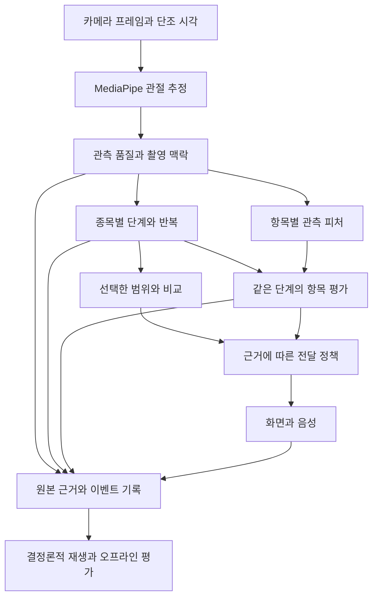

# TREX 26종 자세 서비스 설계

> 이후 구현: [trex_v2 구현·검증](TREX_V2_IMPLEMENTATION.md). 아래 미구현/미실행 표기는 설계 작성 당시 상태이며, 모든 설계 항목의 구현·검증 완료를 뜻하지 않는다.

작성: 2026-09-20 · 상태: **제안 / 미구현**

이 문서는 새로운 사람 촬영·사용성 실험·교정 효과 검증을 하지 않는 조건에서 도달할 수 있는 제품·엔진 설계다. 기존 AIHub 자료와 저장 로그의 재분석, 합성 시험, 기존 이미지를 이용한 기기 시험은 활용한다. 이번 작업은 설계 문서만 작성했으며 앱·엔진·규칙·기기 설치본은 변경하지 않았다.

기준 소스는 현재 `5c7118e`와 새 엔진 브랜치 `2cd4d94`다. ‘Apple 수준’은 실제 만족도를 입증했다는 뜻이 아니라 일관된 조작, 명확한 상태, 오류 복구, 절제된 피드백, 개인정보 보호의 품질 목표다. Apple의 ML 디자인 지침도 잘못된 결과를 사용자가 수정할 수 있는 경로와 결과의 한계 설명을 강조한다. 이를 TREX의 제품 목표로 적용한다. [Apple HIG: Machine learning](https://developer.apple.com/design/human-interface-guidelines/machine-learning)

## 1. 제품 결정

**26종 모두에서 운동을 시작하고 기록을 끝낼 수 있게 하되, 자세 항목은 실제 관측 근거가 있는 만큼만 제공한다.** 촬영 준비, 반복 기록, 선택한 범위와의 비교, 초반 대비 변화, 세트 후 설명을 하나의 흐름으로 만든다. 정확도가 불명인 자세 판정을 늘려 지원 종목 수를 채우지 않는다.

핵심 결정은 다음과 같다.

1. 횟수·선택한 동작 범위·자세 판단을 분리한다. 하나를 통과했다고 다른 것을 통과시키지 않는다.
2. 운동 종류별 시작·전환·복귀의 의미를 정의한다. 최초 안정값으로 돌아오는 임의의 왕복을 모두 운동 1회로 세지 않는다.
3. 촬영 품질과 자세를 분리한다. 보이지 않는 신체 부위는 ‘틀림’이 아닌 ‘확인 못함’이다.
4. 원인을 확정할 수 없으면 몸을 바꾸라는 지시를 만들지 않는다. 특히 바벨, 척추 곡률, 접지 압력, 근육 활성은 다른 피처로 대신 확정하지 않는다.
5. 운동 중 한 번에 한 가지 안내만 보여 준다. 상세 근거와 연구 상태는 쉬는 시간에 펼친다.
6. 가림·일시정지·기기 회전·카메라 이동 이후의 관측을 이전 결과에 조용히 이어 붙이지 않는다.
7. 전체 자세 점수와 ‘완벽/깨끗/안전’ 인증을 제거한다. 실제 기록과 확인한 항목의 범위를 보여 준다.
8. 신규 사람 검증 없이 가능한 전달 수준을 규칙마다 제한한다. 기존 `ship` 이름만으로 교정 음성 자격을 승계하지 않는다.

현재 자산에는 이 조건을 만족하지 않는 규칙이 있다. 새로운 설계의 완성 선언과 현재 구현 상태를 혼동하지 않는다. [브랜치 비교](C:/Users/hp276/Desktop/trex/research/aihub_fitness/outputs/engine_compare_20260920/report.md)

## 2. 범위와 사용자 약속

### 2.1 범위

- Android 휴대폰 한 대, 고정 촬영, 한 사람, 기기 내 실시간 처리. 별도 웨어러블이나 서버 연결은 필수 조건이 아니다.
- 기존 AIHub 연결 고유 26종만 제공한다. 운동명 별칭은 검색·저장 호환성에만 사용한다.
- 바벨·그립·다리 역할·양쪽/교대 방식처럼 영상에서 확정하기 어려운 변형은 필요한 경우 준비 화면에서 선택한다. 자동으로 추측해 판정 기준을 바꾸지 않는다.
- 선택하지 않은 변형과 26종 밖 운동을 대체 운동 버튼으로 다시 노출하지 않는다. 과거 운동 기록은 보존하고 이후 선택 목록만 제한한다.
- 기존 COACH/TRACK의 공통 측정값·임계값은 동일하다. 모드는 안내·표시 정책만 바꾸며, 초보/숙련자별로 정답 기준을 바꾸지 않는다.

### 2.2 제공 수준

| 제공 수준 | 필요한 근거 | 지금 조건에서 설계 가능한 결과 |
|---|---|---|
| 운동 가이드 | 출처가 있는 고정 설명·지원 변형 | 준비 시범, 촬영 안내, 횟수 단위, 수동 기록 |
| 동작 관측 | 관측 계약·반례·결정론적 재생 통과 | 확인된 반복, 관측 시간, 선택 범위와의 비교, 초반 대비 변화 |
| 자세 참고 | 직접 관측 가능, 의미·방향 일치, 보유 데이터의 분리 평가 통과 | 세트 후 또는 펼친 상세의 조건부 참고. beta 표기, 점수·헤드라인·행동 지시 음성 제외 |
| 개인화된 교정 지시 | 위 근거 + 대상 사용자/환경에서 오탐·행동 결과 확인 | 이번 조건에서는 신규 승인하지 않음. 차후 별도 검증 경로만 설계 |

‘운동 가이드’는 사용자의 방금 자세를 판정했다는 의미가 없다. ‘초반보다 범위가 줄었다’는 관측과 ‘더 깊이 내려가라’는 지시는 다른 채널이다. 참고 문구에 단지 ‘~같아요’를 붙인다고 관측하지 않은 대상을 말할 수 있는 것은 아니다.

현재 보유 근거로만 재평가한 **기존 ship과 신규 규칙 모두** 이 단계의 상한은 자세 참고다. 사용자의 자세 판정을 근거로 몸을 바꾸라고 하는 행동 지시 음성은 후속 사람 검증 전까지 미승인으로 둔다. 고정 운동 가이드, 촬영 위치 안내, 명시적 목표·변화의 관측 알림은 이 개인화 교정 지시와 구분한다.

모든 26종은 가이드·수동 기록을 제공한다. 자동 관측이 지원 조건을 통과하지 못하면 해당 기능만 보류한다. 관측 항목이 적다고 실패 경험을 만들거나 억지 판정을 추가하지 않는다.

## 3. 사용자 경험

공통 흐름은 **운동 선택 → 촬영 준비 → 운동 → 세트 확인 → 다음 세트**다. 종목마다 다른 설정 화면과 다른 종료 방식을 만들지 않는다.

### 3.1 준비

운동 카드는 운동명·짧은 동작 예시·횟수 또는 시간만 보여 준다. 시작 화면은 다음 세 가지만 우선 표시한다.

- `바벨 스쿼트 · 10회` 및 필요한 경우 수행 방식.
- `이번에는 무릎 경로를 관찰합니다`처럼 한 방향에서 볼 목표.
- `카메라로 시작`과 `직접 기록`.

사용자가 시작 의도를 표시한 뒤 카메라를 확인한다. 전신 범위·필요한 관절·실제 방향·시각 연속성을 확인하며, 가장 먼저 해결할 한 가지만 안내한다. 준비 완료는 촬영 조건 완료이며 바른 자세 인증이 아니다.

여러 뷰가 필요한 항목을 한 번에 검사하지 않는다. 스쿼트 정면은 무릎 경로, 측면은 시작·깊이·복귀처럼 관찰 목적을 선택한다. 같은 세트 도중 폰을 옮기라고 반복 요구하지 않는다. 서서 운동의 현행 SIDE 미지원은 별도 구현·검증 대상이며 설정 이름 변경만으로 지원 처리하지 않는다.

### 3.2 운동 중

기본 화면은 큰 횟수/시간, 짧은 관측 상태, 필요할 때 안내 한 줄, 고정된 일시정지/끝내기 버튼이다. 자세 각도·확률·규칙 개수·관절 전체 골격은 기본 화면에서 감춘다. 선택한 항목의 근거가 있을 때만 국소 표시를 사용한다.

목표 횟수 도달은 알림만 주고 측정은 계속한다. **자동 세트 종료·자동 화면 전환은 기본 OFF**다. 기구를 든 중간에 휴식 화면으로 바뀌지 않도록 사용자가 끝내거나 쉬는 단계에서 확인한다. 추후 자동 종료를 제공해도 별도 명시적 설정이며, 정자세 인증과 무관하다.

| 상황 | 기본 문구 예시 | 동작 |
|---|---|---|
| 필요한 신체가 화면 밖 | `발끝까지 보이도록 조금 뒤로 이동해 주세요` | 위치가 실제 확인되는 경우만 사용. 그 외에는 `발 위치를 확인할 수 없어요` |
| 촬영 준비 완료 | `촬영 준비가 됐습니다. 5초 후 시작합니다` | 취소·시간 추가 가능. 숫자는 초기 UX 설계값 |
| 초기 기준 수집 | `처음 동작을 확인하고 있어요` | ‘정상 자세 학습’이라고 부르지 않음 |
| 일부 가림 | `무릎이 잠시 보이지 않아 해당 관찰을 쉬고 있어요` | 해당 항목만 즉시 유보, 오래된 지적 취소 |
| 관측 재개 | `다시 움직임을 확인합니다` | 재준비가 필요한 관찰기만 준비부터 시작 |
| 선택한 범위 미달 | `이번 동작은 설정한 범위에 닿지 않았어요` | 범위를 사용자가 설정했고 측정 가능한 경우만. 더 크게 움직이라는 지시 자동 생성 금지 |
| 범위 비교만 가능 | `최근 동작 범위가 초반보다 줄었어요` | 동일 측·단계·촬영 조건에서 확인된 관측만 |
| 목표 도달 | `목표 10회에 도달했어요` | 숫자 계약 충족 기준 명시. 자동 종료하지 않음 |
| 음성 꺼짐 | `음성 꺼짐` | 같은 핵심 안내를 화면에서도 제공 |
| 카메라 사용 불가 | `카메라를 사용할 수 없습니다` | 동일 운동·세트에서 직접 기록으로 계속 |

색이나 소리만으로 상태를 구분하지 않는다. 글자·형태·선택적 음성을 함께 사용하고 TalkBack, 큰 글자, 애니메이션 감소를 지원한다. 이는 Apple 피드백 원칙을 Android 방식으로 적용한 제안이다. [Apple HIG: Feedback](https://developer.apple.com/design/human-interface-guidelines/feedback)

### 3.3 세트 확인

최상단은 실제 활동 기록이다. 예: `스쿼트 · 8회 관측`, `기록할 횟수 10회`를 구분하고 큰 −/＋로 수정할 수 있게 한다. 원래 엔진 결과는 변경하지 않는다. 사용자가 숫자를 바꾸거나 확인했다는 출처를 별도 보존한다.

아래에는 세 가지를 둔다.

1. **관찰한 것:** `최근 3회에서 초반보다 하강 범위가 줄었어요` 등 근거가 있는 사실.
2. **확인하지 못한 것:** `발끝이 가려져 무릎과 발 방향은 비교하지 못했어요`.
3. **다음 세트 한 가지:** 근거가 있는 촬영 조정 또는 고정 가이드 확인. 미검증 개인 교정 지시를 끼워 넣지 않는다.

`3세트를 기록했어요`는 가능하지만 `오늘 자세 100점`은 제공하지 않는다. 각 항목도 정답이 없으면 긍정색 체크를 붙이지 않는다. 사용자가 `이 안내 숨기기`를 선택하면 즉시 전달 정책에 반영하되 정답 라벨로 학습시키지 않는다.

## 4. 엔진 구조와 계약

실험 앱과 제품 앱은 **같은 순수 Kotlin 엔진·프로필·정책 패키지**를 사용한다. 앱마다 복사한 소스에 별도 보정 코드를 두지 않는다. 현재 푸시업 붕괴 방어 차이는 이 구조 변경이 필요한 직접 근거다.

MediaPipe는 영상/월드 관절 좌표·가시성 등을 출력한다. 좌표의 존재는 자세 정답이나 물체 접촉의 인증이 아니다. 실시간/비디오 경로에는 입력 시각이 필요하므로 관측·발화·요약이 같은 단조 시간 기준을 쓰도록 한다. [Google Pose Landmarker Android](https://developers.google.com/edge/mediapipe/solutions/vision/pose_landmarker/android)

### 4.1 반드시 별도로 보존할 데이터

| 계약 | 핵심 필드·의미 |
|---|---|
| 운동 계약 | canonical ID, 명시된 변형, 횟수 단위, 지지 측의 출처, 시작/종료 단계, 지원 뷰 |
| 촬영 맥락 | 세션/관측 구간 ID, 카메라·회전·미러, 실제 방향, 중력 출처, 모델·피처 버전 |
| 관측 품질 | 관절별 가시성·범위·시각 공백·좌우 연속성·추정 붕괴·뷰 적합성; 하나의 평균 확률로 합치지 않음 |
| 반복 사건 | 시작/반전/복귀 시각, 측, 동작 완성 여부, 극값, 미완료 사유, 사용한 신호 |
| 범위 결과 | 목표의 출처, 충족/미달/측정불가. 목표 미설정과 미달은 다름 |
| 항목 결과 | 관측 값, 비교 기준, 단위, 정상/위반/유보 또는 변화, 근거 프레임, 허용 문장 ID |
| 전달 사건 | 생성/표시/음성 요청/시작/완료/취소, 원래 항목·관측 구간, 취소 사유 |
| 수동 기록 | 사용자가 입력·수정·확인한 값과 원래 엔진 추정치. 서로 덮어쓰지 않음 |

실시간 판정 상태와 검증 등급은 별도다. `ABSTAIN`은 등급이 아니고, `beta`는 지금 위반이라는 뜻이 아니다. 각 항목은 측정 의미, 검증 등급, 판정 상태, 전달 자격을 따로 갖는다.

### 4.2 관측 품질

- 필요한 관절이 없으면 그 피처만 중단한다. 얼굴 가림 때문에 무릎 관측 전체를 버리지 않고, 발끝 가림을 무릎–발 방향 비교에서 무시하지도 않는다.
- 현재 방향과 최근 방향 창이 일치해야 한다. UNKNOWN을 허용 뷰로 바꾸지 않는다.
- 화면 밖 좌표, 비유한 값, 관절 길이/속도의 급변, 좌우 바뀜, 근거 없는 단측 대체를 감지한다. 숫자 범위는 센서·종목·피처별 근거와 버전을 갖는다.
- 부드럽게 보이는 화면용 보간과 판정용 입력을 분리한다. 가려진 반복을 화면 보간으로 완성하지 않는다.
- 시각 중복·역행·큰 공백은 현재 미완료 사건을 폐기한다. 완료 이력은 보존한다.
- 폰 기울기 보정은 지원되는 좌표·화면 회전·센서 외부 보정 계약 안에서만 사용한다. 가속도 센서가 있다는 이유로 3D 관절의 실제 정확도가 보장되지는 않는다. 미보정일 때는 세운 고정 촬영을 요구한다.
- 사람 교체를 의심하면 새 관측 구간을 만든다. 한 사람만 추론하도록 설정한 모델로 화면의 두 사람 부재까지 인증하지 않는다.

## 5. 횟수와 가동범위

### 5.1 세 가지 숫자를 섞지 않는다

| 값 | 정의 | 목표 진행 |
|---|---|---|
| 확인된 반복 | 해당 종목의 시작·전환·복귀가 필요한 관측으로 확인됨 | 기본 횟수 목표에 사용. 정자세 인증은 아님 |
| 설정 범위 충족 반복 | 확인된 반복 중 사용자가 명시한 범위 목표도 충족 | 사용자가 범위 목표를 켠 경우에만 해당 목표 진행에 사용 |
| 사용자가 기록한 횟수 | 세트 후 직접 입력/확인 | 운동 이력의 사용자 기록. 엔진 정확도·자세 정답으로 자동 승격하지 않음 |

관측 공백의 횟수는 추정해 더하지 않는다. 화면은 `확인 7회 · 확인하기 어려운 구간 있음`으로 표현하고 세트 후 보정한다. 범위 목표가 없으면 `범위 미달 0회`가 아니라 `범위 목표 없음`이다.

범위 목표는 선택 사항이며 운동 중 수치 입력을 요구하지 않는다. 준비 단계에서 사용자가 직접 지정한 끝 위치 또는 범위 예시를 선택하고, 관측 가능한 좌표 구간으로 표현할 수 있을 때만 켠다. 초반 몇 회를 자동으로 ‘충분한 깊이’로 채택하지 않는다. 목표 설정이 어려우면 일반 관측과 직접 기록으로 진행한다.

예를 들어 사용자가 선택한 범위로 10회를 목표로 했고 확인된 왕복 10회 중 7회만 범위에 도달했다면, 목표는 `7 / 10회`이고 기록 상세는 `왕복 관측 10회 · 선택 범위 도달 7회`다. 범위 자체가 관측 불가인 3회라면 이를 미달로 바꾸지 않고 별도로 남긴다. 반대로 범위 목표를 설정하지 않았다면 얕은 왕복을 의료적/운동학적 무효라고 판정할 근거도 만들지 않는다. 이 선택을 감춰서 ‘엄격한 정자세 카운터’라고 홍보하지 않는다.

### 5.2 종목별 단계

일반 상태는 `준비 확인 → 출발 → 목표 쪽 이동 → 전환 → 복귀 확인 → 사건 확정`이다. 출발·전환·복귀의 관절 관계와 방향은 운동마다 정의한다. 준비 자세 분류와 신호 잡음 임계는 사람/뷰 분리로 점검하며 임의 각도 하나를 모든 사람의 정답으로 쓰지 않는다.

- **스쿼트:** 선 시작과 선 복귀를 무릎/고관절·골반 이동의 조합으로 확인한다. `90→130→90°`를 기본 전범위 스쿼트로 인정하지 않는다. 초기 자세가 불명확하면 미준비 상태로 남긴다. 부분 반복을 선택했을 때만 해당 구간 계약으로 별도 기록한다.
- **데드리프트:** 선택한 시작 방식에 따라 숙인 위치 시작과 상단 시작의 단계 순서를 다르게 정의한다. 바닥 접촉이나 바벨 위치를 이 단계에서 추측하지 않는다. 상단에서 과신전을 유도하는 ‘더 펴세요’는 생성하지 않는다.
- **런지:** 고관절/골반·발 이동을 결합한다. 두 무릎이 같이 굽는 한 반복을 2회로 세지 않는다. 앞/지지 다리는 사용자가 지정한 정보와 자동 추정 출처를 구분한다.
- **컬·레이즈:** 좌우 독립 상태를 갖는다. 동시 방식은 끝점 시간차뿐 아니라 관측된 움직임 구간의 겹침을 확인한다. 시간차가 작다는 사실만으로 동일 수행 방식이라 인증하지 않는다.
- **푸시업/니푸쉬업:** 손목 거리 붕괴 방어를 엔진 공통 계약에 넣고 팔꿈치·어깨·몸통 이동과 교차 확인한다. 발목 지지선과 무릎 지지선을 구분한다.
- **플랭크:** 운동 경과 시간, 몸을 관측한 시간, 특정 항목을 평가할 수 있던 시간을 구분한다. 카메라가 가려진 시간을 실제 운동하지 않은 시간으로 지우지 않는다.

최초 안정값은 무조건 올바른 시작점이 아니다. 첫 몇 회의 개인 범위는 ‘초반 관측 기준’이며 목표 깊이나 정답으로 자동 채택하지 않는다. 너무 빠르거나 샘플이 부족한 왕복은 복원하지 않고 이유를 남긴다. 현행 1.2초 불응기를 실사용 정확도 근거로 취급하지 않으며 지원 속도 계약을 따로 검증한다.

## 6. 자세 판정과 문장 계약

147개 설계 항목은 실행 목록으로 일괄 승격하지 않는다. 항목마다 다음 카드가 완성되어야 한다.

`정확히 무엇을 관측하는가 → 필요한 관절/물체 → 방향·변형·단계 → 피처와 부호 → 기준 출처 → 반례 → 유보 → 허용 문장 → 검증 근거 → 전달 자격`

### 6.1 스쿼트 무릎

발목 간격과 무릎 경로는 다른 값이다. 발 간격이 넓다는 이유로 정상 처리하거나 안쪽 오류라고 지적하지 않는다. 발끝이 충분히 보이고 투영이 적합한 뷰에서, 같은 쪽 골반–무릎–발목 관계와 발 방향을 따로 관측한다. 좌우 평균으로 반대 편차를 지우지 않는다.

동일 깊이·단계에서 여러 반복의 경로를 비교한다. 발끝 방향 변경, 발 간격 변경, 깊은 스쿼트, 카메라 사선, 한쪽 가림을 반례로 넣는다. 발 방향을 볼 수 없으면 `무릎 횡이동`까지만 남기고 발끝 정렬 문장은 금지한다. 2D 투영에서 나온 값은 3D 무릎 외반·부상 위험으로 단정하지 않는다.

### 6.2 데드리프트

고관절·무릎·몸통 선의 단계 조합과 반복 간 변화는 후보가 된다. 기존 좁은 `knee_out` 통과 구간을 모든 변형의 정답으로 재사용하지 않는다. 무릎 굽힘 정도와 좌우 편차는 별도 항목이다.

바벨 검출·추적·가림·몸과의 거리 기준을 별도로 확보하기 전까지 바벨 밀착 판정은 제공하지 않는다. 손 위치나 물체 검출 모델의 이름만으로 대체하지 않는다. 새로운 실제 물체 정답이 없는 상태에서 합성 바벨 자료만으로 해당 교정을 승인하지 않는다.

어깨–골반 선은 몸통 기울기이며 척추 분절 곡률이 아니다. 해당 피처로 ‘허리가 말렸다’를 말하지 않는다. 관측 가능한 몸통 변화와 보지 못하는 허리 모양을 결과에서 구분한다.

### 6.3 범위·근거의 불변조건

- 관절을 제거하거나 촬영 품질을 낮췄을 때 새 정상·관측 회복·높은 전체 점수가 생겨서는 안 된다.
- 세트 시작에 선택한 관찰 항목과 미관측 사유를 보존한다. 실패한 항목을 목록에서 삭제해 더 좋아 보이게 하지 않는다.
- 초기 창을 판정하지 못했다면 ‘처음부터’라는 시점 문장을 만들지 않는다.
- 상반된 방향 안내가 동시에 나오면 확신을 낮추고 유보한다. 양쪽 지시를 번갈아 발화하지 않는다.
- 운동 종류가 바뀌면 다른 종목의 결과를 재사용하지 않는다. 측·단계·촬영 조건이 바뀌면 비교 가능한지부터 확인한다.
- 모든 안내 문장은 허용된 측정 대상과 연결한다. 필수 근거가 없으면 배포 패키지 검사에서 실패시킨다.

## 7. 기준선과 개인화

기준은 세 종류로 나눈다.

| 기준 | 용도 | 금지 사항 |
|---|---|---|
| 초반 관측 기준 | 같은 세트·측·단계의 변화 비교 | 처음 자세를 정답으로 취급, 최근 오류를 따라 기준을 자동 이동 |
| 사용자 범위 목표 | 사용자가 선택한 동작 범위의 달성 여부 | 사용자 범위를 건강·안전한 깊이로 인증 |
| 모집단 교정 기준 | 해당 운동·변형·뷰·피처에서 검증한 참고 판정 | 다른 뷰·날짜·피처 버전의 기준선을 무조건 빼서 통과시킴 |

초반 동적 3회 또는 정적 5초는 기존 정책을 이어받는 **초기 설정 후보**다. 샘플 수가 부족하거나 산포가 크면 해당 기준만 미수집으로 남긴다. 실제 속도·노이즈를 검증했다는 뜻이 아니다.

저장 기준선은 exercise/variant/view/side/phase/feature version/model/gravity/source/time을 모두 포함한 호환성 확인 뒤에만 비교한다. 과거 TSV는 자동 보정에 다시 연결하지 않는다. 보정값으로만 정상 통과하는 충돌은 원값과 함께 기록하고 교정 성공으로 만들지 않는다.

개인화는 숫자의 조용한 변화보다 안내 빈도·선호 촬영·수행 방식·사용자가 숨긴 안내를 기억하는 것부터 적용한다. 동일 관측을 초보/숙련자에게 다른 정답으로 채점하지 않는다.

## 8. 음성과 피드백 제어

출력 우선순위는 `직접 조작 응답 → 촬영/관측 회복 → 목표 알림 → 요청한 횟수 읽기 → 허용된 관측 안내`다. 관측 품질이 나쁠 때 자세 지적을 더 크게 반복하지 않는다.

아래 숫자는 전부 **검증 전 초기 UX 설계값**이며 Apple 기준이나 생체역학 임계값이 아니다.

| 정책 | 초기 설계값 |
|---|---|
| 준비 카운트다운 | 촬영 조건 안정 후 5초, 건너뛰기/취소 가능 |
| 변화 후보 | 같은 단계·같은 방향 2회 연속 관측; 시간 기반은 실제 시각 사용 |
| 관측 안내 간격 | 서로 다른 안내 최소 12초, 같은 안내 최소 30초 |
| 운동 중 관측 안내 | 세트당 최대 2회. 횟수/타이머 안내는 별도 선택 |
| 표시 상태 안정 | 관측 상실은 판정에 즉시 반영, 안내 문구는 0.5초 지속 후 교체 후보 |
| 오래된 결과 | 표시 시점에 입력 나이가 1초를 넘으면 현 자세 안내 금지 |

안내는 다음 반복 사이 또는 쉬는 때 전달한다. 큐에는 최신 유효 사건만 둔다. 원인 관절 가림·뷰 변경·종목 변경·일시정지·결과 만료 시 요청과 재생 중 안내를 취소한다.

회복 상태는 세 가지로 구분한다. `관측 재개`는 가림이 해소된 사실, `측정값 복귀`는 비교 기준 안으로 값이 돌아온 사실이며 둘 다 TTS와 독립적이다. 별도로 `전달된 안내 이후의 관측`을 설명할 때만 TTS 완료 콜백 이후 새 관측 창을 요구한다. 음소거·TTS 실패 때문에 관측 자체를 멈추거나 정상 복귀 사실을 숨기지 않는다. 어느 경로도 교정의 인과 효과를 주장하지 않는다.

음소거·TTS 실패·이어폰 해제 상태에서도 화면 안내와 기록은 계속한다. 음악과 시스템 음량을 임의로 장악하지 않는다. 거치된 폰의 진동을 멀리 있는 사용자가 느끼는 기본 피드백으로 삼지 않는다.

## 9. 학습과 오프라인 검증

### 9.1 보유 자료의 현실

기존 조사에는 37,607클립·41종목, Training 112명/Validation 22명 중 18명 중복이 기록되어 있다. 제품 대상은 26종이다. 조사한 tar 36개에는 Validation 첫 이미지 매칭이 0건이었고, 과거 단말 재생은 Training 32클립·160뷰 조합·2,560장이다. 합성 600ms 시각은 실제 반복·홀드 시간 정답이 아니다. [자료 조사](C:/Users/hp276/Desktop/trex/research/aihub_fitness/DEVICE_REPLAY_INVENTORY.md), [기기 재생 한계](C:/Users/hp276/Desktop/trex/research/aihub_fitness/DEVICE_REPLAY_RESULTS.md)

따라서 정적/클립 라벨, 실제 시간 로그, 합성 상태 시험을 서로 다른 평가 집합으로 둔다. 자료 이름이 Validation이라고 자동 독립 시험으로 간주하지 않는다.

### 9.2 지금 할 수 있는 학습

1. 잘못된 관측 대상·방향·문구를 먼저 정리한다. 바벨을 안 보고 바벨 위치를 예측하는 기존 문제는 임계값 조정으로 해결하지 않는다.
2. 실제 앱과 같은 MP 피처를 추출하고, 조건의 의미가 맞는 기존 라벨로 보수적인 임계값을 재적합한다.
3. 단일 피처로 구분이 어려우면 작은 해석 가능한 다중 피처 모델을 비교한다. 단계별 모델은 단계 정답이 있는 자료에서만 학습·채점한다.
4. 값·불확실성·분포 이탈을 함께 사용해 판정 가능한 사례를 선택한다. 유보를 늘려 오탐만 0으로 만드는 모델은 우승시키지 않는다.
5. 결과·정책·프로필·모델 해시를 하나의 버전으로 묶고 실험 앱과 제품 앱에 같은 패키지를 공급하도록 설계한다.

정답 없는 엔진 출력, 자동 생성 자세 라벨, 사용자 목표 ‘5회’를 학습 정답으로 사용하지 않는다. 사용자 횟수 확인은 자세 라벨이 아니다. 시간 정답 없는 JPEG를 보간해 실제 반복 정답 시퀀스처럼 학습시키지 않는다. 무라벨 자료는 품질·재현·분포 이동 조사에 사용한다.

### 9.3 누수 방지

원본·사람·날짜·클립·뷰·파생 변환·라벨·과거 학습 노출을 등록한다. 같은 사람의 프레임과 같은 클립의 여러 뷰를 학습/평가에 나누지 않는다. 사람 분리와 날짜 분리는 별도로 평가하며 둘 다 요구할 때는 교차 중복을 제거한다. `person×day` 하나의 그룹만으로 새 사람 일반화를 인증하지 않는다.

피처·뷰·통계량·임계값·유보 정책 선택은 안쪽 fold, 선택 결과의 평가는 바깥 fold로 분리한다. 전체 Training을 과거에 이미 보았다면 새로 분할해도 ‘한 번도 보지 않은 최종 시험’이 아니다. 노출 이력이 불명확하면 재분할 연구 평가로 명시한다. [scikit-learn: Nested cross-validation](https://sklearn.org/stable/auto_examples/model_selection/plot_nested_cross_validation_iris.html)

### 9.4 평가 지표

규칙×변형×뷰마다 정상 오탐, 전체 위반 검출률, 전체/클래스별 판정률, 판정한 사례의 오류율, 미관측 이유, 수행자 수와 군집 신뢰구간을 함께 낸다. 147개를 평균 하나로 합쳐 약한 항목을 숨기지 않는다. 판정률과 오류의 관계를 함께 보는 선택적 판정의 개념을 적용하되 논문의 보장을 실제 가정이 다른 TREX 현장에 옮기지 않는다. [SelectiveNet](https://proceedings.mlr.press/v97/geifman19a.html)

초기 연구 후보 게이트의 예는 `정상 오탐률 95% 상한 ≤5%`, `전체 위반 검출률 95% 하한 ≥60%`, `적격 사례 판정률 ≥50%`를 동시에 요구하는 것이다. 이는 **제안할 리스크 예산**이며 현재 달성치·임상 기준·출시 정확도가 아니다. 실제 라벨 단위와 군집 표본이 이를 지지하지 못하면 미승인으로 남긴다. 커버리지 확보를 위해 약한 규칙을 강제로 활성화하지 않는다. 이 게이트 통과도 개인화 교정 음성을 승인하지 않는다.

횟수/시각 정답이 없는 자료의 반복 정확도·지연은 `측정 불가`로 낸다. 새 사람 정확도, 사용자 만족, 실제 교정 효과는 현재 검증 범위 밖이다.

## 10. 사람 없이 수행할 검증 묶음

| 묶음 | 핵심 검사 | 통과가 의미하지 않는 것 |
|---|---|---|
| 계약 검사 | 측정 대상·문구·부호·단위·뷰·등급 정합성 | 실제 환경의 정확도 |
| 기하 파리티 | 같은 입력의 연구 코드/JVM/Android 값·좌우 일치 | 관절 추정이 실제 몸과 같음 |
| 결정론적 재생 | 원시 좌표부터 횟수·유보·요약까지 같은 결과 | 엔진 결과 자체가 정답 |
| 합성 반례 | 아래쪽 스쿼트, 바운스, 손만 이동, 목만 끄덕임, 교대 상쇄, 푸시업 붕괴 | 자연 동작 분포·정자세 |
| 변환 관계 | 이동/축척, 미러+ID, 회전+중력, 결측, 시간 이동 | 모든 뷰/변환에서 판정 불변 |
| 이미지 재추론 | 기존 이미지의 밝기·블러·압축·가림 변화 | 신규 사람·옷·방의 성능 |
| 기존 라벨 재평가 | 사람/날짜/뷰별 오류와 유보 | 이미 노출된 자료를 독립 최종 평가로 인증 |
| 기기 시스템 | CPU/GPU, 해제 경합, 장시간, 음성 취소, 저장 실패, 접근성 | 실제 카메라 광학 조건과 사용자가 느끼는 편의 |

필수 반례와 완료 조건은 [검증 명세](C:/Users/hp276/Desktop/trex/docs/POSTURE_SERVICE_ACCEPTANCE.md)에 정의한다.

## 11. 실행 품질·실패 복구

성능 목표 역시 향후 시험할 예산이다. 기존 단말의 단순 이미지 추론 시간을 전체 서비스 지연으로 제시하지 않는다.

- 분석은 지원 기기에서 5Hz를 초기 목표로 하고, 미리보기는 분석과 분리해 부드럽게 유지한다. 입력→결과의 p95 350ms를 초기 기기 시험 목표로 둔다. 실제 지원 기기별 통과 여부를 보고한다.
- 발열·CPU fallback으로 처리량이 줄면 최신 프레임을 우선하고 오래된 작업을 쌓지 않는다. 해당 동작의 관측밀도가 부족하면 반복/자세 항목을 유보하고 수동 기록을 유지한다. 중간에 모델을 바꾸면 새 관측 구간과 버전을 남긴다.
- 시간 정답 없는 JPG에서도 시스템 지연은 각 처리 단계 시계로 계측할 수 있지만, 사용자 동작 발생→교정 체감 지연과는 구분한다.
- 카메라 전환·회전·백그라운드·전화 중단 때 진행 동작과 음성을 정리하고 완료 기록은 보존한다. 재진입 시 복구 가능한 세트부터 제시한다.
- 반복 이벤트 ID와 세트 종료 ID로 중복 저장/전달을 방지한다. 늦게 도착한 추론/TTS 콜백은 관측 구간 ID가 다르면 무시한다.
- 저장 실패 시 ‘저장됨’을 표시하지 않는다. 기록을 메모리에 유지하고 재시도/내보내기 경로를 제공한다. 종료 취소는 새 연속 관측 구간으로 이어가며 이미 확정한 반복을 다시 세지 않는다.

## 12. 데이터 보존과 이후 학습

기본 서비스는 기기 내 분석과 세트 요약만으로 동작한다. 카메라 권한은 카메라 시작 시 요청하며 거부해도 같은 운동을 수동 기록한다. 음성 출력에 마이크 권한을 요구하지 않는다. 불필요한 서버 왕복을 줄이는 방향은 Apple의 개인정보 설계 지침과도 일치한다. [Apple HIG: Privacy](https://developer.apple.com/design/human-interface-guidelines/privacy?changes=_10_7)

| 데이터 | 기본 정책 제안 |
|---|---|
| 영상 | 기본 저장/업로드 없음 |
| 세트 요약·수동 수정 | 기기 내 기록, 사용자 삭제/내보내기 |
| 원시 관절·시각·피처·엔진 해시 | 별도 진단 저장 선택. 로컬 7일 보존 후 자동 정리하는 초기 정책, 저장 용량 상한 명시 |
| 향후 연구용 영상·항목별 라벨 | 진단 좌표 저장과 별도 동의·정책. 이번 작업의 신규 수집 대상 아님 |

앱이 보고한 값, 사람이 확인한 횟수, 기존 AIHub 라벨, 합성 계약 정답, 전문가 자세 라벨을 다른 출처로 유지한다. 나중에 항목별 발생 구간·검수자·불확실성·수정 이력을 붙일 수 있게 설계한다. 사용자 동의 없이 자동 온라인 학습이나 임계값 덮어쓰기를 하지 않는다.

원시 관절도 민감할 수 있으므로 ‘영상이 아니라 익명’이라고 단정하지 않는다. 설치 ID를 실제 사람 ID라고 해석하지 않는다. 삭제 시 원본·파생 피처·공유 대기 파일을 포함해 대상 범위를 알려 준다. 해시·집계 수치에도 식별 정보가 남지 않는지 따로 검토한다.

## 13. 단계별 산출물과 종료 조건

| 단계 | 산출물 | 다음 단계 조건 |
|---|---|---|
| 1. 범위·관측 계약 | 26종 레지스트리, 변형/횟수 단위, 147항목 의미 감사 | 미관측 대상의 교정 문장 없음, 26종 외 신규 진입 없음 |
| 2. 하나의 엔진 | 공통 프로필·상태·정책, 스쿼트/푸시업 반례 재생 | 제품/실험 경로의 입력·출력 동일, 필수 반례 통과 |
| 3. 서비스 흐름 | 준비/운동/세트확인 상태 명세와 접근성 시나리오 | 오류 상태에서도 기록 종료/수정 가능, 오래된 안내 0건 |
| 4. 오프라인 후보 | 기존 데이터 재평가, 항목별 근거 카드 | 의미·방향·리스크/판정률 게이트 통과 항목만 참고 승인 |
| 5. 기기 품질 | 기존 이미지·합성 입력의 지연/자원/전환/저장 보고 | 지원 기기 조건 명시, 실패 복구·파리티 통과 |
| 6. 이후 실제 검증 | 향후 별도 계획으로 남김 | 신규 교정 지시·만족도·효과 주장은 해당 근거 확보 후 |

현재 제약 안에서 단계 1~5의 설계와 구현·자동 검증을 최대화할 수 있다. 단, 표는 이번에 그 작업을 구현하거나 통과했다는 뜻이 아니다. 실제 사람 검증이 필요한 단계 6을 완료로 표시하지 않는다.

## 14. 이번 설계의 최종 선택

새 `engine-lab`의 좌우 추적·관측 경계·원시 로그를 기반으로 발전시키고, 기존 규칙은 개별 관측 계약을 통과한 것만 연결한다. 화면의 단순함은 불확실성을 숨겨서 만들지 않는다. 사용자에게는 ‘지금 무엇을 보고 있는지’, ‘무엇이 바뀌었는지’, ‘왜 확인하지 못했는지’, ‘어떻게 기록을 바로잡는지’가 일관되게 전달되어야 한다.

26종 세부 지원 계약은 [종목별 설계](C:/Users/hp276/Desktop/trex/docs/POSTURE_SERVICE_EXERCISES.md), 반례와 완료 기준은 [검증 명세](C:/Users/hp276/Desktop/trex/docs/POSTURE_SERVICE_ACCEPTANCE.md)를 따른다. 이 세 문서는 설계안이며 기존 구현 정본 스펙의 완료 항목을 변경하지 않는다.
