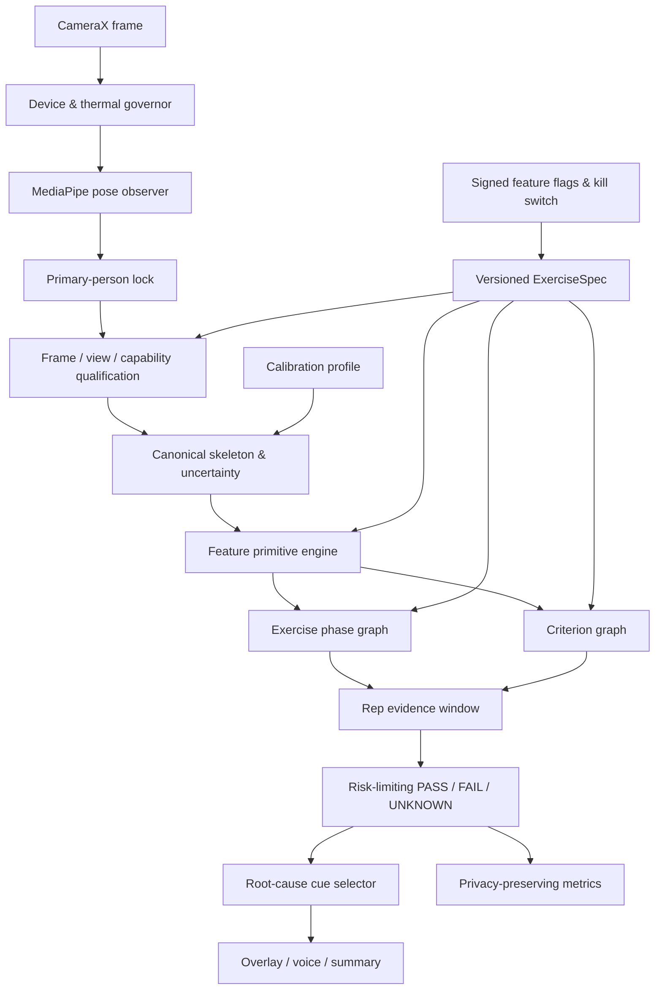

# TREX 자세 교정 서비스 출시 청사진

- 상태: 출시 설계 기준선(RFC); 아래 P0 측정·통계·운영 계약이 승인되기 전에는 구현 완료 명세가 아님
- 작성일: 2026-08-09
- 범위: AI Hub 피트니스 자세 데이터에 존재하는 운동만 대상
- 비범위: 이번 작업에서는 Kotlin·모델·빌드 설정을 변경하지 않는다
- 관련 문서: [데이터 감사](pose-data-audit.md), [현재 시스템](pose-correction-system.md), [운동 카탈로그](aihub-exercise-catalog.md)

## 1. 결정 요약

TREX는 **MediaPipe를 관절 관측기로 사용하고, 버전된 수학 규칙을 최종 판정기로 사용하며, 경량 시계열 모델은 단계·불확실성·잔차 보조에만 제한하는 하이브리드 시스템**으로 출시한다.

최종 판정은 항상 `PASS / FAIL / UNKNOWN` 중 하나다. 카메라로 관찰할 수 없거나 신뢰도가 부족한 조건을 `PASS`로 간주하지 않는다. 서비스의 핵심 품질은 많은 오류를 말하는 것이 아니라, 말한 오류가 틀리지 않는 데 있다.

출시 전략은 41개 운동 일괄 지원이 아니다. 운동과 오류 조건을 각각 독립 기능으로 관리하며 다음 상태를 통과한 항목만 사용자에게 노출한다.

```text
DISABLED
  -> OFFLINE_VALIDATED
  -> DEVICE_VALIDATED
  -> INTERNAL_DOGFOOD
  -> OPT_IN_BETA
  -> LIMITED_GA
  -> GA
```

첫 공개 후보는 원본 이미지와 현재 evaluator가 모두 존재하는 **스텝 포워드·백워드 다이나믹 런지**다. 다만 Day05는 한 촬영일·제한된 피사체의 스튜디오 데이터이므로 외부 사용자·기기 검증 전에는 GA로 승격하지 않는다. 현재 구현된 바벨 스쿼트는 원본 이미지 기반 MediaPipe 오차 검증과 고중량 안전 검증이 없으므로 GA 대상에서 보류한다.

서비스 표현은 “정확한 자세 진단”이나 “부상 예방 보장”이 아니라 **“카메라로 관찰 가능한 동작 특성에 대한 실시간 피드백”**으로 제한한다.

## 2. 설계 불변조건

1. **관측 불가능한 것을 추론했다고 주장하지 않는다.** 단안 RGB로 근육 긴장, 실제 지면 압력, 미세 척추 형상, 견갑골 고정, 기구 궤적을 직접 관측할 수 없다.
2. **`UNKNOWN`은 실패가 아니라 안전 기능이다.** 필수 관절 손실, 잘못된 시점, 다중 인물, 낮은 조도, 빠른 가림에서는 카운트와 교정을 멈춘다.
3. **AI Hub는 원천자료이지 무가공 정답지가 아니다.** `conditions`, `description`, 이미지, pose와 전문가 판정이 충돌하면 격리한다.
4. **정답 관절과 런타임 관절의 오차를 분리한다.** 이상적인 AI Hub 좌표로 정한 임계값을 MediaPipe 출력에 그대로 적용하지 않는다.
5. **운동 단계와 오류 조건을 분리한다.** 반복 단계는 동작을 설명하고, criterion은 단계 안에서 관찰한 품질을 설명한다.
6. **점수와 관측 범위를 함께 표시한다.** 낮은 coverage를 높은 점수로 위장하지 않는다.
7. **개인화는 안전 범위 안에서만 한다.** 나쁜 첫 자세를 개인 기준으로 학습하지 않는다.
8. **원본 영상은 기본적으로 기기를 떠나지 않는다.** 서버 없이 핵심 기능이 완전히 동작해야 한다.
9. **운동 하나의 실패가 전체 엔진을 오염시키지 않는다.** 규칙·모델·릴리스·kill switch는 운동과 criterion 단위로 버전 관리한다.
10. **출시 주장은 locked test와 외부 검증으로만 만든다.** 프레임 수를 독립 표본 수처럼 세지 않는다.

## 3. 현재 증거와 한계

### 3.1 로컬 데이터에서 확정된 사실

- 전체 catalog: 41개 운동, 816개 type code.
- 현재 스냅샷: 파일 561,295개, JPG 485,102개, JSON 76,176개, ZIP 15개, XLSX 2개, 총 119.945GiB. 전체 inventory hash를 배포 데이터 version과 함께 고정하기 전에는 파일 수를 학습 표본 수로 사용하지 않는다.
- AI Hub 포털의 요약 수치와 현재 추출본의 catalog 수치가 일치하지 않으므로 데이터셋 번호만으로 version을 식별하지 않는다. 원본 snapshot hash와 생성된 `CATALOG_SHA256`을 함께 고정한다.
- 정확 문자열 기준 condition 97개, 운동별 condition 할당 167개.
- 26개 운동만 모든 Boolean 조합이 유일하게 존재한다. 15개 운동에서는 104개 type code가 다른 code와 같은 condition vector를 공유하며 그만큼 다른 조합이 빠져 있다.
- `062` 버피, `101`·`109` 포워드 런지는 설명과 이미지가 오류 동작을 나타내지만 condition은 모두 `true`다. 최소 153개 sequence에 직접 영향을 준다.
- condition 문자열 97개는 16개 의미군으로 정리되며, 런타임 계산은 8개 수치 primitive로 일반화할 수 있다.
- 지정된 맨몸 폴더의 **사전 탐색 감사**에서는 “이동량 상위 6관절만” 사용한 단변량 구분 신호의 평균 AUC가 0.642, 저이동 관절 guard까지 포함하면 0.743이었고 25개 condition 중 14개가 0.05 이상 개선됐다. 이 수치는 후보 feature를 고르는 탐색 신호이며, 입력 manifest·positive 정의·sequence split·CI를 고정한 재현 스크립트와 결과 artifact가 저장소에 추가되기 전에는 출시 성능 근거로 사용하지 않는다.

따라서 구조는 **phase driver + stabilization guard**여야 한다. guard는 각도뿐 아니라 상대 위치, 방향, 접촉 proxy, 시간 안정성을 포함한다. 관절각 수십 개의 계산 비용은 MediaPipe 추론에 비해 작으므로 “정상 범위면 계산하지 않기”는 주된 성능 전략이 아니다. 계산은 수행하되 정상 deadband에서는 피드백을 만들지 않고, 중요도가 낮은 guard만 낮은 주기로 평가한다.

### 3.2 Day05 이미지가 제공하는 새 증거

`라벨링데이터`의 `Day05_200925_F`에는 1920×1080 JPG 151,755장과 2D/3D JSON 각 945개가 있다. 별도 `원시데이터/Day05_200925_F`의 9,479장은 파일명 기준 중복 후보이므로 합쳐서 독립 표본 161,234개라고 해석하지 않는다.

- 유효 JSON frame 14,929개 × 5개 view = 이미지 참조 74,645개.
- 누락 참조 0, 중복 참조 0.
- 2D 좌표 1,791,480개가 모두 이미지 경계 안에 있다.
- 나머지 77,110장은 주로 JSON이 직접 라벨링하지 않은 짝수 frame이다.
- 포함 운동은 스탠딩 사이드 크런치, 스탠딩 니업, 버피 테스트, 스텝 포워드·백워드 다이나믹 런지다.

이제 이 5개 운동은 AI Hub 관절과 **실제 배포 모델의 MediaPipe 관절**을 직접 대조할 수 있다. 다만 A–E view는 같은 동작을 동시에 본 상관 관측이며 5개의 독립 샘플이 아니다. 짝수 frame은 시간 안정성에는 사용할 수 있지만 관절 정답으로 승격하지 않는다.

### 3.3 현재 앱에서 재사용할 기반

현재 앱은 다음 파이프라인을 이미 갖고 있다.

```text
CameraX 640×480 RGBA
  -> MediaPipe Pose Landmarker Full
  -> 화면 2D + 추정 world 좌표의 PoseFrame
  -> EMA + visibility/presence gate
  -> 운동별 FSM
  -> 반복·점수·피드백
```

재사용할 부분은 CameraX 최신-frame 전략, MediaPipe asset, 좌표계 독립 `PoseFrame`, EMA, visibility gate, 추적 단절 복구, FSM, 650ms 피드백 지속시간과 5초 cooldown이다.

출시 전에 교체하거나 보강할 부분은 다음과 같다.

- 첫 pose를 무조건 선택하는 단일 인물 처리
- world 좌표가 존재하면 무조건 우선하는 정책
- 운동과 관계없이 고정된 필수 8관절
- 하드코딩된 스쿼트·런지 임계값
- 전면 카메라만 사용하는 고정 정책
- 프레이밍·시점·조도·다중 인물 qualification 부재
- inference latency, dropped frame, thermal, `UNKNOWN` 비율 telemetry 부재
- 매 frame RGBA Bitmap 복사·회전에서 발생할 수 있는 저사양 기기 할당 비용

## 4. 서비스 아키텍처



아키텍처는 다섯 경계로 나뉜다.

1. **관측 경계:** 카메라와 MediaPipe가 실제로 본 정보만 만든다.
2. **의미 경계:** 공통 primitive가 운동별 feature를 계산한다.
3. **시간 경계:** phase graph가 유효한 동작 순서를 보장한다.
4. **판정 경계:** criterion이 신뢰도와 coverage를 포함한 증거를 축적한다.
5. **제품 경계:** 한 번에 하나의 안전하고 행동 가능한 cue만 사용자에게 전달한다.

## 5. 버전형 운동 명세

운동마다 Kotlin `if`를 추가하지 않는다. AI Hub condition을 다음과 같은 데이터 명세로 변환한다.

```yaml
exerciseId: step-forward-dynamic-lunge
specVersion: 1.0.0
releaseState: OFFLINE_VALIDATED
supportedViews:
  - id: front_oblique
    classifierThreshold: TBD_GOLD
  - id: lateral
    classifierThreshold: TBD_GOLD
phaseGraph:
  states: [READY, DESCENDING, BOTTOM, ASCENDING, READY]
  driverFeatures: [frontKneeAngle, pelvisVerticalVelocity, stanceDistance]
  legalTransitions:
    - [READY, DESCENDING]
    - [DESCENDING, BOTTOM]
    - [BOTTOM, ASCENDING]
    - [ASCENDING, READY]
criteria:
  - id: front-knee-depth
    sourceCondition: "앞무릎의 각도 90도"
    severity: MAJOR
    validPhases: [BOTTOM]
    primitive: ANGLE
    measurementConstruct: GROSS_INCLUDED_ANGLE_PROXY
    angleConvention: "180deg=extended; flexion lowers the value"
    projectionPlane: VIEW_VALIDATED_SAGITTAL_PROXY
    coordinatePolicy: WORLD_PREFERRED
    requiredJoints: [FRONT_HIP, FRONT_KNEE, FRONT_ANKLE]
    requiredCapabilities: [POSE_2D, TEMPORAL_POSE, PRIMARY_PERSON_LOCK]
    framingRequirement: FULL_LOWER_BODY
    populationBandDeg: [78, 105]
    personalization: SAFE_OFFSET_ONLY
    evidence:
      minimumTimeCoverage: 0.80
      minimumObservableDurationMs: 400
      minimumEffectiveSamples: 4
      maximumGapMs: 150
      persistenceMs: 300
      aggregation: WEIGHTED_P80
    failRegions:
      - id: TOO_SHALLOW
        condition: "interval entirely above populationBandDeg"
        feedback: "앞무릎을 조금 더 굽혀보세요"
      - id: TOO_DEEP
        condition: "interval entirely below populationBandDeg"
        feedback: "조금 덜 내려가고 통증 없는 범위에서 멈춰주세요"
    unavailableFeedback: "옆 사선으로 전신이 보이게 카메라를 옮겨주세요"
```

실제 수치는 Gold calibration set에서 확정한다. 위 값은 schema 예시이지 출시 임계값이 아니다.

각 명세는 다음을 반드시 가진다.

- 원본 condition과 type provenance
- 유효 phase와 side
- required joint와 capability
- `FULL_BODY / FULL_LOWER_BODY / UPPER_BODY` framing requirement
- `2D_ONLY / WORLD_PREFERRED / WORLD_REQUIRED / TEMPORAL_ONLY` 좌표 정책
- 해부학적 각도인지 화면·gross-angle proxy인지 구분하는 `measurementConstruct`, projection plane, 좌표축과 부호 관례
- target band, 불확실성 margin, 지속시간
- `PASS / FAIL / UNKNOWN` state와 `FAIL`일 때의 `LOW_SIDE / HIGH_SIDE` fail region
- fail region마다 반대 방향을 혼동하지 않는 사용자 cue와 우선순위
- 규칙·데이터·MediaPipe 최소 버전
- 검증 상태와 승인자

## 6. 공통 predicate 엔진

### 6.1 16개 의미군

97개 condition 문자열은 다음 의미군으로 정규화한다.

1. 축·척추 정렬
2. 머리·시선
3. 몸통 방향
4. 관절각 목표
5. 분절 방향
6. 각도·위치 유지
7. 회전 방향
8. 상대 기하
9. ROM 끝점
10. 접촉·지지
11. 기구 궤적
12. 견갑 제어
13. 반동·안정성
14. 시간 순서
15. 긴장 연속성
16. 좌우 대칭

의미군은 UI와 데이터 분석용 taxonomy다. 실제 런타임은 다음 8개 primitive 조합으로 구현한다.

### 6.2 8개 수치 primitive

1. `ANGLE(a,b,c)` — 세 keypoint의 gross included angle. 화면 투영각 또는 추정 3D 내각이며 해부학적 joint-coordinate angle과 동일하지 않음
2. `ORIENTATION(segment, referenceFrame)` — 중력축·화면축·몸통축 대비 분절 방향
3. `SIGNED_DISTANCE_OR_ALIGNMENT(a,b,axis)` — 무릎-발, 손-가슴 등의 상대 위치
4. `DISPLACEMENT_OR_ROM(feature, phase)` — 시작점 대비 변위와 범위
5. `TRAJECTORY_DEVIATION(point, referencePath)` — 직선·몸통축·개인 baseline에서의 이탈
6. `VELOCITY_ACCEL_STABILITY(feature)` — 속도, 가속도, 반동, hold 분산
7. `CONTACT_PROXY(points, groundPlane)` — 화면상 지면 또는 지지면 근사; 실제 압력이라고 표현하지 않음
8. `TEMPORAL_ORDER_OR_SYNCHRONY(events)` — 좌우·상하 사건의 순서와 동기

`SYMMETRY(left,right)`는 동일 primitive 두 결과를 비교하는 합성 연산자로 둔다.

각 feature는 `measurementConstruct`, 좌표계, projection plane, axis/부호와 단위를 갖는다. `ANGLE`만으로 valgus/varus, 내·외회전 또는 임상적 flexion이라고 명명하지 않는다. 그런 명칭은 anatomical segment frame capability와 동기화된 기준장비 검증을 별도로 통과한 feature에만 허용한다.

### 6.3 capability gate

criterion은 필요한 센서 능력을 선언한다.

| capability | 판정 가능한 예 | 불가능하거나 제한적인 예 |
|---|---|---|
| `POSE_2D` | 큰 관절각, 화면상 정렬 | 깊이 방향 회전 |
| `POSE_WORLD_RELATIVE` | 체절 간 상대 3D 방향 | 실제 측정 거리·힘 |
| `TEMPORAL_POSE` | ROM, 속도, 반동, 순서 | 근육 긴장 자체 |
| `GROUND_PROXY` | 발 또는 팔의 화면상 높이 | 발바닥 압력·접촉력 |
| `OBJECT_TRACK` | 바벨·덤벨 경로 | 객체 detector가 없을 때 기구 궤적 |
| `PRIMARY_PERSON_LOCK` | 다중 후보에서도 주 사용자 유지 | 배경인·모니터 인물 구분 없는 상태 |
| `ANATOMICAL_SEGMENT_FRAME` | 기준장비로 검증된 임상적 joint-coordinate angle | 현재 MediaPipe keypoint만으로는 미지원 |

견갑 고정, 숄더패킹, 근육 긴장, 미세 척추 중립, 실제 발 접촉은 현재 MediaPipe 골격만으로 직접 판정하지 않는다. 적절한 capability가 없으면 `UNKNOWN`으로 남기고 정상 점수에 포함하지 않는다.

## 7. 수학적 평가 로직

### 7.1 관절과 기준 좌표계

frame `t`의 관절 `j`를 다음과 같이 표현한다.

\[
p_{j,t} = (x_{j,t}, y_{j,t}, z_{j,t}),\qquad
q_{j,c,t}=P\left(\lVert \hat p_{j,t}-p^*_{j,t}\rVert_{g_c}\leq
\delta_{j,c}\mid X_t\right)
\]

`q`는 MediaPipe confidence를 그대로 믿는 값이 아니라, criterion `c`가 사용하는 좌표·projection `g_c`에서 관절 오차가 사전 지정 허용량 `δ` 안에 있을 확률로 Gold calibration set에서 보정한 **관절 품질 확률**이다. required joint의 criterion 품질은 첫 버전에서 보수적으로

\[
q_c(t)=\min_{j\in J_c}q_{j,c,t}
\]

로 합성한다. 이후 joint 간 상관을 학습한 합성기를 쓰려면 별도 calibration과 locked test가 필요하다. 큰 `q`가 더 신뢰할 수 있다는 방향은 모든 schema와 테스트에서 불변이다.

관절은 골반 중심으로 이동하고 몸통 길이 또는 신뢰 가능한 양측 골격 길이의 robust median으로 정규화한다.

\[
\tilde p_{j,t}=\frac{p_{j,t}-p_{pelvis,t}}{s_{body}}
\]

화면 좌표, 카메라 좌표, 몸통 기준 좌표를 구분한다. 좌우 mirror는 표시 단계에서만 처리하며 해부학적 left/right를 바꾸지 않는다.

MediaPipe world 좌표는 단안 RGB에서 **추정된** 값이다. 출력 형식이 meter라고 해서 측정 장비의 절대 3D와 동일하다고 간주하지 않는다. 2D 재투영 일관성은 구현 오류를 찾는 sanity check일 뿐 depth 정확성의 증명이 아니다. `WORLD_PREFERRED` feature는 동기화된 motion capture 또는 보정된 다중시점 기준장비에서 criterion별 depth·angle 오차가 2D 대안보다 낫고, 현재 frame의 가림·시점 gate도 통과할 때만 사용한다.

### 7.2 feature 불확실성

MediaPipe는 관절 covariance를 제공하지 않으므로 offline calibration에서 다음 조건별 **전체 feature 오차의 비대칭 경험 분포**를 만든다.

```text
(exercise, criterion, view-bin, phase, visibility-bin,
 body-size-bin, occlusion-bin, device/model-version)
  -> bias, lower/upper error quantile, median absolute error,
     P90/P95 absolute error, failure rate
```

`\hat f_c(t)`가 런타임 feature이고 `f_c^*(t)`가 Gold일 때 calibration cell에서

\[
e_c(t)=f_c^*(t)-\hat f_c(t)
\]

의 하·상 quantile

\[
\ell_c(X)=Q_{\alpha_c/2}(e_c\mid X),\qquad
u_c(X)=Q_{1-\alpha_c/2}(e_c\mid X)
\]

를 구하고 feature의 Gold-compatible interval을

\[
I_c(t)=\left[\hat f_c(t)+\ell_c(X_t),\ \hat f_c(t)+u_c(X_t)\right]
\]

로 정의한다. `α_c`와 양측/단측 tail 배분은 criterion severity별로 calibration 전에 고정한다. pose, view, temporal, domain 항은 서로 독립이라고 가정해 분산을 더하지 않는다. 이 요인들이 함께 포함된 end-to-end residual을 직접 calibration하고, 필요하면 split-conformal residual로 interval을 넓힌다. P90/P95 error를 표준편차 `σ`라고 부르지 않는다.

세분 cell은 최소 독립 subject/session 수와 quantile CI 기준을 가져야 한다. 부족하면 `(exercise, criterion, view, phase, device)`에서 사전 정의된 상위 cell로 계층적 backoff하고, 가장 넓은 승인 interval도 만들 수 없으면 `UNKNOWN_UNCALIBRATED_DOMAIN`이다. test set을 보고 bin이나 backoff 순서를 바꾸지 않는다.

불확실성 자료가 없는 조합을 좁은 interval로 추정하지 않는다. 해당 조합은 미검증 상태이므로 `UNKNOWN` 또는 beta 범위다.

### 7.3 phase graph

각 운동은 legal transition을 가진 semi-Markov 상태 그래프로 표현한다.

\[
P(s_t\mid s_{t-1},f_{t-w:t}),\quad
s_t\in\{SETUP, READY, ECCENTRIC, BOTTOM, CONCENTRIC, TOP, HOLD\}
\]

- 운동에 존재하지 않는 상태는 명세에서 제거한다.
- phase 진입·이탈 임계값은 서로 다른 hysteresis를 사용한다.
- 최소 phase 시간, 최소 rep 시간, timestamp gap을 적용한다.
- 필수 관절 소실 또는 사람 교체 시 미완료 rep를 폐기한다.
- 정적 운동은 rep FSM이 아니라 `ENTER -> HOLD -> EXIT`와 누적 유효시간을 사용한다.

초기 버전은 규칙 상태 머신을 사용한다. 경량 TCN이 추가되더라도 합법적 전이와 안전 gate를 우회할 수 없다.

### 7.4 criterion margin

criterion `c`의 허용 구간이 `[L_c,U_c]`일 때 point estimate의 거리

\[
d_c(t)=\max\{L_c-f_c(t),\ 0,\ f_c(t)-U_c\}
\]

는 UI 정렬·오류 크기 연구용 보조량일 뿐 판정식이 아니다. `d/σ`는 불확실성이 커질수록 같은 위반을 작게 만들어 안전 판정에 사용할 수 없다. 판정은 7.6의 비대칭 interval 포함관계로만 한다.

절대 feature가 불안정하고 변화량이 검증된 criterion은 개인 setup 또는 phase 시작점 `f_{c,0}` 대비 변화량을 사용한다.

\[
\Delta f_c(t)=f_c(t)-\operatorname{median}(f_c(SETUP))
\]

동적 무릎 외반의 한 연구에서는 건강한 성인 남성 15명의 정면 고정 카메라·20cm single-leg drop landing에서 초기 접촉 대비 100ms 변화량이 절대값보다 더 유용했다. 이는 모든 운동·관절에 일반화하지 않으며, 해당 criterion·view·population에서 delta feature를 다시 검증한 경우에만 적용한다.

### 7.5 시간 증거 집계

한 frame의 오류는 사용자 피드백이 아니다. phase 구간 `W_c`에서 관측 시간 coverage와 품질 evidence mass를 분리한다.

\[
C_c^{time}=\frac{\sum_t\Delta t_t\mathbf{1}[observable_t]}
{\sum_t\Delta t_t},\qquad
M_c=\frac{\sum_t\Delta t_t q_c(t)\mathbf{1}[observable_t]}
{\sum_t\Delta t_t}
\]

- `C_c^{time}`: 누락을 품질 weight로 지워버리지 않는 실제 시간 coverage
- `M_c`: 별도로 보고하는 criterion evidence mass
- safety-critical 순간 사건은 percentile 대신 검증된 peak 또는 duration을 사용한다.
- 일반 guard는 5Hz, phase driver와 안전 guard는 10–15Hz에서 평가한다. 경계 접근 시 일반 guard도 고주기로 승격한다.

criterion마다 사전 등록된 집계 함수 `A_c`로 phase-level feature `\hat F_c=A_c(\hat f_c(t);q_c(t)\Delta t_t)`를 만든 뒤, 같은 집계 단위로 calibration한 비대칭 interval `I_c(W_c)`를 사용한다. weighted quantile이면 값 오름차순, timestamp를 tie-breaker로 정렬해 누적 weight가 목표 quantile에 처음 도달하는 값을 택한다. 불규칙 frame은 `q_c(t)\Delta t_t`를 weight로 사용한다.

명세는 `minimumObservableDurationMs`, `minimumEffectiveSamples`, `maximumGapMs`를 함께 가진다. 유효 표본수는 최소한

\[
N_{eff}=\frac{(\sum_t w_t)^2}{\sum_t w_t^2}
\]

를 보고하고 시계열 자기상관으로 추가 보정한다. 예를 들어 5Hz에서 300ms는 1–2표본뿐이므로 quantile 판정에 충분하지 않다. sampling schedule이 명세의 최소 duration·표본수를 충족하지 못하면 `UNKNOWN_INSUFFICIENT_EVIDENCE`다.

### 7.6 위험 제한형 삼상 판정

phase-level Gold-compatible interval `I_c(W_c)=[a_c,b_c]`에 대해 다음처럼 방향을 보존한다.

```text
capability/coverage/duration/sample/calibration 부족 -> UNKNOWN
I_c가 [L_c,U_c] 안에 완전히 포함                 -> PASS
b_c < L_c                                           -> FAIL, region=LOW_SIDE
a_c > U_c                                           -> FAIL, region=HIGH_SIDE
그 외(허용 경계와 interval이 겹침)                -> UNKNOWN_BOUNDARY
```

`LOW_SIDE`와 `HIGH_SIDE` fail region은 서로 다른 cue를 가져야 한다. 이 포함관계는 불확실성이 커질수록 `PASS`나 `FAIL`이 쉬워지지 않고 `UNKNOWN`이 늘어나는 단조 안전성을 갖는다. property-based test에서 interval을 넓혔을 때 확정 판정이 반대 방향 확정 판정으로 바뀌지 않는지 검증한다.

Selective prediction과 conformal risk control은 구분한다. Selective model은 locked test에서 class-conditional coverage와 covered/end-to-end risk를 경험적으로 검증할 뿐 분포무관 보장을 주장하지 않는다. Conformal risk control을 쓰는 경우 독립 단위를 participant 또는 session으로 고정하고, 보수성 `λ`가 커질수록 cue 집합이 중첩 축소되도록 `A_i(λ_2)\subseteq A_i(λ_1)` (`λ_2>λ_1`)로 만든다. 사전 지정 loss는 예를 들어

\[
L_i(\lambda)=\mathbf{1}[A_i(\lambda)\text{에 harmful cue가 하나 이상 존재}]
\]

인 bounded·monotone participant/session endpoint다. 고정 calibration cohort, exchangeability, policy family, 목표 `E[L_i(λ)]≤α`와 선택 절차를 사전 등록한다. 이때의 보장은 **기대 주변위험**에 한정되며 판정 표본의 조건부 오류율, 각 subgroup, 고확률 보장을 뜻하지 않는다. coverage와 subgroup 위험은 별도 locked test를 통과해야 하고 운영 분포가 달라지면 보장이 자동 유지되지 않는다.

### 7.7 반복 결과와 점수

반복 결과는 Boolean 하나가 아니라 다음 벡터다.

```text
RepResult = {
  phaseCompletion,
  criteria: criterionId -> {
    state: PASS | FAIL | UNKNOWN,
    failRegion: LOW_SIDE | HIGH_SIDE | null,
    unknownReason
  },
  confidence,
  coverage,
  countEligibility,
  feedbackEvidence,
  evaluatorVersion
}
```

다음 규칙을 지킨다.

- 안전 criterion이 `UNKNOWN`이면 전체를 “정상”으로 표시하지 않는다.
- `UNKNOWN`을 0점이나 100점으로 치환하지 않는다.
- coverage가 기준 미만이면 점수를 숨기고 카메라 개선 안내를 먼저 제공한다.
- 종합점수는 expert-approved weight와 locked-test calibration이 완료된 뒤에만 활성화한다.
- 초기 GA는 점수보다 `안정성 / 가동범위 / 정렬 / 제어` 하위 축과 관측 coverage를 보여준다.

초기 GA에서는 종합 숫자점수를 제공하지 않는다. 향후 점수를 도입하려면 assessable criterion 집합, 각 criterion의 0–1 quality mapping, 최소 필수 집합, weight, safety cap을 사전 정의하고 전문가 rubric·사용자 결과와 locked test로 검증한다. 품질점수는 assessable criterion에서만 계산하며 coverage는 별도 축으로 표시한다. coverage를 점수에 곱해 촬영 품질과 자세 품질을 한 숫자로 혼합하지 않고, 필수 safety criterion이 `UNKNOWN`이면 점수 자체를 숨긴다.

### 7.8 피드백 선택

동시에 여러 오류를 말하지 않는다. criterion dependency graph에서 downstream 중복을 제거한 뒤 곱셈 점수가 아니라 **사전 정의된 사전식(lexicographic) 순서**로 하나를 선택한다.

1. `SAFETY_CRITICAL > MAJOR > MINOR` severity tier를 먼저 고정한다.
2. 같은 tier 안에서 root-cause 우선, cue가 올바를 calibrated lower confidence bound, 지속시간, 현재 phase에서의 actionability 순으로 정렬한다.
3. novelty와 cooldown은 같은 안전 tier·동일 근거 수준에서만 tie-breaker로 쓰며 safety cue를 아래 tier로 내리지 못한다.

- 위험도가 높고 근거가 강하며 지금 고칠 수 있는 cue를 우선한다.
- 동일 cue는 cooldown 동안 반복하지 않는다.
- “무릎이 손상됩니다”가 아니라 “현재 화면에서는 무릎이 발 안쪽으로 보입니다”처럼 관찰 사실만 말한다.
- 원인이 불확실하면 결과를 단정하지 않고 시점 변경이나 속도 완화를 요청한다.
- 한 rep에 cue를 과도하게 바꾸지 않고 다음 rep에서 개선 여부를 평가한다.

### 7.9 안전한 개인 보정

개인 보정은 세 층으로 제한한다.

1. **형태 보정:** 몸통·대퇴·하퇴 비율, neutral stance, 좌우 기준.
2. **카메라 보정:** yaw, pitch, 화면 점유율, ground line.
3. **동작 보정:** population safety gate를 통과한 rep의 robust median/MAD만 사용.

사용자의 첫 rep를 무조건 정상 기준으로 삼지 않는다. population limit 밖으로 threshold를 이동하지 않으며, 통증·가동범위 제한을 자동으로 “정상 개인차”로 승인하지 않는다. 적응값은 언제든 초기화할 수 있고 evaluator version과 함께 저장한다.

### 7.10 end-to-end 위험 예산

각 component의 평균 정확도가 높다는 사실만으로 cue가 안전해지지 않는다. directional cue `c`의 harmful event `H_c`를 다음 fault tree로 분해한다.

```text
wrong identity
  OR unsupported view accepted
  OR Gold-compatible interval miss
  OR criterion/phase decision error
  OR fail-region -> cue mapping error
  OR stale delivery / user reverse response
  OR unknown residual cause
    -> harmful directional cue
```

각 사건의 허용위험을 `β_id, β_view, β_measure, β_decision, β_mapping, β_stale, β_residual`로 두면, 사건 간 독립성을 가정하지 않는 union bound로

\[
P(H_c)\leq \beta_{id}+\beta_{view}+\beta_{measure}+\beta_{decision}
+\beta_{mapping}+\beta_{stale}+\beta_{residual}\leq\beta_c
\]

를 만족하도록 criterion severity별 예산을 사전 배분한다. component gate는 원인 격리와 조기 중단용이며, 합으로 계산한 위험이 실제 end-to-end 시험을 대신하지 않는다. 최종 `β_c`는 natural-use 및 human-factors cohort에서 cue event와 participant/session endpoint로 다시 검증한다. 잔여 원인을 0으로 두거나 `UNKNOWN`을 안전 성공으로만 세어 예산을 맞추지 않는다.

## 8. 수학 규칙과 엣지 모델의 역할

### 8.1 기본 결정

최종 서비스는 다음 역할 분리를 따른다.

| 계층 | 수학 규칙 | 경량 모델 |
|---|---|---|
| 촬영 qualification | 주 담당 | 선택적 보조 |
| 관측 가능성·기권 | 주 담당 | confidence 보조 가능 |
| phase·rep | 단순 운동의 주 담당 | 버피 같은 복합 운동 보조 |
| 명백한 방향성 오류 | 주 담당 | 잔차 보조 |
| 여러 관절의 미세한 시간 패턴 | baseline | 검증 후 담당 가능 |
| 최종 안전 경계·피드백 문구 | 항상 담당 | 우회 금지 |

816개 type code를 단일 분류 문제로 학습하지 않는다. type은 provenance이며 정답은 criterion별 multi-label이다. 동일 Boolean vector를 공유하는 서로 다른 type을 모델이 억지로 구분하게 만들지 않는다.

### 8.2 허용할 모델

모델 입력은 raw RGB가 아니라 정규화된 pose feature와 mask다.

```text
input: 32~64 frame × 20~80 feature
model candidate:
  - logistic/ordinal regression
  - small gradient-boosted tree
  - depthwise-separable causal 1D TCN
output:
  - phase probability
  - criterion residual probability
  - OOD/quality/abstention score
```

단일 logistic/tree/TCN의 score를 epistemic uncertainty라고 부르지 않는다. epistemic uncertainty를 주장하려면 ensemble·posterior approximation 등 별도 방법과 error–uncertainty correlation, OOD, subgroup calibration 검증이 필요하다.

TFLite int8 양자화 모델을 우선하며, 다음을 모두 만족할 때만 규칙 baseline 위에 추가한다.

- locked external test에서 criterion precision/recall과 risk–coverage가 개선됨
- 최악 subgroup 성능이 악화되지 않음
- calibration과 기권 성능이 유지됨
- 저사양 기기 latency·thermal gate 통과
- feature attribution과 failure taxonomy가 검토 가능

Lite/Full 모델은 관절 분포가 다를 수 있으므로 한 세션 도중 임의로 교체하지 않는다. 시작 시 benchmark로 variant를 고정하고 variant별 threshold·uncertainty table을 별도로 관리한다.

### 8.3 복합 운동

버피는 하나의 관절각 왕복으로 계산하지 않는다.

```text
STAND
 -> SQUAT_TRANSITION
 -> PLANK_ENTRY
 -> PUSHUP_DOWN
 -> PUSHUP_UP
 -> FEET_RETURN
 -> JUMP_OR_STAND
 -> COMPLETE
```

단계 누락, 역순, 반쪽 반복, 바닥 가림을 명시적으로 처리한다. causal TCN을 사용하더라도 위 legal graph와 최소 단계 증거를 통과해야 반복으로 인정한다. 최근 반복의 pose-feature self-similarity는 off-by-one을 줄이는 보조 신호로 사용할 수 있다.

## 9. 촬영 계약과 주 사용자 고정

### 9.1 운동 시작 전 qualification

초 단위 warm-up에서 다음을 검사한다.

- exercise가 요구하는 frontal/lateral/oblique view 범위
- 머리, 필수 손·발, required joint가 프레임 안에 있는지
- 신체 bounding box의 크기와 중심, 바닥 동작 여유 공간
- 카메라 roll/pitch, 화면 흔들림
- 조도·역광·모션 블러 proxy
- 두 명 이상의 사람 또는 화면 속 사람 후보
- 1–2초 동안 primary identity가 안정적으로 유지되는지

통과하지 못하면 운동 평가는 시작하지 않고 구체적인 카메라 이동 안내를 제공한다. “조금 뒤로 가세요” 같은 안내도 bounding-box 목표 범위가 검증된 exercise/view에서만 사용한다.

`viewId`는 pose-only 절대 yaw 각도를 단정하는 값이 아니라 Gold 이미지로 검증된 `ViewClassifierResult(viewId, confidence, unknownReason)`다. 현재 앱은 전면 카메라만 사용하므로 측면·후면 criterion은 camera selector와 view classifier가 구현·검증되기 전 GA 대상이 아니다.

### 9.2 primary-person lock

MediaPipe가 여러 pose를 제공하거나 보조 person detector를 사용하는 경우 후보 `i`의 기본 추적 비용을 다음처럼 계산한다.

\[
Cost_i=
\lambda_1 D(pelvis_i,pelvis_{t-1})+
\lambda_2 |scale_i-scale_{t-1}|+
\lambda_3 D(poseShape_i,poseShape_{t-1})+
\lambda_4 cropPenalty_i
\]

가장 낮은 후보라도 절대 gate를 통과하지 못하면 사람을 교체하지 않고 `UNKNOWN_IDENTITY`로 전환한다. 화면 중앙 또는 첫 번째 pose만으로 사용자를 결정하지 않는다. 모니터·거울 속 후보, 배경 사람, 갑작스러운 identity switch challenge set에서 (a) 잘못된 사람으로 cue를 낸 비율과 (b) 실제 사용자를 유지해 평가할 수 있었던 identity coverage를 별도 평가한다. 전부 기권하는 정책은 통과하지 못한다.

이를 위해 현재의 단일 `PoseFrame` observer API를 `PoseCandidate` 목록과 candidate별 bbox·pose confidence·tracking metadata를 내보내는 API로 변경해야 한다. appearance embedding은 Pose Landmarker 출력에 존재하지 않는다. 별도 re-identification 모델과 개인정보·latency 검토를 통과한 경우에만 비용식에 optional 항으로 추가하고, 첫 구현은 위치·scale·pose shape·segmentation·시간 연속성으로 제한한다.

### 9.3 시점별 criterion 계약

모든 오류를 한 시점에서 제공하지 않는다.

| 예시 criterion | 정면 | 측면 | 사선 | 출시 원칙 |
|---|---:|---:|---:|---|
| 무릎-발 화면상 정렬 | 높음 | 낮음 | 중간 | 정면/검증된 사선만 |
| 런지·스쿼트 깊이 | 중간 | 높음 | 높음 | 측면/사선 우선 |
| 몸통 전후 기울기 | 낮음 | 높음 | 중간 | 측면 우선 |
| 좌우 몸통 기울기 | 높음 | 낮음 | 중간 | 정면 우선 |
| 고관절 축회전 | 낮음 | 낮음 | 제한적 | 단안 pose-only GA 제외 |
| 발 회내·압력 중심 | 매우 낮음 | 매우 낮음 | 낮음 | out-of-scope |

단일 카메라 세션에서 모든 criterion을 약속하지 않는다. 필요하면 “깊이·몸통 평가”와 “정면 정렬 평가”를 별도 camera mode로 제공한다.

## 10. 데이터 제품: Raw에서 출시 Gold까지

### 10.1 세 계층

| 계층 | 내용 | 변경 정책 |
|---|---|---|
| Bronze/Raw | AI Hub JSON·JPG·ZIP 원본 | 불변, 해시 고정 |
| Silver/Verified | 스키마 검증, 2D/3D/image pair, 중복·충돌 flag | 재현 가능한 pipeline으로만 생성 |
| Gold/Release | 전문가 adjudication, phase interval, criterion 정답 | 승인과 dataset version 필요 |

sequence manifest는 다음을 보존한다.

```text
sourceSnapshot, fileHash, sourcePath,
day, subject/session, exercise, typeCode, pose, description,
rawConditions, correctedCriteria, adjudicationStatus,
views, frames, imageRefs, pairStatus,
split, modelVersion, ruleVersion, dataLicense
```

라벨 상태는 다음 셋만 사용한다.

- `ACCEPT`: 원문·이미지·pose·전문가가 일치
- `OVERRIDE`: 전문가가 근거와 함께 정정
- `QUARANTINE`: 충돌 또는 관측 불가; 학습·출시 검증에서 제외

description을 무조건 condition보다 우선하지 않는다. 양쪽 모두 원본으로 보존하고 증거 기반 adjudication만 Gold를 변경한다.

AI Hub 포털 요약의 운동·상태 수와 로컬 catalog의 41개 운동·816 type이 일치하지 않는 문제를 provenance gate로 다룬다. 각 운동과 type이 어떤 원본 package·변경일·이용조건에서 왔는지 대조할 수 없으면 Gold 및 배포 catalog에서 제외한다.

현재 전체 스냅샷에는 JPG 485,102개가 있으며, 별도 `원시데이터/Day05_200925_F`의 9,479장은 라벨링 Day05와 파일명이 모두 겹치는 중복 후보이다. 파일명 일치만으로 삭제하지 않고 content hash·perceptual hash로 동일성을 확인한 뒤 하나의 `duplicate_group_id`로 묶어 같은 split에 배치한다. 전체 JPG 중 JSON이 직접 참조하지 않는 251,112장도 “음성 정답”으로 간주하지 않고 시간 안정성·재획득용 또는 미라벨 자료로 상태를 명시한다.

### 10.2 누출 없는 split

분할 원자는 frame이나 view가 아니라 capture group이다.

```text
group_id =
  subject + day/session + sequence
  + A~E 모든 view
  + 2D/3D pair
  + odd labeled / even unlabeled frame
  + 모든 augmentation 파생물
```

필수 규칙은 다음과 같다.

- 한 subject는 train/calibration/test 중 한 곳에만 존재
- 같은 sequence의 5개 view와 2D/3D는 같은 split
- 원본·ZIP 복사본·perceptual duplicate도 같은 split
- 정규화, feature 선택, threshold와 uncertainty calibration은 test를 보지 않고 수행
- locked test를 보고 설계를 바꾸면 새 test cohort를 확보
- 통계 단위는 frame이 아니라 subject/session

권장 구조는 development subject 70%, calibration 10%, access-controlled internal test 20%이며, 별도 실제 가정·기기 external test를 유지한다. 이 비율은 subject 수와 오류 분포에 따라 조정하되 group 불변조건은 바꾸지 않는다.

### 10.3 전문가 Gold

운동처방·트레이닝·재활 전문인력 3명이 독립적으로 검토하고, 모델 예측을 보지 않은 상태에서 다음 단위를 판정한다.

```text
exercise × phase interval × view × criterion
  -> PASS | FAIL | UNKNOWN_GOLD
  + severity + laterality + evidence
```

다수결 후 불일치는 합의 회의로 adjudication한다. criterion별 Krippendorff's α가 0.80 미만이면 사람에게 억지로 정답을 요구하지 않고 rubric과 관측 정의를 먼저 수정한다. α만으로 승인하지 않고 raw agreement, positive/negative agreement, prevalence, `UNKNOWN_GOLD` 비율, adjudication 전후 변경률을 함께 보고한다. 모델 prediction이 reviewer 화면에 노출되지 않았는지도 audit log로 확인한다. `062`, `101`, `109`는 우선 검토 대상으로 둔다.

AI Hub는 전체 조합을 제공하는 유용한 감독 신호지만 해부학적 관절 중심, 힘, 임상적 올바름의 최종 Gold는 아니다. 핵심 GA criterion은 일부라도 동기화된 광학 motion capture 또는 검증된 기준 장비와 비교한다.

## 11. AI Hub 이미지–MediaPipe 검증 프로토콜

### 11.1 Day05 처리

1. 74,645개 라벨 이미지에 앱과 동일한 MediaPipe task asset·version을 실행한다.
2. AI Hub 24점과 MediaPipe 33점의 직접 공통 관절을 매핑한다.
3. 파생 Neck/Waist/Palm/Foot는 별도 정의하고 직접 관절과 섞어 보고하지 않는다.
4. 운동·view·phase·joint별 normalized error와 PCK를 계산하되 이를 `AI Hub annotation agreement`로 명명한다.
5. 실제 판정 feature에 대해 angle/distance/orientation MAE, bias와 반복측정 limits of agreement를 계산한다. 일반 Bland–Altman에 수만 frame을 독립 표본처럼 넣지 않고 participant/sequence/view 반복을 혼합효과모형 또는 repeated-measures 방법으로 반영한다.
6. 5개 view의 같은 시점을 묶는다. calibration 전에는 명시적으로 view-invariant인 gross joint angle·ratio만 비교하고, 좌표·depth·방향의 cross-view dispersion은 카메라 intrinsics/extrinsics와 시간 동기가 확인된 경우에만 공통 좌표계로 변환해 계산한다.
7. 짝수 frame은 jitter, dropout, reacquisition, rep boundary 안정성에만 사용한다.
8. `active`를 confidence 또는 correctness 정답으로 사용하지 않는다.
9. conflict type은 자동 calibration에서 제외한다.
10. 결과를 `MediaPipe version × model variant × view × criterion` 데이터 카드로 고정한다.

동일 asset 실행만으로 앱 경로를 재현했다고 간주하지 않는다. benchmark는 두 트랙으로 나눈다.

- **IMAGE landmark audit:** 원본 1920×1080 정지 이미지에서 detector 자체의 관절 오차 측정
- **VIDEO pipeline replay:** view별 frame 순서를 유지해 현재 앱과 같은 `RunningMode.VIDEO`, timestamp, tracking, 640×480 resize/crop/rotation 조건으로 재생

각 결과에는 model SHA-256, MediaPipe Tasks SDK, running mode, delegate, input color format·resize·crop·rotation·mirror 정책, timestamp 간격, host/device를 기록한다. Day05 고정 스튜디오 카메라와 실제 전면 휴대폰 CameraX의 domain gap은 별도 external test 축이며 서로의 성능을 대신하지 않는다.

BlazePose 논문과 동일하게 torso-normalized PCK를 보고하되, PCK 하나로 서비스 성능을 대표하지 않는다. 사용자가 듣는 피드백의 최소 단위인 feature와 criterion 오차까지 연결한다.

### 11.2 3D 검증

AI Hub 3D의 원점·축·단위가 충분히 문서화되고 frame 동기가 검증되기 전에는 MediaPipe world meter와 직접 뺄셈하지 않는다. AI Hub 3D와의 일치는 우선 annotation agreement일 뿐 true 3D accuracy가 아니다. depth admission의 기준은 동기화 motion capture 또는 보정된 다중시점 reconstruction이다.

- pelvis 중심화
- body scale 정규화
- 좌표축·좌우·시간 정렬 확인
- unaligned, pelvis/root-aligned 지표를 주 admission 근거로 보고
- rigid/Procrustes-aligned PA-MPJPE는 shape 진단용으로만 분리 보고
- MPJPE, angle error, depth-order accuracy, cross-view consistency 분리

Procrustes는 rotation·translation·scale 오류를 제거하므로 절대 거리, depth 방향, 중력축 feature의 입학 근거가 될 수 없다. 2D 재투영도 여러 3D가 같은 2D를 만드는 단안 모호성 때문에 depth gate가 아니다. 단안 3D가 2D보다 나쁜 criterion은 3D를 제거한다. `WORLD_PREFERRED`는 “world가 있으면 사용”이 아니라 **기준장비 검증에서 2D보다 낫고 현재 frame의 일관성 gate를 통과하면 사용**이라는 뜻이다.

### 11.3 feature 입학 기준

criterion `c`에서 서비스가 구분하려는 decision boundary의 가장 가까운 안전 margin을 전문가가 `M_c`로 사전 정의한다. Gold 대비 feature 오차 `e_c`가 다음을 만족하지 못하면 GA에서 제외한다.

\[
P95(|e_c|) < M_c
\]

여기에 calibration error distribution을 feature에 주입했을 때 최종 `PASS↔FAIL` 또는 `LOW_SIDE↔HIGH_SIDE` 오류 전환율을 criterion별로 측정하고, 일반 criterion은 2%, safety-critical criterion은 1% 미만이어야 한다. 확정판정에서 `UNKNOWN`으로 바뀌는 비율은 coverage degradation으로 별도 보고한다. 절대각 오차가 큰데 변화량은 신뢰할 수 있다면 절대 threshold 대신 개인 setup 대비 delta feature로 다시 검증한다. 둘 다 실패하면 더 큰 허용 band, 다른 시점, 추가 센서 또는 `OUT_OF_SCOPE` 중 하나를 선택한다.

## 12. 외부 검증 설계

### 12.1 모집 범위

AI Hub 스튜디오 자료만으로 출시하지 않는다. 초기 운동 하나당 다음은 **pilot/성능 추정의 시작 하한**이며, GA 표본 수는 사전 power/CI 계산으로 별도 확정한다.

- 서로 다른 사용자 60명 이상
- 정상 rep 500개 이상
- 지원하는 주요 단일 오류마다 300 rep 이상
- 독립 실제 session 300개 이상
- 저사양·중급·고급 Android 각 10개 모델 이상
- 집, 헬스장, 협소 공간, 역광, 저조도 포함

60명은 participant-level harmful cue 상한을 1% 미만으로 증명할 수 없다. 해당 endpoint에서 사건이 0건이어도 one-sided 95% 상한을 약 1% 아래로 내리려면 대략 300명의 독립 participant가 필요하므로, exact 계산과 예상 탈락률을 반영한 수를 별도로 모집한다. cue 이해·반대 반응·subgroup endpoint도 원하는 CI가 가능한 독립 participant 수를 각각 확보하지 못하면 `NOT_VALIDATED`다.

한 사용자의 반복 수가 늘어도 독립 표본 수가 같은 비율로 늘지 않는다. 사용자당 평균 관측 수 `m`, intra-subject correlation `ρ`를 추정해 설계효과를 반영한다.

\[
n_{eff}=\frac{n}{1+(m-1)\rho}
\]

성별·연령대·device tier·핵심 체형 범위처럼 primary subgroup을 사전 지정하고 criterion별 독립 사용자 수로 power를 계산한다. 표본이 부족한 subgroup은 평균에 합쳐 통과시키지 않고 `NOT_VALIDATED`로 지원 범위에서 제외한다.

외부 검증은 두 cohort로 나눈다.

1. **Scripted challenge cohort:** 숙련자가 안전하게 정상, single-fault, multi-fault를 시연해 sensitivity와 boundary를 stress test한다.
2. **Natural-use cohort:** 사용자가 평소대로 운동하며 실제 오류 유병률에서 cue precision/PPV, session별 잘못된 cue 노출, 10분당 cue 부담과 root-cause cue 적합성을 측정한다.

고중량·고위험 오류를 데이터 수집 목적으로 일반 사용자에게 유도하지 않는다. 초기 intended population은 급성 통증·부상 없이 일반 운동을 수행하는 18세 이상 성인이다. 미성년자, 임신 특화, 재활·치료 목적 사용은 별도 검증 전 지원하지 않는다.

평가 축은 성별, 연령, 키·체형, 피부·의복 대비, 헐렁한 옷, 보조기구, 신체 가동범위, 시점·카메라 높이·거리, 배경 clutter·거울·TV, 가림, 제조사·SoC·OS·delegate, 전후면 카메라, mirror·회전을 포함한다.

### 12.2 통계

criterion별로 다음을 보고한다.

여기서 `판정`은 `PASS` 또는 fail region이 있는 `FAIL`이며 `UNKNOWN`과 단순 camera guidance는 제외한다. 방향성 오류에서는 `LOW_SIDE/HIGH_SIDE` 정답 region까지 맞아야 “올바른 FAIL”이다.

\[
Coverage_1=P(판정\mid Y=오류),\quad
Coverage_0=P(판정\mid Y=정상),
\]

\[
ConditionalRecall=P(FAIL\mid Y=오류,판정),
\]

\[
UnconditionalRecall=P(올바른\ FAIL\mid Y=오류),
\]

\[
FalseReassurance=P(PASS\mid Y=중대오류),
\]

\[
SafeResponse=P(올바른\ FAIL\ 또는\ 명시적\ PAUSE/UNKNOWN\mid Y=중대오류).
\]

정상 표본에서는 specificity와 false cue를, natural-use cohort에서는 cue precision/PPV와 10분당 cue 수를 별도로 보고한다. 이렇게 해야 어려운 오류만 `UNKNOWN`으로 버리고 조건부 정확도와 전체 coverage를 동시에 통과하는 것을 막을 수 있다.

위험한 방향 cue는 두 분모로 보고한다.

- cooldown을 통과해 실제 사용자에게 전달된 고유 directional cue event당 harmful-direction rate
- 동일 exercise/evaluator version에서 한 번 이상 harmful cue에 노출된 participant 비율과 session 비율

participant endpoint는 한 사람이 여러 session을 수행해도 한 번만 세며, cue opportunity와 총 노출 시간을 함께 보고한다. 모든 cue를 기권해 0-event를 만드는 정책은 `Coverage_1/0`, unconditional recall과 true-user coverage gate에서 탈락한다.

confidence interval은 frame bootstrap이 아니라 subject/session cluster bootstrap, beta-binomial, GEE 또는 사전 지정 participant-level endpoint로 계산한다. 0-event 자료에서 일반 cluster bootstrap만 사용하지 않는다. 여러 criterion을 동시에 검정할 때 primary endpoint를 사전 지정하고 Holm 보정을 사용한다.

rule-of-three는 동일 위험을 가진 독립 Bernoulli endpoint에만 적용한다. 예를 들어 서로 독립인 300명의 participant-level 노출 endpoint에서 사건이 0건일 때 one-sided 95% 상한이 대략 1%다. 한 사용자의 반복 session이나 위험 cue 기회가 없었던 session을 분모에 추가해 이 주장을 만들지 않는다.

반복 검출은 Gold rep midpoint와 예측 midpoint를 사전 고정한 `τ_match≤500ms` 안에서 one-to-one 최소시간차 matching한다. 같은 예측을 두 Gold rep에 재사용하지 않는다. event precision/recall/F1과 함께 session exact-count accuracy, count MAE, off-by-one 비율을 보고하며 `τ_match`를 locked test 결과에 맞춰 조절하지 않는다.

확률 calibration은 criterion/class/subgroup별 reliability curve와 Brier score·log loss를 주지표로 삼는다. ECE는 calibration set에서 고정한 15개 equal-mass bin과 classwise 정의를 test에서도 그대로 사용하고 subject-cluster CI를 붙이는 보조지표다. bin이 빈 subgroup은 ECE를 합쳐 만들지 않고 `NOT_ESTIMABLE`로 둔다.

### 12.3 출시 수용 기준

| 영역 | GA 기준 |
|---|---:|
| 판정한 주요 오류 recall | 점추정 ≥ 90%, subject-cluster 95% CI 하한 ≥ 85% |
| 오류 조건부 coverage | 유효 촬영 조건에서 ≥ 85% |
| 정상 조건부 coverage | 유효 촬영 조건에서 ≥ 85% |
| unconditional correct-fail recall | 점추정 ≥ 75%, 95% CI 하한 ≥ 70% |
| 정상 specificity | ≥ 90%, 95% CI 하한 ≥ 85% |
| natural-use cue precision | ≥ 90%, 95% CI 하한 ≥ 85% |
| 잘못된 cue에 노출된 정상 session | one-sided 95% CI 상한 ≤ 5% |
| 중대 오류 false reassurance | one-sided 95% CI 상한 < 1% |
| 중대 오류 safe response | 95% CI 하한 ≥ 99% |
| 반대 방향·위험 cue 노출 | cue당·participant당 one-sided 95% CI 상한 각각 < 1% |
| rep event F1 | `τ_match≤500ms` one-to-one matching에서 ≥ 0.97; exact-count·MAE·off-by-one 병기 |
| rep boundary error | median ≤ 150ms, P95 ≤ 350ms |
| cue decision-to-delivery | P95 ≤ 250ms, stale-phase cue < 1% |
| feature 입학 | `P95(|error|) < criterion decision margin` 및 error 주입 flip-rate 기준 통과 |
| Gold-compatible interval | 전체·지원 subgroup에서 one-sided 95% CI miscoverage 상한 ≤ 사전 지정 `α_c` |
| calibration | criterion/class/subgroup reliability curve·Brier/log loss CI와 risk–coverage 상한 통과; ECE는 보조지표 |
| silent wrong-person lock/switch | one-sided 95% CI 상한 < 1%; 확인 1건은 critical incident |
| true-user 유지 coverage | ≥ 95%, identity 재획득 P95 ≤ 1초 |
| 필수 관절 손실 | 상태 머신 property test에서 카운트 증가 불변조건 통과; challenge test에서 실패율 CI 보고 |

절대 feature 기준을 만족하지 못하더라도 상대 변화량 criterion이 별도 기준을 통과하면 출시할 수 있다. 반대로 전체 평균이 좋아도 사전 지정한 지원 subgroup 하나가 안전 기준을 위반하면 해당 subgroup·view 또는 criterion을 지원 범위에서 제거한다. 표본이 부족하면 통과가 아니라 `NOT_VALIDATED`다.

## 13. 온디바이스 성능 설계

### 13.1 실제 benchmark 기반 tier

Android media performance class는 참고 신호일 뿐 ML 성능 보증으로 사용하지 않는다. 첫 실행 또는 모델 update 후 짧은 local benchmark와 지속 session telemetry로 tier를 정한다.

| tier | 초기 정책 | 최소 지속 목표 |
|---|---|---:|
| Low | Lite, 낮은 분석 해상도·8~12Hz, 안전 핵심 criterion | ≥8 analysis FPS, P95 end-to-end ≤200ms |
| Mainstream | Full 우선·10~15Hz | ≥15 FPS 목표, P95 ≤120~160ms |
| High | Full·높은 안정 sampling, 선택적 TCN | ≥20 FPS 목표, P95 ≤120ms |

정확한 해상도와 FPS는 기기군 검증으로 확정한다. 모델 variant가 바뀌면 별도 evaluator calibration을 사용한다.

현재 앱에는 Full asset 하나만 있으며 Lite asset·governor·thermal signal은 없다. 위 표는 목표 정책이다. Lite 도입은 asset provenance, variant별 Gold calibration, 앱 크기와 실제 기기 benchmark를 통과하는 별도 구현 slice다.

### 13.2 adaptive governor

다음 signal의 rolling P50/P95/P99를 감시한다.

- capture-to-result latency
- MediaPipe inference latency
- dropped-frame과 timestamp gap
- thermal status
- 메모리와 allocation rate
- pose acquisition과 criterion coverage

열화 시 순서는 다음과 같다.

1. 비핵심 guard 주기 감소
2. temporal 보조 모델 비활성화
3. analysis FPS·해상도 감소
4. session 경계에서 검증된 Lite variant로 전환
5. 안전 기준을 유지할 수 없으면 자세 교정 중지, 일반 타이머 모드 제안

판정 품질을 낮춘 상태에서 조용히 계속 점수를 만들지 않는다. variant 변경은 session 중간이 아닌 안전한 경계에서만 수행한다.

### 13.3 성능 시험

- physical device에서 Macrobenchmark와 전용 15–20분 session benchmark 실행
- 저/중/고 tier와 주요 제조사별 P50/P95/P99
- cold/warm start, GPU failure→CPU fallback, 화면 회전, background/foreground
- 5분 warm-up 이후 post-GC retained heap의 Theil–Sen slope 95% 상한 ≤1MB/min, 20분 종료값 ≤warm-up median+20MB
- 처리 deadline miss/drop 비율 <1%; 누락 timestamp는 phase 엔진 입력으로 기록
- Android thermal `MODERATE`에서 단계적 감속, `SEVERE` 진입 시 1초 안에 자세 판정·cue를 중지하는 fail-closed 검증
- crash/ANR 0; 실제 비율 주장은 device-session CI와 함께 보고
- 네트워크 차단 상태의 전체 운동 기능 검증
- release AAB ABI split과 model asset hash 확인

thermal 시험은 주변온도 25±2°C, 충전 여부, 배터리 범위, 케이스 사용 여부, 화면 밝기를 고정하고 기기당 3회 이상 반복한다. 고온 시작 조건도 별도 challenge로 두며 severe에 진입하지 않는 것보다 severe에서 안전하게 중지하는 불변조건을 우선한다.

현재 매 frame Bitmap 복사·회전 경로는 allocation trace로 먼저 측정한다. zero-copy 또는 live-stream 전환은 benchmark가 실제 이득을 증명할 때 별도 구현한다.

## 14. 안전 UX와 개인정보

### 14.1 운동 전

- 지원 운동과 평가 가능한 criterion을 명시
- 실루엣과 음성으로 필요한 camera view·전신 영역 안내
- 바닥·주변 장애물과 기기 고정 확인
- 통증, 어지럼증, 기존 부상이 있으면 중단하고 전문가와 상담하도록 안내
- 의료 진단·치료·부상 예방 보장이 아님을 명시

### 14.2 운동 중

- 한두 frame이 아니라 criterion별 300–650ms 또는 phase 비율 지속 후 cue
- 한 번에 가장 중요한 cue 하나
- 낮은 confidence에서는 칭찬도 오류 판정도 하지 않음
- 잘못된 시점이면 자세보다 카메라 이동을 먼저 안내
- 필수 관절 손실·identity switch·큰 timestamp gap에서 FSM 초기화
- `UNKNOWN` 동안 rep와 점수를 증가시키지 않음
- 언제든 한 번의 조작으로 음성 cue를 음소거하고 자세 교정을 일시정지할 수 있음

영상상 맞는 cue도 사용자가 반대로 이해하거나 늦게 반응하면 위험하다. GA 전에 전문가가 관찰하는 human-factors study를 수행해 cue 이해도, 올바른 방향 반응, 과교정, stale-phase cue, 주의분산·균형 상실, 즉시 중지/음소거 성공률, adverse event와 near miss를 측정한다. 핵심 cue 이해·올바른 방향 반응은 95% CI 하한 95% 이상, 반대 방향 반응은 one-sided 95% CI 상한 1% 미만이어야 한다. serious adverse event 또는 모델 cue와 관련된 near miss가 확인되면 해당 cue는 중지하고 재검증한다.

### 14.3 개인정보 기본값

- 원본 frame/video 저장·전송 0
- pose 시계열도 기본 업로드 금지
- 서버 telemetry는 evaluator/model version, device tier, latency, pose 획득률, abstention률, correction count 같은 집계만 사용
- 진단 clip은 별도 opt-in, 목적·보유기간·삭제 절차, 얼굴·배경 마스킹과 암호화 필요
- AI Hub 원본은 APK·공개 저장소·telemetry에 포함하지 않음
- packet capture로 영상·landmark 유출 0을 release gate에서 검증

Google Play에서 운동·카메라 기능은 Health apps 선언, privacy policy, camera 사용의 명확한 disclosure 대상임을 출시 checklist에 포함한다. 의료 또는 재활 효능을 표방하는 경우 본 설계 범위를 넘어 별도의 법무·규제·임상 검증을 수행한다.

초기 GA에는 raw frame, video, pose sequence의 진단 업로드 기능을 넣지 않는다. 향후 opt-in 진단 기능은 별도 privacy release로 다루며 on-device 얼굴·배경 마스킹이 성공하기 전에는 upload buffer를 만들지 않고, 마스킹 실패 시 fail closed한다.

출시 privacy gate는 packet capture 외에 다음을 포함한다.

- camera frame부터 삭제까지 data-flow inventory와 처리 근거
- stable device identifier 없는 집계 또는 별도 승인된 최소 식별 설계
- crash/analytics SDK별 payload, logcat, temp/cache, screenshot, Android backup 검사
- 전송·저장 암호화, server access control·audit log·backup 복제 삭제
- 동의 철회·열람·삭제 end-to-end 시험
- telemetry와 향후 diagnostic의 숫자로 확정된 retention·삭제 SLA; `TBD` 상태로 GA 금지
- 미성년자 차단·처리 정책과 intended-use 고지
- AI Hub 원본의 상업적 이용·파생 규칙/모델 배포 권한에 대한 서면 확인

## 15. 운영과 단계적 출시

### 15.1 privacy-preserving observability

운동·criterion·rule/model version·device tier별로 다음 집계만 관측한다.

- pose acquisition, `UNKNOWN`, identity reset 비율
- view/crop/조도 qualification 실패 구간
- inference P50/P95/P99, dropped-frame, thermal
- rep completion과 correction 분포
- 사용자 cue dismiss·수동 종료·오류 신고
- crash, ANR, OOM

운영 telemetry 자체를 정답 라벨로 사용하지 않는다. 명시적으로 동의한 별도 audit cohort만 전문가가 재검토한다. audit 참여자의 자기선택률과 전체 사용자 대비 device·환경·사용 패턴 차이를 보고하고, 이 편향을 무시한 accuracy 추정치를 전체 사용자 성능이라고 표현하지 않는다.

### 15.2 경보와 kill switch

경보는 최소 노출량을 채운 version/device/exercise cell에서 절대 safety ceiling과 baseline 대비 통계적 control limit을 함께 사용한다. 다음 퍼센트는 초기 investigation trigger이며 단독 자동 판정 기준이 아니다.

- `UNKNOWN` +10%p 또는 사전 절대 상한 초과: 조사
- inference P95 +20% 또는 deadline-miss 1% 초과: rollout 중지
- correction 분포 PSI 0.2 초과: 원인 분석 보조 신호; PSI 단독으로 criterion을 중지하지 않음
- critical wrong cue 또는 silent wrong-person cue 확인 1건: 즉시 해당 운동/criterion kill switch
- crash·ANR·thermal fail-closed 기준 초과: 해당 device tier 중지

각 control chart는 최소 session·participant 수, baseline 기간, confidence limit, 다중 비교 정책을 모니터링 plan에 사전 등록한다.

오프라인 코어와 원격 제어를 분리한다.

- 앱에는 마지막으로 승인된 최소 `ExerciseSpec`을 내장한다.
- 원격 config는 기능 확대가 아니라 rollout 축소·criterion 중지·최소 version 강제에 사용한다.
- config는 서명, monotonic version, issued/expiry time, app/evaluator compatibility를 가진다.
- 낮은 version replay를 거부하고 키 회전·폐기 목록을 지원한다.
- critical incident 확인 후 60분 안에 kill config를 발행하고, client는 cold start와 네트워크 연결 중 최대 6시간 간격으로 확인한다.
- GA corrective config의 최대 age는 24시간이다. 검증된 config가 만료된 오프라인 기기는 해당 자세 교정을 끄고 일반 타이머만 제공한다.
- signature·schema·compatibility 검증 실패, 전파 실패 또는 지원 종료 앱 version은 fail closed한다.

### 15.3 rollout

```text
offline replay
 -> shadow mode(사용자에게 말하지 않음)
 -> internal dogfood
 -> opt-in beta
 -> 1%
 -> 5%
 -> 20%
 -> 50%
 -> 100%
```

각 단계는 최소 독립 session, incident-free 기간, accuracy·device·privacy gate를 다시 확인한다. 운동 하나를 승격했다고 다른 운동이 자동 승격되지 않는다.

초기 운영 floor는 다음과 같다. external locked test를 대체하지 않으며 risk review에서 더 큰 수를 요구할 수 있다.

| 단계 | 최소 eligible session / 기간 | 전문가 audit | 승격 조건 |
|---|---:|---:|---|
| Shadow | 300 / 14일 | 100 | 출력 분포·coverage·latency gate, critical 0 |
| Dogfood | 300 / 14일 | 100 | human-factors와 false-cue gate, critical 0 |
| Opt-in beta | 1,000 / 21일 | 200 | natural-use PPV·subgroup·device gate, critical 0 |
| 1% | 1,000 / 7일 | 100 | 모든 control limit 이내 |
| 5% | 2,000 / 7일 | 100 | 모든 control limit 이내 |
| 20% | 5,000 / 14일 | 200 | 모든 control limit 이내 |
| 50% | 5,000 / 14일 | 200 | 모든 control limit 이내 |
| 100% | 지속 | 주기 표본 | 주간 safety·월간 subgroup review |

최소 노출이나 audit 수가 부족하면 시간을 채웠더라도 승격하지 않는다. critical incident, privacy breach, false reassurance ceiling, silent identity switch 또는 device safety ceiling을 한 번이라도 넘으면 자동 중지·rollback 후 새 version으로 다시 시작한다.

## 16. 운동별 우선순위

### Release Candidate A — 스텝 포워드 다이나믹 런지

- 장점: 현재 evaluator와 Day05 이미지/2D/3D 연결 존재
- 우선 criterion: 반복, 앞무릎 굴곡/깊이, 몸통 기울기, 제한된 view의 무릎-발 정렬
- blocker: 라벨 충돌 `101`, `109`, 외부 사용자·기기 Gold 부재

### Release Candidate B — 스텝 백워드 다이나믹 런지

- 장점: 현재 evaluator와 Day05 이미지 존재
- blocker: Day05 sequence 수가 포워드보다 적고 외부 검증 부재

### Release Candidate C — 스탠딩 니업

- 장점: phase driver가 비교적 명확하고 Day05 이미지 존재
- 구현 전 criterion Gold와 좌우 교대 FSM 필요

### 보류 — 바벨 스쿼트

- 현재 evaluator는 있으나 원본 이미지–MediaPipe 검증이 없음
- AI Hub exact condition 4개는 manifest에 4/4 결속됐지만 척추 중립·고개 정면·발-무릎 방향의 proxy 3개와 camera로 관측 불가능한 발바닥 고정 1개가 모두 `Unavailable`이다. `MeasureOnly`·실행 가능한 runtime shadow 측정·사용자 release는 각각 0개다.
- 고중량 운동의 잘못된 실시간 cue는 결과가 더 크므로 bodyweight 운동보다 높은 safety gate 적용
- 다음 구현 gate는 실제 full-cycle phase, criterion별 view, anatomical-segment-frame·face-orientation provider와 blind 전문가 Gold·calibration이다. 발바닥 고정은 별도 contact sensor 없이는 camera 지원 범위에 넣지 않는다.

### 후기 단계 — 버피·바닥 운동·기구 운동

- 버피: 계층형 phase와 바닥 가림 검증 필요
- 플랭크·푸시업: 저이동 관절에서 큰 3D noise가 확인돼 view/quality gate 강화 필요
- 바벨·덤벨·케이블: 기구 궤적 condition은 object detector 없이 미지원
- 견갑·긴장·접촉 중심 condition: pose-only capability 범위 밖이면 부분 criterion만 출시

## 17. 구현 작업 분해

실제 구현은 각 항목을 독립 기능 branch와 독립 검증 단위로 진행한다.

1. **Data foundation** — [고정 snapshot manifest](pose-dataset-snapshot.json), license manifest, content duplicate graph, conflict registry, split validator
2. **Day05 benchmark** — IMAGE audit와 VIDEO pipeline replay, 반복측정 데이터 카드
3. **Gold workflow** — blind annotation, adjudication, 기준장비 동기화, provenance gate
4. **ExerciseSpec schema** — measurement construct·directional fail region·capability·phase·criterion validator
5. **Observer contract** — 단일 `PoseFrame`을 candidate 목록 API로 교체
6. **Camera qualifier** — view, full-body crop, lighting, multi-person sentinel
7. **Primary-person lock** — identity continuity, wrong-lock와 coverage 분리 challenge test
8. **Feature engine** — 8 primitive, canonical frame, 비대칭 empirical interval·backoff
9. **Phase engine** — generic semi-Markov FSM와 운동별 graph
10. **Criterion engine** — interval 포함관계 tri-state, 시간 coverage와 evidence mass
11. **Personal calibration** — safe baseline과 reset/versioning
12. **Feedback policy** — dependency graph, lexicographic priority, directional cue, cooldown
13. **Device governor** — model tier, FPS, thermal, degradation policy
14. **Offline evaluation** — subject-group metrics, calibration, class-coverage/risk report
15. **Privacy/operations** — data-flow audit, 집계 telemetry, signed config·kill switch와 전파 rehearsal
16. **External validation** — scripted/natural-use cohort, human-factors와 전문가 adjudication 도구
17. **Exercise rollout** — 포워드 런지부터 운동별 gate 통과

각 slice는 unit test만으로 완료되지 않는다. 관련 offline replay, 실제 CameraX/MediaPipe instrumented test, physical-device benchmark 또는 Gold evaluation 중 적어도 하나를 requirement-derived 증거로 가져야 한다.

첫 구현 slice는 metadata-only dataset snapshot과 순수 Kotlin scalar criterion core를 만들었다. 두 번째 slice는 explicit-domain feature primitive와 canonical feature-AST SHA, ordered explicit-duration phase graph와 최대 phase 시간, 불변·비감소 quality-calibration artifact, criterion dependency/root-cause graph, shadow-safe hash-pinned `PoseExerciseSpec`, attested·bounded `PoseExerciseEvaluationSession`을 추가했다. 기존 evaluator의 관절각과 stance ratio는 공통 feature primitive로 계산하고 좌표 domain 자동 fallback과 null→정상 점수 승격을 제거했다. criterion core는 명시적 phase window, 사용 가능한 시간 coverage, 품질 evidence mass, 보정된 상관시간으로 제한한 유효 표본수, 정확히 일치하는 calibration contract·artifact content SHA·evaluator-spec SHA, `PASS/FAIL/UNKNOWN` 포함관계를 유지한다. top-level exercise SHA는 observer/phase/feature/view/release/graph 정책을 묶고 graph 진입 시 evaluator/calibration/phase/window/cycle/view/domain/person provenance를 다시 검증한다. session은 같은 source가 발급한 opaque person epoch와 frame별 view qualification만 받고, identity 변경을 즉시 reset하며 backdated phase 경계를 반개구간으로 재분배한다. 계약된 duration과 독립된 2,048-frame hard cap을 넘긴 cycle, reset·불완전 cycle은 폐기한다. branch별 적용성 계약 전에는 모든 phase를 정확히 한 번 방문하는 결정적 cycle만 승인한다.

세 번째 slice는 AI Hub 34,468개 2D metadata에서 41개 운동·97개 exact condition·167개 운동-condition binding·816개 truth row를 생성형 source registry로 고정했다. 이어 167개 binding 전부에 semantic family, 관측성, generic phase role, side policy, candidate view, 필요한 capability와 calibration 부재 사유를 부여한 catalog-only policy를 생성했다. source-ambiguous 19개는 interpretation 자체가 없고, 해석된 148개도 `NO_APPROVED_ARTIFACT`라 사용자 판정 권한이 없다. strict compiler와 repository drift pin은 누락·중복·source orphan·근거 문서 drift·생성물 변조를 거부하지만 서명된 release authorization은 아니다.

네 번째 slice는 `PostureCorrectionRuntimeFacade`를 운동 목록·사용자 선택·세션 진입의 유일한 product availability 경계로 연결했다. 41개 운동의 catalog/review/release count를 한곳에서 계산하며, policy SHA에 묶인 app-bundled allowlist는 `NO_RELEASE_KEY_CONFIGURED`, 0-entry로 고정했다. 따라서 현재 모든 토글은 비활성이고 타이머 세션으로 fail closed한다. 과거 수동 스쿼트·런지 factory를 제거해 구현 클래스의 존재가 사용자 cue·점수 권한이 되는 우회를 닫았고, 빈 feedback을 PASS 문구로 바꾸거나 null 점수를 0점으로 저장하거나 workout preference만으로 오류 기록을 합성하지 않는다. empty allowlist hash는 repository drift pin일 뿐 issuer signature가 아니다.

다섯 번째 slice는 bundled MediaPipe model의 정확한 길이·SHA-256을 검증한 동일 direct buffer로 task를 만들고, 실제 CPU/GPU delegate와 inference/preprocessing/landmark-schema contract를 분리해 고정하는 observer factory를 추가했다. 모든 normalized/world pose를 같은 index로 짝지으며 schema-invalid 후보도 raw 다중인물 sentinel에서 숨기지 않는다. 정확히 한 명의 usable candidate가 1초 동안 연속 관측돼야 새 person epoch를 만들고, 두 번째 후보·공백·불연속은 즉시 폐기한다. 전신 crop과 view는 별도 dwell을 거쳐 source·epoch·timestamp에 결속되며, front/rear를 구별할 수 없는 body-axis 관측은 front criterion token을 발급하지 않는다.

여섯 번째 slice는 criterion scope에 `CompletedCycle`을 추가해 순서·연속성이 검증된 phase path의 정확한 `[cycleStart,cycleEnd)`만 집계한다. criterion view가 맞지 않는 프레임은 측정값 `null`·품질 가중치 `0`으로 기권하고, 유효 프레임 사이를 경계 너머로 보간하지 않아 coverage·gap 부족은 `UNKNOWN`이 된다. person lock reset·epoch 변경, phase/cycle timeout, cycle scope 또는 frame-buffer overflow, 불완전 cycle에서는 부분 결과를 내지 않고 cycle 전체를 폐기한다. 같은 slice의 바벨 스쿼트 manifest는 AI Hub exact condition 4개를 모두 고정했지만 proxy 3개와 camera 비관측 발바닥 1개가 전부 `Unavailable`이므로 `MeasureOnly`·실행 가능한 runtime shadow 측정·사용자 release는 모두 0개다. 이 manifest의 content pin은 서명이나 실행 권한이 아니다.

일곱 번째 slice는 각 CameraX 프레임의 원본 크기, 반개구간 crop, 입력 회전, upright 출력 크기, inference/display mirror 정책과 preprocessing artifact를 불변 geometry context로 보존한다. observation source가 geometry epoch와 capture timestamp receipt를 발급하며 context drift는 기존 person/view 상태를 폐기한다. 카메라 초기화·bind·`Ready` callback 실패와 dispose도 한 번만 실행되는 terminal cleanup으로 analyzer, owned use case, observer/landmarker와 executor를 정리한다. 바벨 스쿼트 측면 연구 신호는 정확한 lateral token과 geometry receipt가 있을 때만 WORLD 좌표의 좌·우 `hip-knee-ankle` 굴곡을 따로 측정하고, timestamp·person·view·geometry 불연속에서 acquisition segment를 끊는다. 이 신호에는 phase decoder, rep, verdict, score, cue 또는 제품 caller가 없다.

여덟 번째 slice는 phase engine에 setup-inclusive scope와 첫 transition boundary부터 시작하는 scope를 명시적으로 분리하고 그 선택을 phase artifact SHA에 포함했다. 바벨 스쿼트 AI Hub Training 720개·42명을 global-subject LOSO로 평가한 causal knee-flexion phase 후보는 미래 prefix 불변성은 100%였지만 surrogate eligible sequence 22.08%, subject-macro surrogate recall 0.2595, 최소 subject coverage 0으로 continuation gate를 통과하지 못했다. 이 결과는 `REJECTED`·`NO_RUNTIME_DECODER_PARAMETERS`·모든 authority 0인 immutable readiness artifact로 고정했다. 같은 신호에서 만든 retrospective surrogate는 phase Gold가 아니므로 선택된 diagnostic threshold를 Kotlin runtime이나 phase provider로 옮기지 않았으며, 다음 유효 단계는 untouched MediaPipe×전문가/MoCap phase Gold 수집이다.

아홉 번째 slice는 바벨 스쿼트 production-domain Gold 수집을 위한 protocol, data-rights manifest, study plan과 aggregate-only readiness receipt를 추가했다. v1은 `PLAN_ONLY`와 compiler 소유의 고정 synthetic conformance fixture만 검증하며, 실제 제한 데이터 intake는 파일을 읽기 전에 거부한다. 공개 receipt는 participant·capture·frame·reviewer identity나 leaf hash를 포함하지 않고, detached signer와 pinned trust registry가 없는 v1 approval SHA slot은 실행 권한으로 해석하지 않는다. 따라서 실제 Gold·calibration·phase decoder·shadow·release·cue·score 권한은 계속 0이다.

열 번째 slice는 같은 구조를 41개 운동으로 확장하기 위한 데이터 기반 planning registry와 생성 matrix를 추가했다. Matrix는 41개 운동·97개 exact condition·167개 binding을 전부 보존하고, 148개 reviewed binding을 direct 80·unvalidated proxy 52·추가 capability가 필요한 비관측 16으로 분리하며 source interpretation 미해결 19개도 누락하지 않는다. 바벨 스쿼트 preregistration과 `standing-side-crunch` policy-projection 선언을 동일 compiler가 exercise ID 분기 없이 검증해 full-cycle과 contracted-endpoint, 9종 side policy와 resolver, view·capability 차이를 보존한다. 등록되지 않은 39개 운동은 자동으로 catalog-only이고, 두 등록 plan도 `NOT_READY`이며 release eligible binding은 0이다.

열한 번째 slice는 M7의 squat-only topology validator를 느슨하게 재사용하지 않고 별도 v2 Gold decision contract를 추가했다. 이 contract는 167개 exact binding을 정책 hash에 결속하고, 여섯 phase role을 topology나 timestamp로 오해하지 않으며, 아홉 side policy를 MIDLINE으로 축약하지 않는다. `BILATERAL_INDEPENDENT`는 LEFT/RIGHT를 분리하고 coupled·global·role-relative slot을 각각 보존하며 ACTIVE/LEAD/TRAIL/ALTERNATING/CONTRALATERAL role은 정책의 정확한 resolver ID와 승인 artifact 없이는 해부학적 side를 배정하지 않는다. 148개 reviewed binding의 measurement·observability·view·capability·calibration 요구를 그대로 보존하고 19개 source-ambiguous binding에는 어떤 interpretation도 만들지 않는다. 승인된 phase scope, resolver, reference, capability, calibration과 trusted intake가 아직 없으므로 모든 reviewed row는 `UNKNOWN_GOLD_ONLY`, determinate/release authority는 0이며 restricted·synthetic evidence parser나 timestamp·review·runtime API도 포함하지 않는다.

열두 번째 slice는 이 decision contract를 실제 annotation identity가 될 수 있는 `binding × phase role × symbolic side slot` reference template로 확장했다. 148개 reviewed binding은 203개 template이 되고, 19개 unresolved binding은 phase·side·evidence interpretation을 발명하지 않은 채 template 0개로 남는다. 여섯 phase role은 occurrence ordinal을 가진 symbolic scope만 정의하고 topology·timestamp·interval은 포함하지 않으며, 아홉 side policy는 coupled pair 한 채널, bilateral-independent LEFT/RIGHT 두 채널, exact role-relative resolver ID를 손실 없이 유지한다. Compiler-owned in-memory conformance envelope는 등록된 barbell squat 6개와 standing side crunch 5개 template을 모두 `UNKNOWN_GOLD`로만 결속하며 외부 bundle path·participant·capture·timestamp·media·landmark를 받지 않는다. 같은 의미를 shadow 내부 모델에도 맞춰 `BILATERAL_COUPLED`를 독립 LEFT/RIGHT가 아닌 단일 `BILATERAL_PAIR`로 고정했다. 승인된 scope/resolver/evidence가 없으므로 determinate Gold, shadow 실행, runtime provider, score, cue와 release authority는 계속 0이다.

열세 번째 slice는 determinate annotation 전에 외부에서 승인돼야 할 결손 artifact를 catalog 전체에서 exact requirement로 생성했다. 203개 template은 78개 exercise×phase-role requirement로 중복·누락 없이 묶이고, role-relative 18개 template은 binding policy의 exact resolver ID를 보존한 13개 exercise×side-policy×resolver requirement로 묶인다. Fixed-side coupled·independent policy에는 resolver를 발명하지 않고, source interpretation 미해결 19개 binding은 requirement도 만들지 않는다. 모든 91개 row는 candidate artifact·signature·trust registry·approver가 null인 `PENDING_TRUSTED_ARTIFACT`이며 resolver anatomy도 null이다. 공개 validator는 caller-provided expected mapping이나 path를 받지 않고 repository-canonical A0를 내부 재빌드한다. 실제 bootstrap key, issuer/quorum, revocation·rotation·rollback·trusted-clock 정책과 approved candidate schema가 없으므로 self-hash나 repository가 새로 만든 key로 상태를 `APPROVED`로 바꾸는 경로는 없고 아홉 authority axis는 계속 0이다.

이 구현은 여전히 SHADOW observer 기반시설이다. 좌표 연속성은 생체 신원이 아니어서 거울·TV·같은 위치의 유사 체형 교체를 막는 물리기기 challenge가 필요하고, view 임계값도 Gold 승인 전이다. crop·rotation·mirror provenance와 source-bound receipt는 구현됐지만 issuer가 같은 Gradle module의 `internal` 경계에 있고 provider hash도 build-derived 서명이 아닌 수동 contract pin이다. camera-session authenticity, 실제 CameraX/MediaPipe instrumented geometry 증거, detached signature와 pinned release public key loader, 실제 MediaPipe↔Gold calibration artifact도 아직 없다. 따라서 어떤 운동도 사용자 판정을 승인하지 않으며 0-entry release allowlist를 유지한다. Kotlin 단위 테스트는 계산 계약과 fail-closed 회귀의 증거일 뿐 M2 또는 서비스 출시 완료 증거가 아니다.

### 17.1 출시 critical path

기간은 팀 규모와 Gold 수집 속도에 따라 달라지므로 날짜보다 exit evidence로 관리한다.

| milestone | 핵심 산출물 | 다음 단계 진입 조건 |
|---|---|---|
| M0 증거 동결 | snapshot/license manifest, conflict·duplicate graph, intended-use | provenance·권리 P0 해소 |
| M1 측정 성립 | Day05 IMAGE/VIDEO 카드, joint/feature interval, view matrix | 후보 criterion의 `P95(error)<margin`, interval coverage 통과 |
| M2 안전 런타임 뼈대 | candidate observer, qualifier, person lock, generic phase/criterion engine | property test·replay·identity challenge 통과 |
| M3 포워드 런지 vertical slice | ExerciseSpec, 방향별 cue, low/mainstream device governor | locked internal·물리기기·privacy gate 통과 |
| M4 외부 검증 | scripted/natural-use Gold, subgroup CI, human-factors | 12.3의 모든 GA 기준 통과 |
| M5 제한 출시 | signed config, kill rehearsal, shadow→beta audit | 단계별 최소 노출·incident-free·expert audit 통과 |
| M6 운동 확장 | 동일 engine의 새 ExerciseSpec과 criterion card | 운동·criterion마다 M1–M5 독립 반복 |

M0–M1이 끝나기 전에 임계값을 Kotlin 상수로 굳히지 않는다. M2–M3 동안 privacy/store와 signed operations를 병렬 진행할 수 있지만, M4의 external Gold와 M5의 운영 gate는 생략하거나 내부 replay로 대체할 수 없다. “서비스 가능” 판정은 코드 완성이 아니라 M5 exit evidence가 승인된 시점이다.

## 18. 출시 승인 체크리스트

### Data gate

- [ ] split 간 subject/sequence/image hash 중복 0
- [ ] 출시 criterion의 미해결 label conflict 0
- [ ] 전문가 α ≥ 0.80 또는 명시적 `UNKNOWN_GOLD`
- [ ] raw/silver/gold manifest와 hash 고정
- [ ] 전체 JPG/JSON/ZIP inventory와 content duplicate group 고정
- [ ] AI Hub 포털·로컬 snapshot provenance 불일치 해소
- [ ] AI Hub 상업 이용·파생 규칙/모델 배포 권한 서면 확인

### Accuracy and safety gate

- [ ] locked internal test 통과
- [ ] independent external test 통과
- [ ] 전체와 모든 지원 subgroup의 CI 기준 통과
- [ ] 저신뢰·가림·잘못된 시점·다중 인물에서 fail closed
- [ ] `Coverage_1`, `Coverage_0`, conditional/unconditional 위험 기준 동시 통과
- [ ] cue event당·participant/session당 harmful-direction CI 상한 < 1%
- [ ] interval 확대 단조성, 방향별 fail/cue mapping property test 통과
- [ ] human-factors 이해·올바른 반응·반대 반응·near-miss 기준 통과
- [ ] `UNKNOWN`에서 rep·점수 증가 0

### Device gate

- [ ] low tier ≥8 analysis FPS, P95 ≤200ms
- [ ] mainstream 목표 ≥15 FPS, P95 ≤160ms
- [ ] P99, deadline miss/drop <1%, allocation rate 기준 통과
- [ ] retained heap slope 95% 상한 ≤1MB/min, 20분 종료 ≤warm-up+20MB
- [ ] thermal MODERATE 감속·SEVERE 1초 내 fail-closed 물리기기 검증
- [ ] crash/ANR 0 관측과 device-session CI 보고
- [ ] CPU fallback, rotation, lifecycle, permission denial 복구

### Privacy and store gate

- [ ] 초기 GA에 raw frame/video/pose upload path·buffer 없음
- [ ] packet capture, SDK payload, logcat, temp/cache, screenshot, backup 유출 0
- [ ] camera disclosure, privacy policy, Health apps declaration
- [ ] data-flow inventory, 최소 식별, 암호화, 접근·audit log 승인
- [ ] 숫자로 확정된 retention/delete/backup SLA와 철회·삭제 E2E 검증
- [ ] intended population·미성년자 차단 정책 승인
- [ ] model/rule/data hash와 SBOM 고정

### Rollout gate

- [ ] exercise/criterion kill switch
- [ ] signed monotonic config, replay/key-rotation/expiry fail-closed 시험
- [ ] 60분 발행·cold start/6시간 polling·24시간 max-age 전파 rehearsal
- [ ] 단계별 최소 session과 incident-free 기간
- [ ] 사용자 문의·오류 신고와 expert audit 절차

## 19. 현재 출시 blocker

1. AI Hub 포털 요약과 로컬 41운동·816 type snapshot의 provenance가 일치하지 않고 상업 이용·파생물 배포 권한이 서면 확인되지 않았다.
2. Day05 MediaPipe IMAGE/VIDEO full-run 및 반복측정 2D/3D·feature 오차 데이터 카드가 없다.
3. `062`, `101`, `109`를 포함한 conflict type의 blind 전문가 Gold가 없다.
4. 실제 가정·스마트폰·다양한 사용자의 scripted/natural-use external test와 human-factors 결과가 없다.
5. 운동별 camera-view/criterion observability matrix, measurement construct, 방향별 cue의 승인값이 없다.
6. candidate-level observer는 구현됐지만 좌표 연속성만 사용하므로 거울·TV·같은 위치의 유사 체형 교체를 물리적 신원으로 구분하지 못하고, replay·실기기 wrong-person CI와 명시적 acquisition UX가 없다.
7. world Z를 criterion별 기준장비 검증 없이 우선하고 비대칭 오차 interval·domain backoff가 없다.
8. 실제 기기 sustained P99·heap slope·thermal fail-closed benchmark가 없다.
9. privacy data-flow/retention/license review, 집계 telemetry, signed 운동별 kill switch와 전파 rehearsal이 없다.
10. 제품 문구·Health apps 선언·intended population과 미성년자 처리의 출시 검토가 없다.
11. 포워드 런지조차 class-conditional coverage·unconditional recall·harmful cue CI의 GA 기준을 아직 통과하지 않았다.
12. 바벨 스쿼트 4/4 manifest는 연구 inventory일 뿐이다. 실제 full-cycle phase·criterion별 view·anatomical-segment-frame·face-orientation provider와 blind Gold·calibration이 없고, 발바닥 고정은 contact sensor 없이 camera로 관측 불가능하며 원본 이미지–MediaPipe·고중량 안전 검증도 없다.

이 blocker가 남아 있는 동안 현재 기능은 데모 또는 내부 beta이지, 자세의 정확성을 보증하는 GA 서비스가 아니다.

## 20. 연구 및 공식 근거

- Bazarevsky et al., [BlazePose: On-device Real-time Body Pose Tracking](https://arxiv.org/abs/2006.10204) — 단일 사용자 detector–tracker, 33점 topology, 모바일 성능과 fitness PCK.
- Google AI Edge, [Pose Landmarker for Android](https://developers.google.com/edge/mediapipe/solutions/vision/pose_landmarker/android) — normalized/world 좌표, visibility, running mode와 configuration.
- Grishchenko et al., [BlazePose GHUM Holistic](https://arxiv.org/abs/2206.11678) — 단안 3D 추정과 모바일 model variant.
- Rode et al., [Assessment of monocular human pose estimation models for clinical movement analysis](https://doi.org/10.1038/s41598-025-22626-7) — Physio2.2M에서 운동별 2D/3D 위치·관절각 오차와 단안 깊이 한계.
- Asaeda et al., [MediaPipe knee valgus validity](https://doi.org/10.1016/j.heliyon.2024.e36338) — 절대각 bias와 시작점 대비 변화량의 유용성.
- Fieraru et al., [AIFit](https://openaccess.thecvf.com/content/CVPR2021/html/Fieraru_AIFit_Automatic_3D_Human-Interpretable_Feedback_Models_for_Fitness_Training_CVPR_2021_paper.html) — 반복 분할, trainer reference와 해석 가능한 fitness feedback.
- Pavllo et al., [VideoPose3D](https://openaccess.thecvf.com/content_CVPR_2019/html/Pavllo_3D_Human_Pose_Estimation_in_Video_With_Temporal_Convolutions_and_CVPR_2019_paper.html) — 2D pose 시계열의 temporal convolution과 3D ambiguity.
- Abu Farha & Gall, [MS-TCN](https://openaccess.thecvf.com/content_CVPR_2019/html/Abu_Farha_MS-TCN_Multi-Stage_Temporal_Convolutional_Network_for_Action_Segmentation_CVPR_2019_paper.html) — 단계 분할과 over-segmentation 완화.
- Casiez et al., [1€ Filter](https://doi.org/10.1145/2207676.2208639) — 저지연 적응형 smoothing.
- Guo et al., [On Calibration of Modern Neural Networks](https://proceedings.mlr.press/v70/guo17a.html) — raw confidence 오보정과 temperature scaling.
- Geifman & El-Yaniv, [SelectiveNet](https://proceedings.mlr.press/v97/geifman19a.html) — risk–coverage와 reject option.
- Angelopoulos et al., [Conformal Risk Control](https://proceedings.iclr.cc/paper_files/paper/2024/file/f3549ef9b5ff520a7e41ff3cc306ab2b-Paper-Conference.pdf) — monotone loss에 대한 calibration 기반 risk control.
- Wu et al., [ISB joint coordinate recommendations](https://doi.org/10.1016/S0021-9290(01)00222-6) 및 Grood & Suntay, [knee joint coordinate system](https://doi.org/10.1115/1.3138397) — 임상적 3D 관절각 명명의 기준.
- Bland & Altman, [Agreement between methods of measurement with multiple observations per individual](https://doi.org/10.1080/10543400701329422) — participant 안의 반복 관측을 고려한 agreement 분석.
- Wehrbein et al., [Probabilistic Monocular 3D Human Pose Estimation with Normalizing Flows](https://openaccess.thecvf.com/content/ICCV2021/html/Wehrbein_Probabilistic_Monocular_3D_Human_Pose_Estimation_With_Normalizing_Flows_ICCV_2021_paper.html) — 같은 2D 관측에 여러 3D 설명이 가능한 단안 모호성.
- Android Developers, [Performance class](https://developer.android.com/topic/performance/performance-class), [physical-device performance tests](https://developer.android.com/training/testing/instrumented-tests/performance), [CameraX image analysis](https://developer.android.com/media/camera/camerax/analyze) — 기기 등급, benchmark와 backpressure.
- Google Play, [Health Content and Services](https://support.google.com/googleplay/android-developer/answer/16679511) — health 기능, privacy policy, disclosure와 선언.
- AI Hub, [피트니스 자세 데이터](https://aihub.or.kr/aihubdata/data/view.do?currMenu=115&topMenu=100&dataSetSn=231) — 원천 데이터 설명과 변경 이력.

## 21. 최종 아키텍처 명제

TREX의 경쟁력은 “카메라가 사람을 봤으니 무엇이든 판정한다”가 아니다.

> **검증된 운동에서, 올바른 시점과 충분한 관절 증거가 있을 때, 측정 오차보다 큰 변화만 판정하고, 나머지는 정직하게 보류하며, 사용자가 지금 고칠 수 있는 단 하나의 cue를 제공한다.**

이 명제가 데이터 schema, 수학식, Kotlin API, 테스트, telemetry와 출시 문구에서 동시에 지켜질 때 비로소 데모가 서비스가 된다.
