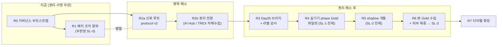

# TREX 자세 교정: 현재 데이터 기반 서비스 수준 도달 로드맵

- 상태: 연구·설계 문서(RFC). 실행 권한·release 권한을 부여하지 않으며, 아래 모든 단계는 [출시 청사진](pose-correction-launch-blueprint.md)의 게이트 체계 안에서만 유효하다.
- 작성일: 2026-08-11
- 질문: "현재 데이터(AI Hub 피트니스 자세 이미지 013 + 기존 저장소 자산)로 어떻게 해야 서비스 수준까지 도달할 수 있는가"
- 방법: 저장소 전 자산(문서 30여 종·실험 아티팩트·Kotlin 런타임 12개 패키지) 판독 → 4개 독립 관점(MVP·증거·리스크·제품)의 설계안 → 3중 적대적 심사(데이터 현실성·통계 타당성·엔지니어링 정합성) → 통합. 심사가 코드 실측으로 반박한 설계 결함은 본문에서 모두 수정 반영했다.
- 관련 문서: [출시 청사진](pose-correction-launch-blueprint.md), [데이터 감사](pose-data-audit.md), [현재 시스템](pose-correction-system.md), [바벨 스쿼트 검증](barbell-squat-validation.md), [권리 manifest](pose-data-rights-manifest.v1.json)

## 1. 결론 요약

현재 데이터만으로 "자세 판정 서비스"에 곧바로 도달할 수는 없다. 그러나 현재 자산은 (a) 지금 즉시 출시 가능한 무판정 사용자 가치, (b) 권리 해소 후 실행할 준비가 끝난 측정 검증, (c) 최소 신규 수집으로 첫 판정 criterion을 여는 확증 경로의 3단 구조를 이미 지탱할 수 있다. 경로의 진짜 크리티컬 패스는 실험이 아니라 **두 개의 비-데이터 병목**이다.

1. **신뢰 루트(서명 인프라)**: release/shadow/권리 전환/Gold 반입 전부가 detached signature + pinned trust registry(protocol v2)에 걸려 있고, 이것 없이는 어떤 검증 성공도 서비스로 전환될 경로 자체가 없다.
2. **권리 게이트**: [권리 manifest](pose-data-rights-manifest.v1.json)는 verified-ready 전까지 AI Hub 실데이터의 threshold fitting·calibration·locked 평가·runtime 사용은 물론, **자체 실기기 참가자 수집(REAL_PARTICIPANT_COLLECTION)까지 금지**한다. manifest v1은 전환 자체가 금지되어 있어 protocol v2가 선행 조건이다. 따라서 "동의서만 받으면 파일럿 촬영 가능"이라는 가정은 성립하지 않는다.

이 두 병목과 무관하게 지금 착수 가능한 작업(무판정 배치 코치, UNKNOWN UX, adjudication 패킷, 접촉 이력 감사, 승인 역치 사전등록)을 전진 배치하고, 병목 해소 후 Day05 브리지 → 실기기 phase Gold → shadow → 외부 확증의 순서로 첫 criterion을 LIMITED_GA까지 관통한다.

## 2. '서비스 수준'의 정의 — 4단 누적 계약

"서비스 수준"을 단일 지점이 아니라 각각 독립적으로 검증·출시되는 4개 층으로 정의한다. 상위 층이 하위 층을 함의하지 않으며, 각 층은 자기 게이트를 통과한 만큼만 사용자에게 노출된다.

| 층 | 내용 | 핵심 게이트 |
|---|---|---|
| **SL-0 배치 코치** | 판정·측정 주장 0건. 스켈레톤 오버레이 + 인물 고정 + 카메라 배치 안내만 | 무판정 정책 문서 준수(정적 테스트), 프라이버시 감사(영속화 0), 판정성 언어 0건 |
| **SL-1 반복 카운트** | 서명된 approvedPhaseArtifact 기반 rep 카운트 | 실기기 phase Gold에서 사전등록 역치 통과, 검정력 승인 표본에서 rep F1 확증, UNKNOWN 중 카운트 증가 0 |
| **SL-2 무판정 측정 요약** | 완료 사이클의 ROM 등 집계 표시(정오 판정 없음) | SHADOW_MEASUREMENT 서명 엔트리 + **해당 채널의 오차 데이터 카드 선행**(P95<margin) + 오인율 human-factors 통과 |
| **SL-3 첫 판정 criterion** | 1개 (운동×criterion×view×tier)의 PASS/FAIL/UNKNOWN + cue | 청사진 §12.3 전체(untouched 외부 실기기 Gold에서 recall·precision·false reassurance·harmful cue CI), rollout 사다리 |

측정값(ROM 수치 등)은 "판정이 아니어도 측정 주장"이므로, 해당 채널의 오차 데이터 카드 없이 사용자에게 노출하지 않는다(SL-2가 SL-1보다 늦은 이유). shadow는 청사진 정의상 사용자 비노출 단계이므로 SL-2 표시는 shadow의 전용이 아니라 별도 표시 승인(SHADOW_MEASUREMENT allowlist kind)으로 인가한다.

## 3. 현재 자산과 제약 (판독 확정 사실)

### 3.1 데이터가 허용하는 것

| 자산 | 규모 | 용도 |
|---|---|---|
| 이미지-라벨 연결 시퀀스 | Day05 945(맨몸 5종) + Day04 945(바벨·덤벨 4종) + Day17 1,049(기구 8종) = 2,939개(전체 2D 라벨의 약 8.5%) | MediaPipe↔AI Hub 브리지 오차 데이터 카드(§11 프로토콜 설계 완료·미실행) |
| Day05 무결성 | 참조 74,645개, 누락 0·중복 0, 좌표 전수 경계 내 | IMAGE/VIDEO 2트랙 벤치마크의 확정 기반 |
| 좌표 라벨 전체 | 41운동·816 type·167 binding, 2D/3D 쌍 33,349개 | 후보 신호 탐색(LOSO)·조건 관측 가능성 분류 — 확증 불가 |
| 조건 O/X + 오류 시나리오 | 운동당 3~5조건, 오류 유도 촬영 설계 | 약감독 신호. 단 클립 단위이며 오염 확정 3 type 존재 |
| 완성 런타임 | MediaPipe full 모델(SHA 고정)·attested observer·phase engine·shadow 커널·평가 세션·readiness·0-entry facade | 배선과 인가 발급만 남은 상태 — 재작성 불요 |
| 실험·Gold 방법론 | LOSO·bootstrap·holdout ledger·gold workflow 검증기·굿모닝 수치 rubric | 런지 등 신규 실험에 상수 교체 수준으로 이식 가능 |

### 3.2 데이터·구조가 막는 것

1. **확증 불가**: 바벨 스쿼트 공식 Validation은 `CONSUMED_DEVELOPMENT_BENCHMARK`로 소진, 바벨 스쿼트 이미지는 0장. 어떤 운동이든 GA급 확증은 신규 실기기 수집으로만 가능하다.
2. **phase 검증 불가**: 16-keyframe·무 timestamp 구조로 phase decoder 검증이 원천 불가함이 실험으로 확정(`REJECTED`, subject-macro recall 0.2595). AI Hub 16-keyframe phase 재실험은 금지 목록이다.
3. **권리 게이트**: manifest v1이 허용하는 작업은 `PUBLIC_SCHEMA_REVIEW`·`SYNTHETIC_CONFORMANCE_FIXTURE_VALIDATION` 2종뿐. "zero-authority 연구" 라벨은 `MODEL_OR_THRESHOLD_FITTING` 금지를 면제하지 않는다. **자체 수집(TREX 데이터 클래스)도 전 클래스 realDataUseReady=false**다.
4. **첫 criterion의 계약 결선**: 스텝 포워드 런지 5개 binding의 실측 상태 —

| 조건 | 관측성 | side 정책 | 허용 view | 차단 요인 |
|---|---|---|---|---|
| 앞무릎 각도 90도 | DIRECT | LEAD_LIMB | front-oblique·lateral | **role resolver 미구현**(PENDING_TRUSTED_ARTIFACT) |
| 뒷무릎 각도 90도 | DIRECT | TRAIL_LIMB | front-oblique·lateral | 동일 |
| 무릎-발 방향 일치 | PROXY_UNVALIDATED | LEAD_LIMB | **front·front-oblique 전용** | resolver + PROXY(cue 부적격) + 현 런타임 lateral 전용 view token |
| 척추의 중립 | PROXY_UNVALIDATED | MIDLINE | front-oblique·lateral | PROXY(cue 부적격) |
| 상체 숙임/젖힘 | 해석 미확정 | — | — | 전문가 adjudication 선행 |

   즉 "런지 첫 출시"는 **role resolver 구현 + trusted artifact 승인 트랙 없이는 성립하지 않는다**. 이 결선은 4개 설계안 전부가 놓쳤고 심사에서 확정된 사실이다.
5. **관측 불가 조건**: NOT_OBSERVABLE 16개 binding(발바닥 지면 고정 등)은 contact/force 센서 없이는 영구 미지원 — "센서 필요" 정직 표시가 유일한 처리다.
6. **라벨 오염**: type 062·101·109(153 record) 격리 확정. 전체 오염률은 미상 — 층화 표본 감사 전까지 "확정 3건이 전부"라고 가정하지 않는다.
7. **봉인 전 접촉 의혹**: 청사진 §3.1의 맨몸 사전 탐색(25개 condition, manifest·split 미고정)이 Day05 5운동(조건 합계 24개)을 이미 접촉했을 개연성이 높다. Day05 기반 확증 축은 **소급 접촉 이력 감사 없이 설계 금지**다.

## 4. 설계 원칙 (심사 통합 결정 8건)

1. **확증의 주 축은 실기기 MediaPipe-Gold다.** AI Hub는 스크리닝·브리지 오차 정량화·입학 심사(도메인 한정 태그)까지만. Day05 통과를 GA 근거로 격상하지 않는다.
2. **권리 게이트를 문언 그대로 준수한다.** verified-ready 전 신규 실데이터 실험 동결. AI Hub 축과 자체 수집 축의 권리 전환을 분리 추진한다(자체 수집 전환은 AI Hub 회신과 무관하게 protocol v2 + 정책 문서로 가능).
3. **phase Gold 파일럿이 shadow보다 선행한다.** shadow 커널은 완료 사이클에만 집계하고, 완료 사이클은 approvedPhaseArtifactSha256 기반 phase driver binding을 요구한다(코드 실측). shadow 먼저 → Gold 나중 순서는 존재하지 않는 artifact를 가정하는 오류다.
4. **파일럿은 GO/NO-GO 전용이다.** 12명급 LOSO로 beta 노출을 승격하지 않는다(7명 중 1명이 coverage gate를 깬 0.4375 전례 = 소표본 1인 granularity의 함정). 사용자 노출은 검정력 사전 계산을 통과한 표본 이후로만.
5. **봉인 규율**: 소급 접촉 이력 감사 → subject 분포 감사 → 검정력 계산 → 봉인 비율 결정 → 봉인 SHA의 시간 선행성 ledger 기록 → 브리지/데이터 카드 실행은 비봉인 subject 한정 → 봉인 holdout은 primary 가설 1개로 정확히 1회 실행 후 결과 무관 CONSUMED. gate 완화 절대 금지(표본 확대 또는 탈락만 허용).
6. **측정값 노출은 오차 데이터 카드 이후.** 무판정이어도 수치 노출은 측정 주장이다.
7. **파사드는 유일한 product availability 경계로 유지한다.** 배치 코치는 파사드 밖 우회 화면이 아니라 DISPLAY_ONLY 류 lifecycle의 파사드 편입(권장) 또는 최소한 SHA-pin 무판정 정책 문서 + 평가 API 도달 불가 정적 테스트로 경계를 강제한다.
8. **표본 수는 목표 수치에서 역산해 사전 고정한다.** 오염률 95% 상한 <5% 증명은 층당 n≥60, CI 하한 ≥95% 주장은 n≥59, participant-level 상한 <1%는 약 300명 독립 참가자. frame 단위 상관 관측에 독립성 가정 구간(Wilson 등) 사용 금지 — subject-cluster bootstrap으로 통일.

## 5. 로드맵

기간 대신 exit evidence로 관리한다. R1은 R0와, R2a/R2b는 R0·R1과 병렬이다.

### R0 — 거버넌스 부트스트랩 (즉시, 권리·데이터 무관)

목적: 이후 전 단계가 의존하는 결정·문서·감사를 선행 완료한다.

Exit criteria:
- 무판정 표시 정책 문서 v1 SHA-pin: 허용 표시(스켈레톤·인물고정·뷰 안내·집계)와 금지 표시(PASS/FAIL·점수·cue·규범 비교·정오 함의 문구) 전수 열거
- hash-bound allowlist 스키마 설계: artifact kind 3종(PHASE_DRIVER / SHADOW_MEASUREMENT / RELEASE_CRITERION) 분리, 기본 0-entry에서 기존 fail-closed 동작 불변
- phase artifact 승인 역치 사전등록: 기각 지표(recall 0.2595·min coverage 0)를 역기준화한 수치(예: subject-macro recall ≥0.85, min-subject coverage ≥0.6, rep F1 ≥0.95, causal prefix invariance 1.0) — 이후 완화 금지
- **첫 출시 단위 결선**: (a) 런지 LEAD/TRAIL_LIMB role resolver 구현 + trusted artifact 승인 트랙 추가(권장 — 이미지 자산과 정합) vs (b) 고정 side 후보(측면 뷰 DIRECT 목록)에서 재선정. 결정문을 planning registry에 기록
- 소급 접촉 이력 감사: 기존 3개 실험 + 맨몸 사전 탐색의 입력 이력 대조 → "이미 관찰된 Day05 subject 목록" 산출(봉인 설계의 전제)
- subject(Z)×촬영일 분포 감사(읽기 전용): Day05 5운동 + 바벨 스쿼트 — 봉인 비율·검정력 산정의 기초
- 모호 19 binding(런지 2건 우선) + 062/101/109의 blind adjudication 패킷 작성(PUBLIC_SCHEMA_REVIEW 범위)
- trust root 옵션 결정 문서: 서명 주체·quorum(최소: 외부 co-signer 1인)·key custody·revocation·trusted time — 소규모 팀 실행 가능 구성 명시
- 모델/SDK 수명주기 정책 사전등록: 8종 SHA hash-bound 인가는 모델·SDK 교체 시 전 criterion을 무효화하므로(의도된 fail-closed), 업그레이드 등급 분류(SDK patch vs 모델 교체)별 최소 재검증 팩 — Day05 데이터 카드 자동 재실행 + 보존 실기기 회귀 표본의 paired 동등성 gate(비열등성 마진 사전 고정) — 와 재서명 경로를 미리 정의한다. 재검증용 회귀 표본은 locked test와 별도 클래스로 ledger 등재(소진 규칙과 분리), Gold 동의서에는 "동일 목적 내 미래 모델 버전 재검증 재사용" 조항을 처음부터 포함

### R1 — 배치 코치 알파: SL-0 (R0와 병렬, 권리 무관)

목적: 판정 0건으로 첫 사용자 가치를 열고, 전 단계 공통 전제(전면 카메라+측면 배치 UX)를 실측한다.

Exit criteria:
- PostureActiveScaffold 휴면 UI를 DISPLAY_ONLY로 배선: attested observation → 오버레이 + person-lock + 뷰 배치 안내만. 평가 세션 생성 지점 0곳 정적 테스트, 무판정 정책 lint 통과
- 프라이버시 감사: 프레임·좌표 영속화 0, 네트워크 전송 0, "자세를 평가하지 않습니다" 고지
- E1(배치 성공률): 내부 dogfood에서 90초 내 view-qualified 도달률·이탈 사유 분포 데이터 카드. 알파 게이트 ≥70%
- E2(UNKNOWN UX 이해도): mock 데이터 프로토타입으로 3상 표현·사유 4종 해석 정확도 ≥80%
- E6(Wizard-of-Oz cue 파일럿): 판정 엔진 없이 스크립트 cue로 이해도·방향 반응 관찰 — 본 human-factors의 리허설
- dogfood floor: 300세션/14일/audit 100

주의: 여기서 수집하는 계측은 집계 전용·메모리 전용이다. 참가자 신체 데이터의 반출·보존이 시작되는 순간 R2b(TREX 클래스 전환)가 선행되어야 한다.

### R2a — 신뢰 루트: protocol v2 (R0 직후, 전 트랙의 병목)

Exit criteria:
- detached signature verifier + pinned trust registry 구현(별도 모듈 격리 — observer issuer 서명 경계 문제 동시 해소), synthetic fixture 회귀 통과
- 키 세리머니: 외부 보관 서명키·custody·철회 정책, 발급 이력 ledger
- rights manifest protocol v2 스키마 구현: 증빙 없으면 전환 불가를 테스트로 증명
- self-signed·저장소 내부 해시로 승인을 대체한 artifact 1건 발견 시 해당 계열 전량 무효화 규칙 명문화

### R2b — 권리 전환 (R2a 이후, 두 갈래 분리)

- **TREX 자체 수집 클래스**: 동의서·retention·삭제 정책·계측 build 요건을 갖춰 verified-ready 전환 — AI Hub 회신과 독립이며 R4의 선행 조건
- **AI Hub 클래스**: 이용약관 원문·상업 이용·파생 threshold/모델 배포 허용의 서면 증빙 → blocker 11개 해소 → 전환. 포털-로컬 catalog provenance 불일치 규명 포함
- 불허 확정 시(사전 문서화된 abort): AI Hub를 설계·스크리닝 전용으로 영구 강등, R3의 브리지 데이터 카드는 연구 참고로 격하, 확증·보정은 자체 수집 단독 분기로 전환(R4~R6은 원래 자체 수집 축이므로 구조 불변)

### R3 — Day05 브리지 + 라벨 감사 (AI Hub 클래스 verified-ready 이후)

목적: MediaPipe 33lm↔AI Hub 24kp 오차를 정량화해 feature 입학 심사(P95<margin)를 제도화하고, 라벨의 truth 자격을 판정한다.

Exit criteria:
- 24kp↔33lm 매핑 계약 SHA 고정(공통 14~17관절, Back/Waist 척추 chain 대응 불가 명문화 — 척추 중립류는 shoulder-hip 대체 금지)
- **비봉인 subject 한정** IMAGE landmark audit + VIDEO pipeline replay 2트랙 full-run(§11.1), model SHA×SDK×view×criterion 데이터 카드 고정
- criterion별 P95(|error|) vs margin 통과/탈락 표 + error 주입 flip rate(일반 <2%, safety <1%), 탈락 binding은 BRIDGE_BLOCKED로 기계 판독 표기
- 입학 심사 재설계 상한: 통과 0개로 인한 feature 재설계 회귀는 사전등록된 대안 목록 안에서 최대 2회, 매회 Day05 development-consumed 상태를 ledger 기록(무제한 재설계 = 과적합 필터 금지)
- X5(라벨 오염률 층화 감사): 런지 2종 우선, 층당 n≥60, 3인 blind — 95% 상한 >5%면 해당 운동 라벨을 truth에서 사전 스크리닝으로 강등
- 런지 좌표·이식성 실험(사전등록): Training-only 비봉인 LOSO + paired-frame 방향 일치(subject-cluster 구간). 봉인 holdout 확증은 primary 가설 1개를 사전 지정해 정확히 1회 → 즉시 CONSUMED
- Day04·Day17 승격 감사(읽기 전용 — R2b와 병렬 가능): 무결성 Day05 동급 확인 시 Tier 2 후보 확정, 미달 시 이미지 전무군과 동일 취급

### R4 — 실기기 phase Gold 파일럿 (TREX 클래스 전환 이후) → SL-1

목적: AI Hub로 불가능이 확정된 phase 검증을 30fps 연속 실기기 데이터로 수행해 첫 approvedPhaseArtifact를 발급한다.

Exit criteria:
- 계측 build(geometry 6필드 attest·offline 6-file bundle 규격) 승인, 파일럿 캡처 ≥12명×2 tier×2세션(대상: R0 결선이 선택한 운동, 측면 뷰)
- **negative 세그먼트 의무 포함**: 참가자당 (a) 세트 간 휴식·이동·잡동작, (b) 인접 운동 1~2종 수행(예: 런지 세션 중 스쿼트) 구간을 스크립트에 넣고 phase Gold에 NON-EXERCISE로 주석 — 유사 관절 궤적에서 히스테리시스 decoder의 사이클 오발화는 정의상 harmful cue 경로다
- 3인 blinded phase boundary 라벨(Krippendorff α ≥0.80, 미달 시 rubric 수정 최대 2회)
- **파일럿 내 confirmatory subset 사전 봉인**: 승인 판정은 LOSO 전체가 아니라 untouched subset에서 사전등록 역치 통과로만(개발 성능의 확증 승격 금지)
- 승인 역치에 negative 게이트 병기: NON-EXERCISE 구간 완료 사이클 오발화·cue 발생 0건, rep false-positive율 상한(사전등록) — rep F1은 negative 구간을 포함한 표본에서만 측정
- 통과 시 phase artifact 서명 발급 → PosePhaseDriverBinding 프로덕션 인스턴스화, UNKNOWN 단조 안전성 property test
- 반복 카운트의 사용자 노출(SL-1)은 파일럿이 아니라 **검정력 사전 계산을 통과한 본 표본**에서 rep F1 확증 후. 파일럿은 본 수집 GO/NO-GO 전용
- 2개 후보(knee-flexion·pelvis-ankle)×2개 운동 순차 검정 시 α 분할 사전등록. 전부 실패 시 반복 카운트를 로드맵에서 제외하고 SL-2를 phase 비의존 집계로 재설계(abort)

### R5 — shadow 개통 (R4 이후) → SL-2 준비

선행 의존(비평가 감사로 추가): **운영 인프라 최소 구축**. 현재 앱은 완전 오프라인(네트워킹 스택 전무)이므로 shadow/rollout floor(세션 수·UNKNOWN율·audit 건수)는 측정 자체가 불가능하다. (1) signed config 스키마 + 클라이언트 폴링·만료 타이머 폴백(§15.2 계약, 서명은 R2a 인프라 재사용), (2) 집계 전용 telemetry 수집기(§15.1 허용 필드만, stable device identifier 없음, retention SLA 숫자 확정), (3) opt-in 편향 보고 규칙과 floor 카운트 분모 정의가 shadow floor 판정보다 먼저 있어야 한다.

Exit criteria:
- shadow key 발급 체계로 NO_SHADOW_KEY_CONFIGURED 해소, SHADOW_MEASUREMENT allowlist 엔트리 서명(측정 전용 채널)
- 파사드 생명주기 전이가 서명 엔트리 기반으로만 발생함을 테스트로 증명(SHADOW-mode 엔트리만으로 cue·PASS/FAIL 경로 타입 수준 도달 불가)
- PoseExerciseEvaluationSession 실배선 + shadow floor: 300세션/14일/audit 100, IN_MEMORY_ONLY·AGGREGATES_ONLY packet capture 검증
- 세션 요약 화면(SL-2)은 **해당 채널 오차 데이터 카드(R3) + 오인율 human-factors(정답률 ≥90%, 유해 해석 0건) 통과 후에만** opt-in beta로
- 실기기 분포가 Day05 데이터 카드와 사전 정의 drift 한계 이상 비양립이면 해당 criterion의 R6 진입 보류

### R6 — 본 Gold 수집 + 외부 확증 → SL-3 (LIMITED_GA)

Exit criteria:
- 검정력 사전 계산 승인(min-subject coverage 게이트가 1인 granularity로 깨지지 않는 규모 — 참조 플로어: split×tier당 30명·cell당 20명, harmful cue participant-level 상한 <1% 증명은 약 300명 독립 참가자·예상 탈락률 반영)
- 코호트 층화 변수 명시(cohort power plan null 슬롯 충전 시): 조도 2수준×복장 대비 2수준을 캡처 스크립트 통제 변수로, 성별·연령대·체형(BMI 대역)을 모집 쿼터로 — AI Hub는 스튜디오·표준 복장 데이터라 이 축들이 정확히 신규 수집으로만 메울 수 있는 도메인 갭이다. 사전 지정 세그먼트별 최소 성능 하한 또는 해당 세그먼트 UNKNOWN 처리를 게이트에 병기하고, 전 capture group 메타데이터에 축을 기록
- negative 세그먼트(비운동·오운동)를 본 수집 스크립트에도 의무 포함, negative 게이트를 §12.3 판정에 병기
- 윤리·consent·retention·incident response 패키지, 독립 EXTERNAL site/operator, split seal이 outcome 관찰에 선행
- 3인 blind Gold(α ≥0.80), 핵심 criterion은 동기화 MoCap/기준장비 대조 포함
- untouched locked external test **1회** 평가: §12.3 전체(recall ≥90%·CI 하한 ≥85%, cue precision ≥90%, false reassurance 상한 <1%, safe response ≥99%). 복수 criterion 동시 판정 시 primary 사전 지정 + Holm 보정. 미달 시 CONSUMED 기록·동일 데이터 재평가 영구 금지
- coverage 분해 의무 보고: selective vs unconditional recall 괴리·abstain 표본 오류 집중 검사
- human-factors 본 study: cue 이해·올바른 방향 반응 CI 하한 ≥95%, 반대 방향 상한 <1%(운영 텔레메트리로 측정 불가 — 전문가 관찰 지표임을 KPI 정의에 명시)
- 8종 SHA signed release package → RELEASE_CRITERION allowlist 발급 → rollout 사다리(shadow → dogfood → opt-in beta 1,000/21/200 → 1%→5%→…), kill switch drill은 **실제 배포 채널을 통한 60분 발행**으로 정의, config 만료 타이머 폴백 실증
- **운영 수용 능력 심사**: 60분 kill SLA의 현실적 커버리지(대응 가능 시간대·백업 서명자·자동화 범위)를 문서화하고, 불가능하면 SLA 또는 노출 상한을 정직하게 하향(예: opt-in beta를 공식 상한으로 선언). GA 이후 분기별 전문가 audit·재검증 팩·키 회전을 포함한 연간 운영 인력·예산표를 산출물로 요구. 대응 불가 시간대의 무인 fail-safe(노출 자동 축소) 설계 포함

### R7 — 티어별 확장

- versioned exercise-plan compiler 승인(두 운동 fixture 동시 통과·exercise ID 분기 부재) 후 운동별 R3~R6 독립 반복
- 공개 순서: Tier 1(Day05: 런지 포워드→백워드→스탠딩 니업) → Tier 2(Day04 4종 + Day17 기구 8종, R3 승격 감사 조건부) → Tier 3(이미지 전무 24종 — 자체 수집 필수. 바벨 스쿼트는 고중량 안전 게이트로 Tier 3 중에서도 후순위: 실기기 lateral phase Gold 수집 후에만 재개)
- NOT_OBSERVABLE 16 binding: contact/force 센서 조달 결정 또는 "센서 필요" 영구 정직 표시 중 하나를 공식 확정
- 티어 로드맵을 앱 내 노출("내 운동이 언제 왜 지원되는지") + 운동 상세 "검증된 판정 N/M + 보류 사유" 라벨 전 41종 적용
- 공유 인프라(파서·view qualifier·observer) 결함 발견 시 기출시 운동 포함 전 출시 단위 재검증 전 kill switch

### 횡단 트랙 (완결성 감사로 추가된 3건)

설계 4안과 3중 심사 전부가 놓쳐 별도 완결성 감사에서 확정된 항목이다. 각각 특정 마일스톤이 아니라 여러 단계에 걸친다.

1. **운영 인프라(W-OPS)**: signed config 배포 채널 + 집계 전용 telemetry 수집기 + 폴링·만료 폴백 클라이언트. 현재 앱은 완전 오프라인이므로 이것 없이는 rollout floor 측정과 kill switch SLA가 모두 선언에 그친다. R5의 선행 의존(본문 반영). 백엔드는 그 자체가 개인정보 처리 시스템이므로 설계 시점부터 privacy gate(§14.3)와 함께 진행한다.
2. **모델/SDK 수명주기 정책**: hash-bound 인가 체계에서 업그레이드는 전 criterion 자동 무효화를 뜻한다. Google Play targetSdk 연간 상향 등으로 업그레이드는 상수이므로, 등급별 재검증 팩·동등성 gate·재서명 경로·재검증용 회귀 표본 클래스를 R0에서 사전등록한다(본문 반영). 이것이 없으면 LIMITED_GA 도달 후 수개월 내 서비스가 자연 소멸한다.
3. **접근성**: 핵심 출력이 음성 cue와 색 기반 시각 표시인데 접근성 설계가 전무하다. cue를 듣지 못하는 사용자는 "기능이 켜져 있다"고 믿는 false reassurance 상태가 되며, 이는 harmful cue 상한의 미측정 하위 집단이다. (a) cue 다중 채널 정책(음성+진동+화면 자막)과 채널별 전달 지연 정의, (b) 3상 판정·오버레이의 비색상 이중 부호화(아이콘/패턴)와 색각 시뮬레이션 검사, (c) Compose semantics/TalkBack 검수를 device gate에 추가, (d) human-factors 모집에 감각 저하 참가자 쿼터 포함 또는 intended population 문구에 한계 명시. 최저비용 첫 단계는 R1의 E2(UNKNOWN UX 테스트)에 접근성 조건 프로브를 추가하는 것이다.

## 6. 신규 확보가 불가피한 것 (현재 데이터로 절대 불가)

1. **untouched 외부 실기기 MediaPipe-Gold holdout** — 소진된 Validation의 유일한 대체. 모든 판정 승격의 확증 증거
2. **phase Gold**(timestamp 기반 boundary + abstention 구간, 전문가 부여) — 16-keyframe 구조 한계로 대체 불가
3. **시간 안정성류 조건의 연속 고FPS 영상** — 굿모닝 STABILITY BA 0.50이 실증한 관측 한계
4. **전문 인력**: SME 1인, blinded reviewer 3인, adjudicator, 독립 EXTERNAL site — 현재 roster 전부 null
5. **외부 bootstrap trust root**(서명자·quorum·custody) — 저장소 내부에서 생성 불가
6. **AI Hub 이용약관 서면 증빙** — 데이터 폴더에 이용조건 문서 없음
7. **human-factors 관찰 데이터**(파일럿 n≥10 → GA급 약 300명)
8. (조건부) attested contact/force 센서, MoCap/기준장비, front/front-oblique view provider 검증 데이터

## 7. 리스크와 중단 기준 (요약)

| 리스크 | 완화 | 중단·되돌림 |
|---|---|---|
| AI Hub 상업 이용 불허 | 로드맵을 AI Hub 의존 최소로 설계(확증 축은 원래 자체 수집) | AI Hub 파생물 전면 연구 강등, R3 산출은 참고 자료화 |
| trust root·전문가 미확보 | 최소 quorum(외부 co-signer 1인)·범위 최소화(1운동×1criterion) | 확보 불가 시 SL-0까지를 공식 상한으로 동결 — 타이머 유지가 fail-closed의 올바른 결말임을 문서화 |
| 측면 배치 UX 실패 | E1 최전방 배치, 안내 반복 개선 | 개선 2회 후 통과율 <50%면 lateral 전제 재검토·후면 카메라 시나리오 전환 |
| 봉인 전 접촉 판명 | R0 소급 감사 선행, 접촉 subject dev 강등 | Day05 전 subject 접촉 시 AI Hub 내 확증 축 공식 포기, 실기기 단일 축 |
| 라벨 오염 광범위 | X5 층화 감사(층당 n≥60) | 오염률 95% 상한 >5%면 해당 운동 truth 강등, Gold-only 전환 |
| 브리지 오차 초과 | delta-feature·band 확대·view 한정 단계 대응 | 핵심 관절 P95가 margin 2배 초과 시 feature family 기각 |
| phase 재실험 실패 | 사전등록 역치·α 분할·후보 2개 한정 | 전부 실패 시 반복 카운트 제외, SL-2 재설계 |
| UNKNOWN 다발로 UX 역풍 | 사유별 행동 안내·coverage <50% criterion 비노출·'좁고 깊게' | beta 세션 완료율 <70%면 판정 노출 중단, SL-0/1 중심 재구성 |
| 잘못된 cue(유일한 최대 비용 실패) | 삼상 판정·PROXY cue 금지·participant 상한 <1%·rollout floor | critical wrong cue 1건 = 60분 내 kill switch·전 단계 강등 |
| 의료/규제 경계 | intended-use "일반 피트니스 보조" 한정, 재활·치료·진단 claim 금지 | 의료기기 해당 가능성 확인 시 해당 기능 중단·문구 회수 |

## 8. 금지 목록 (심사로 확정된 do-not-do)

1. AI Hub 16-keyframe phase 재실험(REJECTED가 hash 고정됨)
2. 소진된 공식 Validation의 confirmatory 재사용(descriptive 인용만 허용)
3. 소표본 파일럿(≥12명 LOSO)으로 사용자 노출 기능 beta 승격
4. frame-level 상관 관측에 독립성 가정 신뢰구간(Wilson 등) 적용
5. 봉인 holdout에 복수 가설 무통제 동시 검정, gate 사후 완화, 동일 데이터 재평가
6. 오차 데이터 카드 없는 측정값(ROM 등) 사용자 노출 — *예외: 휴리스틱 자세 체크 베타 트랙은 소유자 결정으로 [별도 계약](pose-heuristic-form-check.v1.md) §1.1의 보상 통제 하에 각도 관찰·반복 카운트를 노출한다*
7. 파사드 밖 우회 화면으로 표시 기능 신설(경계 이중화)
8. "zero-authority 연구" 라벨로 rights manifest 금지 작업 우회
9. 세션/audit floor 충족을 participant-level CI 충족으로 혼동
10. Day05 입학 심사의 무제한 반복 재설계(상한 2회·ledger 기록 없이)
11. `conditions.value` 단독 truth 사용(type code·description·adjudication 병행 없이), `active` 필드의 correctness 사용
12. AI Hub 원본·파생 raw 데이터의 APK·저장소·telemetry 포함
13. negative(비운동·오운동) 구간 없는 표본에서 rep F1·phase 게이트 측정 — 휴식 중 오카운트와 오운동 cue를 잡지 못하는 공허한 지표
14. 배포 채널·telemetry 수집기 없이 rollout floor·kill switch SLA를 exit criteria로 선언

## 9. 착수 2주 작업 목록

1. 무판정 표시 정책 문서 v1 초안 + SHA-pin (R0)
2. allowlist artifact kind 3종 스키마 설계 문서 + detached signature verifier 스파이크 (R0/R2a)
3. phase artifact 승인 역치 사전등록 문서 (R0)
4. 첫 출시 단위 결선 자료: 런지 resolver 트랙 vs 고정 side 후보 재선정 비교표 → 결정 (R0)
5. 소급 접촉 이력 감사 + subject(Z)×촬영일 분포 감사 스크립트(읽기 전용) 실행 (R0)
6. 모호 19 binding(런지 2건 우선)·062/101/109 adjudication 패킷 작성, 전문가 후보 접촉 (R0)
7. trust root 옵션 비교 문서(소규모 팀 실행 구성 2~3안) (R0)
8. PostureActiveScaffold DISPLAY_ONLY 배선 스파이크 + 평가 세션 미생성 정적 테스트 (R1)
9. UNKNOWN UX 문안 v1 + mock 프로토타입 + E2 참가자 모집 (R1)
10. AI Hub 이용약관 원문 확보 절차 착수: blocker 11개 대응 확인 요청서 발송 (R2b)
11. TREX 자체 수집 전환 패키지 초안: 동의서·retention·계측 build 요건 (R2b)
12. 런지 실험 러너 스캐폴드(굿모닝 템플릿 이식) — synthetic fixture 테스트만으로 검증, 실데이터 접촉 금지 (R3 대비)

## 10. 방법론 각주

본 문서는 다음 절차의 산출물이다: 저장소 자산 5개 영역(데이터 현실·실험 증거·거버넌스·Gold 파이프라인·런타임) 병렬 판독 → MVP·증거·리스크·제품 4개 렌즈의 독립 설계 → 데이터 현실성·통계 타당성·엔지니어링 정합성 3중 적대적 심사 → 완결성 감사 → 통합. 심사가 지적한 설계 공통 결함(런지 binding의 resolver 결선 누락, rights manifest의 자체 수집 게이트 오해, shadow↔phase 의존성 역전, 소표본 승격, 봉인 전 접촉 미감사)과 완결성 감사가 확정한 공백 6건(운영 인프라 부재, 모델/SDK 수명주기, negative 표본, 인구·환경 층화, 접근성, 지속 운영 조직)은 본문에 전부 반영했으며, 각 사실은 저장소 파일 실측으로 재확인했다.
