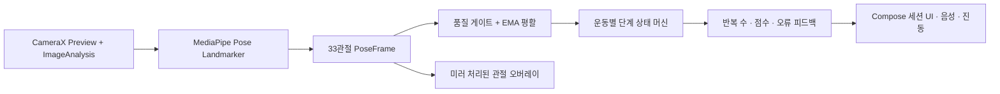

# TREX 실시간 자세 교정 시스템

## 목표와 범위

이 기능의 목표는 전면 카메라에서 사용자의 전신 관절을 온디바이스로 추정하고, 운동의 진행 단계·반복 횟수·지속되는 자세 오류를 실시간으로 판정하는 것이다. 운동 목록의 체크 버튼이 켜져 있고 `PoseEvaluatorFactory`에 evaluator가 등록된 운동만 자세교정 세션으로 진입한다. 현재 초기 규칙 기반 지원 운동은 `바벨 스쿼트`, `스텝 포워드 다이나믹 런지`, `스텝 백워드 다이나믹 런지` 3개다. 체크하지 않은 운동과 미지원 운동은 타이머 세션을 사용한다.

현재 evaluator는 symmetric squat / alternating lunge 관절 규칙을 위 세 운동의 런타임 프로필로 연결한 1차 구현이다. AI Hub condition 전체를 학습·보정한 최종 정확도 모델이라는 의미는 아니며, 실기기 데이터와 라벨 충돌 정제 후 계속 교체·보정해야 한다.

이 기능은 의료 진단이나 부상 위험 판정을 대신하지 않는다. 절대 거리와 관절의 실제 3D 위치를 단정하지 않고 관절각, 신체 길이 비율, 프레임 간 변화만 사용한다.

## 현재 데이터 감사 결과

`data/`는 앱 런타임 자산이 아니라 오프라인 보정·검증 자료다.
파일·운동별 전수 결과와 정제 규칙은 [pose-data-audit.md](pose-data-audit.md)에 정리했다.

| 항목 | 확인 결과 |
|---|---:|
| 전체 파일 | 393,789개 |
| 전체 크기 | 약 71.0 GiB |
| JPG | 323,868개, 약 65.6 GB |
| JSON | 69,898개, 약 10.2 GB |
| ZIP | 23개, 약 0.43 GB |
| 원천 JPG 촬영일 | Day04 151,099장, Day17 172,769장 |
| Training 2D / 3D JSON | 34,468개 / 35,430개 |
| 정확한 2D↔3D 쌍 | 33,349쌍 |
| 2D only / 3D only | 1,119개 / 2,081개 |
| Validation 라벨 | 3,139쌍, 원천 JPG 없음 |

한 2D 라벨 시퀀스는 일반적으로 16개 시점, 시점당 5개 카메라 뷰, 뷰당 24개 관절을 가진다. 대응 3D 라벨은 시점당 24개 `(x, y, z)` 관절을 가진다. 주요 메타데이터는 운동 종류, 자세, 운동명, 조건별 O/X, 오류 설명이다.

데이터 사용 전에 반드시 해결할 제약이 있다.

- 라벨은 여러 촬영일에 걸쳐 있지만 추출된 원천 JPG는 Day04·Day17뿐이다. 전체 라벨을 이미지 학습 데이터로 간주하면 안 된다.
- 2D only는 전부 Day36, 3D only는 Day37·38에 있다. category/day/basename 기준으로 쌍을 만든 뒤 누락 파일을 제외해야 한다.
- 맨몸 기본 스쿼트 라벨은 없고 `바벨 스쿼트`만 있다. 기존 generic squat 규칙을 단순 이름 변경으로 바벨 스쿼트 evaluator에 연결하지 않는다.
- 조건 벡터와 오류 설명이 충돌하는 사례가 있다. 예를 들어 일부 포워드 런지는 명백한 오류 설명인데도 모든 조건이 O다. `conditions.value`만 정답으로 쓰지 말고 type code와 description을 함께 감사해야 한다.
- 추출된 JPG와 연결되는 것은 Day04·17의 13개 운동뿐이며 스쿼트·런지는 포함되지 않는다. 스쿼트·런지 관절 시퀀스 판정 보정은 가능하지만 pose detector 자체의 이미지 fine-tuning·검증은 현 자료만으로 불가능하다.

현재 운동과 직접 관련된 라벨 조건은 다음과 같다.

| 운동 | 시나리오 | 주요 조건 |
|---|---:|---|
| 바벨 스쿼트 | 16종 / 720시퀀스 | 척추 중립, 고개 정면, 발-무릎 방향, 발바닥 고정 |
| 스텝 포워드 다이나믹 런지 | 32종 / 1,618 record | 앞무릎 90도, 몸통-발-무릎 방향, 뒤무릎 90도, 척추 중립, 상체 과도 숙임/젖힘 |
| 스텝 백워드 다이나믹 런지 | 32종 / 1,458 record | 스텝 포워드 다이나믹 런지와 같은 5개 조건 |
| 사이드 런지 | 32종 / 1,404시퀀스 | 앞무릎 90도, 몸통-발-무릎 방향, 반대 다리 펴기, 척추 중립, 상체 기울기 |
| 크로스 런지 | 8종 / 350시퀀스 | 앞무릎 90도, 앞발-앞무릎 방향, 상체 정면 균형 |

바벨 스쿼트 16개 condition 조합은 균형적이지만, 런지는 type 수보다 고유 truth vector가 훨씬 적고 type 101·109처럼 설명과 condition vector가 충돌하는 오라벨이 확인됐다. 런지 학습 전에는 description 기반 override catalog가 필요하다.

## 기기 런타임 구조

현재 앱은 공식 `pose_landmarker_full.task` float16 번들을 `app/src/main/assets/`에 포함한다.

- 원본: `https://storage.googleapis.com/mediapipe-models/pose_landmarker/pose_landmarker_full/float16/latest/pose_landmarker_full.task`
- SHA-256: `4EAA5EB7A98365221087693FCC286334CF0858E2EB6E15B506AA4A7ECDCEC4AD`
- SDK: `com.google.mediapipe:tasks-vision:0.10.29`

Universal debug APK는 MediaPipe의 4개 ABI 네이티브 라이브러리를 모두 포함해 약 84 MB다. 배포본은 Android App Bundle의 ABI 분할을 사용해 실제 기기에는 해당 ABI만 전달해야 한다.

- CameraX 분석은 640×480, `STRATEGY_KEEP_ONLY_LATEST`, 단일 분석 스레드를 사용한다. Preview와 Analysis를 같은 ViewPort로 묶고 `ImageProxy.cropRect`를 모델 입력에도 적용한다. 처리한 `ImageProxy`는 성공·실패와 관계없이 닫는다.
- MediaPipe Full 모델은 앱 내부에서만 실행하며 원본 프레임, Bitmap, 관절 시퀀스를 파일이나 네트워크에 저장하지 않는다.
- 모델의 해부학적 좌·우는 유지한다. 전면 카메라 미러링은 화면 오버레이에만 적용한다.
- 카메라 계층은 SDK 타입을 공통 `PoseFrame`으로 변환한다. 판정기는 MediaPipe나 CameraX 타입을 참조하지 않는 순수 Kotlin 코드다.
- 추론 결과의 world 좌표가 충분하면 각도 계산에 우선 사용하고, 없으면 이미지 종횡비를 보정한 normalized 좌표를 사용한다.

## 프레임 처리 알고리즘

### 1. 품질 게이트

운동별 필수 관절이 모두 있고 visibility와 presence가 기준 이상일 때만 상태 머신을 진행한다. 스쿼트·런지의 필수 관절은 양쪽 어깨, 엉덩이, 무릎, 발목이다. 관절이 사라지거나 신뢰도가 낮으면 반복 카운트를 즉시 멈추고 전신을 화면 안으로 이동하라는 안내를 낸다.

### 2. 평활과 시간 안전성

좌표에는 EMA를 적용하되 confidence는 평활하지 않는다. 낮은 confidence의 오래된 좌표를 재사용하면 화면 밖에서 가짜 반복이 생길 수 있기 때문이다. 350ms 미만의 짧은 추적 손실은 호환되는 동작 단계만 유지하고, 그 이상이거나 자세가 불연속이면 진행 중 동작과 필터를 초기화한다. 관절을 다시 찾은 뒤에는 연속 2프레임 동안 상태 전이와 세션 시간을 보류해 복귀 첫 프레임의 가짜 반복 완료를 막는다. timestamp 역전 또는 긴 프레임 공백도 재획득 상태로 초기화한다.

### 3. 체형·카메라 정규화

- 거리 임계값은 픽셀 대신 어깨 폭, 골반 폭, 몸통 길이의 비율로 표현한다.
- 관절각은 `A-B-C`의 벡터 내적으로 계산하고 0~180도로 제한한다.
- 좌우 평균과 차이를 함께 사용한다. 평균은 운동 깊이, 차이는 비대칭을 나타낸다.
- 단안 world 좌표의 meter 값을 절대 거리나 의료적 측정값으로 사용하지 않는다.

### 4. 반복 상태 머신

스쿼트는 `READY → DESCENDING → BOTTOM → ASCENDING → READY`를 모두 통과해야 1회다. 런지는 먼저 앞다리를 판별한 뒤 같은 순서를 좌·우별로 기록한다. 서로 다른 진입·이탈 임계값(hysteresis), 최소 단계 유지 시간, 최소 반복 시간을 사용해 바닥에서 흔들리는 동작이 여러 회로 세어지지 않게 한다.

프레임 한 장에서 바로 오류를 말하지 않는다. 위반이 연속 프레임 또는 일정 시간 이상 지속될 때만 활성화하고, 동일 음성 안내에는 cooldown을 둔다. 한 번의 반복 점수는 깊이, 제어, 무릎 정렬, 몸통 안정성의 감점 합으로 만들고 세트 점수는 완료 반복의 평균으로 계산한다.

## 데이터셋 24관절과 런타임 33관절 연결

직접 존재하는 Nose, Eye, Ear, Shoulder, Elbow, Wrist, Hip, Knee, Ankle은 같은 해부학적 관절로 매핑한다. 파생 관절은 다음처럼 정의한 뒤 모든 좌표를 몸통 길이로 정규화한다.

| 데이터 관절 | MediaPipe 기반 정의 |
|---|---|
| Neck | 좌·우 Shoulder 중점 |
| Waist | 좌·우 Hip 중점 |
| Back | Neck과 Waist 사이의 고정 비율점 |
| Palm | Wrist와 Index/Pinky 중점의 조합 |
| Foot | Ankle, Heel, Foot Index의 조합 |

이 매핑은 데이터의 2D/3D 수치를 런타임 출력과 직접 동일시하기 위한 것이 아니라, 동일한 특징(각도·정렬·비율)을 추출하기 위한 canonical schema다.

## 오프라인 보정·학습 계획

1. basename으로 2D/3D 쌍을 만들고 실제 존재하는 `img_key`만 남긴다.
2. type, exercise, condition vector, description을 정규화하고 충돌 라벨을 격리한다.
3. 카메라별 24관절을 hip 중심으로 이동하고 몸통 길이로 스케일링한다.
4. 각도, 좌우 차이, 속도, 가속도, 뼈 길이 변화율을 시퀀스 특징으로 만든다.
5. 같은 사람·촬영일·시퀀스가 train과 validation에 동시에 들어가지 않도록 subject/day 단위로 분리한다.
6. 1차 버전은 해석 가능한 규칙 임계값의 분포를 보정한다. 충분한 정상/오류 실영상이 확보된 뒤 작은 TCN 또는 TFLite 분류기를 규칙 엔진 뒤의 보조 신호로 비교한다.

현재 자료는 원천 영상 누락과 라벨 충돌이 있어 곧바로 end-to-end 분류기를 학습하기보다 규칙 보정과 회귀 테스트에 먼저 쓰는 편이 안전하다.

## 실기기 검증 기준

- 전면 카메라 세로/가로 회전과 미러 오버레이 정렬
- 정상 10회에서 카운트 오차 0회, 반동·반복 중 정지·절반 동작에서 중복 카운트 없음
- 관절 유실 중 카운트 정지, 복귀 후 이전 단계의 가짜 완료 없음
- 저조도, 화면 밖 관절, 두 명 등장, 전면 카메라 없음, 모델 초기화 실패의 안전한 처리
- 분석 FPS, 추론 P50/P95, dropped frame, 10분 연속 실행 발열·메모리 증가 측정
- 원본 프레임과 관절 데이터가 파일·로그·네트워크에 남지 않는지 확인

자동 테스트는 순수 Kotlin 합성 관절 시퀀스로 상태 전이·평활·visibility gate·중복 카운트 방지를 검증한다. 카메라 좌표 변환과 성능은 실제 Android 기기에서 별도로 검증해야 한다.
