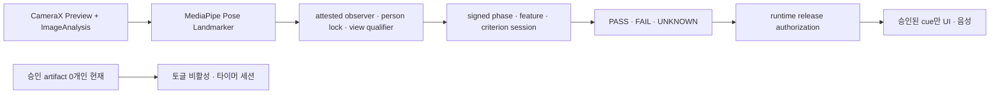

# TREX 실시간 자세 교정 시스템

## 목표와 범위

이 기능의 목표는 전면 카메라에서 사용자의 전신 관절을 온디바이스로 추정하고, 운동의 진행 단계·반복 횟수·지속되는 자세 오류를 실시간으로 판정하는 것이다. 제품 지원 여부는 구현 클래스의 존재가 아니라 `PostureCorrectionRuntimeFacade`가 제공하는 운동별 release availability만 사용한다. 현재 41개 운동·167개 criterion binding은 모두 `CATALOG_ONLY`이고 승인된 runtime criterion은 0개이므로, 모든 자세교정 토글은 비활성화되며 세션은 타이머 모드로 실행된다.

과거 symmetric squat / alternating lunge 수동 규칙은 결정적 회귀 연구를 위해 module-internal 클래스로만 남아 있다. 제품 factory와 호출 경로는 제거했으며, 이 규칙의 임의 임계값·점수·문구는 화면·음성·운동 기록의 근거가 될 수 없다. 첫 사용자 기능은 별도의 Gold 보정과 runtime release authorization을 통과한 criterion만 연결한다.

이 기능은 의료 진단이나 부상 위험 판정을 대신하지 않는다. 절대 거리와 관절의 실제 3D 위치를 단정하지 않고 관절각, 신체 길이 비율, 프레임 간 변화만 사용한다.

## 현재 데이터 감사 결과

`data/`는 앱 런타임 자산이 아니라 오프라인 보정·검증 자료다.
파일·운동별 전수 결과와 정제 규칙은 [pose-data-audit.md](pose-data-audit.md)에 정리했다.

| 항목 | 확인 결과 |
|---|---:|
| 전체 파일 | 561,295개 |
| 전체 크기 | 약 119.945 GiB |
| JPG | 485,102개, 약 109.286 GiB |
| JSON | 76,176개, 약 10.364 GiB |
| ZIP | 15개, 약 0.294 GiB |
| Training JPG 촬영일(전체 scope) | Day04 151,099장, Day05 161,234장, Day17 172,769장 |
| 실제 저장 scope | Day04·Day17은 원시데이터, Day05는 라벨링데이터 151,755장 + 원시데이터 9,479장 |
| 원시데이터 중복 후보 | Day05 9,479장 |
| Training 2D / 3D JSON | 34,468개 / 35,430개 |
| 정확한 2D↔3D 쌍 | 33,349쌍 |
| 2D only / 3D only | 1,119개 / 2,081개 |
| Validation 라벨 | 추출 JSON 6,278개 = 3,139쌍, 원천 JPG 없음 |

한 2D 라벨 시퀀스는 일반적으로 16개 시점, 시점당 5개 카메라 뷰, 뷰당 24개 관절을 가진다. 대응 3D 라벨은 시점당 24개 `(x, y, z)` 관절을 가진다. 주요 메타데이터는 운동 종류, 자세, 운동명, 조건별 O/X, 오류 설명이다.

데이터 사용 전에 반드시 해결할 제약이 있다.

- 라벨은 여러 촬영일에 걸쳐 있지만 JSON과 연결 가능한 JPG는 Day04·Day05·Day17뿐이다. 전체 라벨을 이미지 학습 데이터로 간주하면 안 된다.
- 2D only는 전부 Day36, 3D only는 Day37·38에 있다. category/day/basename 기준으로 쌍을 만든 뒤 누락 파일을 제외해야 한다.
- 맨몸 기본 스쿼트 라벨은 없고 `바벨 스쿼트`만 있다. 기존 generic squat 규칙을 단순 이름 변경으로 바벨 스쿼트 evaluator에 연결하지 않는다.
- 조건 벡터와 오류 설명이 충돌하는 사례가 있다. 예를 들어 일부 포워드 런지는 명백한 오류 설명인데도 모든 조건이 O다. `conditions.value`만 정답으로 쓰지 말고 type code와 description을 함께 감사해야 한다.
- 새 Day05 JPG는 5개 운동과 연결되며 스텝 포워드·백워드 다이나믹 런지의 MediaPipe 검증을 가능하게 한다. 바벨 스쿼트 이미지는 여전히 없어 스쿼트 pose detector 자체의 이미지 검증은 현 자료만으로 불가능하다.

현재 운동과 직접 관련된 라벨 조건은 다음과 같다.

| 운동 | 시나리오 | 주요 조건 |
|---|---:|---|
| 바벨 스쿼트 | 16종 / 720시퀀스 | 척추 중립, 고개 정면, 발-무릎 방향, 발바닥 고정 |
| 스텝 포워드 다이나믹 런지 | 32종 / 1,618 record | 앞무릎 90도, 몸통-발-무릎 방향, 뒤무릎 90도, 척추 중립, 상체 과도 숙임/젖힘 |
| 스텝 백워드 다이나믹 런지 | 32종 / 1,458 record | 스텝 포워드 다이나믹 런지와 같은 5개 조건 |
| 사이드 런지 | 32종 / 1,404시퀀스 | 앞무릎 90도, 몸통-발-무릎 방향, 반대 다리 펴기, 척추 중립, 상체 기울기 |
| 크로스 런지 | 8종 / 350시퀀스 | 앞무릎 90도, 앞발-앞무릎 방향, 상체 정면 균형 |

바벨 스쿼트 16개 condition 조합은 균형적이지만, 런지는 type 수보다 고유 truth vector가 훨씬 적고 type 101·109처럼 설명과 condition vector가 충돌하는 오라벨이 확인됐다. 런지 학습 전에는 description 기반 override catalog가 필요하다.

### 41개 운동 criterion source coverage

`generate_aihub_criterion_coverage.py`는 Training의 authoritative 2D JSON 34,468개 metadata를 전수 감사한다. 생성 결과는 41개 운동, 816개 type, exact normalized condition 97개, 운동-condition 할당 167개를 모두 보존한다. 또한 같은 truth vector를 공유하는 15개 운동·55개 충돌 그룹·104개 excess type과, description-condition 충돌이 확인된 type `062`, `101`, `109`의 153개 record를 명시적으로 분리한다.

```powershell
python tools/generate_aihub_criterion_coverage.py `
  "data\013.피트니스자세\1.Training\라벨링데이터" `
  --check
```

- `docs/aihub-criterion-coverage.json`은 raw condition spelling, type별 truth vector, record count, collision/quarantine 및 metadata provenance를 보존한다. frame 좌표·이미지·3D JSON은 포함하지 않는다.
- 생성된 `AiHubCriterionSourceCatalog`는 동일 내용을 앱이 읽을 수 있는 compact immutable Kotlin 레지스트리로 제공한다. 조건 문자열 SHA, type 순서, truth-vector 충돌 선언, 전체 개수와 catalog SHA를 초기화 시 재검증한다.
- 이 레지스트리는 **source truth inventory**일 뿐이다. feature, phase, threshold, calibration, view/capability policy 또는 cue 문구가 없으며 어떤 운동도 사용자 `PASS/FAIL`이나 교정 cue로 자동 승격하지 않는다.
- 사람의 관측가능성 해석과 출시 정책은 source coverage SHA와 별도의 policy SHA로 고정한다. 따라서 AI Hub truth가 그대로여도 proxy 범위·필요 센서·phase·view·좌우 역할·release state가 바뀌면 독립 검토가 필요하다.

### 167-binding curated criterion policy

`compile_aihub_criterion_policy.py`는 source coverage의 167개 `(exercise, exact condition)` 집합과 curated policy가 정확히 일치하는지 검증한다. 현재 engineering review 결과는 `DIRECT` 80개, `PROXY_UNVALIDATED` 52개, camera pose로 식별 불가능한 `NOT_OBSERVABLE` 16개, 원문 의미·극성·기준이 모호해 전문가 adjudication 전 해석을 금지한 binding 19개다. 해석 가능한 148개도 모두 보정 artifact가 없으므로 사용자 판정 권한은 없다.

```powershell
python tools/compile_aihub_criterion_policy.py --check
```

- `docs/aihub-criterion-policy.json`은 exact source identity를 유지하면서 semantic family, 측정 construct와 claim boundary, generic phase role, side policy, candidate view, 필요한 capability, 보정 부재 사유를 binding별로 보존한다.
- `docs/aihub-criterion-policy-approval.json`은 source coverage SHA, global policy SHA와 148개 reviewed-binding set SHA를 별도로 고정한다. compiler는 후보 pin을 stdout에 표시할 수 있지만 파일을 자동 갱신하지 않는다. 현재 pin은 서명된 독립 승인이 아니라 code review에서 동시 변경과 drift를 드러내는 장치이며 runtime 권한이 아니다.
- 생성된 `AiHubCriterionPolicyCatalog`는 41개 운동과 167개 binding의 exact-set·내용 SHA·불변 collection을 앱 초기화 시 다시 검증한다. 공개 API는 policy 조회뿐이며 evaluator, threshold, score, cue text 또는 `CUE_ELIGIBLE` 상태가 없다.
- repository 경로를 가리키는 evidence ref는 LF/CRLF를 정규화한 실제 문서 SHA와 일치해야 한다. source·method 문서가 달라지면 compiler는 approval draft와 Kotlin 생성을 모두 중단한다.
- policy compiler는 자신이 소비하는 source identity·assignment projection을 엄격히 다시 검사한다. type truth row, collision, quarantine 등 source artifact 전체 하위 구조의 무결성은 선행 `generate_aihub_criterion_coverage.py --check`와 `AiHubCriterionSourceCatalog` 초기화 검증을 필수 trust boundary로 둔다.
- 이 catalog slice의 versioned phase/view/capability/measurement ID는 engineering proposal이지 provider 구현 증명이 아니다. 후속 release compiler는 signed contract registry의 exact ID·SHA를 해석해야 하며 알려지지 않은 ID나 provider 부재는 항상 `UNKNOWN`으로 처리한다.
- 기존 바벨 스쿼트 4조건 수동 registry는 이 전수 generated registry로 대체했다. 운동을 추가할 때 Kotlin `if`를 늘리지 않고 source coverage → curated policy → 별도 Gold/calibration/release authorization 순서로 확장한다.

## 기기 런타임 구조

현재 앱은 공식 `pose_landmarker_full.task` float16 번들을 `app/src/main/assets/`에 포함한다.

- 원본: `https://storage.googleapis.com/mediapipe-models/pose_landmarker/pose_landmarker_full/float16/latest/pose_landmarker_full.task`
- SHA-256: `4EAA5EB7A98365221087693FCC286334CF0858E2EB6E15B506AA4A7ECDCEC4AD`
- SDK: `com.google.mediapipe:tasks-vision:0.10.29`

당시 측정한 Universal debug APK는 MediaPipe의 4개 ABI 네이티브 라이브러리를 모두 포함해 약 84MB였다. 현재 산출물 크기로 간주하지 않고 release build에서 다시 측정한다. 배포본은 Android App Bundle의 ABI 분할을 사용해 실제 기기에는 해당 ABI만 전달해야 한다.



- CameraX 분석은 640×480, `STRATEGY_KEEP_ONLY_LATEST`, 단일 분석 스레드를 사용한다. Preview와 Analysis를 같은 ViewPort로 묶고 `ImageProxy.cropRect`를 모델 입력에도 적용한다. 처리한 `ImageProxy`는 성공·실패와 관계없이 닫는다.
- MediaPipe Full 모델은 앱 내부에서만 실행하며 원본 프레임, Bitmap, 관절 시퀀스를 파일이나 네트워크에 저장하지 않는다.
- observer factory는 asset을 한 번 읽으면서 정확한 길이와 SHA-256을 검증하고, 검증한 동일 direct buffer를 MediaPipe에 전달한다. running mode, 실제 CPU/GPU delegate, 요청 delegate 정책, 후보 수와 confidence 옵션, CameraX 전처리 및 33-landmark mapping은 서로 분리된 content SHA로 observation contract에 고정한다.
- MediaPipe의 normalized/world 후보는 같은 result index로 묶고 모든 후보를 보존한다. 정확히 33개가 아니거나 non-finite인 후보는 usable pose에서 제외하지만 raw 후보 수에는 남기며, visibility/presence 누락은 `1.0`이 아니라 `0.0`으로 처리한다. capture timestamp가 중복·역행하거나 SDK 결과 timestamp와 다르면 observer를 진행하지 않는다.
- 현재 primary-person 정책은 정확히 한 개의 raw·usable 후보가 1초 동안 연속 관측될 때만 opaque epoch를 발급한다. 두 번째 사람, schema-invalid 후보, 추적 공백, 큰 위치·체형 불연속은 epoch와 view evidence를 즉시 폐기한다. 이는 생체 신원 확인이 아니라 pose 궤적 연속성 가설이며, 거울·TV·같은 위치의 유사 체형 교체를 증명하지 못한다.
- view qualification은 전신 crop·confidence와 body axis를 별도로 검사하고 source·person epoch·frame timestamp에 묶인 token만 발급한다. shoulder/hip axis만으로 front와 rear를 구분할 수 없으므로 현재 긍정적인 방향 token은 dwell을 통과한 lateral view뿐이며, 정면 축은 진단값만 남기고 criterion 권한으로 쓰지 않는다.
- 모델의 해부학적 좌·우는 유지한다. 전면 카메라 미러링은 화면 오버레이에만 적용한다.
- 카메라 계층은 SDK 타입을 공통 `PoseFrame`으로 변환한다. 판정기는 MediaPipe나 CameraX 타입을 참조하지 않는 순수 Kotlin 코드다.
- 내부 회귀용 임시 evaluator도 `PoseEvaluatorConfig.coordinateSpace`에 고정된 한 좌표계만 사용한다. 선택한 domain의 관절이 없으면 다른 domain으로 fallback하지 않고 추적 실패로 처리하지만, 기본 world 정책은 Gold 보정 전 legacy 설정이므로 제품 availability나 사용자 판정 권한을 갖지 않는다.

### 검증 판정 코어

새 `PoseCriterionEngine`은 기존 운동별 임계값과 피드백 문자열에서 분리된 순수 Kotlin 도메인 코어다.

- 한 프레임이 아니라 명시된 phase 시작·종료 사이의 관측 구간을 집계한다.
- time coverage와 criterion별 품질 evidence mass를 별도 gate로 검사한다.
- 고FPS 반복 프레임을 독립 표본으로 부풀리지 않도록 Gold residual에서 고정할 correlation horizon으로 Kish 유효 표본수를 제한한다.
- criterion, feature AST SHA, 단위, 집계법, 품질 보정 artifact SHA, 모델·view domain과 모든 evidence gate가 정확히 같은 calibration artifact만 받으며 artifact 내용을 SHA-256으로 고정한다.
- target interval과 `PRIMARY_PERSON_LOCK` 같은 required capability도 별도 evaluator-spec SHA-256에 포함해, 승인 후 허용범위를 넓히거나 안전 capability를 제거할 수 없게 한다.
- calibration/capability/evidence가 부족하거나 허용 경계와 오차구간이 겹치면 `UNKNOWN`이며, 정상으로 대체하지 않는다.
- 품질이 거의 0인 한 프레임이 극값 판정을 지배하지 않도록 raw minimum/maximum 집계는 제공하지 않는다.

이 코어는 사용자 점수·음성 cue에 연결하지 않았다. AI Hub replay와 독립 Gold에서 criterion별 target/calibration contract가 생성되고 release authorization까지 검증되기 전에는 임의 임계값을 새 엔진에 넣지 않는 것이 의도된 안전 경계다.

### 좌표·phase·criterion graph 런타임 뼈대

두 번째 구현 slice는 운동별 거대 evaluator 밖에 다음 순수 Kotlin 경계를 추가한다.

- `PoseFeatureEngine`은 `NORMALIZED_IMAGE` 또는 `WORLD`를 호출자가 반드시 지정하게 하며 누락된 domain으로 자동 fallback하지 않는다. `atan2` 기반 관절각, body-scale 거리, gravity/body-axis 방향, signed alignment, 좌우 차이와 ROM을 제공하고 누락·저신뢰·퇴화·혼합 unit/domain은 값 대신 명시적 unknown을 반환한다.
- `PoseScalarFeatureSpec`은 위 primitive를 versioned data로 표현한다. 사람이 붙인 ID와 별도로 관절·좌표계·참조축·부호·scale·중첩 feature 전체의 canonical AST SHA-256을 계산하므로, 같은 ID를 재사용해 내용을 바꿔도 기존 calibration과 결합할 수 없다.
- `PosePhaseEngine`은 운동명과 무관한 directed phase graph, enter/hold hysteresis, 방향, dwell, dropout grace, 최대 gap·phase 시간·cycle 시간과 최대 추적 phase-window 수를 처리한다. 같은 timestamp와 dropout 시간은 phase evidence를 늘리지 않으며 허용 edge 밖의 phase skip은 거부한다. cycle 시간 또는 scope가 한계를 넘으면 reset하고 결과를 만들지 않는다. `PosePhaseDriverBinding`은 feature AST, graph, 모든 시간 정책과 phase 품질 artifact를 하나의 내용 SHA로 묶는다.
- `PoseCriterionSampler`는 raw MediaPipe confidence를 criterion evidence에 직접 넣지 못하게 한다. feature AST·signal kind·`qualityContractId`·runtime domain을 내용 해시로 고정한 불변·비감소 step-table artifact를 반드시 거치며, 첫 보정 cell 미만의 값은 null evidence로 기권한다.
- `PoseCriterionGraph`는 atomic `PASS/FAIL/UNKNOWN`을 보존하면서 unknown prerequisite를 `UNKNOWN_CONFOUNDED`로 전파하고, 실패한 원인의 descendant cue를 억제한 뒤 severity와 선언 순서에 따라 한 개의 방향성 cue 후보만 선택한다. shadow 결과는 보존하되 released status·dependency·suppression·cue에 영향을 주지 않으며 released subgraph가 shadow prerequisite에 의존하는 명세는 거부한다.
- `PoseExerciseSpec`은 canonical `AiHubExercise`, hash-pinned phase binding, criterion feature·view·관측가능성·runtime mode와 graph 정책 전체를 top-level SHA로 묶는다. criterion window는 특정 `Phase` 또는 `CompletedCycle`로 명시하며, 후자는 완성된 cycle 전체의 정확한 `[start,end)`만 집계한다. criterion view contract를 충족하지 못한 프레임은 측정값 `null`·품질 가중치 `0`인 기권 증거로 남겨 coverage와 gap gate가 `UNKNOWN`을 결정하게 하고, 다른 프레임의 유효 증거로 몰래 보간하지 않는다. graph 입력은 같은 ID만 확인하지 않고 evaluator/calibration/phase/window/cycle/view/domain provenance가 모두 일치하는 결과만 받는다. branch별 `NOT_APPLICABLE` 계약이 없는 현재 slice는 모든 phase를 한 번씩 방문하는 결정적 단일 cycle만 승인한다.
- `PoseObservationContract`은 model bytes, preprocessing, landmark schema, 좌표 domain, phase view, person-lock와 view-qualifier artifact를 내용 해시로 고정한다. raw `PoseFrame`이나 호출자가 만든 capability set은 cue 증거가 아니며, 같은 observer source가 발급한 opaque person epoch와 프레임별 view qualification이 붙은 observation만 세션이 받는다.
- `PoseExerciseEvaluationSession`은 계약에 고정된 최대 phase·cycle 시간과 별도의 2,048-frame hard cap 안에서 ring을 소유하고 dwell 확인으로 늦게 확정된 phase 경계를 `[start,end)` 구간으로 재분배한다. `CompletedCycle` criterion은 engine이 제공한 순서·연속 phase-window provenance와 같은 cycle의 `[cycleStart,cycleEnd)` 관측만 사용한다. 사람 lock 상실·epoch 변경은 confidence grace 없이 즉시 reset하며, person reset·시간 초과·cycle scope overflow·frame buffer overflow·불완전 cycle에서는 부분 `PASS/FAIL/UNKNOWN`조차 반환하지 않고 cycle 결과 전체를 폐기한다. 모든 user-cue 대상 criterion의 정확한 aggregate calibration이 있을 때만 세션을 열며, calibration이 없는 shadow criterion은 `UNKNOWN` 외 상태를 만들 수 없다.

내부 스쿼트·런지 회귀 evaluator의 네 개 큰 관절각과 stance ratio도 새 공통 feature primitive로 계산해 수학 경로를 비교할 수 있다. 그러나 제품 factory는 제거했고 `PostureCorrectionRuntimeFacade`의 app-bundled allowlist는 정책 SHA에 묶인 0-entry 상태다. 이 empty artifact hash는 drift 탐지용이지 서명이 아니다. 검증된 candidate observer·person lock·제한된 lateral qualifier의 순수 코어는 구현했지만 현재 제품 화면의 판정 session에 연결하지 않았고, 좌표 궤적은 물리적 신원을 증명하지 않는다. observer issuer의 별도 모듈 격리, 실제 기기 identity/view challenge, MediaPipe↔Gold 보정, detached signature와 pinned public-key release loader가 모두 완료되기 전에는 non-empty allowlist를 허용하지 않는다.

`BarbellSquatShadowSpec`은 AI Hub 바벨 스쿼트의 exact condition 4개를 4/4로 결속하지만 출시 manifest가 아니라 repository drift 검출용 연구 계획이다. 척추 중립·고개 정면·발-무릎 방향 3개는 `PROXY_UNVALIDATED`이며 실제 provider와 blind Gold가 없어 `Unavailable`, 발바닥 고정 1개는 camera pose로 관측할 수 없어 `Unavailable`이다. 네 계획 모두 예상 scope만 `CompletedCycle`이고 현재 `MeasureOnly` 0개, 실행 가능한 runtime shadow 측정 0개, 사용자 release 0개다. 다음 gate는 실제 full-cycle phase provider, criterion별 front/front-oblique/lateral view provider, anatomical-segment-frame·face-orientation provider와 독립 blind Gold·calibration을 연결하는 것이다. 발바닥 고정은 contact sensor 계약이 생기지 않는 한 camera 기능에서는 계속 미지원한다.

## 프레임 처리 알고리즘

### 1. 품질 게이트

운동별 필수 관절이 모두 있고 visibility와 presence가 기준 이상일 때만 상태 머신을 진행한다. 스쿼트·런지의 필수 관절은 양쪽 어깨, 엉덩이, 무릎, 발목이다. 관절이 사라지거나 신뢰도가 낮으면 반복 카운트를 즉시 멈추고 전신을 화면 안으로 이동하라는 안내를 낸다.

### 2. 평활과 시간 안전성

좌표에는 EMA를 적용하되 confidence는 평활하지 않는다. 낮은 confidence의 오래된 좌표를 재사용하면 화면 밖에서 가짜 반복이 생길 수 있기 때문이다. 350ms 미만의 짧은 추적 손실은 호환되는 동작 단계만 유지하고, 그 이상이거나 자세가 불연속이면 진행 중 동작과 필터를 초기화한다. 관절을 다시 찾은 뒤에는 연속 2프레임 동안 상태 전이와 세션 시간을 보류해 복귀 첫 프레임의 가짜 반복 완료를 막는다. timestamp 역전 또는 긴 프레임 공백도 재획득 상태로 초기화한다.

### 3. 체형·카메라 정규화

- 거리 임계값은 픽셀 대신 어깨 폭, 골반 폭, 몸통 길이의 비율로 표현한다.
- 관절각은 `A-B-C` 두 벡터에 `atan2(||a×b||, a·b)`를 적용해 0~180도로 계산한다.
- 좌우 평균과 차이를 함께 사용한다. 평균은 운동 깊이, 차이는 비대칭을 나타낸다.
- 단안 world 좌표의 meter 값을 절대 거리나 의료적 측정값으로 사용하지 않는다.

### 4. 반복 상태 머신

스쿼트는 `READY → DESCENDING → BOTTOM → ASCENDING → READY`를 모두 통과해야 1회다. 런지는 먼저 앞다리를 판별한 뒤 같은 순서를 좌·우별로 기록한다. 서로 다른 진입·이탈 임계값(hysteresis), 최소 단계 유지 시간, 최소 반복 시간을 사용해 바닥에서 흔들리는 동작이 여러 회로 세어지지 않게 한다.

프레임 한 장에서 바로 오류를 말하지 않는다. 위반이 연속 프레임 또는 일정 시간 이상 지속될 때만 활성화하고, 동일 음성 안내에는 cooldown을 둔다. 한 번의 반복 점수는 깊이, 제어, 무릎 정렬, 몸통 안정성의 감점 합으로 만들고 세트 점수는 완료 반복의 평균으로 계산한다.

## 데이터셋 24관절과 런타임 33관절 연결

직접 존재하는 Nose, Eye, Ear, Shoulder, Elbow, Wrist, Hip, Knee, Ankle은 같은 해부학적 관절로 매핑한다. 파생 관절은 다음처럼 정의한 뒤 모든 좌표를 몸통 길이로 정규화한다.

| 데이터 관절 | MediaPipe 기반 정의 |
|---|---|
| Neck | 좌·우 Shoulder 중점 |
| Waist | 좌·우 Hip 중점 |
| Back | Neck과 Waist 사이의 고정 비율점 |
| Palm | Wrist와 Index/Pinky 중점의 조합 |
| Foot | Ankle, Heel, Foot Index의 조합 |

이 매핑은 데이터의 2D/3D 수치를 런타임 출력과 직접 동일시하기 위한 것이 아니라, 동일한 특징(각도·정렬·비율)을 추출하기 위한 canonical schema다.

## 오프라인 보정·학습 계획

1. basename으로 2D/3D 쌍을 만들고 실제 존재하는 `img_key`만 남긴다.
2. type, exercise, condition vector, description을 정규화하고 충돌 라벨을 격리한다.
3. 카메라별 24관절을 hip 중심으로 이동하고 몸통 길이로 스케일링한다.
4. 각도, 좌우 차이, 속도, 가속도, 뼈 길이 변화율을 시퀀스 특징으로 만든다.
5. 같은 사람·촬영일·시퀀스가 train과 validation에 동시에 들어가지 않도록 subject/day 단위로 분리한다.
6. 1차 버전은 해석 가능한 규칙 임계값의 분포를 보정한다. 충분한 정상/오류 실영상이 확보된 뒤 작은 TCN 또는 TFLite 분류기를 규칙 엔진 뒤의 보조 신호로 비교한다.

현재 자료는 원천 영상 누락과 라벨 충돌이 있어 곧바로 end-to-end 분류기를 학습하기보다 규칙 보정과 회귀 테스트에 먼저 쓰는 편이 안전하다.

좌표-only 후보 탐색은 다음 도구로 재현한다.

```powershell
python tools\analyze_pose_coordinate_criteria.py `
  "data\013.피트니스자세\1.Training\라벨링데이터" `
  --exercise "Y - Exercise" `
  --max-sequences 32 `
  --output "$env:TEMP\trex-coordinate-candidates.json"
```

도구는 필터 사용 여부와 무관하게 모든 2D JSON metadata tail을 감사한 뒤 운동·condition·전역 `Z` subject metadata와 basename-paired 3D 좌표를 사용하고, pelvis 중심·몸통 길이 정규화 후 Hamming-distance-1 condition 대비를 계산한다. `--max-sequences`는 type을 먼저 균형화하고 각 type 안에서 subject/day cell을 stable-hash 순환 선택하므로 파일명의 이른 촬영분만 고르지 않는다. `062`, `101`, `109`는 기본 격리하며 frame·5개 view를 독립 표본으로 세지 않는다. 같은 condition stratum 안에 양쪽 라벨을 모두 수행한 subject가 없으면 차이는 descriptive 값으로만 보존하고 후보 방향을 만들지 않는다. 출력은 원본 덮어쓰기와 재수집을 막기 위해 labeling root 밖에 atomic write한다. 현재 snapshot dry-run은 2D metadata 34,468개를 모두 해석하고 `Y - Exercise` 32 sequence를 18 subject·8 type에서 골랐으며, 세 criterion 모두 paired-subject 대비를 확보했다. 이 출력은 후보 특징 연구용이며 threshold, calibration artifact 또는 `PASS/FAIL` 정답으로 사용할 수 없다.

## 실기기 검증 기준

- 전면 카메라 세로/가로 회전과 미러 오버레이 정렬
- 정상 10회에서 카운트 오차 0회, 반동·반복 중 정지·절반 동작에서 중복 카운트 없음
- 관절 유실 중 카운트 정지, 복귀 후 이전 단계의 가짜 완료 없음
- 저조도, 화면 밖 관절, 두 명 등장, 전면 카메라 없음, 모델 초기화 실패의 안전한 처리
- 분석 FPS, 추론 P50/P95, dropped frame, 10분 연속 실행 발열·메모리 증가 측정
- 원본 프레임과 관절 데이터가 파일·로그·네트워크에 남지 않는지 확인

자동 테스트는 순수 Kotlin 합성 관절 시퀀스로 상태 전이·평활·visibility gate·중복 카운트 방지를 검증한다. 카메라 좌표 변환과 성능은 실제 Android 기기에서 별도로 검증해야 한다.
